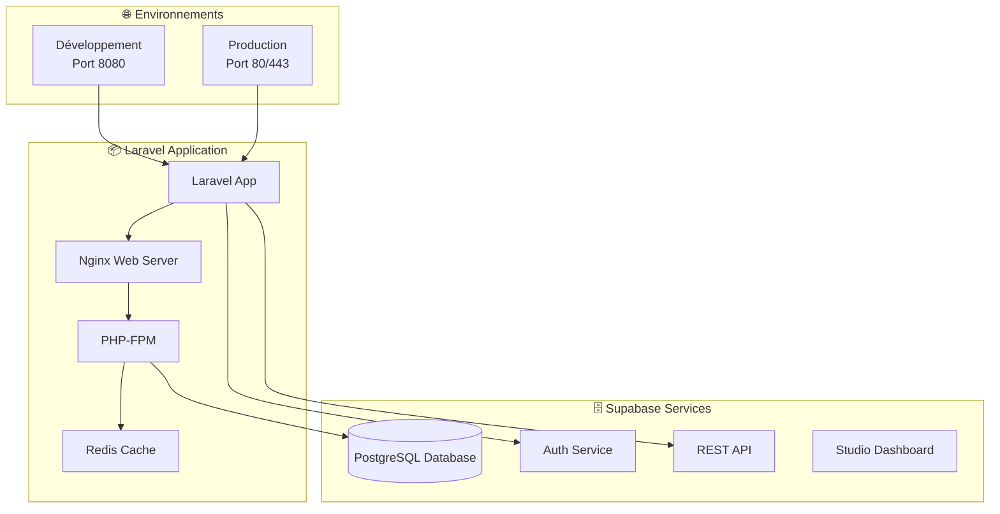
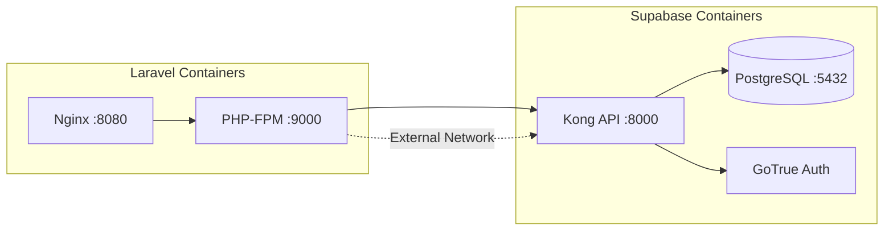
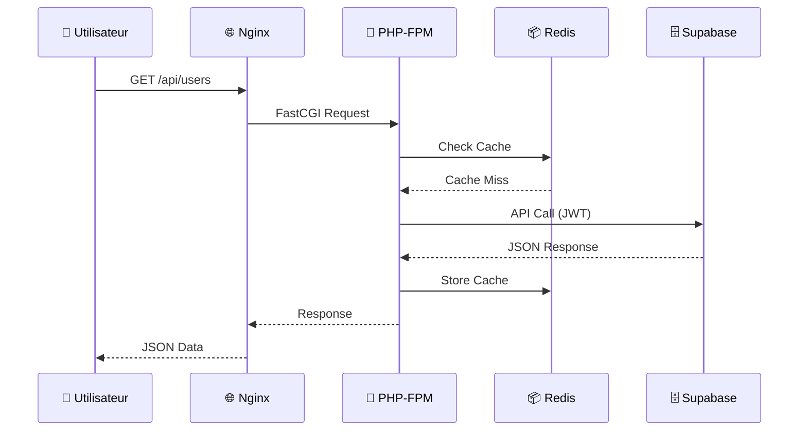
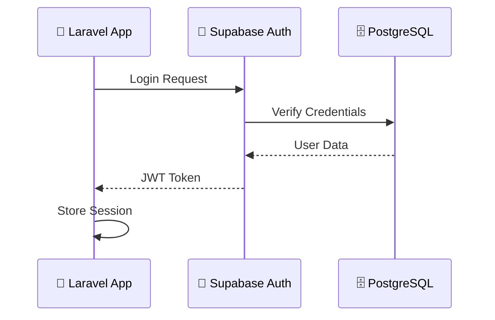

---
# Roadmap Architecture - Laravel Supabase Docker

## 📐 Vision d'ensemble de l'architecture

Cette documentation explique l'architecture complète du projet Laravel-Supabase-Docker, les relations entre les composants et la logique des configurations.

---

## 🏗️ Architecture Générale

### Schéma de l'écosystème



---

## 📋 Tableau des Configurations Docker

| Fichier | Environnement | Rôle | Ports exposés | Réseaux |
|---------|---------------|------|---------------|---------|
| `docker-compose.yml` | **Laravel Sail** | Configuration Sail complète | 80, 5173, 5432, 3306 | `sail` |
| `compose.dev.yaml` | **Développement** | Stack de développement | 8080, 5173 | `laravel-development`, `supabase-dev_default` |
| `compose.prod.yaml` | **Production** | Stack de production optimisée | 80, 443 | `laravel-production`, `supabase-standalone_default` |

---

## 🐳 Analyse des Services Docker

### 1. **Environnement Développement** (`compose.dev.yaml`)

| Service | Image/Build | Fonction | Pourquoi maintenant ? |
|---------|-------------|----------|----------------------|
| `web` | `nginx:latest` | Serveur web reverse proxy | ✅ **Configuration simple** : Nginx standard avec conf personnalisée |
| `php-fpm` | Build custom | Processeur PHP FastCGI | ✅ **XDebug activé** : Développement avec debugging |
| `workspace` | Build custom | Environnement de travail | ✅ **Hot reload** : Vite.js pour les assets frontend |
| `redis` | `redis:alpine` | Cache et sessions | ✅ **Performance** : Cache local pour développement |

#### Pourquoi cette architecture ?
- **Séparation des responsabilités** : Nginx gère les requêtes statiques, PHP-FPM traite le code Laravel
- **Hot reloading** : Volumes montés permettent les modifications en temps réel
- **Debugging** : XDebug configuré pour l'IDE

### 2. **Environnement Production** (`compose.prod.yaml`)

| Service | Image/Build | Fonction | Sécurité/Performance |
|---------|-------------|----------|---------------------|
| `web` | Build optimisé | Nginx avec SSL | ✅ **HTTPS** : Certificats Let's Encrypt |
| `certbot` | `certbot/certbot` | Gestion SSL automatique | ✅ **Auto-renouvellement** : Certificats automatiques |
| `php-fpm` | Build production | PHP optimisé | ✅ **OPCache** : Performance maximale |
| `redis` | `redis:alpine` | Cache persistant | ✅ **Health checks** : Monitoring intégré |

#### Optimisations production
- **Assets compilés** : Volume `laravel-public-assets` avec build Vite
- **Storage persistant** : Volume `laravel-storage-production`
- **Restart policy** : `unless-stopped` pour haute disponibilité

---

## 🔧 Décryptage des Dockerfiles

### Structure Multi-Stage (`docker/common/php-fpm/Dockerfile`)

| Stage | Base | Objectif | Optimisation |
|-------|------|----------|--------------|
| `builder` | `php:8.4-fpm` | Construction dependencies | ✅ **Composer optimisé** : `--no-dev --optimize-autoloader` |
| `production` | `php:8.4-fpm` | Runtime minimal | ✅ **Sécurité** : Configuration production PHP |
| `development` | `production` | Outils développement | ✅ **XDebug** : Debugging conditionnel |

#### Pourquoi cette approche ?
1. **Réduction taille image** : Les outils de build ne sont pas dans l'image finale
2. **Sécurité** : Configuration PHP production séparée
3. **Flexibilité** : Un seul Dockerfile pour tous les environnements

---

## 🌐 Configuration Nginx

### Développement (`docker/development/nginx/nginx.conf`)

```nginx
server {
    listen 80;
    server_name localhost;
    root /var/www/public;
    
    location / {
        try_files $uri $uri/ /index.php?$query_string;
    }
    
    location ~ \.php$ {
        fastcgi_pass php-fpm:9000;  # Communication inter-conteneurs
    }
}
```

#### Points clés :
- **Port 8080 → 80** : Mapping dans compose.dev.yaml
- **FastCGI** : Communication avec PHP-FPM via nom de service Docker
- **Try files** : Pattern Laravel pour les routes

### Production (Build dans `docker/production/nginx/`)
- **SSL terminaison** : Gestion HTTPS avec certificats
- **Assets statiques** : Serveur directement par Nginx
- **Compression Gzip** : Optimisation bande passante

---

## 🗄️ Intégration Supabase

### Architecture Self-Hosted

| Service Supabase | Port | Fonction | Accès |
|------------------|------|----------|-------|
| **API Gateway (Kong)** | 8000 | Routage API central | `http://localhost:8000` |
| **Database (PostgreSQL)** | 5432 | Base de données principale | Via pooler Supavisor |
| **Auth (GoTrue)** | - | Authentification JWT | `/auth/v1/` |
| **Storage** | - | Gestion fichiers | `/storage/v1/` |
| **Studio** | 8000 | Interface admin | Dashboard web |

### Réseaux Docker et Communication



#### Réseaux configurés :
- **`laravel-development`** : Communication interne Laravel
- **`supabase-dev_default`** : Réseau externe Supabase
- **Bridge externe** : Connexion entre les stacks

---

## 🚀 Commandes et Workflow

### Développement - Étapes d'exécution

| Étape | Commande | Pourquoi maintenant ? | Résultat |
|-------|----------|----------------------|----------|
| 1 | `cd supabase-project-dev && docker compose up -d` | **Base de données first** | Supabase disponible sur `:8000` |
| 2 | `cd laravel-supabase && docker compose -f compose.dev.yaml up -d` | **Application après DB** | Laravel sur `:8080` |
| 3 | `docker exec -it workspace bash` | **Environnement interactif** | Accès shell développement |

### Production - Séquence de déploiement

| Étape | Commande | Sécurité | Impact |
|-------|----------|----------|--------|
| 1 | `cd supabase-project && docker compose up -d` | ✅ **Variables d'environnement** | Base production stable |
| 2 | Configuration DNS/Domaine | ✅ **SSL Ready** | Certificats Let's Encrypt |
| 3 | `docker compose -f compose.prod.yaml up -d` | ✅ **HTTPS forcé** | Application sécurisée |

---

## 📊 Comparaison Environnements

| Aspect | Développement | Production | Justification |
|--------|---------------|------------|---------------|
| **Database** | Supabase local `:8000` | Supabase externe | Isolation/Sécurité |
| **SSL** | ❌ HTTP seulement | ✅ HTTPS obligatoire | Sécurité production |
| **Debugging** | ✅ XDebug activé | ❌ Désactivé | Performance vs Debug |
| **Assets** | ✅ Hot reload Vite | ✅ Build optimisé | DX vs Performance |
| **Restart** | Manuel | `unless-stopped` | Développement vs Disponibilité |
| **Volumes** | Code monté | Assets compilés | Flexibilité vs Immutabilité |

---

## 🔄 Flux de Données

### Requête HTTP Typique



### Authentification Flow



---

## 🛠️ Fichiers de Configuration Essentiels

### Structure et Rôles

```
laravel-supabase/
├── docker-compose.yml          # 🚢 Laravel Sail (dev complet)
├── compose.dev.yaml            # 🔧 Stack développement
├── compose.prod.yaml           # 🏭 Stack production
├── docker/
│   ├── common/
│   │   └── php-fpm/Dockerfile  # 🐘 Image PHP multi-stage
│   ├── development/
│   │   ├── nginx/nginx.conf    # 🌐 Config Nginx dev
│   │   └── workspace/          # 💻 Environnement développeur
│   └── production/
│       ├── nginx/              # 🔒 Nginx avec SSL
│       └── php-fpm/            # ⚡ PHP optimisé production
├── .env                        # 🔧 Variables développement
└── .env.production            # 🏭 Variables production
```

### Variables d'Environnement Critiques

| Variable | Développement | Production | Usage |
|----------|---------------|------------|-------|
| `APP_ENV` | `local` | `production` | Mode Laravel |
| `APP_DEBUG` | `true` | `false` | Debugging |
| `SUPABASE_URL` | `http://localhost:8000` | `https://your-project.supabase.co` | API Endpoint |
| `SUPABASE_ANON_KEY` | Dev key | Production key | Authentification |
| `NGINX_PORT` | `8080` | `80` | Port exposition |

---

## 🎯 Recommandations d'Architecture

### ✅ Bonnes Pratiques Implémentées

1. **Séparation environnements** : Dev/Prod isolés
2. **Images multi-stage** : Optimisation taille et sécurité
3. **Health checks** : Monitoring services production
4. **SSL automatique** : Let's Encrypt intégré
5. **Cache Redis** : Performance et sessions
6. **Réseau externe** : Communication Supabase sécurisée

### 🔄 Évolutions Possibles

1. **Monitoring** : Ajout Prometheus/Grafana
2. **CI/CD** : Pipeline GitHub Actions
3. **Backup** : Stratégie sauvegarde automatisée
4. **Scaling** : Docker Swarm ou Kubernetes
5. **CDN** : Intégration pour assets statiques

---

## 📚 Ressources et Documentation

### Liens de Référence

- 📖 [Documentation Laravel](https://laravel.com/docs)
- 🐳 [Docker Samples Laravel](https://github.com/dockersamples/laravel-docker-examples)
- 🗄️ [Supabase Self-Hosting](https://supabase.com/docs/guides/self-hosting/docker)
- 🌐 [Nginx Configuration](https://nginx.org/en/docs/)
- 🐘 [PHP-FPM Tuning](https://www.php.net/manual/en/install.fpm.php)

### Commandes Utiles

```bash
# Monitoring des conteneurs
docker compose ps
docker compose logs -f [service]

# Accès aux services
docker exec -it [container] bash

# Nettoyage
docker compose down -v
docker system prune
```

---

*Cette roadmap architecture fournit une compréhension complète du projet Laravel-Supabase-Docker, depuis la configuration des conteneurs jusqu'aux flux de données en production.* 