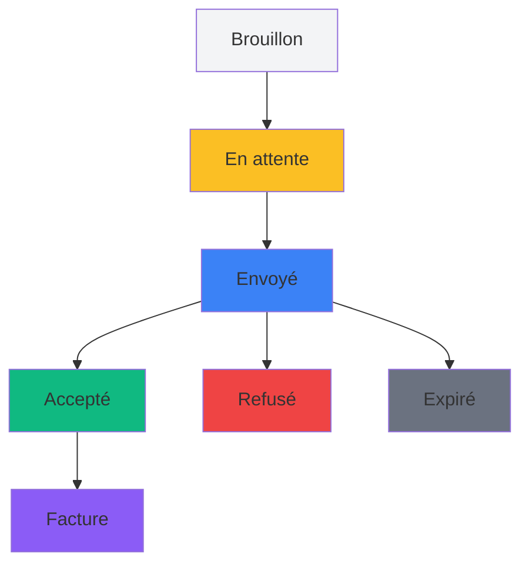

# 📄 Module 4 : Gestion des Devis

## 🎯 Introduction

La gestion des devis est au cœur du processus commercial de votre dashboard. Ce module vous permettra de créer, modifier, suivre et gérer vos devis clients de manière professionnelle et efficace.

::: info Priorité du Module
**Phase 2 - Priorité HAUTE** : Module essentiel pour le processus commercial
:::

## 📋 Vue d'ensemble du système de devis

### Qu'est-ce qu'un devis ?

Un devis est une proposition commerciale détaillée envoyée à un client, comprenant :
- Les prestations proposées (services du catalogue)
- Les quantités et prix unitaires
- Les calculs automatiques (HT, TVA, TTC)
- Les conditions commerciales
- La date de validité

### Cycle de vie d'un devis

## 🔍 Comprendre les statuts des devis

### Statuts principaux

| Statut | Description | Actions possibles |
|--------|-------------|-------------------|
| **📝 Brouillon** | Devis en cours de préparation | Modifier, Valider |
| **⏳ En attente** | Devis finalisé, en attente d'envoi | Envoyer, Modifier |
| **📧 Envoyé** | Devis envoyé au client | Relancer, Accepter/Refuser |
| **✅ Accepté** | Devis accepté par le client | Transformer en facture |
| **⛔ Refusé** | Devis refusé par le client | Archiver |
| **⏰ Expiré** | Date de validité dépassée | Renouveler, Archiver |

### Statuts d'envoi

- **Non envoyé** : Le devis n'a pas encore été envoyé
- **Envoyé** : Le devis a été envoyé avec succès
- **Échec d'envoi** : Problème lors de l'envoi par email

## 📊 Liste des devis

### Accéder à la liste

1. Dans le menu principal, cliquez sur **"Devis"**
2. La page d'accueil des devis s'affiche avec tous les devis actifs

### Interface de la liste

La liste affiche pour chaque devis :
- **Numéro de devis** (format DV-25-001)
- **Objet** du devis
- **Client** et entreprise associée
- **Statut** avec code couleur
- **Statut d'envoi**
- **Montant TTC**
- **Date de création**
- **Date de validité**

### Actions rapides disponibles

- **👁️ Voir** : Consulter le devis complet
- **✏️ Modifier** : Éditer le devis (si statut le permet)
- **📧 Envoyer** : Envoyer par email au client
- **📄 PDF** : Télécharger ou générer le PDF

## ➕ Créer un nouveau devis

### Étape 1 : Accéder à la création

1. Depuis la liste des devis, cliquez sur **"Nouveau devis"**
2. Le formulaire de création s'ouvre

### Étape 2 : Informations générales

**Champs obligatoires :**
- **Client** : Sélectionnez le client destinataire
- **Administrateur responsable** : Assignez un responsable
- **Date du devis** : Date de création (aujourd'hui par défaut)
- **Date de validité** : Date d'expiration (30 jours par défaut)
- **Objet** : Titre du devis

**Champs optionnels :**
- **Description** : Description détaillée de la mission
- **Conditions commerciales** : Conditions spécifiques
- **Notes internes** : Remarques pour l'équipe

::: tip Numéro automatique
Le numéro de devis est généré automatiquement au format **DV-AA-XXX** :
- DV = Devis
- AA = Année (ex: 25 pour 2025)
- XXX = Numéro séquentiel (001, 002, etc.)
:::

### Étape 3 : Ajouter des lignes de service

#### Ajouter une ligne

1. Cliquez sur **"+ Ajouter une ligne"**
2. Une nouvelle ligne apparaît dans le tableau

#### Configurer chaque ligne

**Service :** 
- Sélectionnez un service du catalogue
- Les champs se remplissent automatiquement (prix, description, unité)

**Description personnalisée :**
- Modifiez si nécessaire la description du service
- Ajoutez des détails spécifiques au client

**Quantité :**
- Saisissez la quantité (entier ou décimal)
- L'unité dépend du service (heure, jour, forfait, etc.)

**Prix unitaire HT :**
- Prix automatique du catalogue
- Modifiable si négociation tarifaire

**Taux de TVA :**
- 20% par défaut
- Modifiable selon la situation

#### Calculs automatiques

Le système calcule automatiquement :
- **Montant HT** = Quantité × Prix unitaire HT
- **Montant TVA** = Montant HT × (Taux TVA / 100)
- **Montant TTC** = Montant HT + Montant TVA

#### Gérer les lignes

- **Réorganiser** : Les lignes sont numérotées automatiquement
- **Supprimer** : Cliquez sur l'icône poubelle 🗑️
- **Modifier** : Tous les champs sont éditables

### Étape 4 : Valider et enregistrer

#### Options d'enregistrement

**Enregistrer en brouillon :**
- Le devis est sauvegardé avec le statut "Brouillon"
- Peut être modifié ultérieurement
- Non visible par le client

**Enregistrer et valider :**
- Le devis est sauvegardé avec le statut "En attente"
- Prêt à être envoyé au client
- Génération automatique du PDF

::: warning Validation requise
Au moins une ligne de service est obligatoire pour enregistrer le devis.
:::

## ✏️ Modifier un devis existant

### Conditions de modification

Un devis peut être modifié si son statut est :
- **Brouillon** : Modification libre
- **En attente** : Modification libre
- **Envoyé** : Modification limitée

::: danger Attention
Un devis **Accepté**, **Refusé** ou **Expiré** ne peut plus être modifié.
:::

### Processus de modification

1. Depuis la liste, cliquez sur **"Modifier"** ou l'icône ✏️
2. Le formulaire d'édition s'ouvre avec les données existantes
3. Modifiez les champs nécessaires
4. Sauvegardez les modifications

### Régénération automatique du PDF

À chaque modification, le PDF est automatiquement régénéré pour refléter les changements.

## 📄 Gestion des PDF

### Génération automatique

Le système génère automatiquement un PDF professionnel :
- À la création du devis
- À chaque modification
- Lors des changements de statut

### Télécharger le PDF

1. Depuis la fiche devis, cliquez sur **"Télécharger PDF"**
2. Le fichier se nomme automatiquement `devis_{id}.pdf`

### Prévisualiser le PDF

1. Cliquez sur **"Aperçu PDF"**
2. Le PDF s'ouvre dans un nouvel onglet
3. Vérifiez la mise en forme avant envoi

## 📧 Envoyer un devis par email

### Conditions d'envoi

Un devis peut être envoyé si :
- Son statut est : Brouillon, En attente ou Envoyé
- Le client a une adresse email valide
- Le PDF a été généré avec succès

### Processus d'envoi

1. Depuis la fiche devis, cliquez sur **"Envoyer par email"**
2. Le formulaire d'envoi s'ouvre
3. Vérifiez l'adresse email du destinataire
4. Personnalisez le message si souhaité
5. Cliquez sur **"Envoyer"**

### Templates d'email

Le système utilise des templates prédéfinis :
- **Email client** : Message professionnel avec le PDF en pièce jointe
- **Email admin** : Notification interne de l'envoi

### Suivi des envois

- Le statut d'envoi est mis à jour automatiquement
- Les dates d'envoi sont enregistrées
- L'historique conserve la trace de tous les envois

## 🔄 Gestion des statuts

### Changer le statut manuellement

1. Depuis la fiche devis, utilisez le sélecteur de statut
2. Choisissez le nouveau statut
3. Confirmez la modification

### Actions automatiques par statut

**Accepter un devis :**
- Statut passe à "Accepté"
- Date d'acceptation enregistrée
- Emails de notification envoyés
- Possibilité de créer une facture

**Refuser un devis :**
- Statut passe à "Refusé"
- Historique mis à jour
- Plus de modifications possibles

**Marquer comme expiré :**
- Statut passe à "Expiré"
- Automatic si date de validité dépassée
- Possibilité de renouveler

## 🧾 Transformer en facture

### Prérequis

- Le devis doit être **Accepté**
- Aucune facture ne doit déjà exister pour ce devis

### Processus de transformation

1. Depuis un devis accepté, cliquez sur **"Transformer en facture"**
2. Confirmez la transformation
3. Une facture est créée automatiquement avec :
   - Toutes les lignes du devis
   - Les mêmes montants
   - Un nouveau numéro de facture
   - Le statut "En attente"

### Lien automatique

- La facture est liée au devis d'origine
- Un lien apparaît dans la fiche devis
- Traçabilité complète du processus commercial

## 📈 Suivi et historique

### Historique automatique

Chaque action sur un devis est tracée :
- Création et modifications
- Changements de statut
- Envois d'emails
- Acceptation/refus
- Transformation en facture

### Informations de suivi

Pour chaque devis, consultez :
- **Date de création** et créateur
- **Date de dernière modification**
- **Date d'envoi** au client
- **Date d'acceptation** ou refus
- **Administrateur responsable**

## 🚨 Gestion des erreurs courantes

### Problèmes de création

**"Erreur de validation"**
- Vérifiez que tous les champs obligatoires sont remplis
- Contrôlez que la date de validité est postérieure à la date de devis
- Assurez-vous qu'au moins une ligne est présente

**"Erreur lors de la génération du PDF"**
- Rafraîchissez la page et réessayez
- Vérifiez que toutes les informations entreprise sont complètes
- Contactez le support si le problème persiste

### Problèmes d'envoi email

**"Échec d'envoi"**
- Vérifiez l'adresse email du client
- Contrôlez la configuration email du système
- Réessayez après quelques minutes

**"PDF manquant"**
- Régénérez le PDF depuis la fiche devis
- Vérifiez les permissions de stockage
- Contactez l'administrateur système

### Problèmes de statut

**"Impossible de modifier"**
- Vérifiez que le statut autorise les modifications
- Un devis accepté/refusé/expiré ne peut plus être modifié
- Créez un nouveau devis si nécessaire

## ✅ Bonnes pratiques

### Création de devis

1. **Utilisez les services du catalogue** pour une tarification cohérente
2. **Personnalisez les descriptions** pour chaque client
3. **Vérifiez les dates de validité** (30 jours recommandés)
4. **Assignez un responsable** pour le suivi
5. **Relisez avant envoi** en consultant l'aperçu PDF

### Suivi commercial

1. **Relancez régulièrement** les devis envoyés non répondus
2. **Surveillez les dates d'expiration** pour renouveler si nécessaire
3. **Transformez rapidement** les devis acceptés en factures
4. **Archivez les devis refusés** pour maintenir la liste claire

### Gestion des modifications

1. **Documentez les modifications importantes** dans les notes
2. **Informez le client** des changements significatifs
3. **Conservez un historique** des versions précédentes
4. **Régénérez le PDF** après chaque modification

## 🔧 Actions administrateur avancées

### Numérotation des devis

Le système génère automatiquement les numéros au format **DV-AA-XXX**. En cas de besoin de modification :

1. Contactez votre administrateur système
2. Une commande spéciale peut réinitialiser la numérotation
3. Les anciens numéros restent conservés

### Gestion des archives

Pour archiver massivement des anciens devis :

1. Utilisez les filtres de date
2. Sélectionnez les devis à archiver
3. Appliquez l'action groupée "Archiver"

### Rapports et exports

Générez des rapports sur :
- Les devis par période
- Les taux d'acceptation
- Les montants moyens
- La performance commerciale

## 📞 Support et assistance

### Problèmes fréquents résolus automatiquement

- ✅ Calculs automatiques des montants
- ✅ Génération automatique des numéros
- ✅ Régénération automatique des PDF
- ✅ Mise à jour automatique des statuts

### Quand contacter le support

- 🆘 Erreurs persistantes de génération PDF
- 🆘 Problèmes de configuration email
- 🆘 Perte de données ou corruption
- 🆘 Besoin de formation approfondie

---

::: tip Navigation
**Précédent :** [Module 3 - Gestion des Clients et Entreprises](./gestion-clients-entreprises.md)  
**Suivant :** [Module 5 - Gestion des Factures](./gestion-factures.md)
::: 