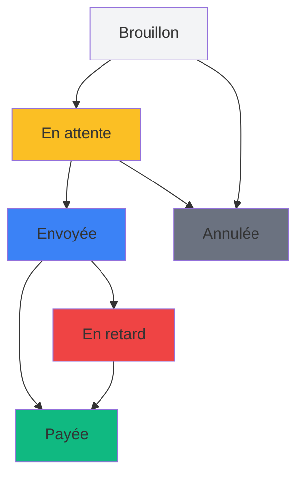

# 🧾 Module 5 : Gestion des Factures

## 🎯 Introduction

La gestion des factures complète le processus commercial initié avec les devis. Ce module vous permettra de créer, modifier, suivre et gérer vos factures clients pour assurer une facturation professionnelle et un suivi efficace des paiements.

::: info Priorité du Module
**Phase 2 - Priorité HAUTE** : Module essentiel pour la facturation et le suivi des paiements
:::

## 📋 Vue d'ensemble du système de facturation

### Qu'est-ce qu'une facture ?

Une facture est un document commercial obligatoire qui formalise une créance, comprenant :
- Les prestations facturées (identiques aux devis ou personnalisées)
- Les montants détaillés (HT, TVA, TTC)
- Les conditions de paiement
- Les dates de facturation et d'échéance
- Le suivi du statut de paiement

### Cycle de vie d'une facture



### Lien avec les devis

- **Transformation automatique** : Un devis accepté peut être transformé en facture
- **Copie des lignes** : Toutes les prestations du devis sont reprises
- **Traçabilité** : Lien permanent entre devis et facture
- **Numérotation distincte** : Les factures ont leur propre numérotation

## 🔍 Comprendre les statuts des factures

### Statuts principaux

| Statut | Description | Actions possibles |
|--------|-------------|-------------------|
| **📝 Brouillon** | Facture en cours de préparation | Modifier, Valider |
| **⏳ En attente** | Facture finalisée, prête à l'envoi | Envoyer, Modifier |
| **📧 Envoyée** | Facture envoyée au client | Relancer, Marquer payée |
| **✅ Payée** | Paiement reçu et confirmé | Archiver |
| **🔴 En retard** | Échéance dépassée sans paiement | Relancer, Marquer payée |
| **❌ Annulée** | Facture annulée | Archiver |

### Statuts d'envoi

- **Non envoyée** : La facture n'a pas encore été envoyée
- **Envoyée** : La facture a été envoyée avec succès
- **Échec d'envoi** : Problème lors de l'envoi par email

### Gestion automatique des retards

Le système détecte automatiquement les factures en retard :
- Vérification basée sur la date d'échéance
- Mise à jour automatique du statut
- Alertes et notifications

## 📊 Liste des factures

### Accéder à la liste

1. Dans le menu principal, cliquez sur **"Factures"**
2. La page d'accueil des factures s'affiche avec toutes les factures actives

### Interface de la liste

La liste affiche pour chaque facture :
- **Numéro de facture** (format FACT-2025-0001)
- **Objet** de la facture
- **Client** et entreprise associée
- **Statut** avec code couleur
- **Statut d'envoi**
- **Montant TTC**
- **Date de facturation**
- **Date d'échéance**
- **Date de paiement** (si payée)

### Filtres et recherche

- **Par statut** : Filtrer par statut de facturation
- **Par client** : Rechercher les factures d'un client
- **Par période** : Filtrer par date de création ou d'échéance
- **En retard** : Afficher uniquement les factures en retard

### Actions rapides disponibles

- **👁️ Voir** : Consulter la facture complète
- **✏️ Modifier** : Éditer la facture (si statut le permet)
- **📧 Envoyer** : Envoyer par email au client
- **💰 Marquer payée** : Confirmer le paiement
- **📄 PDF** : Télécharger ou régénérer le PDF

## ➕ Créer une nouvelle facture

### Méthode 1 : Création depuis un devis accepté

**Processus automatique recommandé :**

1. Depuis un devis accepté, cliquez sur **"Transformer en facture"**
2. Une facture est créée automatiquement avec :
   - Toutes les lignes du devis copiées
   - Les mêmes montants et conditions
   - Un nouveau numéro de facture
   - Le statut "Brouillon" par défaut

3. Modifiez si nécessaire les dates et conditions
4. Validez la facture

### Méthode 2 : Création manuelle

#### Étape 1 : Accéder à la création

1. Depuis la liste des factures, cliquez sur **"Nouvelle facture"**
2. Le formulaire de création s'ouvre

#### Étape 2 : Informations générales

**Champs obligatoires :**
- **Numéro de facture** : Généré automatiquement (FACT-2025-XXXX)
- **Client** : Sélectionnez le client à facturer
- **Administrateur responsable** : Assignez un responsable
- **Date de facturation** : Date de création (aujourd'hui par défaut)
- **Date d'échéance** : Date limite de paiement (30 jours par défaut)
- **Objet** : Titre de la facture

**Champs optionnels :**
- **Description** : Description détaillée des prestations
- **Conditions de paiement** : Modalités de règlement
- **Notes internes** : Remarques pour l'équipe

::: tip Numérotation automatique
Le numéro de facture est généré automatiquement au format **FACT-AAAA-XXXX** :
- FACT = Facture
- AAAA = Année complète (ex: 2025)
- XXXX = Numéro séquentiel (0001, 0002, etc.)
:::

#### Étape 3 : Ajouter des lignes de prestation

Le système de lignes fonctionne exactement comme pour les devis :

**Ajouter une ligne :**
1. Cliquez sur **"+ Ajouter une ligne"**
2. Une nouvelle ligne apparaît dans le tableau

**Configurer chaque ligne :**
- **Service** : Sélectionnez depuis le catalogue
- **Description personnalisée** : Modifiez si nécessaire
- **Quantité** : Saisissez la quantité facturée
- **Prix unitaire HT** : Prix du service
- **Taux de TVA** : 8.5% par défaut

**Calculs automatiques :**
- Montant HT = Quantité × Prix unitaire HT
- Montant TVA = Montant HT × (Taux TVA / 100)
- Montant TTC = Montant HT + Montant TVA

#### Étape 4 : Valider et enregistrer

**Options d'enregistrement :**
- **Enregistrer en brouillon** : Facture modifiable
- **Enregistrer et valider** : Facture prête à l'envoi

## ✏️ Modifier une facture existante

### Conditions de modification

Une facture peut être modifiée si son statut est :
- **Brouillon** : Modification libre
- **En attente** : Modification libre
- **Envoyée** : Modification limitée (notes, conditions)

::: danger Attention
Une facture **Payée** ou **Annulée** ne peut plus être modifiée substantiellement.
:::

### Processus de modification

1. Depuis la liste, cliquez sur **"Modifier"** ou l'icône ✏️
2. Le formulaire d'édition s'ouvre avec les données existantes
3. Modifiez les champs nécessaires
4. Sauvegardez les modifications

### Régénération automatique du PDF

À chaque modification, le PDF est automatiquement régénéré pour refléter les changements.

## 📄 Gestion des PDF

### Génération automatique

Le système génère automatiquement un PDF professionnel :
- À la création de la facture
- À chaque modification
- Lors des changements de statut

### Format et contenu du PDF

Le PDF de facture contient :
- **En-tête** : Informations de l'entreprise
- **Destinataire** : Coordonnées du client
- **Détail des prestations** : Tableau avec quantités, prix, montants
- **Totaux** : Sous-total HT, TVA, Total TTC
- **Conditions** : Modalités de paiement
- **Mentions légales** : Obligatoires selon la réglementation

### Actions PDF disponibles

- **Télécharger** : `facture_{id}.pdf`
- **Prévisualiser** : Aperçu dans le navigateur
- **Régénérer** : En cas de problème
- **Synchroniser** : Mise à jour du stockage cloud

## 📧 Envoyer une facture par email

### Conditions d'envoi

Une facture peut être envoyée si :
- Son statut est : Brouillon, En attente, Envoyée ou En retard
- Le client a une adresse email valide
- Le PDF a été généré avec succès

### Processus d'envoi

1. Depuis la fiche facture, cliquez sur **"Envoyer par email"**
2. Le formulaire d'envoi s'ouvre
3. Vérifiez l'adresse email du destinataire
4. Personnalisez le message si souhaité
5. Cliquez sur **"Envoyer"**

### Templates d'email

Le système utilise des templates spécialisés pour les factures :
- **Email client** : Message professionnel avec facture en pièce jointe
- **Email admin** : Notification interne de l'envoi
- **Email de relance** : Pour les factures en retard

### Contenu type de l'email client

```
Objet : Facture [Numéro] - [Objet de la facture]

Bonjour [Nom du client],

Veuillez trouver ci-joint votre facture n°[Numéro] d'un montant de [Montant] €.

Date d'échéance : [Date]
Conditions de paiement : [Conditions]

En vous remerciant de votre confiance.

Cordialement,
[Signature]
```

## 🔄 Gestion des statuts et paiements

### Changer le statut manuellement

1. Depuis la fiche facture, utilisez le sélecteur de statut
2. Choisissez le nouveau statut
3. Confirmez la modification

### Marquer une facture comme payée

**Processus complet :**

1. Cliquez sur **"Marquer comme payée"**
2. Renseignez les informations de paiement :
   - **Date de paiement** : Date de réception du règlement
   - **Mode de paiement** : Virement, chèque, carte, espèces
   - **Référence de paiement** : N° de transaction, chèque, etc.

3. Confirmez l'enregistrement

**Actions automatiques :**
- Statut passe à "Payée"
- Date de paiement enregistrée
- Historique mis à jour
- Notifications envoyées si configurées

### Gestion des retards

**Détection automatique :**
- Vérification quotidienne des échéances
- Mise à jour automatique du statut "En retard"
- Calcul du nombre de jours de retard

**Actions recommandées :**
1. **Relance par email** : Envoi d'un rappel automatique
2. **Contact téléphonique** : Suivi personnalisé
3. **Négociation** : Échéancier de paiement
4. **Procédure de recouvrement** : Si nécessaire

## 📈 Suivi et historique

### Historique automatique

Chaque action sur une facture est tracée :
- Création et modifications
- Changements de statut
- Envois d'emails
- Paiements et relances
- Actions administratives

### Indicateurs de suivi

Pour chaque facture, consultez :
- **Âge de la facture** : Nombre de jours depuis création
- **Délai d'échéance** : Temps restant ou dépassé
- **Historique des relances** : Dates et types de contact
- **Taux de paiement** : Ponctualité du client

### Tableaux de bord

Accédez aux indicateurs globaux :
- **Chiffre d'affaires** par période
- **Factures en attente** de paiement
- **Retards de paiement** par client
- **Délais de paiement moyens**

## 🔗 Intégration avec les autres modules

### Lien avec les devis

- **Transformation automatique** : Devis → Facture
- **Traçabilité** : Référence au devis d'origine
- **Cohérence** : Mêmes données et montants

### Lien avec les clients

- **Historique client** : Toutes les factures du client
- **Statistiques** : Montants, délais, ponctualité
- **Relances personnalisées** : Basées sur l'historique

### Lien avec les services

- **Catalogue unifié** : Mêmes services que les devis
- **Tarification cohérente** : Prix et unités standardisés
- **Statistiques** : Services les plus facturés

## 🚨 Gestion des erreurs courantes

### Problèmes de création

**"Erreur de validation"**
- Vérifiez tous les champs obligatoires
- Contrôlez que la date d'échéance est postérieure à la date de facture
- Assurez-vous qu'au moins une ligne est présente

**"Numéro de facture déjà existant"**
- Le système génère automatiquement des numéros uniques
- Si problème, contactez l'administrateur système

### Problèmes de PDF

**"Erreur de génération PDF"**
- Vérifiez les informations entreprise complètes
- Contrôlez les lignes de facturation
- Rafraîchissez et réessayez

**"PDF manquant ou corrompu"**
- Utilisez la fonction "Régénérer PDF"
- Vérifiez les permissions de stockage
- Synchronisez avec le cloud si nécessaire

### Problèmes d'envoi

**"Échec d'envoi email"**
- Vérifiez l'adresse email du client
- Contrôlez la taille du PDF (doit être < 10 Mo)
- Vérifiez la configuration email du système

**"Email marqué comme spam"**
- Informez le client de vérifier ses spams
- Utilisez un objet d'email explicite
- Contactez votre administrateur pour la réputation email

### Problèmes de statut

**"Impossible de marquer comme payée"**
- Vérifiez que le statut actuel permet cette action
- Une facture annulée ne peut pas être payée
- Contactez l'administrateur si blocage persistant

## ✅ Bonnes pratiques

### Facturation

1. **Facturez rapidement** après acceptation du devis
2. **Vérifiez les informations** avant envoi
3. **Personnalisez les conditions** selon le client
4. **Archivez les factures payées** pour clarifier la liste

### Suivi des paiements

1. **Relancez de manière systématique** les retards
2. **Diversifiez les canaux** : email, téléphone, courrier
3. **Négociez les échéanciers** si nécessaire
4. **Documentez tous les échanges** dans l'historique

### Gestion des PDF

1. **Vérifiez l'aperçu** avant envoi
2. **Régénérez en cas de modification** importante
3. **Conservez une copie locale** des PDF importants
4. **Vérifiez la synchronisation cloud** régulièrement

### Organisation

1. **Utilisez les filtres** pour organiser votre travail
2. **Priorisez les retards** de paiement
3. **Analysez les délais** de paiement par client
4. **Exportez les données** pour la comptabilité

## 🔧 Actions administrateur avancées

### Numérotation des factures

La numérotation suit le format **FACT-AAAA-XXXX** :
- Réinitialisation automatique chaque année
- Numéros séquentiels sans interruption
- Gestion des doublons impossible

### Exports comptables

Générez des exports pour votre expert-comptable :
- **Format CSV** : Données brutes
- **Format PDF** : Récapitulatifs périodiques
- **Fichiers FEC** : Conformité fiscale française

### Rapports financiers

Accédez aux analyses avancées :
- **Chiffre d'affaires** par période, client, service
- **Délais de paiement** moyens et évolution
- **Taux d'impayés** et créances douteuses
- **Prévisions de trésorerie** basées sur les échéances

### Maintenance et sauvegarde

- **Archivage automatique** des anciennes factures
- **Sauvegarde cloud** des PDF
- **Synchronisation** avec les systèmes comptables
- **Nettoyage** des données temporaires

## 📞 Support et assistance

### Problèmes fréquents résolus automatiquement

- ✅ Calculs automatiques des montants et taxes
- ✅ Génération automatique des numéros de facture
- ✅ Détection automatique des retards de paiement
- ✅ Synchronisation automatique des PDF

### Quand contacter le support

- 🆘 Erreurs persistantes de génération PDF
- 🆘 Problèmes de configuration email
- 🆘 Incohérences dans les calculs
- 🆘 Besoins d'intégration comptable
- 🆘 Formation sur les bonnes pratiques

### Ressources disponibles

- **Documentation technique** : Intégrations et API
- **Guides comptables** : Conformité et réglementation
- **Templates d'emails** : Personnalisation avancée
- **Formations** : Optimisation des processus

---

::: tip Navigation
**Précédent :** [Module 4 - Gestion des Devis](./gestion-devis.md)  
**Suivant :** [Module 6 - Catalogue de Services](./catalogue-services.md)
::: 