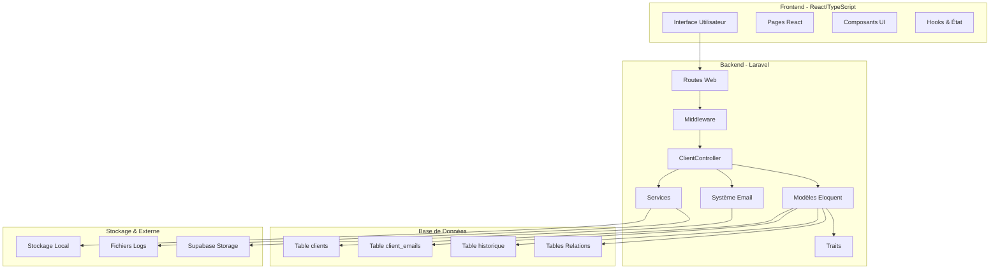
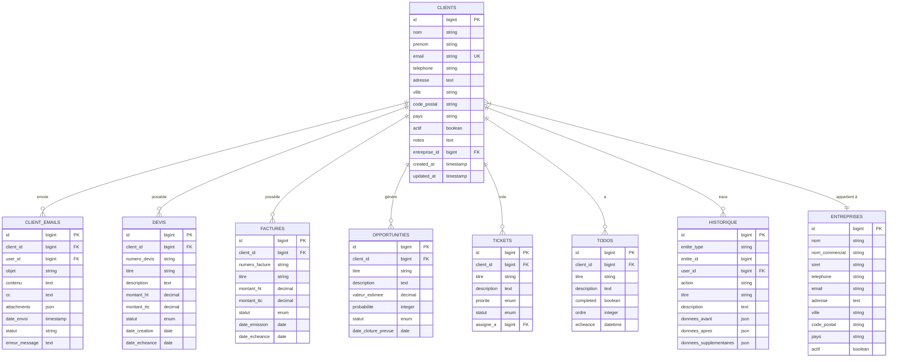
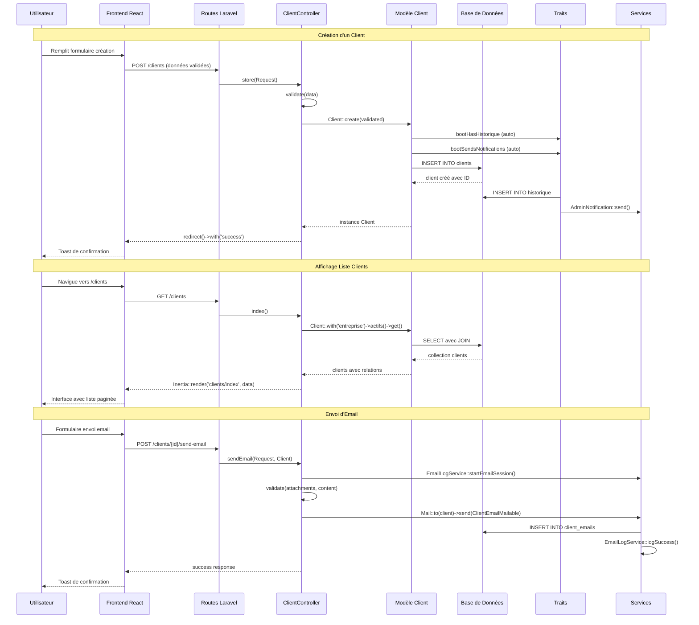

# 🏗️ Module 1 : Vue d'ensemble Architecture Clients

## 📋 Objectif du Module

Ce module présente l'architecture globale du système de gestion des clients dans le Dashboard Madinia. Il couvre l'ensemble des composants, leurs interactions, et fournit une vision complète de l'écosystème client.

---

## 🏛️ Architecture MVC Globale

### **Schéma Architectural**

### **Composants Principaux**

| **Couche** | **Composant** | **Responsabilité** | **Fichiers** |
|------------|---------------|-------------------|--------------|
| **Frontend** | Pages React | Interface utilisateur | `index.tsx`, `create.tsx`, `edit.tsx`, `show.tsx` |
| **Frontend** | Composants UI | Éléments réutilisables | Tables, formulaires, modales, badges |
| **Backend** | ClientController | Logique métier CRUD | `ClientController.php` (552 lignes) |
| **Backend** | Modèle Client | ORM & Relations | `Client.php` (150 lignes) |
| **Backend** | Système Email | Envoi d'emails | `ClientEmailMailable.php`, `ClientEmail.php` |
| **Backend** | Traits | Fonctionnalités transversales | `HasHistorique.php`, `SendsNotifications.php` |
| **Database** | Tables | Persistance des données | `clients`, `client_emails`, `historique` |

---

## 🗄️ Diagramme des Relations Base de Données

### **Schéma Relationnel**

### **Relations Détaillées**

| **Relation** | **Type** | **Cardinalité** | **Contrainte** | **Description** |
|--------------|----------|-----------------|----------------|-----------------|
| Client → Entreprise | `belongsTo` | N:1 | `nullable` | Un client peut appartenir à une entreprise |
| Client → Devis | `hasMany` | 1:N | `cascade` | Un client peut avoir plusieurs devis |
| Client → Factures | `hasMany` | 1:N | `cascade` | Un client peut avoir plusieurs factures |
| Client → Emails | `hasMany` | 1:N | `cascade` | Un client peut recevoir plusieurs emails |
| Client → Opportunités | `hasMany` | 1:N | `cascade` | Un client peut générer plusieurs opportunités |
| Client → Tickets | `hasMany` | 1:N | `cascade` | Un client peut créer plusieurs tickets |
| Client → Todos | `hasMany` | 1:N | `cascade` | Un client peut avoir plusieurs todos |
| Client → Historique | `morphMany` | 1:N | `polymorphe` | Un client a un historique complet |

---

## 🔄 Flow de Données Client → Backend → Frontend

### **Flux Complet de Données**

### **Patterns de Communication**

#### **1. Frontend → Backend**
- **Protocole** : HTTP/HTTPS via Inertia.js
- **Format** : JSON avec CSRF token
- **Validation** : FormRequest Laravel + validation frontend
- **Authentification** : Session Laravel + middleware

#### **2. Backend → Base de Données**
- **ORM** : Eloquent avec relations eager loading
- **Transactions** : Auto-commit avec rollback sur erreur
- **Migrations** : Schema Builder pour évolution
- **Indexes** : Optimisation des requêtes fréquentes

#### **3. Système d'Événements**
- **Traits automatiques** : HasHistorique, SendsNotifications
- **Hooks Eloquent** : created, updated, deleted
- **Jobs asynchrones** : Queue pour emails lourds
- **Logs structurés** : EmailLogService pour traçabilité

---

## 🛠️ Stack Technique Utilisée

### **Technologies Backend**

| **Technologie** | **Version** | **Rôle** | **Configuration** |
|-----------------|-------------|-----------|-------------------|
| **Laravel** | 11.x | Framework PHP | MVC, Eloquent ORM, Blade templates |
| **PHP** | 8.2+ | Langage serveur | Extensions : PDO, GD, Mailparse |
| **MySQL/PostgreSQL** | 8.0+/13+ | Base de données | UTF8MB4, Indexes, Foreign Keys |
| **Inertia.js** | 1.x | Pont Frontend/Backend | SSR, routing côté serveur |
| **Laravel Mail** | 11.x | Système d'emails | SMTP, Mailables, Queue |
| **Supabase** | API | Stockage fichiers | Upload, URL publiques |

### **Technologies Frontend**

| **Technologie** | **Version** | **Rôle** | **Configuration** |
|-----------------|-------------|-----------|-------------------|
| **React** | 18.x | Framework UI | Hooks, Context, Suspense |
| **TypeScript** | 5.x | Langage typé | Strict mode, interfaces |
| **Vite** | 5.x | Build tool | Hot reload, optimisation |
| **Tailwind CSS** | 3.x | Framework CSS | JIT, composants personnalisés |
| **Radix UI** | 1.x | Composants UI | Accessibilité, theming |
| **Lucide React** | 1.x | Icônes | SVG optimisées |

### **Outils de Développement**

| **Outil** | **Usage** | **Configuration** |
|-----------|-----------|-------------------|
| **Composer** | Dépendances PHP | `autoload`, scripts personnalisés |
| **npm/pnpm** | Dépendances JS | Workspaces, cache |
| **Laravel Artisan** | CLI Laravel | Commandes personnalisées |
| **PHPUnit** | Tests unitaires | Feature tests, mocking |
| **ESLint/Prettier** | Qualité code JS | Rules personnalisées |

---

## 📊 Métriques et Complexité

### **Statistiques du Code**

| **Composant** | **Lignes de Code** | **Complexité** | **Responsabilités** |
|---------------|-------------------|----------------|---------------------|
| **ClientController.php** | 552 lignes | ⚡ Élevée | CRUD, emails, validation, logs |
| **Client.php (Modèle)** | 150 lignes | 🟡 Moyenne | Relations, scopes, accesseurs |
| **Frontend Pages** | 3670+ lignes | ⚡ Élevée | UI, filtres, pagination, état |
| **HasHistorique.php** | 131 lignes | 🟡 Moyenne | Historique automatique |
| **SendsNotifications.php** | 104 lignes | 🟢 Faible | Notifications automatiques |
| **Migrations** | 3 fichiers | 🟢 Faible | Structure DB, contraintes |

### **Points de Complexité Identifiés**

1. **🔴 Critique** : Formulaire de création/édition (600+ lignes)
2. **🟡 Important** : Système de filtrage avancé (pagination, tri, recherche)
3. **🟡 Important** : Gestion des pièces jointes emails
4. **🟢 Faible** : Relations Eloquent standard

---

## 🎯 Architecture de Qualité

### **Principes Appliqués**

- ✅ **Séparation des responsabilités** : MVC strict
- ✅ **Single Responsibility** : Contrôleurs focalisés
- ✅ **DRY (Don't Repeat Yourself)** : Traits réutilisables
- ✅ **Relations normalisées** : Base de données optimisée
- ✅ **Type Safety** : TypeScript côté frontend
- ✅ **Logging centralisé** : EmailLogService, historique automatique
- ✅ **Gestion d'erreurs** : Try/catch, validation, rollback

### **Patterns Utilisés**

- 🎨 **Repository Pattern** : Via Eloquent ORM
- 🎨 **Observer Pattern** : Traits avec hooks Eloquent
- 🎨 **Strategy Pattern** : Services spécialisés (EmailLogService)
- 🎨 **Factory Pattern** : Mailables, Notifications
- 🎨 **Decorator Pattern** : Middleware Laravel

---

## 🚀 Points d'Excellence

### **Fonctionnalités Avancées**

1. **📧 Système d'emails sophistiqué** : Pièces jointes, CC, tracking complet
2. **📊 Historique automatique** : Traçabilité complète des actions
3. **🔔 Notifications intelligentes** : Admins alertés automatiquement
4. **🔍 Recherche et filtrage** : Multi-critères côté frontend
5. **📱 Interface responsive** : Mobile-first design
6. **⚡ Performance optimisée** : Eager loading, pagination efficace

### **Sécurité et Robustesse**

- 🔒 **Authentification** : Middleware Laravel
- 🔒 **Validation stricte** : FormRequest + frontend
- 🔒 **CSRF Protection** : Tokens automatiques
- 🔒 **SQL Injection** : ORM Eloquent sécurisé
- 🔒 **Upload sécurisé** : Validation types MIME
- 🔒 **Logs de sécurité** : Traçabilité des actions

---

*Documentation générée le 19 janvier 2025 - Dashboard Madinia v2.0* 