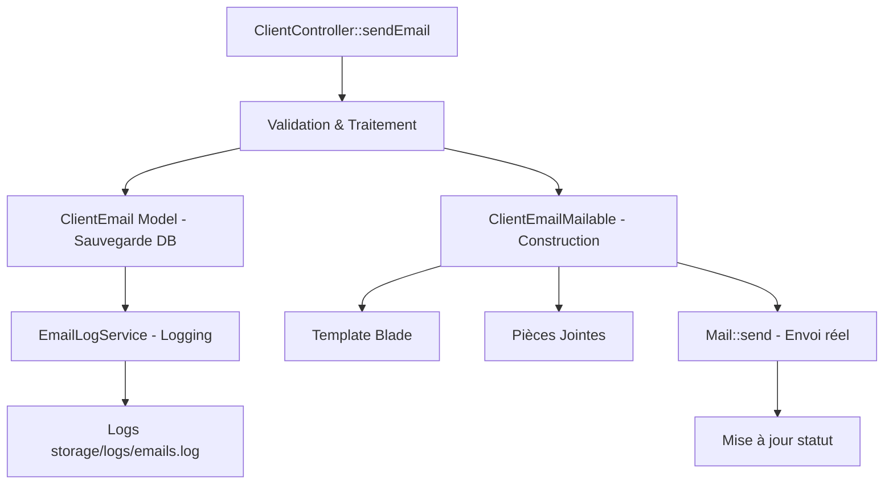
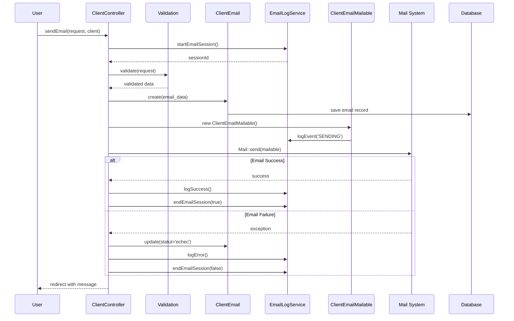

# 📧 Module 5 : Système d'Emails Clients

## 📋 Objectif du Module

Ce module documente en détail le système d'envoi d'emails aux clients, incluant la classe `ClientEmailMailable`, le modèle `ClientEmail` pour le tracking, le service `EmailLogService` pour la traçabilité, et l'intégration complète avec le système de notifications.

---

## 🏗️ Architecture du Système d'Emails

### **Vue d'Ensemble**



### **Composants Principaux**

| **Composant** | **Rôle** | **Fichier** | **Complexité** |
|---------------|----------|-------------|----------------|
| `ClientEmailMailable` | Template d'envoi | `app/Mail/ClientEmailMailable.php` | 🟡 Moyenne (121 lignes) |
| `ClientEmail` | Modèle de tracking | `app/Models/ClientEmail.php` | 🟢 Simple (39 lignes) |
| `EmailLogService` | Service de logs | `app/Services/EmailLogService.php` | ⚡ Élevée (281 lignes) |
| Template Blade | Rendu email | `resources/views/emails/client/custom.blade.php` | 🟢 Simple (6 lignes) |
| Migrations | Structure DB | 3 fichiers de migration | 🟡 Moyenne |

---

## 📧 Classe ClientEmailMailable

### **Structure et Fonctionnement**

```php
<?php

namespace App\Mail;

use App\Models\Client;
use App\Models\User;
use Illuminate\Bus\Queueable;
use Illuminate\Mail\Mailable;
use Illuminate\Mail\Mailables\Content;
use Illuminate\Mail\Mailables\Envelope;
use Illuminate\Queue\SerializesModels;

class ClientEmailMailable extends Mailable
{
    use Queueable, SerializesModels;

    public Client $client;
    public User $user;
    public string $objet;
    public string $contenu;
    public array $attachmentPaths;
}
```

### **Analyse Structurelle**

| **Aspect** | **Détail** | **Fonctionnalité** |
|------------|------------|-------------------|
| **Lignes de code** | 121 lignes | ⚡ Logique complète |
| **Traits utilisés** | `Queueable`, `SerializesModels` | 🔄 Support files d'attente |
| **Propriétés publiques** | 5 propriétés | 📊 Données complètes |
| **Méthodes principales** | 4 méthodes | 🎯 Enveloppe, contenu, pièces jointes |
| **Logging intégré** | Log::info() dans chaque méthode | 📝 Traçabilité complète |

### **Constructeur et Injection de Dépendances**

```php
/**
 * Create a new message instance.
 */
public function __construct(
    Client $client,
    User $user,
    string $objet,
    string $contenu,
    array $attachmentPaths = []
) {
    $this->client = $client;
    $this->user = $user;
    $this->objet = $objet;
    $this->contenu = $contenu;
    $this->attachmentPaths = $attachmentPaths;
}
```

**Caractéristiques :**
- 🎯 **Injection de modèles** : Client et User directement injectés
- 📝 **Contenu personnalisé** : Objet et contenu libres
- 📎 **Pièces jointes** : Tableau de chemins absolus
- 💾 **Propriétés publiques** : Accessibles dans le template

### **Méthode envelope() - Configuration de l'Email**

```php
/**
 * Get the message envelope.
 */
public function envelope(): Envelope
{
    Log::info('Envoi email client', [
        'client_email' => $this->client->email,
        'client_nom' => $this->client->nom_complet,
        'user_name' => $this->user->name,
        'objet' => $this->objet
    ]);

    return new Envelope(
        subject: $this->objet,
        to: [
            $this->client->email
        ],
    );
}
```

**Analyse :**
- 📊 **Logging automatique** : Traçabilité avant envoi
- 🎯 **Destinataire unique** : Email du client directement
- 📝 **Sujet dynamique** : Personnalisé selon le contenu
- ⚡ **Laravel 9+ syntax** : Utilisation des nouveaux Mailables

### **Méthode content() - Template et Données**

```php
/**
 * Get the message content definition.
 */
public function content(): Content
{
    return new Content(
        markdown: 'emails.client.custom',
        with: [
            'client' => $this->client,
            'user' => $this->user,
            'objet' => $this->objet,
            'contenu' => $this->contenu,
            'madinia' => \App\Models\Madinia::getInstance(),
        ],
    );
}
```

**Données Passées au Template :**

| **Variable** | **Type** | **Usage** |
|--------------|----------|-----------|
| `$client` | `Client` | Informations du destinataire |
| `$user` | `User` | Expéditeur (admin/user connecté) |
| `$objet` | `string` | Sujet de l'email |
| `$contenu` | `string` | Corps du message |
| `$madinia` | `Madinia` | Configuration globale (logo, etc.) |

**Avantages :**
- 🎨 **Template Markdown** : Rendu professionnel automatique
- 📊 **Données complètes** : Toutes les infos nécessaires
- 🏢 **Branding** : Intégration configuration Madinia
- 🔄 **Réutilisable** : Template générique personnalisable

### **Méthode attachments() - Gestion des Pièces Jointes**

```php
/**
 * Get the attachments for the message.
 */
public function attachments(): array
{
    $attachments = [];

    Log::info('Ajout des pièces jointes', [
        'nombre_fichiers' => count($this->attachmentPaths),
        'paths' => $this->attachmentPaths
    ]);

    foreach ($this->attachmentPaths as $path) {
        if (file_exists($path)) {
            $originalName = basename($path);

            Log::info('Ajout pièce jointe', [
                'path' => $path,
                'original_name' => $originalName,
                'file_exists' => file_exists($path),
                'file_size' => filesize($path)
            ]);

            $attachments[] = \Illuminate\Mail\Mailables\Attachment::fromPath($path)
                ->as($originalName);
        } else {
            Log::warning('Fichier de pièce jointe non trouvé', [
                'path' => $path
            ]);
        }
    }

    return $attachments;
}
```

**Logique de Traitement :**

1. **Vérification existence** : `file_exists($path)` pour chaque fichier
2. **Logging détaillé** : Trace de chaque opération
3. **Gestion d'erreurs** : Avertissement si fichier manquant
4. **Nom original** : `basename($path)` pour affichage
5. **API Laravel** : `Attachment::fromPath()` moderne

**Sécurité et Robustesse :**
- ✅ **Vérification fichiers** : Évite les erreurs d'envoi
- 📝 **Logging complet** : Diagnostic en cas de problème
- 🛡️ **Gestion erreurs** : Continue même si un fichier manque
- 📊 **Métadonnées** : Taille et existence tracées

---

## 🗄️ Modèle ClientEmail - Tracking des Envois

### **Structure du Modèle**

```php
<?php

namespace App\Models;

use Illuminate\Database\Eloquent\Model;
use Illuminate\Database\Eloquent\Relations\BelongsTo;

class ClientEmail extends Model
{
    use HasFactory;

    protected $fillable = [
        'client_id', 'user_id', 'objet', 'contenu', 
        'cc', 'attachments', 'statut', 'date_envoi',
    ];

    protected $casts = [
        'date_envoi' => 'datetime',
        'attachments' => 'array',
    ];

    public function client(): BelongsTo
    {
        return $this->belongsTo(Client::class);
    }

    public function user(): BelongsTo
    {
        return $this->belongsTo(User::class);
    }
}
```

### **Analyse des Champs**

| **Champ** | **Type** | **Nullable** | **Usage** |
|-----------|----------|--------------|-----------|
| `client_id` | `foreign_id` | ❌ | Destinataire (cascade delete) |
| `user_id` | `foreign_id` | ❌ | Expéditeur (cascade delete) |
| `objet` | `string` | ❌ | Sujet de l'email |
| `contenu` | `text` | ❌ | Corps du message |
| `cc` | `text` | ✅ | Emails en copie (ajouté v2) |
| `attachments` | `json` | ✅ | Métadonnées fichiers (ajouté v3) |
| `statut` | `enum` | ❌ | 'envoye' ou 'echec' |
| `date_envoi` | `timestamp` | ❌ | Date/heure exacte |

### **Évolution du Schéma Database**

#### **Migration 1 : Table de Base (2025-06-12)**

```php
Schema::create('client_emails', function (Blueprint $table) {
    $table->id();
    $table->foreignId('client_id')->constrained()->onDelete('cascade');
    $table->foreignId('user_id')->constrained()->onDelete('cascade');
    $table->string('objet');
    $table->text('contenu');
    $table->enum('statut', ['envoye', 'echec'])->default('envoye');
    $table->timestamp('date_envoi');
    $table->timestamps();

    $table->index(['client_id', 'user_id']);
    $table->index('date_envoi');
});
```

#### **Migration 2 : Ajout Champ CC (2025-06-18)**

```php
Schema::table('client_emails', function (Blueprint $table) {
    $table->text('cc')->nullable()->after('contenu');
});
```

#### **Migration 3 : Ajout Pièces Jointes (2025-06-18)**

```php
Schema::table('client_emails', function (Blueprint $table) {
    $table->json('attachments')->nullable()->after('cc')
        ->comment('Informations des pièces jointes en JSON');
});
```

### **Casts et Transformations**

```php
protected $casts = [
    'date_envoi' => 'datetime',    // Carbon pour manipulation dates
    'attachments' => 'array',      // JSON → array PHP automatique
];
```

**Structure JSON Attachments :**
```json
[
    {
        "original_name": "devis_123.pdf",
        "stored_name": "email_attachment_1642584123_0.pdf",
        "path": "client_emails/attachments/email_attachment_1642584123_0.pdf",
        "size": 245760,
        "mime_type": "application/pdf"
    }
]
```

### **Relations Eloquent**

```php
// Récupérer un email avec ses relations
$email = ClientEmail::with(['client', 'user'])->find(1);

// Accès aux données
$email->client->nom_complet;  // Nom du destinataire
$email->user->name;           // Nom de l'expéditeur
$email->attachments;          // Array des pièces jointes
$email->date_envoi->format('d/m/Y H:i'); // Date formatée
```

### **Requêtes Typiques**

```php
// Emails d'un client
Client::find(1)->emails()->with('user')->orderBy('date_envoi', 'desc')->get();

// Emails d'un utilisateur
User::find(1)->clientEmails()->with('client')->latest()->get();

// Emails avec erreurs
ClientEmail::where('statut', 'echec')->with(['client', 'user'])->get();

// Statistiques
ClientEmail::where('statut', 'envoye')->count(); // Emails réussis
ClientEmail::whereNotNull('cc')->count();        // Emails avec CC
ClientEmail::whereNotNull('attachments')->count(); // Emails avec PJ
```

---

## 📊 Service EmailLogService - Logging Avancé

### **Vue d'Ensemble du Service**

Le `EmailLogService` est un service sophistiqué de 281 lignes qui gère la traçabilité complète des emails avec système de sessions, icônes, et formatage intelligent.

```php
<?php

namespace App\Services;

class EmailLogService
{
    private const LOG_FILE = 'emails.log';
    private const LOG_PATH = 'storage/logs/';
    private static $sessionId = null;

    // 15+ méthodes publiques
    // Gestion sessions avec IDs uniques
    // Logging avec icônes et formatage
    // Utilitaires de nettoyage et récupération
}
```

### **Système de Sessions - Traçabilité Complète**

#### **Démarrage de Session**

```php
/**
 * Démarrer une session d'envoi d'email
 */
public static function startEmailSession(string $type = 'general', array $context = []): string
{
    self::$sessionId = uniqid('email_', true);

    $sessionInfo = [
        'session_id' => self::$sessionId,
        'type' => $type,
        'context' => $context,
        'started_at' => now()->toISOString(),
    ];

    self::writeLog('🚀 SESSION START', 'INFO', "Début de session d'envoi d'email", $sessionInfo);
    self::writeLog('┌─────────────────────────────────────────────────┐', 'SEPARATOR', '');

    return self::$sessionId;
}
```

**Contexte de Session :**
```php
// Exemple d'utilisation dans ClientController
$sessionId = EmailLogService::startEmailSession('client_email', [
    'recipient' => $client->email,
    'client_id' => $client->id,
    'user_id' => Auth::id(),
    'ip' => $request->ip(),
]);
```

#### **Fin de Session**

```php
/**
 * Terminer une session d'envoi d'email
 */
public static function endEmailSession(bool $success = true, array $summary = []): void
{
    $sessionInfo = [
        'session_id' => self::$sessionId,
        'success' => $success,
        'summary' => $summary,
        'ended_at' => now()->toISOString(),
    ];

    self::writeLog('└─────────────────────────────────────────────────┘', 'SEPARATOR', '');
    
    $icon = $success ? '✅ SESSION END' : '❌ SESSION FAILED';
    self::writeLog($icon, $success ? 'SUCCESS' : 'ERROR', "Fin de session d'envoi d'email", $sessionInfo);
    self::writeLog('', 'BLANK', ''); // Ligne vide pour séparer les sessions
}
```

### **Système d'Événements avec Icônes**

#### **Méthode logEvent() - Cœur du Système**

```php
/**
 * Logger un événement d'email
 */
public static function logEvent(string $event, string $level = 'INFO', array $data = []): void
{
    $icons = [
        'SENDING' => '📤',      'SUCCESS' => '✅',      'ERROR' => '❌',
        'WARNING' => '⚠️',      'ATTACHMENT' => '📎',    'RECIPIENT' => '👤',
        'TEMPLATE' => '📄',     'QUEUE' => '⏳',        'DELIVERY' => '📬',
        'BOUNCE' => '↩️',       'OPEN' => '👁️',         'CLICK' => '🖱️',
        'RETRY' => '🔄',        'CONFIG' => '⚙️',       'DATABASE' => '🗄️',
        'API' => '🔌',
    ];

    $icon = $icons[$event] ?? '📧';

    $eventData = [
        'session_id' => self::$sessionId,
        'event' => $event,
        'data' => $data,
        'timestamp' => now()->toISOString(),
    ];

    self::writeLog("$icon $event", $level, '', $eventData);
}
```

#### **Méthodes Spécialisées**

```php
// Succès d'envoi
public static function logSuccess(string $recipient, string $subject, array $details = []): void
{
    self::logEvent('SUCCESS', 'SUCCESS', [
        'recipient' => $recipient,
        'subject' => $subject,
        'details' => $details
    ]);
}

// Erreur d'envoi
public static function logError(string $recipient, string $error, array $context = []): void
{
    self::logEvent('ERROR', 'ERROR', [
        'recipient' => $recipient,
        'error' => $error,
        'context' => $context
    ]);
}

// Pièce jointe
public static function logAttachment(string $filename, int $size, string $type = 'pdf'): void
{
    self::logEvent('ATTACHMENT', 'INFO', [
        'filename' => $filename,
        'size' => $size,
        'type' => $type,
        'size_formatted' => self::formatBytes($size)
    ]);
}
```

### **Méthode writeLog() - Écriture Formatée**

```php
/**
 * Écrire dans le fichier de log
 */
private static function writeLog(string $icon, string $level, string $message = '', array $data = []): void
{
    $timestamp = now()->format('Y-m-d H:i:s');
    $logPath = storage_path('logs/' . self::LOG_FILE);

    if ($level === 'BLANK') {
        $logEntry = "\n";
    } elseif ($level === 'SEPARATOR') {
        $logEntry = "[$timestamp] $icon\n";
    } else {
        $formattedData = !empty($data) ? ' ' . json_encode($data, JSON_UNESCAPED_UNICODE | JSON_PRETTY_PRINT) : '';
        $logEntry = "[$timestamp] [$level] $icon";
        
        if ($message) {
            $logEntry .= " $message";
        }
        
        $logEntry .= $formattedData . "\n";
    }

    file_put_contents($logPath, $logEntry, FILE_APPEND | LOCK_EX);
}
```

**Formats de Sortie :**
```
[2025-01-19 14:30:15] [INFO] 🚀 SESSION START Début de session d'envoi d'email {session_data}
[2025-01-19 14:30:15] ┌─────────────────────────────────────────────────┐
[2025-01-19 14:30:16] [INFO] 📤 SENDING {sending_data}
[2025-01-19 14:30:17] [INFO] 📎 ATTACHMENT {attachment_data}
[2025-01-19 14:30:18] [SUCCESS] ✅ SUCCESS {success_data}
[2025-01-19 14:30:18] └─────────────────────────────────────────────────┘
[2025-01-19 14:30:18] [SUCCESS] ✅ SESSION END Fin de session d'envoi d'email {session_summary}

```

### **Méthodes Utilitaires**

#### **Récupération des Logs**

```php
/**
 * Récupérer les logs d'emails
 */
public static function getEmailLogs(int $lines = 100): array
{
    $logPath = storage_path('logs/' . self::LOG_FILE);
    
    if (!file_exists($logPath)) {
        return [];
    }

    $content = file_get_contents($logPath);
    $logLines = array_slice(array_filter(explode("\n", $content)), -$lines);

    return array_map(function($line) {
        return [
            'raw' => $line,
            'formatted' => self::formatLogLine($line),
            'level' => self::extractLevel($line),
            'timestamp' => self::extractTimestamp($line),
        ];
    }, $logLines);
}
```

#### **Nettoyage des Anciens Logs**

```php
/**
 * Nettoyer les anciens logs
 */
public static function clearOldLogs(int $daysToKeep = 7): bool
{
    $logPath = storage_path('logs/' . self::LOG_FILE);
    $cutoffDate = now()->subDays($daysToKeep);
    
    $content = file_get_contents($logPath);
    $lines = explode("\n", $content);

    $filteredLines = array_filter($lines, function($line) use ($cutoffDate) {
        $timestamp = self::extractTimestamp($line);
        if (!$timestamp) return true;

        try {
            return Carbon::parse($timestamp)->isAfter($cutoffDate);
        } catch (\Exception $e) {
            return true; // Garder les lignes avec timestamps invalides
        }
    });

    file_put_contents($logPath, implode("\n", $filteredLines));
    return true;
}
```

#### **Formatage des Données**

```php
/**
 * Formater les bytes
 */
private static function formatBytes(int $bytes): string
{
    $units = ['B', 'KB', 'MB', 'GB'];

    for ($i = 0; $bytes > 1024 && $i < count($units) - 1; $i++) {
        $bytes /= 1024;
    }

    return round($bytes, 2) . ' ' . $units[$i];
}
```

---

## 🎨 Template Blade - Rendu Email

### **Fichier de Template**

```blade
{{-- resources/views/emails/client/custom.blade.php --}}
<x-mail::message>
# {{ $objet }}

{!! nl2br(e($contenu)) !!}
</x-mail::message>
```

### **Analyse du Template**

| **Élément** | **Fonction** | **Sécurité** |
|-------------|--------------|-------------|
| `<x-mail::message>` | Composant Laravel Mail | 🎨 Styling automatique |
| `{{ $objet }}` | Titre de l'email | ✅ Échappement automatique |
| `{!! nl2br(e($contenu)) !!}` | Corps avec sauts de ligne | ✅ Échappement + HTML |

**Fonctionnalités :**
- 🎨 **Design cohérent** : Utilise le design system Laravel Mail
- ✅ **Sécurité** : Échappement avec `e()` puis rendu HTML avec `nl2br()`
- 📱 **Responsive** : Template adaptatif automatique
- 🏢 **Branding** : Intégration logo et couleurs via configuration

### **Variables Disponibles**

Toutes les variables passées dans `ClientEmailMailable::content()` :

```php
// Dans le template :
$client      // Modèle Client complet
$user        // Modèle User (expéditeur)
$objet       // String : sujet de l'email
$contenu     // String : corps du message
$madinia     // Configuration globale (logo, nom, etc.)
```

### **Exemples d'Usage Avancé**

```blade
<x-mail::message>
# {{ $objet }}

Bonjour {{ $client->prenom }} {{ $client->nom }},

{!! nl2br(e($contenu)) !!}

<x-mail::button :url="config('app.url')">
Accéder à votre espace client
</x-mail::button>

Cordialement,<br>
{{ $user->name }}<br>
{{ $madinia->nom }}

<x-mail::subcopy>
Si vous avez des questions, contactez-nous à {{ $madinia->email }}
</x-mail::subcopy>
</x-mail::message>
```

---

## 🔄 Flux Complet d'Envoi d'Email

### **Diagramme de Séquence**



### **Étapes Détaillées**

1. **Initialisation** (ClientController)
   - Session EmailLogService démarrée
   - Context utilisateur et client capturé

2. **Validation** (Request Validation)
   - Champs obligatoires vérifiés
   - Fichiers validés (types, tailles)
   - Adresses CC contrôlées

3. **Traitement Pièces Jointes**
   - Stockage sécurisé hors web
   - Métadonnées JSON générées
   - Logs détaillés pour chaque fichier

4. **Sauvegarde Base de Données**
   - Enregistrement ClientEmail
   - Statut initial 'envoye'
   - Relations client/user établies

5. **Construction Mailable**
   - ClientEmailMailable instancié
   - Template et données préparés
   - Pièces jointes attachées

6. **Envoi Réel**
   - Mail::send() exécuté
   - Logging des tentatives
   - Gestion des erreurs SMTP

7. **Finalisation**
   - Mise à jour statut si échec
   - Session EmailLogService fermée
   - Notifications admins envoyées

---

## 📊 Intégration avec le Système de Monitoring

### **Page de Monitoring - Logs d'Emails**

Le système d'emails est intégré dans la page de monitoring via des onglets :

```typescript
// Page monitoring avec onglets
const [activeTab, setActiveTab] = useState('email-logs');

// Logs d'emails via API
const { data: emailLogs } = useSWR('/admin/monitoring/email-logs', fetcher);
```

### **Routes API de Monitoring**

```php
// Dans routes/web.php
Route::prefix('admin/monitoring')->middleware(['auth', 'superadmin'])->group(function () {
    Route::get('/email-logs', [MonitoringController::class, 'getEmailLogs']);
    Route::post('/clean-email-logs', [MonitoringController::class, 'cleanEmailLogs']);
});
```

### **Méthodes du MonitoringController**

```php
// Récupération des logs
public function getEmailLogs(Request $request)
{
    $lines = $request->get('lines', 100);
    $logs = EmailLogService::getEmailLogs($lines);
    
    return response()->json([
        'logs' => $logs,
        'total_lines' => count($logs),
        'file_exists' => file_exists(storage_path('logs/emails.log')),
    ]);
}

// Nettoyage des logs
public function cleanEmailLogs()
{
    EmailLogService::clearOldLogs(7); // Garder 7 jours
    
    return response()->json([
        'success' => true,
        'message' => 'Logs d\'emails nettoyés avec succès'
    ]);
}
```

---

## 🎯 Bonnes Pratiques et Optimisations

### **✅ Points Forts du Système**

1. **Traçabilité Complète**
   - 📊 Sessions avec IDs uniques
   - 🎯 Logs détaillés pour chaque étape
   - 📈 Métriques et statistiques

2. **Sécurité Avancée**
   - 🔒 Stockage pièces jointes hors web
   - ✅ Validation stricte des fichiers
   - 🛡️ Échappement dans templates

3. **Gestion d'Erreurs Robuste**
   - 🔄 Statuts dynamiques (envoye/echec)
   - 📝 Logging automatique des erreurs
   - ⚡ Continuité de service

4. **Performance Optimisée**
   - 📊 Relations Eloquent efficaces
   - 🔍 Index de base de données
   - 💾 Casts automatiques

5. **Monitoring Intégré**
   - 📈 Interface web de monitoring
   - 🧹 Nettoyage automatique des logs
   - 📊 Statistiques temps réel

### **🔄 Améliorations Possibles**

1. **Support Files d'Attente**
   ```php
   // Envoi asynchrone pour gros volumes
   class ClientEmailMailable extends Mailable implements ShouldQueue
   {
       use Queueable;
       public $tries = 3;
       public $timeout = 60;
   }
   ```

2. **Templates Dynamiques**
   ```php
   // Système de templates personnalisables
   public function content(): Content
   {
       $template = $this->client->empresa->email_template ?? 'emails.client.custom';
       return new Content(markdown: $template, with: [...]);
   }
   ```

3. **Métriques Avancées**
   ```php
   // Statistiques d'ouverture et clics
   class EmailMetrics
   {
       public static function trackOpen(string $emailId): void
       public static function trackClick(string $emailId, string $url): void
   }
   ```

4. **Cache Intelligent**
   ```php
   // Cache des templates compilés
   $compiledTemplate = Cache::remember("email_template_{$id}", 3600, fn() => ...);
   ```

5. **Webhooks et Callbacks**
   ```php
   // Notifications de delivery/bounce
   Route::post('/webhooks/email-status', [EmailWebhookController::class, 'handle']);
   ```

---

*Documentation générée le 19 janvier 2025 - Dashboard Madinia v2.0* 