# Module 1.1 : Vue d'Ensemble du Système Devis

## 📋 Introduction

Le système de devis constitue le **cœur métier** du Dashboard Madinia. Il gère l'ensemble du cycle de vie commercial, depuis la création jusqu'à la transformation en facture, en passant par l'envoi, l'acceptation ou le refus par le client.

> **Complexité** : ⭐⭐⭐⭐⭐ (5/5 - Très Élevée)  
> **Statut** : Module central du système  
> **Entités liées** : Clients, Entreprises, Services, Factures, Utilisateurs

## 🔄 Cycle de Vie Complet d'un Devis

### Vue d'Ensemble
Le cycle de vie d'un devis suit un processus structuré en 7 étapes principales :

1. **🎯 Création** - Rédaction initiale du devis
2. **💾 Sauvegarde** - Stockage en brouillon ou en attente
3. **📤 Envoi** - Transmission au client
4. **⏳ Attente** - Période de validation client
5. **✅ Décision** - Acceptation ou refus
6. **🔄 Transformation** - Conversion en facture (si accepté)
7. **📊 Archivage** - Finalisation du processus

### Statuts du Devis
Le système gère **6 statuts principaux** :

| Statut | Code | Description | Actions possibles |
|--------|------|-------------|------------------|
| 🟡 **Brouillon** | `brouillon` | Création en cours, non finalisé | Éditer, Envoyer, Supprimer |
| 🔵 **En attente** | `en_attente` | Prêt à être envoyé | Envoyer, Éditer, Changer statut |
| 🟣 **Envoyé** | `envoye` | Transmis au client | Accepter, Refuser, Renvoyer |
| 🟢 **Accepté** | `accepte` | Validé par le client | Transformer en facture |
| 🔴 **Refusé** | `refuse` | Rejeté par le client | Consulter, Archiver |
| ⚫ **Expiré** | `expire` | Date de validité dépassée | Consulter, Archiver |

### Statuts d'Envoi
Le système suit également **3 statuts d'envoi** :

| Statut | Code | Description |
|--------|------|-------------|
| ⭕ **Non envoyé** | `non_envoye` | Pas encore transmis |
| ✅ **Envoyé** | `envoye` | Transmis avec succès |
| ❌ **Échec d'envoi** | `echec_envoi` | Erreur lors de la transmission |

## 🔄 Machine à États et Transitions

### Diagramme de Transition des États

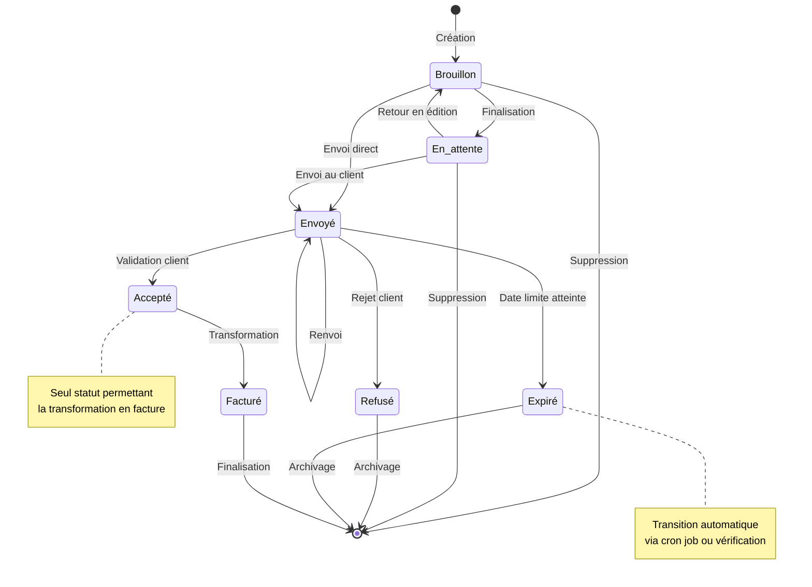

### Transitions Autorisées

#### Depuis Brouillon
- ✅ **Vers En attente** : `store()` avec validation complète
- ✅ **Vers Envoyé** : `envoyerEmail()` avec envoi immédiat
- ✅ **Vers Supprimé** : `destroy()` si non envoyé

#### Depuis En attente
- ✅ **Vers Envoyé** : `envoyerEmail()` au client
- ✅ **Vers Brouillon** : `changerStatut()` pour corrections
- ✅ **Vers Supprimé** : `destroy()` si non envoyé

#### Depuis Envoyé
- ✅ **Vers Accepté** : `accepter()` via client ou admin
- ✅ **Vers Refusé** : `refuser()` avec raison
- ✅ **Vers Expiré** : vérification automatique date
- ✅ **Vers Envoyé** : `envoyerEmail()` pour renvoi

#### Depuis Accepté
- ✅ **Vers Facturé** : `transformerEnFacture()` uniquement
- ❌ **Autres transitions** : Statut terminal

#### Depuis Refusé/Expiré
- ❌ **Aucune transition** : Statuts terminaux

### Méthodes de Transition

```php
// Méthodes principales du modèle Devis
public function accepter(): bool              // brouillon/en_attente/envoyé → accepté
public function refuser(): bool               // envoyé → refusé  
public function marquerEnvoye(): bool         // brouillon/en_attente → envoyé
public function marquerExpire(): bool         // envoyé → expiré
public function transformerEnFacture(): Facture // accepté → facturé
```

## 🔗 Intégrations avec Autres Modules

### Intégrations Principales

#### 1. **Module Clients** 🤝
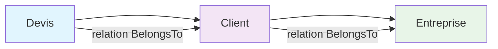

**Relations :**
- `Devis::client()` → `BelongsTo Client`
- `Client::devis()` → `HasMany Devis`

**Dépendances :**
- Sélection client obligatoire à la création
- Envoi d'emails automatique au client
- Affichage des informations entreprise

#### 2. **Module Services** 🛠️
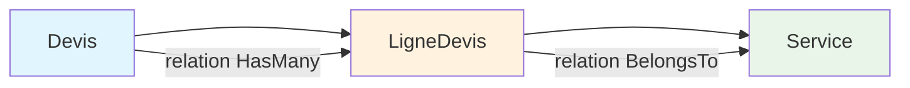

**Relations :**
- `Devis::lignes()` → `HasMany LigneDevis`
- `LigneDevis::service()` → `BelongsTo Service`

**Fonctionnalités :**
- Catalogue de services disponibles
- Calculs automatiques (HT, TVA, TTC)
- Gestion des unités (heure, jour, forfait)

#### 3. **Module Factures** 💰
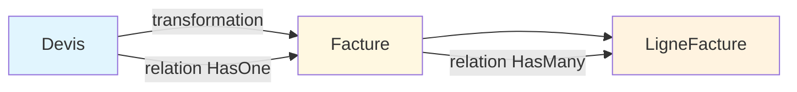

**Processus de Transformation :**
1. Vérification `peutEtreTransformeEnFacture()`
2. Création facture via `Facture::creerDepuisDevis()`
3. Copie automatique de toutes les lignes
4. Génération PDF facture
5. Logging complet via `TransformationLogService`

#### 4. **Module Utilisateurs** 👥
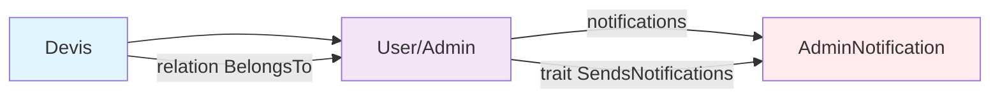

**Rôles :**
- **Administrateur assigné** : Responsable du devis
- **Super Admin** : Accès complet, notifications
- **Admin** : Notifications de changements d'état

#### 5. **Module Emails** 📧
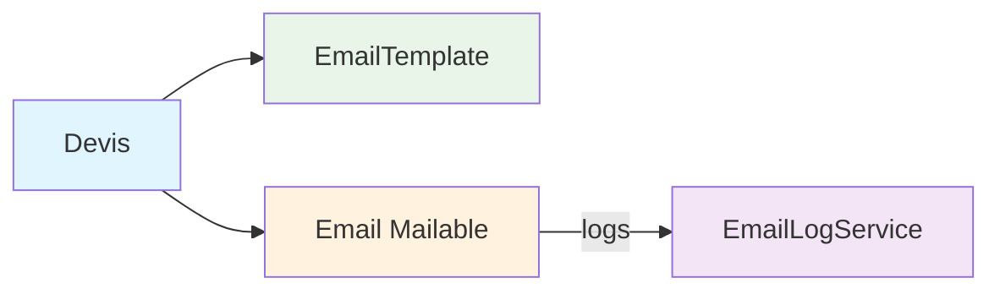

**Types d'emails :**
- `DevisClientMail` : Envoi au client
- `DevisAdminMail` : Notification admin
- `DevisAccepteMail` : Confirmation acceptation
- `DevisAccepteAdminMail` : Notification acceptation admin

### Intégrations Système

#### 1. **Système de Notifications** 🔔
```php
// Trait SendsNotifications dans le modèle Devis
use SendsNotifications;

// Notifications automatiques sur :
- Création de devis
- Changement de statut
- Acceptation/Refus
- Transformation en facture
```

#### 2. **Système d'Historique** 📝
```php
// Trait HasHistorique dans le modèle Devis
use HasHistorique;

// Historique automatique pour :
- Création/Modification
- Changements de statut
- Envois d'emails
- Acceptation/Refus
- Transformation
```

#### 3. **Système de Stockage** 💾
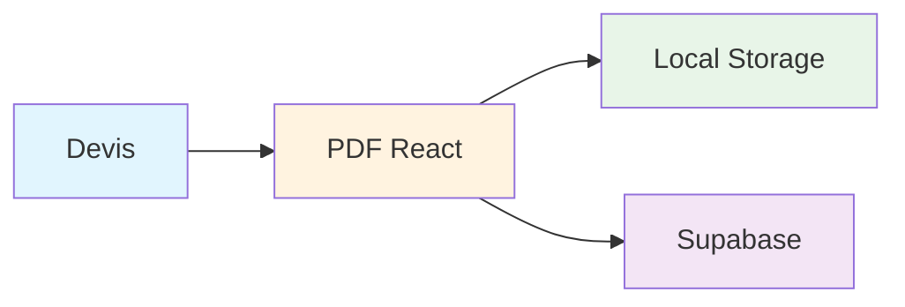

**Stockage dual :**
- **Local** : `storage/app/devis/`
- **Supabase** : Bucket public avec URLs

## 📊 Diagrammes de Flux Métier

### 1. Flux de Création de Devis

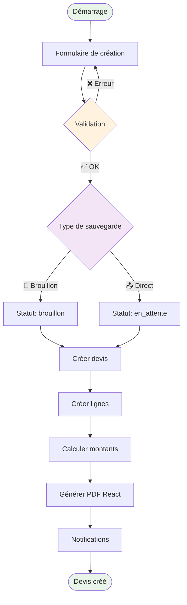

### 2. Flux d'Envoi de Devis

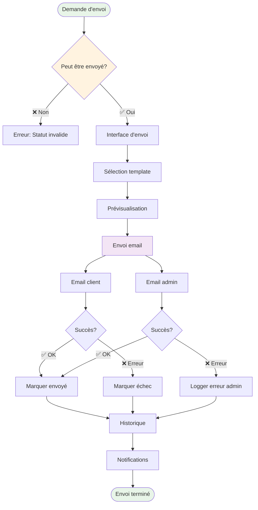

### 3. Flux de Transformation en Facture

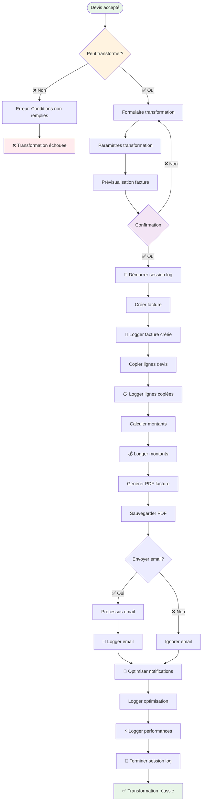

### 4. Flux de Gestion des Statuts

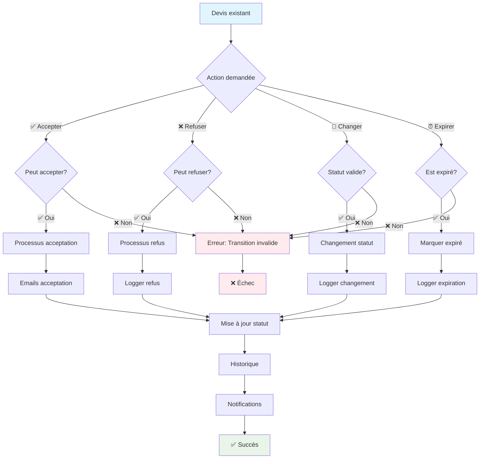

## 🎯 Points Clés du Système

### Forces du Système
1. **Machine à états robuste** avec transitions contrôlées
2. **Logging complet** de toutes les actions
3. **Intégration email** dual (client + admin)
4. **Génération PDF React** professionnelle
5. **Système de notifications** automatiques
6. **Historique détaillé** de tous les changements
7. **Transformation facture** fluide et tracée

### Contraintes Métier
1. **Statut accepté** : Seul statut permettant la transformation
2. **Devis unique** : Un devis ne peut générer qu'une seule facture
3. **Date de validité** : Expiration automatique des devis
4. **Workflow strict** : Transitions d'états contrôlées
5. **Traçabilité** : Toutes les actions sont loggées

### Optimisations
1. **Calculs automatiques** des montants
2. **Stockage dual** PDF (local + cloud)
3. **Notifications groupées** pour éviter le spam
4. **Gestion des timeouts** pour les emails
5. **Lazy loading** des relations

## 📈 Métriques et Monitoring

### Indicateurs Clés
- **Taux de conversion** : % devis acceptés
- **Délai de réponse** : Temps entre envoi et acceptation
- **Performance envoi** : Succès/échecs emails
- **Utilisation PDF** : Téléchargements et consultations

### Logs Spécialisés
- **EmailLogService** : Tous les envois d'emails
- **TransformationLogService** : Transformations en factures
- **Historique** : Toutes les modifications

---

> **Note** : Ce module constitue la fondation de la documentation technique des devis. Il sera complété par les modules suivants couvrant l'architecture détaillée, les composants backend et frontend, et les optimisations avancées. 