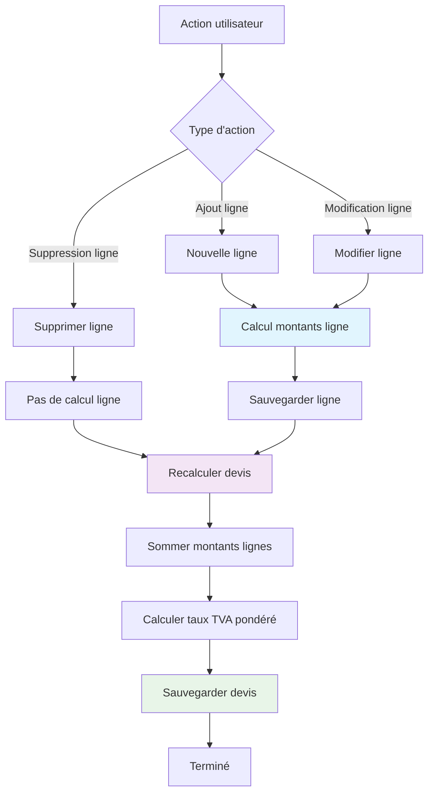
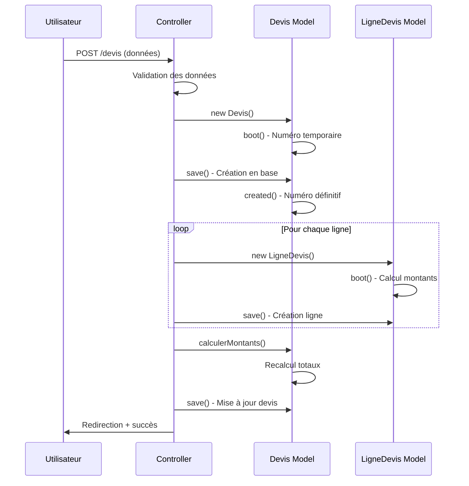
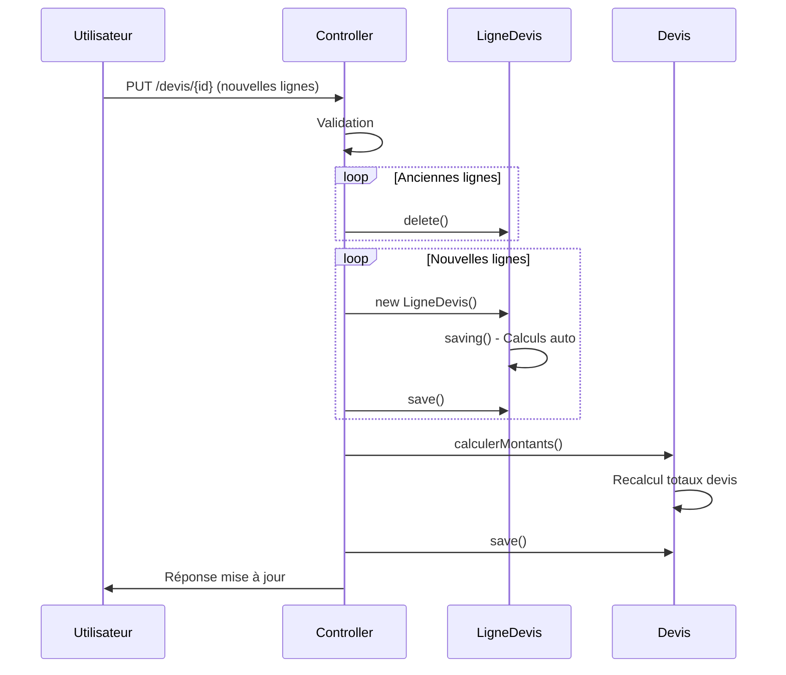

# Module 1.2 : Modèles de Données

## 📊 Introduction

Les modèles de données du système de devis reposent sur **2 tables principales** : `devis` et `lignes_devis`. Ce module détaille la structure complète de ces tables, leurs relations avec les autres entités du système, les contraintes de validation et les calculs automatiques.

> **Tables principales** : `devis` (20 champs) + `lignes_devis` (11 champs)  
> **Relations** : Clients, Utilisateurs, Services, Factures  
> **Calculs automatiques** : Montants HT, TVA, TTC via événements Laravel

## 🏗️ Structure Table `devis`

### Schema de Base de Données

```sql
CREATE TABLE `devis` (
  `id` bigint UNSIGNED NOT NULL AUTO_INCREMENT,
  `numero_devis` varchar(255) NOT NULL UNIQUE,           -- DV-25-0001 (auto-généré)
  `client_id` bigint UNSIGNED NOT NULL,                  -- FK vers clients
  `administrateur_id` bigint UNSIGNED DEFAULT NULL,      -- FK vers users (admin assigné)
  `date_devis` date DEFAULT NULL,                        -- Date de création du devis
  `date_validite` date DEFAULT NULL,                     -- Date limite d'acceptation
  `statut` enum('brouillon','en_attente','envoye','accepte','refuse','expire') DEFAULT 'brouillon',
  `statut_envoi` enum('non_envoye','envoye','echec_envoi') DEFAULT 'non_envoye',
  `date_envoi_client` datetime DEFAULT NULL,             -- Date d'envoi au client
  `date_envoi_admin` datetime DEFAULT NULL,              -- Date de notification admin
  `pdf_file` varchar(255) DEFAULT NULL,                  -- Nom fichier PDF local
  `pdf_url` varchar(255) DEFAULT NULL,                   -- URL publique Supabase
  `objet` varchar(255) DEFAULT NULL,                     -- Objet du devis
  `description` text DEFAULT NULL,                       -- Description détaillée
  `montant_ht` decimal(10,2) DEFAULT 0.00,              -- Montant total HT
  `taux_tva` decimal(5,2) DEFAULT 20.00,                -- Taux TVA moyen pondéré
  `montant_tva` decimal(10,2) DEFAULT 0.00,             -- Montant TVA total
  `montant_ttc` decimal(10,2) DEFAULT 0.00,             -- Montant total TTC
  `conditions` text DEFAULT NULL,                        -- Conditions particulières
  `notes` text DEFAULT NULL,                             -- Notes internes
  `date_acceptation` date DEFAULT NULL,                  -- Date d'acceptation client
  `archive` tinyint(1) DEFAULT 0,                       -- Archivage (soft delete)
  `created_at` timestamp NULL DEFAULT NULL,
  `updated_at` timestamp NULL DEFAULT NULL,
  PRIMARY KEY (`id`),
  UNIQUE KEY `devis_numero_devis_unique` (`numero_devis`),
  KEY `devis_client_id_foreign` (`client_id`),
  KEY `devis_administrateur_id_foreign` (`administrateur_id`),
  CONSTRAINT `devis_client_id_foreign` FOREIGN KEY (`client_id`) REFERENCES `clients` (`id`) ON DELETE CASCADE,
  CONSTRAINT `devis_administrateur_id_foreign` FOREIGN KEY (`administrateur_id`) REFERENCES `users` (`id`) ON DELETE SET NULL
);
```

### Modèle Laravel `Devis.php`

#### Attributs Fillable (20 champs)
```php
protected $fillable = [
    'numero_devis',           // Auto-généré via boot()
    'client_id',             // Obligatoire - FK vers clients
    'administrateur_id',     // FK vers users (admin assigné)
    'date_devis',           // Date de création
    'date_validite',        // Date limite validité
    'statut',               // Statut métier (6 valeurs)
    'statut_envoi',         // Statut envoi (3 valeurs)
    'pdf_file',             // Nom fichier PDF local
    'objet',                // Objet du devis
    'description',          // Description détaillée
    'montant_ht',           // Calculé automatiquement
    'taux_tva',             // Calculé automatiquement (pondéré)
    'montant_tva',          // Calculé automatiquement
    'montant_ttc',          // Calculé automatiquement
    'conditions',           // Conditions particulières
    'notes',                // Notes internes
    'date_acceptation',     // Date acceptation client
    'date_envoi_client',    // Timestamp envoi client
    'date_envoi_admin',     // Timestamp notification admin
    'archive',              // Soft delete boolean
];
```

#### Castings de Types
```php
protected $casts = [
    'date_devis' => 'date',              // Carbon date
    'date_validite' => 'date',           // Carbon date
    'date_acceptation' => 'date',        // Carbon date
    'date_envoi_client' => 'datetime',   // Carbon datetime
    'date_envoi_admin' => 'datetime',    // Carbon datetime
    'montant_ht' => 'decimal:2',         // Précision 2 décimales
    'taux_tva' => 'decimal:2',           // Précision 2 décimales
    'montant_tva' => 'decimal:2',        // Précision 2 décimales
    'montant_ttc' => 'decimal:2',        // Précision 2 décimales
    'archive' => 'boolean',              // Boolean true/false
];
```

#### Traits Utilisés
```php
use HasHistorique;          // Historique automatique des modifications
use SendsNotifications;     // Notifications automatiques aux admins
```

## 🔗 Relations avec Autres Modèles

### 1. Relation avec Client (BelongsTo)
```php
public function client(): BelongsTo
{
    return $this->belongsTo(Client::class);
}

// Utilisation
$devis = Devis::with('client.entreprise')->find(1);
$clientNom = $devis->client->nom_complet;
$entrepriseNom = $devis->client->entreprise->nom ?? null;
```

**Contrainte Database :**
- `client_id` : `FOREIGN KEY` avec `CASCADE` on delete
- Un devis **doit** appartenir à un client
- Si le client est supprimé, le devis est supprimé automatiquement

### 2. Relation avec Administrateur (BelongsTo)
```php
public function administrateur(): BelongsTo
{
    return $this->belongsTo(User::class, 'administrateur_id');
}

// Utilisation
$devis = Devis::with('administrateur')->find(1);
$adminNom = $devis->administrateur->name ?? 'Non assigné';
```

**Contrainte Database :**
- `administrateur_id` : `FOREIGN KEY` avec `SET NULL` on delete
- Relation **optionnelle** (nullable)
- Si l'admin est supprimé, le champ devient `NULL`

### 3. Relation avec Facture (HasOne)
```php
public function facture()
{
    return $this->hasOne(Facture::class);
}

// Vérification transformation
public function peutEtreTransformeEnFacture(): bool
{
    return $this->statut === 'accepte' && !$this->facture()->exists();
}
```

**Règle Métier :**
- Un devis ne peut générer qu'**une seule facture**
- Seuls les devis avec statut `accepte` peuvent être transformés
- Une fois transformé, aucune nouvelle transformation n'est possible

### 4. Relation avec Lignes de Devis (HasMany)
```php
public function lignes()
{
    return $this->hasMany(LigneDevis::class)->ordered();
}

// Utilisation avec services
$devis = Devis::with('lignes.service')->find(1);
foreach ($devis->lignes as $ligne) {
    echo $ligne->service->nom ?? $ligne->description_personnalisee;
}
```

**Contrainte Database :**
- Relation **obligatoire** : un devis doit avoir au moins 1 ligne
- `CASCADE` on delete : supprimer le devis supprime toutes ses lignes
- Ordre automatique via scope `ordered()`

## 📋 Structure Table `lignes_devis`

### Schema de Base de Données

```sql
CREATE TABLE `lignes_devis` (
  `id` bigint UNSIGNED NOT NULL AUTO_INCREMENT,
  `devis_id` bigint UNSIGNED NOT NULL,                   -- FK vers devis (CASCADE)
  `service_id` bigint UNSIGNED DEFAULT NULL,             -- FK vers services (optionnel)
  `quantite` int NOT NULL DEFAULT 1,                     -- Quantité
  `prix_unitaire_ht` decimal(10,2) NOT NULL,            -- Prix unitaire HT
  `taux_tva` decimal(5,2) NOT NULL DEFAULT 20.00,       -- Taux TVA applicable
  `montant_ht` decimal(10,2) NOT NULL,                  -- Calculé automatiquement
  `montant_tva` decimal(10,2) NOT NULL,                 -- Calculé automatiquement
  `montant_ttc` decimal(10,2) NOT NULL,                 -- Calculé automatiquement
  `ordre` int NOT NULL DEFAULT 1,                       -- Ordre d'affichage
  `description_personnalisee` text DEFAULT NULL,        -- Description spécifique
  `created_at` timestamp NULL DEFAULT NULL,
  `updated_at` timestamp NULL DEFAULT NULL,
  PRIMARY KEY (`id`),
  KEY `lignes_devis_devis_id_ordre_index` (`devis_id`,`ordre`),
  KEY `lignes_devis_service_id_index` (`service_id`),
  CONSTRAINT `lignes_devis_devis_id_foreign` FOREIGN KEY (`devis_id`) REFERENCES `devis` (`id`) ON DELETE CASCADE,
  CONSTRAINT `lignes_devis_service_id_foreign` FOREIGN KEY (`service_id`) REFERENCES `services` (`id`) ON DELETE CASCADE
);
```

### Modèle Laravel `LigneDevis.php`

#### Attributs Fillable (11 champs)
```php
protected $fillable = [
    'devis_id',                    // FK vers devis
    'service_id',                  // FK vers service (nullable)
    'quantite',                    // Quantité (entier)
    'prix_unitaire_ht',           // Prix unitaire HT
    'taux_tva',                   // Taux TVA (pourcentage)
    'montant_ht',                 // Calculé automatiquement
    'montant_tva',                // Calculé automatiquement
    'montant_ttc',                // Calculé automatiquement
    'ordre',                      // Ordre d'affichage
    'description_personnalisee',   // Description spécifique
];
```

#### Castings de Types
```php
protected $casts = [
    'quantite' => 'integer',              // Entier
    'prix_unitaire_ht' => 'decimal:2',    // Précision 2 décimales
    'taux_tva' => 'decimal:2',            // Précision 2 décimales
    'montant_ht' => 'decimal:2',          // Précision 2 décimales
    'montant_tva' => 'decimal:2',         // Précision 2 décimales
    'montant_ttc' => 'decimal:2',         // Précision 2 décimales
    'ordre' => 'integer',                 // Entier
];
```

## ⚙️ Calculs Automatiques

### Calculs au Niveau Ligne (`LigneDevis`)

```php
// Événement boot() dans LigneDevis
protected static function boot()
{
    parent::boot();

    static::saving(function ($ligne) {
        // 1. Calcul montant HT
        $ligne->montant_ht = $ligne->quantite * $ligne->prix_unitaire_ht;
        
        // 2. Calcul montant TVA
        $ligne->montant_tva = $ligne->montant_ht * ($ligne->taux_tva / 100);
        
        // 3. Calcul montant TTC
        $ligne->montant_ttc = $ligne->montant_ht + $ligne->montant_tva;
    });
}
```

**Formules appliquées :**
- `montant_ht = quantite × prix_unitaire_ht`
- `montant_tva = montant_ht × (taux_tva ÷ 100)`
- `montant_ttc = montant_ht + montant_tva`

### Calculs au Niveau Devis

```php
// Méthode calculerMontants() dans Devis
public function calculerMontants(): void
{
    $this->load('lignes');

    // 1. Sommation des montants des lignes
    $this->montant_ht = $this->lignes->sum('montant_ht');
    $this->montant_tva = $this->lignes->sum('montant_tva');
    $this->montant_ttc = $this->lignes->sum('montant_ttc');

    // 2. Calcul du taux TVA moyen pondéré
    if ($this->montant_ht > 0) {
        $this->taux_tva = ($this->montant_tva / $this->montant_ht) * 100;
    }
}
```

**Logique de Calcul :**
1. **Sommation** des montants de toutes les lignes
2. **Taux TVA pondéré** = (Total TVA ÷ Total HT) × 100
3. **Appel automatique** après création/modification des lignes

### Déclencheurs de Recalcul



## 🔒 Contraintes et Validations

### Validations Backend (DevisController)

#### Validation Création/Modification Devis
```php
// Règles dans DevisController::store() et ::update()
$validated = $request->validate([
    // === CHAMPS OBLIGATOIRES ===
    'client_id' => 'required|exists:clients,id',
    'administrateur_id' => 'required|exists:users,id',
    'date_devis' => 'required|date',
    'date_validite' => 'required|date|after:date_devis',
    
    // === CHAMPS OPTIONNELS ===
    'objet' => 'nullable|string|max:255',
    'description' => 'nullable|string',
    'conditions' => 'nullable|string',
    'notes' => 'nullable|string',
    
    // === LIGNES DE DEVIS (OBLIGATOIRES) ===
    'lignes' => 'required|array|min:1',
    'lignes.*.service_id' => 'nullable|exists:services,id',
    'lignes.*.quantite' => 'required|numeric|min:0',
    'lignes.*.prix_unitaire_ht' => 'required|numeric|min:0',
    'lignes.*.taux_tva' => 'required|numeric|min:0|max:100',
    'lignes.*.description_personnalisee' => 'nullable|string',
    'lignes.*.ordre' => 'required|integer|min:1',
]);
```

#### Validation Changement Statut
```php
// Règles dans DevisController::changerStatut()
$validated = $request->validate([
    'statut' => 'required|in:brouillon,en_attente,envoye,accepte,refuse,expire'
]);
```

### Contraintes Base de Données

#### Contraintes de Clés Étrangères
```sql
-- Table devis
CONSTRAINT `devis_client_id_foreign` 
    FOREIGN KEY (`client_id`) REFERENCES `clients` (`id`) ON DELETE CASCADE,
CONSTRAINT `devis_administrateur_id_foreign` 
    FOREIGN KEY (`administrateur_id`) REFERENCES `users` (`id`) ON DELETE SET NULL

-- Table lignes_devis  
CONSTRAINT `lignes_devis_devis_id_foreign` 
    FOREIGN KEY (`devis_id`) REFERENCES `devis` (`id`) ON DELETE CASCADE,
CONSTRAINT `lignes_devis_service_id_foreign` 
    FOREIGN KEY (`service_id`) REFERENCES `services` (`id`) ON DELETE CASCADE
```

#### Contraintes de Domaine
```sql
-- Statuts enumérés
`statut` enum('brouillon','en_attente','envoye','accepte','refuse','expire')
`statut_envoi` enum('non_envoye','envoye','echec_envoi')

-- Contraintes numériques
`montant_ht` decimal(10,2) DEFAULT 0.00     -- Max 99,999,999.99
`taux_tva` decimal(5,2) DEFAULT 20.00       -- Max 999.99%
`quantite` int NOT NULL DEFAULT 1           -- Entier positif

-- Contraintes d'unicité
UNIQUE KEY `devis_numero_devis_unique` (`numero_devis`)
```

### Contraintes Métier (Modèle)

#### Auto-génération Numéro de Devis
```php
// Événement boot() dans Devis
protected static function boot()
{
    parent::boot();

    // Avant création : numéro temporaire
    static::creating(function ($devis) {
        if (empty($devis->numero_devis)) {
            $annee = substr(date('Y'), -2);
            $devis->numero_devis = "DV-{$annee}-TEMP";
        }
    });

    // Après création : numéro définitif basé sur ID
    static::created(function ($devis) {
        $annee = substr(date('Y'), -2);
        $numeroFormate = sprintf('DV-%s-%04d', $annee, $devis->id);

        // Mise à jour sans déclencher d'événements
        static::withoutEvents(function () use ($devis, $numeroFormate) {
            $devis->update(['numero_devis' => $numeroFormate]);
        });
    });
}
```

**Format du numéro :** `DV-{AA}-{NNNN}`
- `DV` : Préfixe fixe "Devis"
- `AA` : Année sur 2 chiffres (ex: 25 pour 2025)
- `NNNN` : ID du devis sur 4 chiffres avec zéros (ex: 0001, 0042, 1337)

#### Vérifications de Transition de Statut
```php
// Méthodes de vérification dans Devis
public function peutEtreEnvoye(): bool
{
    return in_array($this->statut, ['brouillon', 'en_attente', 'envoye']);
}

public function peutEtreTransformeEnFacture(): bool
{
    return $this->statut === 'accepte' && !$this->facture()->exists();
}

public function getEstExpireAttribute(): bool
{
    return $this->date_validite < now() && $this->statut !== 'accepte';
}
```

## 📊 Scopes et Requêtes Optimisées

### Scopes Métier

```php
// Scopes dans le modèle Devis
public function scopeActifs($query)
{
    return $query->where('archive', false);
}

public function scopeParStatut($query, $statut)
{
    return $query->where('statut', $statut);
}

public function scopeExpires($query)
{
    return $query->where('date_validite', '<', now())
                 ->where('statut', '!=', 'accepte');
}

public function scopeParClient($query, $clientId)
{
    return $query->where('client_id', $clientId);
}
```

### Scope dans LigneDevis

```php
// Scope pour l'ordre des lignes
public function scopeOrdered($query)
{
    return $query->orderBy('ordre');
}
```

### Requêtes Optimisées

```php
// Chargement optimisé avec relations
$devis = Devis::with([
    'client.entreprise',    // Client + entreprise en 1 requête
    'lignes.service',       // Lignes + services en 1 requête  
    'administrateur',       // Admin assigné
    'facture'              // Facture éventuelle
])->actifs()               // Seulement les non archivés
  ->orderBy('created_at', 'desc')
  ->paginate(20);
```

### Index de Performance

```sql
-- Index composites pour les performances
KEY `lignes_devis_devis_id_ordre_index` (`devis_id`,`ordre`),  -- Pour l'ordre des lignes
KEY `lignes_devis_service_id_index` (`service_id`),           -- Pour les jointures services
KEY `devis_client_id_foreign` (`client_id`),                  -- Pour les jointures clients
KEY `devis_administrateur_id_foreign` (`administrateur_id`)   -- Pour les jointures admins
```

## 🔄 Cycle de Vie des Données

### Création d'un Devis



### Modification d'une Ligne



## 💾 Stockage et Archivage

### Soft Delete vs Archive

Le système utilise un champ `archive` plutôt que le soft delete Laravel :

```php
// Pas de trait SoftDeletes, mais un booléen archive
protected $fillable = [
    // ...
    'archive',  // boolean - défaut false
];

// Scope pour filtrer les archives
public function scopeActifs($query)
{
    return $query->where('archive', false);
}
```

**Avantages :**
- Contrôle total sur l'archivage
- Possibilité de restaurer facilement
- Historique préservé
- Requêtes simplifiées

### Optimisation Stockage

```php
// Nettoyage périodique des anciens PDFs
// Commande artisan dédiée pour nettoyer :
// - PDFs locaux orphelins
// - URLs Supabase invalides  
// - Devis archivés > 2 ans
```

---

## 🎯 Points Clés du Modèle de Données

### Forces du Design
1. **Calculs automatiques** via événements Laravel
2. **Relations optimisées** avec eager loading
3. **Contraintes référentielles** strictes
4. **Validation multi-niveaux** (client + serveur + DB)
5. **Numérotation automatique** avec format métier
6. **Archivage souple** sans suppression définitive

### Contraintes Techniques
1. **Montants en decimal(10,2)** - Max 99M€
2. **TVA max 999.99%** - Flexible pour tous pays
3. **Numérotation annuelle** - Reset chaque année
4. **CASCADE obligatoire** - Cohérence des données

### Évolutions Possibles
1. **Multi-devises** - Ajout champ devise
2. **TVA par ligne** - Déjà supporté
3. **Remises globales** - Ajout champs remise
4. **Versioning** - Historique des versions

---

> **Note** : Ce modèle de données constitue la base solide du système de devis, avec des calculs automatiques fiables et une structure évolutive pour les besoins futurs. 