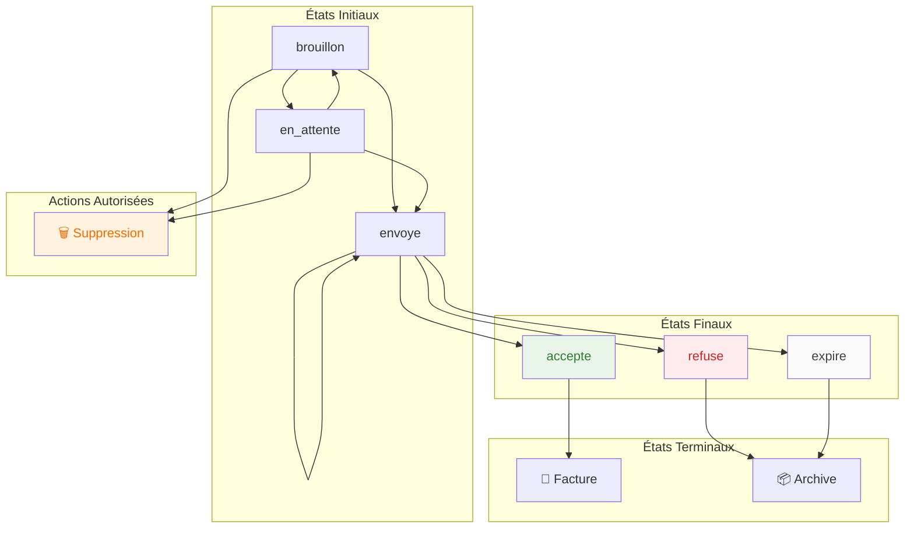
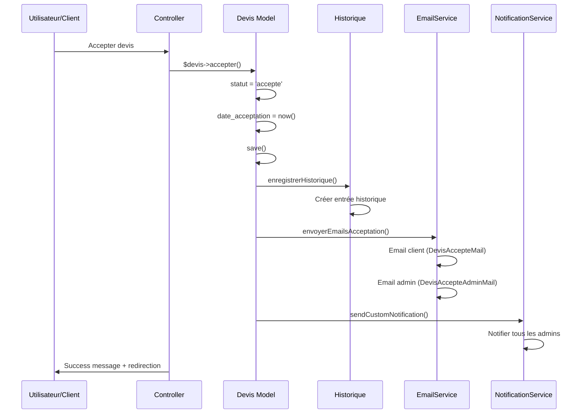

# Module 1.3 : Gestion des Statuts

## 🎯 Introduction

La gestion des statuts constitue le **cœur de la logique métier** du système de devis. Ce module détaille la machine à états sophistiquée qui contrôle les transitions, les méthodes de changement de statut, le système de notifications automatiques et la traçabilité complète des actions.

> **Statuts métier** : 6 statuts principaux + 3 statuts d'envoi  
> **Transitions contrôlées** : Machine à états avec validations  
> **Notifications automatiques** : Via trait `SendsNotifications`  
> **Historique complet** : Toutes les transitions tracées

## 🔄 Machine à États - Statuts Métier

### Énumération des Statuts

```php
// Énumération dans la migration et validation
enum('brouillon', 'en_attente', 'envoye', 'accepte', 'refuse', 'expire')

// Traduction française dans le modèle
public function getStatutFrAttribute(): string
{
    return match($this->statut) {
        'brouillon' => 'Brouillon',      // 🟡 Création en cours
        'en_attente' => 'En attente',    // 🔵 Prêt à envoyer
        'envoye' => 'Envoyé',           // 🟣 Transmis au client
        'accepte' => 'Accepté',         // 🟢 Validé par le client
        'refuse' => 'Refusé',           // 🔴 Rejeté par le client
        'expire' => 'Expiré',           // ⚫ Date limite dépassée
        default => ucfirst($this->statut)
    };
}
```

### Statuts d'Envoi

```php
// Énumération pour le suivi des transmissions
enum('non_envoye', 'envoye', 'echec_envoi')

// Traduction française
public function getStatutEnvoiFrAttribute(): string
{
    return match($this->statut_envoi) {
        'non_envoye' => 'Non envoyé',    // ⭕ Pas encore transmis
        'envoye' => 'Envoyé',           // ✅ Transmis avec succès
        'echec_envoi' => 'Échec d\'envoi', // ❌ Erreur transmission
        default => ucfirst($this->statut_envoi)
    };
}
```

## 🚀 Méthodes de Transition de Statut

### 1. Acceptation du Devis

```php
/**
 * Accepter le devis - Transition vers "accepte"
 * Méthode complexe avec emails et notifications
 */
public function accepter(): bool
{
    $ancienStatut = $this->statut;
    $this->statut = 'accepte';
    $this->date_acceptation = now();

    $result = $this->save();

    if ($result) {
        // 1. Enregistrer dans l'historique
        $this->enregistrerHistorique(
            'changement_statut',
            "Devis accepté",
            "Le devis #{$this->numero_devis} a été accepté",
            ['statut' => $ancienStatut],
            ['statut' => 'accepte', 'date_acceptation' => $this->date_acceptation->format('Y-m-d H:i:s')]
        );

        // 2. Envoyer emails de confirmation (non bloquant)
        try {
            $this->envoyerEmailsAcceptation();
        } catch (\Exception $e) {
            Log::error('Erreur emails acceptation (non bloquant)', [
                'devis_numero' => $this->numero_devis,
                'error' => $e->getMessage()
            ]);
            // L'acceptation continue même si l'email échoue
        }
    }

    return $result;
}
```

**Processus d'acceptation :**
1. **Transition statut** : `{ancien}` → `accepte`
2. **Date d'acceptation** : Timestamp automatique
3. **Historique** : Traçabilité complète
4. **Emails de confirmation** : Client + Admin (non bloquant)
5. **Notifications** : Via trait `SendsNotifications`

### 2. Refus du Devis

```php
/**
 * Refuser le devis - Transition vers "refuse"
 * Méthode simple sans emails automatiques
 */
public function refuser(): bool
{
    $ancienStatut = $this->statut;
    $this->statut = 'refuse';

    $result = $this->save();

    if ($result) {
        $this->enregistrerHistorique(
            'changement_statut',
            "Devis refusé",
            "Le devis #{$this->numero_devis} a été refusé",
            ['statut' => $ancienStatut],
            ['statut' => 'refuse']
        );
    }

    return $result;
}
```

**Processus de refus :**
1. **Transition statut** : `{ancien}` → `refuse`
2. **Historique** : Traçabilité du refus
3. **Pas d'emails** : Évite le spam client
4. **Notifications** : Via trait automatique

### 3. Expiration Automatique

```php
/**
 * Marquer comme expiré - Transition automatique
 * Utilisé par les tâches cron ou vérifications
 */
public function marquerExpire(): bool
{
    if ($this->est_expire && $this->statut !== 'accepte') {
        $ancienStatut = $this->statut;
        $this->statut = 'expire';

        $result = $this->save();

        if ($result) {
            $this->enregistrerHistorique(
                'changement_statut',
                "Devis expiré",
                "Le devis #{$this->numero_devis} a expiré automatiquement",
                ['statut' => $ancienStatut],
                ['statut' => 'expire']
            );
        }

        return $result;
    }
    return false;
}
```

**Logique d'expiration :**
- **Condition** : `date_validite < now()` ET `statut ≠ 'accepte'`
- **Protection** : Les devis acceptés ne peuvent pas expirer
- **Automatique** : Via tâches planifiées ou vérifications

### 4. Gestion de l'Envoi

```php
/**
 * Marquer comme envoyé - Transition complexe
 * Gère les statuts métier ET d'envoi
 */
public function marquerEnvoye(): bool
{
    $ancienStatut = $this->statut;
    $ancienStatutEnvoi = $this->statut_envoi;

    // Transition automatique brouillon → envoyé
    if ($this->statut === 'brouillon') {
        $this->statut = 'envoye';
    }

    $this->statut_envoi = 'envoye';
    $this->date_envoi_client = now();

    $result = $this->save();

    if ($result) {
        // Historique avec données avant/après
        $changes = [
            'statut_envoi' => 'envoye',
            'date_envoi_client' => $this->date_envoi_client->format('Y-m-d H:i:s')
        ];

        $original = [
            'statut_envoi' => $ancienStatutEnvoi,
            'date_envoi_client' => null
        ];

        // Ajouter changement de statut si applicable
        if ($ancienStatut !== $this->statut) {
            $changes['statut'] = $this->statut;
            $original['statut'] = $ancienStatut;
        }

        $this->enregistrerHistorique(
            'envoi_email',
            "Devis envoyé au client",
            "Le devis #{$this->numero_devis} a été envoyé avec succès au client {$this->client->nom_complet}",
            $original,
            $changes,
            [
                'email_destinataire' => $this->client->email,
                'type_envoi' => 'client'
            ]
        );
    }

    return $result;
}
```

### 5. Gestion des Échecs d'Envoi

```php
/**
 * Marquer échec d'envoi - Statut d'envoi uniquement
 */
public function marquerEchecEnvoi(): bool
{
    $ancienStatutEnvoi = $this->statut_envoi;
    $this->statut_envoi = 'echec_envoi';

    $result = $this->save();

    if ($result) {
        $this->enregistrerHistorique(
            'envoi_email',
            "Échec d'envoi du devis",
            "L'envoi du devis #{$this->numero_devis} au client {$this->client->nom_complet} a échoué",
            ['statut_envoi' => $ancienStatutEnvoi],
            ['statut_envoi' => 'echec_envoi'],
            [
                'email_destinataire' => $this->client->email,
                'type_envoi' => 'client',
                'resultat' => 'echec'
            ]
        );
    }

    return $result;
}
```

## 🔐 Méthodes de Validation des Transitions

### Vérifications Métier

```php
/**
 * Vérifier si le devis peut être envoyé
 * Logique métier : statuts autorisés pour l'envoi
 */
public function peutEtreEnvoye(): bool
{
    return in_array($this->statut, ['brouillon', 'en_attente', 'envoye']);
}

/**
 * Vérifier si le devis peut être transformé en facture
 * Règle : UNIQUEMENT les devis acceptés sans facture existante
 */
public function peutEtreTransformeEnFacture(): bool
{
    return $this->statut === 'accepte' && !$this->facture()->exists();
}

/**
 * Vérifier si le devis est expiré
 * Propriété calculée basée sur date_validite
 */
public function getEstExpireAttribute(): bool
{
    return $this->date_validite < now() && $this->statut !== 'accepte';
}
```

### Matrice des Transitions Autorisées



## 🎮 Contrôleur - Gestion des Statuts

### Méthode d'Acceptation (Interface Admin)

```php
/**
 * Accepter un devis via interface administrateur
 * Avec gestion d'erreurs et notifications personnalisées
 */
public function accepter(Devis $devis)
{
    try {
        Log::info('Début acceptation devis via interface', [
            'devis_id' => $devis->getKey(),
            'devis_numero' => $devis->numero_devis,
            'user_id' => Auth::id()
        ]);

        $result = $devis->accepter();

        if ($result) {
            // Notification personnalisée via trait
            $devis->sendCustomNotification(
                'accepted',
                "Le devis #{$devis->numero_devis} pour {$devis->client->prenom} {$devis->client->nom} a été accepté par le client"
            );

            return redirect()->back()
                ->with('success', '✅ Devis ' . $devis->numero_devis . ' accepté avec succès !');
        } else {
            return back()->with('error', '❌ Échec de l\'acceptation du devis.');
        }
    } catch (Exception $e) {
        Log::error('Erreur acceptation devis', [
            'devis_id' => $devis->getKey(),
            'error' => $e->getMessage()
        ]);

        // Gestion spécifique des erreurs SMTP
        if (str_contains($e->getMessage(), 'timeout') || 
            str_contains($e->getMessage(), 'SMTP')) {
            return back()->with('error', 
                '❌ Problème email. Le devis peut être accepté manuellement via commandes admin.');
        }

        return back()->with('error', 
            '❌ Erreur lors de l\'acceptation : ' . $e->getMessage());
    }
}
```

### Méthode de Changement de Statut Générique

```php
/**
 * Changer le statut d'un devis - Interface générique
 * Supporte tous les statuts avec actions spécialisées
 */
public function changerStatut(Request $request, Devis $devis)
{
    $request->validate([
        'statut' => 'required|in:brouillon,en_attente,envoye,accepte,refuse,expire'
    ]);

    try {
        $nouveauStatut = $request->statut;

        // Actions spécialisées selon le statut cible
        switch ($nouveauStatut) {
            case 'accepte':
                $devis->accepter();  // Méthode complète avec emails
                break;
            case 'refuse':
                $devis->refuser();   // Méthode dédiée
                break;
            default:
                // Changement direct pour les autres statuts
                $devis->statut = $nouveauStatut;
                $devis->save();
                break;
        }

        // Messages personnalisés par statut
        $messages = [
            'brouillon' => '📝 Devis ' . $devis->numero_devis . ' remis en brouillon.',
            'en_attente' => '⏳ Devis ' . $devis->numero_devis . ' mis en attente.',
            'envoye' => '📧 Devis ' . $devis->numero_devis . ' marqué comme envoyé.',
            'accepte' => '✅ Devis ' . $devis->numero_devis . ' accepté avec succès !',
            'refuse' => '⛔ Devis ' . $devis->numero_devis . ' refusé.',
            'expire' => '⏰ Devis ' . $devis->numero_devis . ' marqué comme expiré.'
        ];

        return redirect()->back()
            ->with('success', $messages[$nouveauStatut] ?? 'Statut mis à jour.');
    } catch (Exception $e) {
        return back()->with('error', '❌ Erreur lors de la modification du statut.');
    }
}
```

## 🔔 Système de Notifications Automatiques

### Trait SendsNotifications

Le système utilise le trait `SendsNotifications` pour les notifications automatiques :

```php
// Dans le modèle Devis
use HasHistorique, SendsNotifications;

// Notifications automatiques déclenchées sur :
// - created() : Création d'un nouveau devis
// - updated() : Modification du devis (y compris changement statut)
// - deleted() : Suppression du devis
```

### Notifications Personnalisées

```php
/**
 * Envoi de notifications personnalisées pour les changements d'état
 * Utilisé dans le contrôleur pour des messages spécifiques
 */
public function sendCustomNotification(string $action, ?string $message = null)
{
    // Envoie aux admins et super_admins via AdminNotification
    static::sendNotificationToAdmins($this, $action, $message);
}

// Utilisation dans les contrôleurs
$devis->sendCustomNotification('accepted', 
    "Le devis #{$devis->numero_devis} pour {$devis->client->prenom} {$devis->client->nom} a été accepté"
);

$devis->sendCustomNotification('refused', 
    "Le devis #{$devis->numero_devis} a été refusé par le client"
);
```

### Classes de Notifications

```php
// Classe spécialisée pour les devis
App\Notifications\DevisNotification

// Destinataires : Tous les utilisateurs avec rôle admin ou super_admin
$admins = User::whereHas('userRole', function ($query) {
    $query->whereIn('name', ['admin', 'super_admin']);
})->get();
```

## 📝 Système d'Historique et Traçabilité

### Trait HasHistorique

```php
// Enregistrement automatique dans la table historique
$this->enregistrerHistorique(
    $action,           // Type d'action : 'changement_statut', 'envoi_email'
    $titre,            // Titre court : "Devis accepté"
    $description,      // Description détaillée
    $donneesAvant,     // État avant modification
    $donneesApres,     // État après modification
    $donneesSupp       // Données supplémentaires (emails, etc.)
);
```

### Exemples d'Historique par Statut

#### Acceptation
```php
$this->enregistrerHistorique(
    'changement_statut',
    "Devis accepté",
    "Le devis #{$this->numero_devis} a été accepté",
    ['statut' => 'envoye'],
    ['statut' => 'accepte', 'date_acceptation' => '2025-01-15 14:30:00']
);
```

#### Envoi
```php
$this->enregistrerHistorique(
    'envoi_email',
    "Devis envoyé au client",
    "Le devis #{$this->numero_devis} a été envoyé avec succès au client Jean Dupont",
    ['statut_envoi' => 'non_envoye'],
    ['statut_envoi' => 'envoye', 'date_envoi_client' => '2025-01-15 14:30:00'],
    [
        'email_destinataire' => 'jean.dupont@exemple.com',
        'type_envoi' => 'client'
    ]
);
```

#### Échec d'envoi
```php
$this->enregistrerHistorique(
    'envoi_email',
    "Échec d'envoi du devis",
    "L'envoi du devis #{$this->numero_devis} au client a échoué",
    ['statut_envoi' => 'non_envoye'],
    ['statut_envoi' => 'echec_envoi'],
    [
        'email_destinataire' => 'client@exemple.com',
        'type_envoi' => 'client',
        'resultat' => 'echec'
    ]
);
```

## 🔄 Flux de Gestion des Statuts

### Flux d'Acceptation Complète



### Flux de Changement de Statut Générique

```mermaid
flowchart TD
    START[Demande changement statut] --> VALIDATE{Validation}
    VALIDATE -->|❌ Erreur| ERROR[Erreur validation]
    VALIDATE -->|✅ OK| SWITCH{Type de statut}
    
    SWITCH -->|accepte| ACCEPT[Méthode accepter()]
    SWITCH -->|refuse| REFUSE[Méthode refuser()]
    SWITCH -->|autres| DIRECT[Changement direct]
    
    ACCEPT --> EMAILS[Envoi emails]
    REFUSE --> SKIP_EMAILS[Pas d'emails]
    DIRECT --> SKIP_EMAILS
    
    EMAILS --> HISTORY[Historique]
    SKIP_EMAILS --> HISTORY
    
    HISTORY --> NOTIFICATIONS[Notifications]
    NOTIFICATIONS --> SUCCESS[Message succès]
    
    ERROR --> RETURN[Retour avec erreur]
    SUCCESS --> RETURN
    
    style ACCEPT fill:#e8f5e8
    style REFUSE fill:#ffebee
    style ERROR fill:#ffebee
    style SUCCESS fill:#e8f5e8
```

### Flux d'Expiration Automatique

```mermaid
flowchart TD
    CRON[Tâche Cron/Vérification] --> QUERY[Recherche devis expirés]
    QUERY --> CHECK{devis.date_validite < now()}
    
    CHECK -->|❌ Non| SKIP[Ignorer]
    CHECK -->|✅ Oui| VERIFY{statut != 'accepte'}
    
    VERIFY -->|❌ Accepté| PROTECT[Protéger - Ne pas expirer]
    VERIFY -->|✅ OK| EXPIRE[marquerExpire()]
    
    EXPIRE --> UPDATE[statut = 'expire']
    UPDATE --> HISTORY[Historique automatique]
    HISTORY --> NOTIF[Notifications admins]
    
    SKIP --> END[Terminé]
    PROTECT --> END
    NOTIF --> END
    
    style EXPIRE fill:#fafafa
    style PROTECT fill:#e8f5e8
    style END fill:#e8f5e8
```

## 📊 États et Métriques

### Compteurs par Statut

```php
// Requêtes optimisées pour les statistiques
$statistiques = [
    'brouillons' => Devis::where('statut', 'brouillon')->count(),
    'en_attente' => Devis::where('statut', 'en_attente')->count(),
    'envoyes' => Devis::where('statut', 'envoye')->count(),
    'acceptes' => Devis::where('statut', 'accepte')->count(),
    'refuses' => Devis::where('statut', 'refuse')->count(),
    'expires' => Devis::where('statut', 'expire')->count(),
];

// Taux de conversion
$tauxAcceptation = ($statistiques['acceptes'] / $statistiques['envoyes']) * 100;
$tauxRefus = ($statistiques['refuses'] / $statistiques['envoyes']) * 100;
```

### Métriques d'Envoi

```php
// Statuts d'envoi pour monitoring
$envois = [
    'non_envoyes' => Devis::where('statut_envoi', 'non_envoye')->count(),
    'envoyes' => Devis::where('statut_envoi', 'envoye')->count(),
    'echecs' => Devis::where('statut_envoi', 'echec_envoi')->count(),
];

// Taux de succès d'envoi
$tauxSuccesEnvoi = ($envois['envoyes'] / ($envois['envoyes'] + $envois['echecs'])) * 100;
```

## 🎯 Points Clés de la Gestion des Statuts

### Forces du Système
1. **Machine à états robuste** avec validations métier
2. **Transitions contrôlées** via méthodes dédiées
3. **Historique complet** de tous les changements
4. **Notifications automatiques** et personnalisées
5. **Gestion d'erreurs** élaborée (emails, timeouts)
6. **Protection des états** (devis acceptés ne peuvent expirer)
7. **Traçabilité totale** des actions utilisateur et automatiques

### Contraintes Métier
1. **Statuts terminaux** : `accepte`, `refuse`, `expire`
2. **Transition unique** : Un devis accepté ne peut changer d'état
3. **Expiration protégée** : Les devis acceptés ne peuvent expirer
4. **Emails non bloquants** : Les erreurs d'email n'empêchent pas les transitions

### Optimisations
1. **Emails asynchrones** pour l'acceptation
2. **Timeouts courts** pour éviter les blocages
3. **Logs détaillés** pour le débogage
4. **Notifications groupées** aux admins
5. **Requêtes optimisées** pour les statistiques

---

> **Note** : La gestion des statuts est le pilier central du système de devis, assurant la cohérence métier et la traçabilité complète de toutes les transitions d'état. 