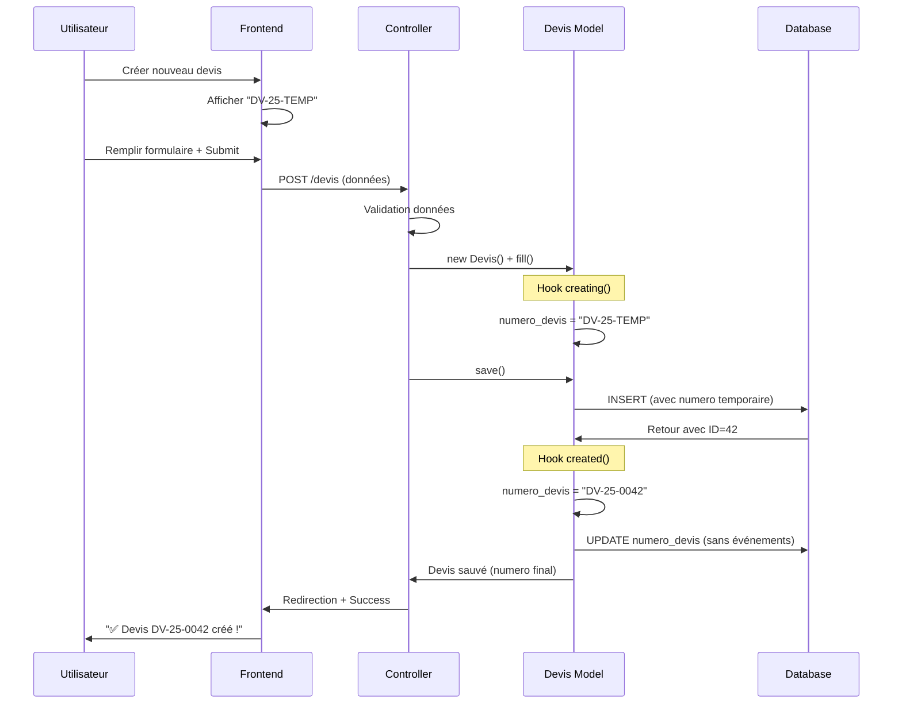
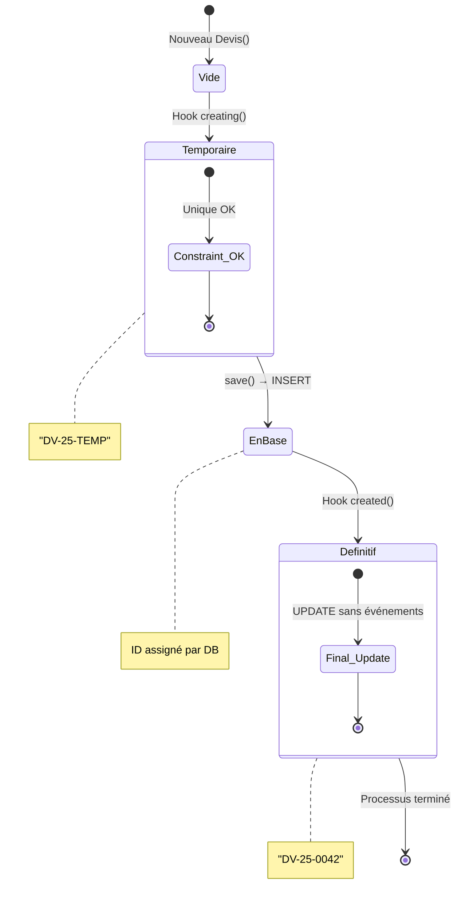

# Module 1.4 : Auto-génération Numéros

## 🎯 Introduction

L'auto-génération des numéros de devis est un système sophistiqué qui garantit l'unicité, la traçabilité et la cohérence des identifiants métier. Ce module détaille le processus d'auto-génération, les hooks Laravel utilisés, les commandes de migration et la gestion des numéros temporaires.

> **Format standardisé** : `DV-{AA}-{NNNN}` (ex: DV-25-0042)  
> **Génération automatique** : Via hooks Laravel `boot()`  
> **Numéros temporaires** : Pendant la création  
> **Migration disponible** : Commande pour uniformiser l'existant

## 🏗️ Architecture du Système

### Format Standard

```
DV-{AA}-{NNNN}
│  │    └── ID du devis sur 4 chiffres avec padding zéros (0001, 0042, 1337)
│  └─────── Année sur 2 chiffres (25 pour 2025, 26 pour 2026)
└────────── Préfixe fixe "Devis"
```

**Exemples concrets :**
- `DV-25-0001` : Premier devis de 2025
- `DV-25-0042` : 42ème devis de 2025  
- `DV-25-1337` : 1337ème devis de 2025
- `DV-26-0001` : Premier devis de 2026

### Avantages du Format

1. **Lisibilité** : Format facile à comprendre pour les utilisateurs
2. **Unicité** : Impossible d'avoir de doublons
3. **Chronologie** : L'année permet de situer dans le temps
4. **Recherche** : Format prévisible pour les requêtes
5. **Archive** : Facilite le classement par année

## ⚙️ Hooks Laravel - Implémentation

### Méthode `boot()` du Modèle Devis

```php
/**
 * Boot du modèle - génère automatiquement le numéro de devis.
 */
protected static function boot()
{
    parent::boot();

    // 🚀 AVANT création : Numéro temporaire
    static::creating(function ($devis) {
        if (empty($devis->numero_devis)) {
            $annee = substr(date('Y'), -2);
            $devis->numero_devis = "DV-{$annee}-TEMP";
        }
    });

    // ✅ APRÈS création : Numéro définitif avec ID réel
    static::created(function ($devis) {
        $annee = substr(date('Y'), -2);
        $numeroFormate = sprintf('DV-%s-%04d', $annee, $devis->id);

        // Mise à jour sans déclencher les événements pour éviter la récursion
        static::withoutEvents(function () use ($devis, $numeroFormate) {
            $devis->update(['numero_devis' => $numeroFormate]);
        });
    });
}
```

### Processus Détaillé

#### 1. Hook `creating` - Numéro Temporaire

**Déclenchement** : Juste avant l'insertion en base  
**Objectif** : Fournir un numéro temporaire valide  
**Logique** :
```php
if (empty($devis->numero_devis)) {
    $annee = substr(date('Y'), -2);        // "25" pour 2025
    $devis->numero_devis = "DV-{$annee}-TEMP";  // "DV-25-TEMP"
}
```

**Pourquoi temporaire ?**
- L'ID n'existe pas encore (auto-increment)
- Évite les contraintes d'unicité lors de la création
- Garantit qu'un numéro existe dès la création

#### 2. Hook `created` - Numéro Définitif

**Déclenchement** : Immédiatement après insertion en base  
**Objectif** : Remplacer le numéro temporaire par le définitif  
**Logique** :
```php
$annee = substr(date('Y'), -2);                    // "25"
$numeroFormate = sprintf('DV-%s-%04d', $annee, $devis->id);  // "DV-25-0042"

// Mise à jour SANS événements (évite récursion)
static::withoutEvents(function () use ($devis, $numeroFormate) {
    $devis->update(['numero_devis' => $numeroFormate]);
});
```

**Protection contre la récursion** :
- `withoutEvents()` empêche de re-déclencher `updating`/`updated`
- Évite les boucles infinies d'événements

## 🛠️ Méthodes Utilitaires

### Génération Manuelle de Numéro

```php
/**
 * Générer un numéro de devis formaté basé sur l'ID du devis.
 */
public function getNumeroDevisFormateAttribute(): string
{
    if (!$this->id) {
        // Si pas d'ID (nouveau devis), retourner un numéro temporaire
        $annee = substr(date('Y'), -2);
        return "DV-{$annee}-TEMP";
    }

    $annee = substr(date('Y'), -2);
    return sprintf('DV-%s-%04d', $annee, $this->id);
}
```

### Génération Statique (Prévisualisation)

```php
/**
 * Générer un numéro de devis pour prévisualisation
 * (utilisé dans les formulaires avant création)
 */
public static function genererNumeroPrevisualisation(): string
{
    $annee = substr(date('Y'), -2);
    return "DV-{$annee}-TEMP";
}
```

## 📋 Utilisation dans les Contrôleurs

### Création de Devis (store)

```php
public function store(Request $request)
{
    try {
        // ... validation ...

        // 🎯 PAS besoin de générer le numéro - automatique via boot()
        $devis = new Devis();
        $devis->fill($validated);
        $devis->statut = 'en_attente';
        $devis->statut_envoi = 'non_envoye';
        $devis->save(); // ← Déclenchement automatique des hooks

        // À ce point, $devis->numero_devis contient "DV-25-0042"
        
        // ... création lignes et calculs ...

        return redirect()->route('devis.show', $devis)
            ->with('success', '✅ Devis ' . $devis->numero_devis . ' créé avec succès !');
    } catch (Exception $e) {
        // ... gestion erreurs ...
    }
}
```

## 🔄 Migration des Numéros Existants

### Commande de Migration

La commande `MigrateDevisNumbers` permet de migrer tous les devis existants vers le nouveau format :

```bash
# 👀 Prévisualisation (sans modifications)
php artisan devis:migrate-numbers --dry-run

# ✅ Application des changements
php artisan devis:migrate-numbers
```

**Exemple de sortie :**
```
🔄 Migration des numéros de devis vers le format DV-25-{ID}
Mode DRY RUN - Aucune modification ne sera appliquée

DRY RUN: Devis ID 1: DEV-2024-001 → DV-25-0001
DRY RUN: Devis ID 42: DEVIS-042 → DV-25-0042

📈 Résumé de la migration:
┌──────────────────┬─────────┐
│ Métrique         │ Valeur  │
├──────────────────┼─────────┤
│ Total devis      │ 14      │
│ Devis modifiés   │ 14      │
│ Devis inchangés  │ 0       │
│ Erreurs          │ 0       │
└──────────────────┴─────────┘
```

## 📊 Contraintes de Base de Données

### Structure Table Devis

```sql
CREATE TABLE `devis` (
    `id` bigint unsigned NOT NULL AUTO_INCREMENT,
    `numero_devis` varchar(255) NOT NULL,
    -- ... autres champs ...
    PRIMARY KEY (`id`),
    UNIQUE KEY `devis_numero_devis_unique` (`numero_devis`)
);
```

**Points clés :**
- `numero_devis` : `varchar(255)` pour flexibilité
- Contrainte `UNIQUE` : Garantit l'unicité absolue
- Pas de `DEFAULT` : Généré automatiquement via hooks

### Validation Backend

```php
// Dans les Request/validation
'numero_devis' => [
    'sometimes', // Pas toujours requis (auto-généré)
    'string',
    'max:255',
    'unique:devis,numero_devis,' . $this->route('devis')?->id,
    'regex:/^DV-\d{2}-\d{4}$/', // Format strict
],
```

**Regex expliquée :**
- `^DV-` : Commence par "DV-"
- `\d{2}` : Exactement 2 chiffres (année)
- `-` : Tiret littéral
- `\d{4}` : Exactement 4 chiffres (ID avec padding)
- `$` : Fin de chaîne

## 🎨 Affichage Frontend

### Prévisualisation dans les Formulaires

```tsx
// Dans create.tsx
const [numeroDevis] = useState(() => {
    const annee = new Date().getFullYear().toString().slice(-2);
    return `DV-${annee}-TEMP`;
});

return (
    <div className="mb-6">
        <label className="block text-sm font-medium text-gray-700 mb-2">
            Numéro de devis
        </label>
        <input
            type="text"
            value={numeroDevis}
            readOnly
            className="bg-gray-100 border border-gray-300 rounded-md px-3 py-2 w-full cursor-not-allowed"
            placeholder="Généré automatiquement"
        />
        <p className="text-xs text-gray-500 mt-1">
            Le numéro définitif sera généré automatiquement après création
        </p>
    </div>
);
```

### Badge dans les Listes

```tsx
// Badge numéro devis avec style conditionnel
const DevisBadge = ({ numeroDevis }: { numeroDevis: string }) => {
    const isTemp = numeroDevis.includes('TEMP');
    
    return (
        <span className={`px-2 py-1 text-xs font-mono rounded-md ${
            isTemp 
                ? 'bg-yellow-100 text-yellow-800 border border-yellow-200'
                : 'bg-blue-100 text-blue-800 border border-blue-200'
        }`}>
            {numeroDevis}
        </span>
    );
};
```

## 🔄 Flux de Génération Complète

### Diagramme de Processus



### États du Numéro



## 📈 Métriques et Monitoring

### Statistiques par Année

```php
// Requête pour compter par année
$statistiquesAnnuelles = DB::table('devis')
    ->selectRaw('
        CONCAT("20", SUBSTRING(numero_devis, 4, 2)) as annee,
        COUNT(*) as total_devis,
        MAX(CAST(SUBSTRING(numero_devis, 7) AS UNSIGNED)) as dernier_numero
    ')
    ->where('numero_devis', 'REGEXP', '^DV-[0-9]{2}-[0-9]+$')
    ->groupBy('annee')
    ->orderBy('annee', 'desc')
    ->get();

// Résultat exemple :
// [
//     ['annee' => '2025', 'total_devis' => 127, 'dernier_numero' => 127],
//     ['annee' => '2024', 'total_devis' => 89, 'dernier_numero' => 89],
// ]
```

### Vérification Intégrité

Une commande `VerifyDevisNumbers` permet de vérifier :
1. **Format correct** : Respect du pattern `DV-XX-XXXX`
2. **Cohérence ID** : Numéro correspond à l'ID en base
3. **Unicité** : Aucun doublon détecté

## 🔧 Gestion des Cas Particuliers

### Gestion des Erreurs

```php
// Dans le hook created(), gestion d'erreurs
static::created(function ($devis) {
    try {
        $annee = substr(date('Y'), -2);
        $numeroFormate = sprintf('DV-%s-%04d', $annee, $devis->id);

        static::withoutEvents(function () use ($devis, $numeroFormate) {
            $devis->update(['numero_devis' => $numeroFormate]);
        });
    } catch (\Exception $e) {
        // Log mais ne pas faire échouer la création
        Log::error('Erreur génération numéro devis', [
            'devis_id' => $devis->id,
            'error' => $e->getMessage()
        ]);
        
        // Le numéro restera "DV-25-TEMP" - à corriger manuellement
    }
});
```

### Récupération Manuelle

Une commande `FixTempDevisNumbers` permet de corriger les numéros temporaires restants en cas de problème lors de la création.

## 🎯 Points Clés de l'Auto-génération

### Forces du Système

1. **Automatisme total** : Aucune intervention manuelle requise
2. **Unicité garantie** : Impossible d'avoir des doublons
3. **Format standardisé** : Cohérence dans toute l'application
4. **Évite les collisions** : Numéro temporaire pendant la création
5. **Migration facile** : Commande pour uniformiser l'existant
6. **Évolutif** : Changement d'année automatique
7. **Traçable** : Format permet de retrouver l'ordre chronologique

### Contraintes Techniques

1. **Deux phases** : Création nécessite temporaire puis définitif
2. **Hooks obligatoires** : Sans eux, pas de numéro automatique
3. **Éviter récursion** : `withoutEvents()` indispensable
4. **Gestion d'erreurs** : Fallback sur numéro temporaire
5. **Migration manuelle** : Pour l'existant non conforme

### Optimisations

1. **Cache à éviter** : Les numéros doivent être uniques
2. **Transaction safe** : Utilise l'ID de base de données
3. **Performance** : Une seule requête UPDATE supplémentaire
4. **Monitoring** : Commandes de vérification d'intégrité
5. **Rollback sûr** : En cas d'erreur, le numéro temporaire reste

---

> **Note** : L'auto-génération des numéros est un pilier de la traçabilité métier, garantissant l'unicité et la cohérence de tous les identifiants de devis dans le système.
