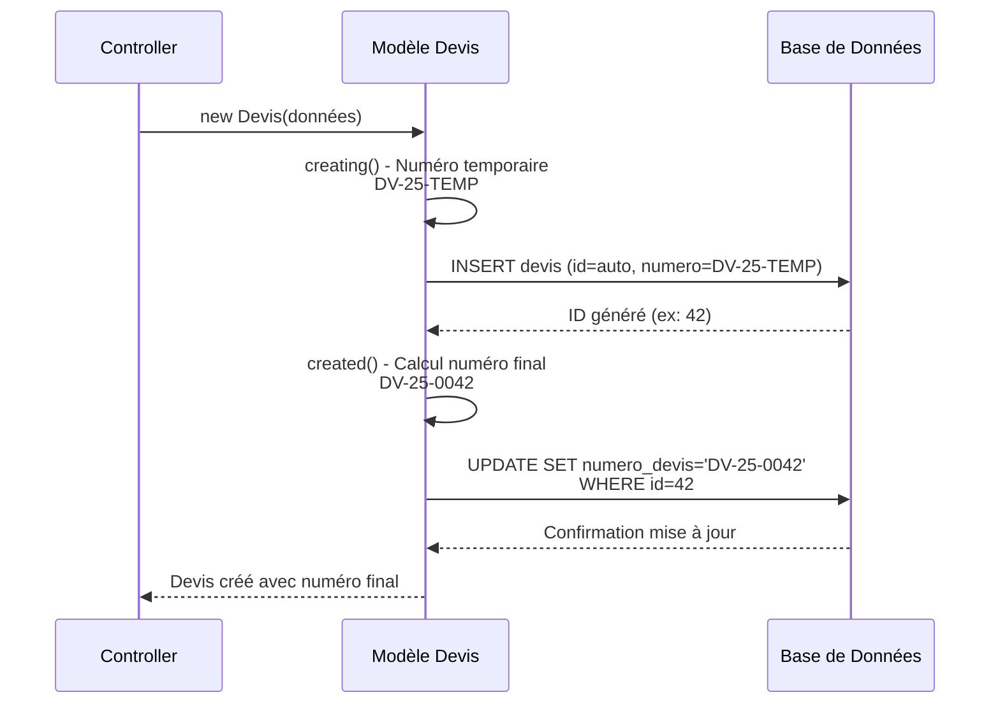

# 🔢 Module 1.4 : Auto-génération Numéros

## Vue d'ensemble

Le système d'auto-génération des numéros de devis de Madinia Dashboard utilise un **format standardisé DV-AA-NNNN** basé sur l'ID unique du devis. Ce système garantit l'unicité, la traçabilité et la cohérence des références métier.

### 🎯 Objectifs du Système

- **Unicité garantie** : Format basé sur l'ID primaire auto-incrémenté
- **Lisibilité métier** : Format explicite avec préfixe et année
- **Traçabilité complète** : Chaque numéro est unique et traçable
- **Évolutivité** : Compatible avec la croissance de l'entreprise
- **Intégrité** : Protection contre les doublons via contrainte DB

---

## 🏗️ Format et Structure

### Format Standard

```
DV-AA-NNNN
│  │  └── Numéro séquentiel (4 chiffres avec zéros de tête)
│  └──── Année sur 2 chiffres (ex: 25 pour 2025)
└────── Préfixe "Devis" (DV)
```

### Exemples Concrets

| ID Devis | Année | Numéro Généré | Description |
|----------|-------|---------------|-------------|
| 1 | 2025 | `DV-25-0001` | Premier devis de 2025 |
| 42 | 2025 | `DV-25-0042` | 42ème devis de 2025 |
| 1337 | 2025 | `DV-25-1337` | 1337ème devis de 2025 |
| 15 | 2026 | `DV-26-0015` | 15ème devis de 2026 |

### Avantages du Format

- **Prévisibilité** : Structure constante et familière
- **Tri naturel** : Ordre chronologique et numérique
- **Lisibilité** : Format professionnel et explicite
- **Évolutivité** : Supporte jusqu'à 9999 devis par année
- **Intégration** : Compatible avec tous les systèmes externes

---

## ⚙️ Implémentation Technique

### 1. Contrainte Base de Données

```sql
-- Migration: create_devis_table.php
$table->string('numero_devis')->unique(); // Contrainte d'unicité
```

**Protection garantie** :
- Index unique au niveau base de données
- Prévention des doublons même en concurrence
- Intégrité référentielle assurée

### 2. Événements Laravel (Modèle)

```php
// Modèle Devis.php - Méthode boot()
protected static function boot()
{
    parent::boot();

    // ÉTAPE 1: Avant création - numéro temporaire
    static::creating(function ($devis) {
        if (empty($devis->numero_devis)) {
            $annee = substr(date('Y'), -2);
            $devis->numero_devis = "DV-{$annee}-TEMP";
        }
    });

    // ÉTAPE 2: Après création - numéro définitif
    static::created(function ($devis) {
        $annee = substr(date('Y'), -2);
        $numeroFormate = sprintf('DV-%s-%04d', $annee, $devis->id);

        // Mise à jour sans déclencher les événements
        static::withoutEvents(function () use ($devis, $numeroFormate) {
            $devis->update(['numero_devis' => $numeroFormate]);
        });
    });
}
```

### 3. Processus en 2 Étapes



### 4. Méthode Utilitaire

```php
/**
 * Générer un numéro de devis formaté basé sur l'ID du devis.
 */
public function getNumeroDevisFormateAttribute(): string
{
    if (!$this->id) {
        // Si pas d'ID (nouveau devis), retourner un numéro temporaire
        $annee = substr(date('Y'), -2);
        return "DV-{$annee}-TEMP";
    }

    $annee = substr(date('Y'), -2);
    return sprintf('DV-%s-%04d', $annee, $this->id);
}
```

---

## 🔄 Commande de Migration

### Utilitaire de Migration Massive

Pour la migration des anciens formats vers le nouveau système :

```php
// Console/Commands/MigrateDevisNumbers.php
class MigrateDevisNumbers extends Command
{
    protected $signature = 'devis:migrate-numbers {--dry-run}';
    
    public function handle()
    {
        $dryRun = $this->option('dry-run');
        $annee = substr(date('Y'), -2);
        
        $devis = Devis::orderBy('id')->get();
        
        foreach ($devis as $unDevis) {
            $ancienNumero = $unDevis->numero_devis;
            $nouveauNumero = sprintf('DV-%s-%04d', $annee, $unDevis->id);
            
            if ($ancienNumero !== $nouveauNumero) {
                if (!$dryRun) {
                    Devis::withoutEvents(function () use ($unDevis, $nouveauNumero) {
                        $unDevis->update(['numero_devis' => $nouveauNumero]);
                    });
                }
            }
        }
    }
}
```

### Utilisation

```bash
# Test des changements (dry-run)
php artisan devis:migrate-numbers --dry-run

# Application des changements
php artisan devis:migrate-numbers
```

---

## 🛡️ Validation et Contraintes

### 1. Validation Laravel

```php
// DevisController.php - Méthodes de validation
'numero_devis' => 'required|string|unique:devis,numero_devis,' . $devis->id
```

### 2. Contraintes Métier

- **Unicité absolue** : Un numéro = Un devis
- **Format strict** : Respect du pattern DV-AA-NNNN
- **Immutabilité** : Le numéro ne change jamais après création
- **Cohérence temporelle** : L'année reflète l'année de création

### 3. Gestion d'Erreurs

```php
try {
    $devis = Devis::create($donnees);
    // Numéro automatiquement généré
} catch (\Illuminate\Database\QueryException $e) {
    if ($e->getCode() === '23000') { // Violation de contrainte unique
        throw new \Exception('Erreur de génération du numéro de devis');
    }
    throw $e;
}
```

---

## 🔍 Cas d'Usage et Scénarios

### 1. Création Normale

```php
// Controller
$devis = Devis::create([
    'client_id' => 1,
    'date_devis' => now(),
    // numero_devis généré automatiquement
]);

// Résultat: $devis->numero_devis = "DV-25-0001"
```

### 2. Import/Migration

```php
// Lors d'un import, forcer la génération
$devis = new Devis($donnees);
// numero_devis sera "DV-25-TEMP" puis "DV-25-0042"
$devis->save();
```

### 3. Recherche par Numéro

```php
// Recherche exacte
$devis = Devis::where('numero_devis', 'DV-25-0042')->first();

// Recherche par pattern
$devisAnnee = Devis::where('numero_devis', 'LIKE', 'DV-25-%')->get();
```

---

## 📊 Statistiques et Métriques

### Compteurs par Année

```php
public function statistiquesParAnnee()
{
    return Devis::selectRaw('
        SUBSTRING(numero_devis, 4, 2) as annee,
        COUNT(*) as total_devis,
        MAX(CAST(SUBSTRING(numero_devis, 7) AS UNSIGNED)) as dernier_numero
    ')
    ->where('numero_devis', 'REGEXP', '^DV-[0-9]{2}-[0-9]{4}$')
    ->groupBy('annee')
    ->orderBy('annee', 'desc')
    ->get();
}
```

### Métriques de Génération

| Métrique | Description | Requête |
|----------|-------------|---------|
| **Total Devis** | Nombre total de devis | `COUNT(*)` |
| **Devis par Année** | Répartition annuelle | `GROUP BY SUBSTRING(numero_devis, 4, 2)` |
| **Dernier Numéro** | Plus haut numéro généré | `MAX(CAST(SUBSTRING(...) AS UNSIGNED))` |
| **Trous de Séquence** | IDs manquants | Comparaison ID vs numéro |

---

## 🔧 Outils de Maintenance

### 1. Diagnostic de Cohérence

```php
// Vérifier la cohérence ID vs Numéro
public function verifierCoherence()
{
    $incoherents = Devis::whereRaw('
        numero_devis != CONCAT("DV-", SUBSTRING(YEAR(created_at), 3, 2), "-", LPAD(id, 4, "0"))
    ')->get();
    
    return $incoherents;
}
```

### 2. Réparation Automatique

```php
public function reparer()
{
    $incoherents = $this->verifierCoherence();
    
    foreach ($incoherents as $devis) {
        $annee = substr($devis->created_at->format('Y'), -2);
        $numeroCorrect = sprintf('DV-%s-%04d', $annee, $devis->id);
        
        $devis->update(['numero_devis' => $numeroCorrect]);
    }
}
```

### 3. Commandes de Diagnostic

```bash
# Vérification complète
php artisan devis:verify-numbers

# Réparation des incohérences
php artisan devis:fix-numbers

# Statistiques de génération
php artisan devis:number-stats
```

---

## 🚀 Optimisations et Performance

### 1. Index de Performance

```sql
-- Index sur numero_devis pour les recherches
CREATE INDEX idx_devis_numero ON devis(numero_devis);

-- Index composé pour les requêtes par année
CREATE INDEX idx_devis_annee ON devis(
    (SUBSTRING(numero_devis, 4, 2)),
    created_at
);
```

### 2. Cache de Métriques

```php
// Cache des statistiques coûteuses
public function getStatistiquesCache()
{
    return Cache::remember('devis_stats_annee', 3600, function () {
        return $this->statistiquesParAnnee();
    });
}
```

### 3. Génération Batch

```php
// Pour les imports massifs
public function creerEnBatch(array $donneesMultiples)
{
    return DB::transaction(function () use ($donneesMultiples) {
        $devis = [];
        
        foreach ($donneesMultiples as $donnees) {
            $devis[] = Devis::create($donnees);
        }
        
        return $devis;
    });
}
```

---

## 📈 Évolutions et Roadmap

### Améliorations Possibles

1. **Format Personnalisable**
   - Configuration du préfixe par entreprise
   - Format adaptatif selon le contexte

2. **Gestion Multi-Année**
   - Reset automatique en début d'année
   - Gestion des chevauchements

3. **Validation Avancée**
   - Vérification de format par regex
   - Détection des numéros corrompus

4. **Intégration Externe**
   - Export vers systèmes comptables
   - API de génération de numéros

### Compatibilité Future

- **Laravel 11+** : Compatible avec les événements modernes
- **PHP 8.2+** : Utilise les améliorations syntaxiques
- **Base de données** : Compatible MySQL/PostgreSQL
- **Migration** : Outils de transition automatisés

---

## 🎯 Points Clés du Module

### ✅ Forces du Système

- **Auto-génération fiable** avec événements Laravel
- **Format professionnel** DV-AA-NNNN standardisé
- **Unicité garantie** par contrainte base de données
- **Traçabilité complète** basée sur l'ID primaire
- **Outils de migration** pour l'existant
- **Performance optimisée** avec index appropriés

### ⚠️ Contraintes Métier

- **Immutabilité** : Le numéro ne peut pas être modifié
- **Dépendance ID** : Nécessite un ID généré d'abord
- **Format fixe** : Structure non personnalisable en runtime
- **Année courante** : Utilise l'année de création, pas de l'objet

### 🔄 Intégrations

- **Emails** : Numéro utilisé dans tous les templates
- **PDFs** : Référence principale dans les documents
- **Factures** : Liaison via transformation de devis
- **Historique** : Tracé dans tous les événements
- **API** : Exposé comme identifiant métier unique

Ce module d'auto-génération des numéros constitue la **base d'identification unique** de tous les devis dans le système Madinia Dashboard, garantissant cohérence, traçabilité et professionnalisme dans tous les échanges métier.
