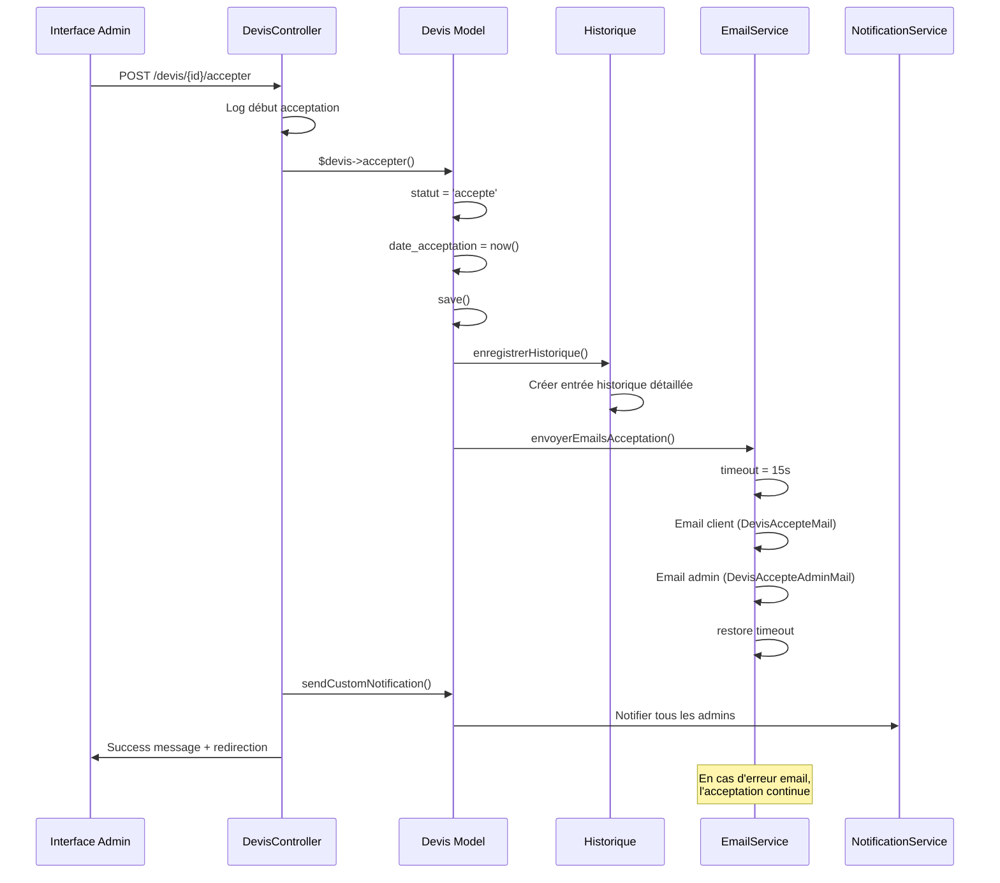
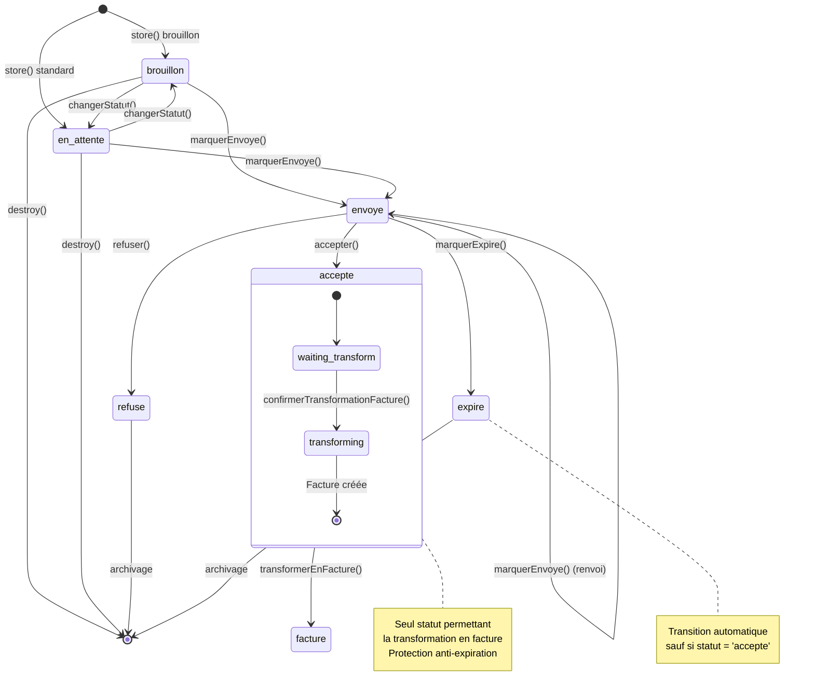

# Module 2.2 : Gestion des Statuts Backend

> **Phase 2 - Backend Avancé** | **Durée estimée** : 1,5 jour | **Complexité** : ⭐⭐⭐⭐⭐ (Très Élevée)

## 📋 Introduction

La gestion des statuts constitue le **cœur de la logique métier** du système de devis. Ce module documente les **6 méthodes de transition de statut** qui orchestrent le cycle de vie complet des devis, de la création à la transformation en factures.

Le système implémente une **machine à états sophistiquée** avec :
- **6 statuts métier principaux** (brouillon, en_attente, envoyé, accepté, refusé, expiré)
- **3 statuts d'envoi** (non_envoyé, envoyé, échec_envoi)
- **5 méthodes de transition contrôlées** dans le modèle Devis
- **3 méthodes d'interface** dans le DevisController
- **Système de notifications automatiques** via trait SendsNotifications
- **Historique complet** de toutes les transitions

---

## 🎯 Architecture des Statuts

### Énumération des Statuts Métier

```php
// Migration : dashboard/database/migrations/create_devis_table.php
enum('brouillon', 'en_attente', 'envoye', 'accepte', 'refuse', 'expire')
->default('en_attente')

// Contrainte de base de données
DB::statement("ALTER TABLE devis ADD CONSTRAINT devis_statut_check 
              CHECK (statut IN ('brouillon', 'en_attente', 'envoye', 'accepte', 'refuse', 'expire'))");
```

### Statuts d'Envoi

```php
// Migration : statuts de transmission
enum('non_envoye', 'envoye', 'echec_envoi')
->default('non_envoye')
->comment('Statut d\'envoi du devis au client')
```

### Traduction Française

```php
// Modèle Devis.php : Accesseurs pour l'affichage
public function getStatutFrAttribute(): string
{
    return match($this->statut) {
        'brouillon' => 'Brouillon',      // 🟡 Création en cours
        'en_attente' => 'En attente',    // 🔵 Prêt à envoyer
        'envoye' => 'Envoyé',           // 🟣 Transmis au client
        'accepte' => 'Accepté',         // 🟢 Validé par le client
        'refuse' => 'Refusé',           // 🔴 Rejeté par le client
        'expire' => 'Expiré',           // ⚫ Date limite dépassée
        default => ucfirst($this->statut)
    };
}

public function getStatutEnvoiFrAttribute(): string
{
    return match($this->statut_envoi) {
        'non_envoye' => 'Non envoyé',    // ⭕ Pas encore transmis
        'envoye' => 'Envoyé',           // ✅ Transmis avec succès
        'echec_envoi' => 'Échec d\'envoi', // ❌ Erreur transmission
        default => ucfirst($this->statut_envoi)
    };
}
```

---

## 🔄 Méthodes de Transition du Modèle

### 1. `accepter()` - Acceptation Complète

**Responsabilité** : Transition vers le statut "accepté" avec processus complet d'emails et notifications

```php
/**
 * Accepter le devis - Transition vers "accepte"
 * Méthode complexe avec emails et notifications automatiques
 */
public function accepter(): bool
{
    $ancienStatut = $this->statut;
    $this->statut = 'accepte';
    $this->date_acceptation = now();

    $result = $this->save();

    if ($result) {
        // 1. Enregistrer dans l'historique avec données détaillées
        $this->enregistrerHistorique(
            'changement_statut',
            "Devis accepté",
            "Le devis #{$this->numero_devis} a été accepté",
            ['statut' => $ancienStatut],
            ['statut' => 'accepte', 'date_acceptation' => $this->date_acceptation->format('Y-m-d H:i:s')]
        );

        // 2. Envoyer emails de confirmation (non bloquant)
        try {
            $this->envoyerEmailsAcceptation();
        } catch (\Exception $e) {
            Log::error('Erreur emails acceptation (non bloquant)', [
                'devis_numero' => $this->numero_devis,
                'error' => $e->getMessage()
            ]);
            // L'acceptation continue même si l'email échoue
        }
    }

    return $result;
}
```

**Processus d'acceptation** :
1. **Changement statut** : `{ancien}` → `accepte`
2. **Date d'acceptation** : Timestamp automatique NOW()
3. **Sauvegarde** : Persistance en base de données
4. **Historique** : Traçabilité avec ancien/nouveau statut
5. **Emails** : Confirmation client + notification admin (non bloquant)
6. **Notifications** : Via trait SendsNotifications

**Caractéristiques** :
- ✅ **Non bloquant** : Les erreurs d'email n'empêchent pas l'acceptation
- ✅ **Traçabilité complète** : Historique détaillé avec métadonnées
- ✅ **Timeout gestion** : Configuration email spécifique (15s)
- ✅ **Logs structurés** : Debugging facilité

### 2. `refuser()` - Refus Simple

**Responsabilité** : Transition vers le statut "refusé" sans envoi d'emails automatiques

```php
/**
 * Refuser le devis - Transition vers "refuse"
 * Méthode simple sans emails automatiques pour éviter le spam
 */
public function refuser(): bool
{
    $ancienStatut = $this->statut;
    $this->statut = 'refuse';

    $result = $this->save();

    if ($result) {
        $this->enregistrerHistorique(
            'changement_statut',
            "Devis refusé",
            "Le devis #{$this->numero_devis} a été refusé",
            ['statut' => $ancienStatut],
            ['statut' => 'refuse']
        );
    }

    return $result;
}
```

**Processus de refus** :
1. **Changement statut** : `{ancien}` → `refuse`
2. **Sauvegarde** : Persistance immédiate
3. **Historique** : Traçabilité du refus
4. **Pas d'emails** : Évite le spam client
5. **Notifications** : Via trait automatique uniquement

**Design rationnel** :
- ✅ **Simplicité** : Processus léger sans overhead
- ✅ **Anti-spam** : Pas d'emails automatiques de refus
- ✅ **Notifications** : Les admins sont notifiés via trait
- ✅ **Réversibilité** : Peut être modifié manuellement

### 3. `marquerExpire()` - Expiration Automatique

**Responsabilité** : Transition automatique vers "expiré" avec protection des devis acceptés

```php
/**
 * Marquer comme expiré - Transition automatique via cron ou vérifications
 * Protection : ne peut pas expirer un devis accepté
 */
public function marquerExpire(): bool
{
    if ($this->est_expire && $this->statut !== 'accepte') {
        $ancienStatut = $this->statut;
        $this->statut = 'expire';

        $result = $this->save();

        if ($result) {
            $this->enregistrerHistorique(
                'changement_statut',
                "Devis expiré",
                "Le devis #{$this->numero_devis} a expiré automatiquement",
                ['statut' => $ancienStatut],
                ['statut' => 'expire']
            );
        }

        return $result;
    }
    return false;
}
```

**Logique d'expiration** :
- **Condition** : `date_validite < now()` ET `statut ≠ 'accepte'`
- **Protection** : Les devis acceptés ne peuvent JAMAIS expirer
- **Automatique** : Utilisé par les tâches cron ou vérifications manuelles
- **Sécurisé** : Double vérification avant transition

**Propriété calculée** :
```php
public function getEstExpireAttribute(): bool
{
    return $this->date_validite < now() && $this->statut !== 'accepte';
}
```

### 4. `marquerEnvoye()` - Gestion d'Envoi Complexe

**Responsabilité** : Marquer comme envoyé avec gestion des transitions automatiques

```php
/**
 * Marquer comme envoyé - Transition complexe
 * Gère les statuts métier ET d'envoi simultanément
 */
public function marquerEnvoye(): bool
{
    $ancienStatut = $this->statut;
    $ancienStatutEnvoi = $this->statut_envoi;

    // Transition automatique brouillon → envoyé
    if ($this->statut === 'brouillon') {
        $this->statut = 'envoye';
    }

    $this->statut_envoi = 'envoye';
    $this->date_envoi_client = now();

    $result = $this->save();

    if ($result) {
        // Construire les changements pour l'historique
        $changes = [
            'statut_envoi' => 'envoye',
            'date_envoi_client' => $this->date_envoi_client->format('Y-m-d H:i:s')
        ];

        $original = [
            'statut_envoi' => $ancienStatutEnvoi,
            'date_envoi_client' => null
        ];

        // Ajouter changement de statut métier si applicable
        if ($ancienStatut !== $this->statut) {
            $changes['statut'] = $this->statut;
            $original['statut'] = $ancienStatut;
        }

        $this->enregistrerHistorique(
            'envoi_email',
            "Devis envoyé au client",
            "Le devis #{$this->numero_devis} a été envoyé avec succès au client {$this->client->nom_complet}",
            $original,
            $changes,
            [
                'email_destinataire' => $this->client->email,
                'type_envoi' => 'client'
            ]
        );
    }

    return $result;
}
```

**Transitions automatiques** :
- **brouillon** → **envoyé** : Validation automatique
- **en_attente** → **envoyé** : Transition logique
- **envoyé** → **envoyé** : Renvoi (mise à jour date)

**Données mises à jour** :
- `statut` (si nécessaire)
- `statut_envoi` → 'envoye'
- `date_envoi_client` → NOW()

### 5. `marquerEchecEnvoi()` - Gestion des Échecs

**Responsabilité** : Marquer l'échec d'envoi pour traçabilité et retry

```php
/**
 * Marquer échec d'envoi - Statut d'envoi uniquement
 * Ne modifie pas le statut métier, permet les tentatives multiples
 */
public function marquerEchecEnvoi(): bool
{
    $ancienStatutEnvoi = $this->statut_envoi;
    $this->statut_envoi = 'echec_envoi';

    $result = $this->save();

    if ($result) {
        $this->enregistrerHistorique(
            'envoi_email',
            "Échec d'envoi du devis",
            "L'envoi du devis #{$this->numero_devis} au client {$this->client->nom_complet} a échoué",
            ['statut_envoi' => $ancienStatutEnvoi],
            ['statut_envoi' => 'echec_envoi'],
            [
                'email_destinataire' => $this->client->email,
                'type_envoi' => 'client',
                'resultat' => 'echec'
            ]
        );
    }

    return $result;
}
```

**Stratégie d'échec** :
- ✅ **Préservation statut métier** : Seul le statut d'envoi change
- ✅ **Retry possible** : Permet les nouvelles tentatives
- ✅ **Traçabilité** : Historique détaillé avec métadonnées
- ✅ **Debugging** : Informations client pour investigation

---

## 🔐 Méthodes de Validation Métier

### Vérifications de Transition

```php
/**
 * Vérifier si le devis peut être envoyé ou renvoyé
 * Logique métier : statuts autorisés pour l'envoi
 */
public function peutEtreEnvoye(): bool
{
    return in_array($this->statut, ['brouillon', 'en_attente', 'envoye']);
}

/**
 * Vérifier si le devis peut être transformé en facture
 * Règle stricte : UNIQUEMENT les devis acceptés sans facture existante
 */
public function peutEtreTransformeEnFacture(): bool
{
    return $this->statut === 'accepte' && !$this->facture()->exists();
}

/**
 * Vérifier si le devis est expiré (propriété calculée)
 */
public function getEstExpireAttribute(): bool
{
    return $this->date_validite < now() && $this->statut !== 'accepte';
}
```

### Matrice des Transitions Autorisées

| Depuis ↓ / Vers → | brouillon | en_attente | envoyé | accepté | refusé | expiré |
|-------------------|-----------|------------|--------|---------|--------|--------|
| **brouillon**     | ✅        | ✅         | ✅     | ❌      | ❌     | ❌     |
| **en_attente**    | ✅        | ✅         | ✅     | ❌      | ❌     | ❌     |
| **envoyé**        | ❌        | ❌         | ✅     | ✅      | ✅     | ✅     |
| **accepté**       | ❌        | ❌         | ❌     | ✅      | ❌     | ❌     |
| **refusé**        | ❌        | ❌         | ❌     | ❌      | ✅     | ❌     |
| **expiré**        | ❌        | ❌         | ❌     | ❌      | ❌     | ✅     |

**Légende** :
- ✅ **Transition autorisée** : Logique métier cohérente
- ❌ **Transition interdite** : Préservation intégrité données

---

## 🎮 Méthodes du Contrôleur

### 1. `accepter()` - Interface Administrateur

**Responsabilité** : Accepter un devis via interface web avec gestion d'erreurs complète

```php
/**
 * Accepter un devis via interface administrateur
 * Gestion d'erreurs sophistiquée et notifications personnalisées
 */
public function accepter(Devis $devis)
{
    try {
        Log::info('Début acceptation devis via interface', [
            'devis_id' => $devis->getKey(),
            'devis_numero' => $devis->numero_devis,
            'user_id' => Auth::id()
        ]);

        $result = $devis->accepter();

        if ($result) {
            // Notification personnalisée pour les administrateurs
            $devis->sendCustomNotification(
                'accepted',
                "Le devis #{$devis->numero_devis} pour {$devis->client->prenom} {$devis->client->nom} a été accepté par le client"
            );

            return redirect()->back()
                ->with('success', '✅ Devis ' . $devis->numero_devis . ' accepté avec succès !');
        } else {
            return back()->with('error', '❌ Échec de l\'acceptation du devis.');
        }
    } catch (Exception $e) {
        Log::error('Erreur acceptation devis', [
            'devis_id' => $devis->getKey(),
            'error' => $e->getMessage()
        ]);

        // Gestion spécifique des erreurs SMTP/timeout
        if (str_contains($e->getMessage(), 'timeout') || 
            str_contains($e->getMessage(), 'SMTP') ||
            str_contains($e->getMessage(), 'Connection')) {
            return back()->with('error', 
                '❌ Problème email. Le devis peut être accepté manuellement via commandes admin.');
        }

        return back()->with('error', 
            '❌ Erreur lors de l\'acceptation : ' . $e->getMessage());
    }
}
```

**Fonctionnalités avancées** :
- ✅ **Logs détaillés** : Contexte complet pour debugging
- ✅ **Notifications personnalisées** : Message enrichi pour admins
- ✅ **Gestion erreurs spécialisée** : Détection problèmes SMTP
- ✅ **Solutions alternatives** : Orientation vers commandes manuelles
- ✅ **UX optimisée** : Messages clairs avec icônes

### 2. `refuser()` - Interface Simple

**Responsabilité** : Refuser un devis via interface web

```php
/**
 * Refuser un devis via interface administrateur
 * Processus simplifié avec notification standard
 */
public function refuser(Devis $devis)
{
    try {
        $devis->refuser();

        // Notification personnalisée pour le refus
        $devis->sendCustomNotification(
            'refused',
            "Le devis #{$devis->numero_devis} pour {$devis->client->prenom} {$devis->client->nom} a été refusé par le client"
        );

        return redirect()->back()
            ->with('success', '⛔ Devis ' . $devis->numero_devis . ' refusé.');
    } catch (Exception $e) {
        return back()
            ->with('error', '❌ Une erreur est survenue lors du refus du devis.');
    }
}
```

### 3. `changerStatut()` - Interface Générique

**Responsabilité** : Changer le statut via interface web avec actions spécialisées

```php
/**
 * Changer le statut d'un devis - Interface générique
 * Supporte tous les statuts avec actions spécialisées selon le type
 */
public function changerStatut(Request $request, Devis $devis)
{
    $request->validate([
        'statut' => 'required|in:brouillon,en_attente,envoye,accepte,refuse,expire'
    ]);

    try {
        $nouveauStatut = $request->statut;

        // Actions spécialisées selon le statut cible
        switch ($nouveauStatut) {
            case 'accepte':
                $devis->accepter();  // Méthode complète avec emails
                break;
            case 'refuse':
                $devis->refuser();   // Méthode dédiée avec historique
                break;
            default:
                // Changement direct pour les autres statuts (brouillon, en_attente, envoyé, expiré)
                $devis->statut = $nouveauStatut;
                $devis->save();
                break;
        }

        // Messages personnalisés par statut avec icônes
        $messages = [
            'brouillon' => '📝 Devis ' . $devis->numero_devis . ' remis en brouillon.',
            'en_attente' => '⏳ Devis ' . $devis->numero_devis . ' mis en attente.',
            'envoye' => '📧 Devis ' . $devis->numero_devis . ' marqué comme envoyé.',
            'accepte' => '✅ Devis ' . $devis->numero_devis . ' accepté avec succès !',
            'refuse' => '⛔ Devis ' . $devis->numero_devis . ' refusé.',
            'expire' => '⏰ Devis ' . $devis->numero_devis . ' marqué comme expiré.'
        ];

        return redirect()->back()
            ->with('success', $messages[$nouveauStatut] ?? 'Statut mis à jour.');
    } catch (Exception $e) {
        return back()->with('error', '❌ Erreur lors de la modification du statut.');
    }
}
```

**Architecture intelligente** :
- ✅ **Actions spécialisées** : `accepte` et `refuse` utilisent les méthodes dédiées
- ✅ **Actions directes** : Autres statuts utilisent l'assignation directe
- ✅ **Messages contextuels** : Icônes et textes adaptés à chaque statut
- ✅ **Validation stricte** : Enum validation avec whitelist

---

## 📧 Système d'Emails d'Acceptation

### Méthode `envoyerEmailsAcceptation()`

**Responsabilité** : Envoyer les emails de confirmation d'acceptation (client + admin)

```php
/**
 * Envoyer les emails de confirmation d'acceptation du devis
 * Processus sécurisé avec timeout réduit et gestion d'erreurs
 */
private function envoyerEmailsAcceptation(): void
{
    try {
        // Charger les relations nécessaires
        $this->load('client.entreprise');

        Log::info('Début envoi emails acceptation devis', [
            'devis_numero' => $this->numero_devis,
            'client_email' => $this->client->email
        ]);

        // Configurer un timeout plus court (15s) pour éviter les blocages
        $originalTimeout = config('mail.mailers.smtp.timeout', 60);
        config(['mail.mailers.smtp.timeout' => 15]);

        try {
            // 1. Email de confirmation au client
            Mail::to($this->client->email)->send(
                new \App\Mail\DevisAccepteMail($this, $this->client)
            );

            Log::info('Email de confirmation d\'acceptation envoyé au client', [
                'devis_numero' => $this->numero_devis,
                'client_email' => $this->client->email,
                'client_nom' => $this->client->nom_complet
            ]);

            // 2. Email de notification à l'admin
            $adminEmail = config('mail.admin_email');
            if ($adminEmail) {
                Mail::to($adminEmail)->send(
                    new \App\Mail\DevisAccepteAdminMail($this, $this->client)
                );

                Log::info('Email de notification d\'acceptation envoyé à l\'admin', [
                    'devis_numero' => $this->numero_devis,
                    'admin_email' => $adminEmail
                ]);
            } else {
                Log::warning('Email admin non configuré, notification d\'acceptation non envoyée', [
                    'devis_numero' => $this->numero_devis
                ]);
            }

        } finally {
            // Restaurer le timeout original quoi qu'il arrive
            config(['mail.mailers.smtp.timeout' => $originalTimeout]);
        }

    } catch (\Exception $e) {
        Log::error('Erreur lors de l\'envoi des emails d\'acceptation', [
            'devis_numero' => $this->numero_devis,
            'error' => $e->getMessage(),
            'trace' => $e->getTraceAsString()
        ]);

        // Relancer l'exception pour qu'elle soit catchée par accepter()
        throw $e;
    }
}
```

**Templates d'emails** :
1. **`DevisAccepteMail`** : Confirmation client avec félicitations
2. **`DevisAccepteAdminMail`** : Notification admin avec détails client

**Optimisations** :
- ✅ **Timeout réduit** : 15s au lieu de 60s pour éviter les blocages
- ✅ **Logs détaillés** : Traçabilité complète du processus
- ✅ **Restauration config** : Finally block pour reset timeout
- ✅ **Gestion admin email** : Vérification configuration avant envoi

---

## 🔔 Système de Notifications

### Trait SendsNotifications

Le système utilise le trait `SendsNotifications` pour les notifications automatiques :

```php
// Dans le modèle Devis.php
use HasHistorique, SendsNotifications;

// Notifications automatiques déclenchées sur :
// - created() : Création d'un nouveau devis
// - updated() : Modification du devis (y compris changement statut)
// - deleted() : Suppression du devis
```

### Notifications Personnalisées

```php
// Notifications spécialisées dans le contrôleur
$devis->sendCustomNotification(
    'accepted',
    "Le devis #{$devis->numero_devis} pour {$devis->client->prenom} {$devis->client->nom} a été accepté par le client"
);

$devis->sendCustomNotification(
    'refused',
    "Le devis #{$devis->numero_devis} pour {$devis->client->prenom} {$devis->client->nom} a été refusé par le client"
);
```

**Destinataires** : Tous les utilisateurs `admin` et `super_admin`

---

## ⚡ Commande de Secours

### `AccepterDevisSansEmail`

**Utilisation** : Contournement pour les problèmes d'emails en production

```php
// Commande artisan pour acceptation manuelle
php artisan devis:accepter-sans-email {devis_id}
```

**Processus** :
1. **Authentification admin** : Login automatique utilisateur admin
2. **Acceptation manuelle** : Changement statut sans emails
3. **Historique** : Enregistrement avec mention "sans email"
4. **Information utilisateur** : Messages d'avertissement

**Usage typique** :
```bash
# Accepter le devis ID 123 sans envoyer d'emails
php artisan devis:accepter-sans-email 123
```

---

## 📊 Flux de Gestion Complexes

### Diagramme de Séquence : Acceptation Complète



### Diagramme d'État : Machine à États Complète



### Flux de Gestion des Échecs

```mermaid
flowchart TD
    START[Tentative envoi email] --> SEND{Envoi réussi ?}
    
    SEND -->|✅ Succès| SUCCESS[marquerEnvoye()]
    SEND -->|❌ Échec| FAIL[marquerEchecEnvoi()]
    
    SUCCESS --> HISTORY_OK[Historique : envoi réussi]
    FAIL --> HISTORY_FAIL[Historique : échec d'envoi]
    
    HISTORY_OK --> NOTIF_OK[Notifications admins]
    HISTORY_FAIL --> LOGS[Logs d'erreur détaillés]
    
    LOGS --> RETRY{Nouvelle tentative ?}
    RETRY -->|Oui| START
    RETRY -->|Non| MANUAL[Intervention manuelle]
    
    NOTIF_OK --> END[Processus terminé]
    MANUAL --> END
    
    style SUCCESS fill:#e8f5e8
    style FAIL fill:#ffebee
    style RETRY fill:#fff3e0
    style END fill:#e8f5e8
```

---

## 📈 Métriques et Statistiques

### Compteurs par Statut

```sql
-- Requêtes optimisées pour tableaux de bord
SELECT 
    statut,
    COUNT(*) as nombre,
    AVG(montant_ttc) as montant_moyen,
    SUM(montant_ttc) as montant_total
FROM devis 
WHERE archive = false 
GROUP BY statut
ORDER BY 
    CASE statut
        WHEN 'accepte' THEN 1
        WHEN 'envoye' THEN 2
        WHEN 'en_attente' THEN 3
        WHEN 'brouillon' THEN 4
        WHEN 'expire' THEN 5
        WHEN 'refuse' THEN 6
    END;
```

### Taux de Conversion

```sql
-- Calcul du taux d'acceptation
SELECT 
    (COUNT(CASE WHEN statut = 'accepte' THEN 1 END) * 100.0 / 
     COUNT(CASE WHEN statut IN ('accepte', 'refuse', 'expire') THEN 1 END)) as taux_acceptation,
    
    (COUNT(CASE WHEN statut = 'refuse' THEN 1 END) * 100.0 / 
     COUNT(CASE WHEN statut IN ('accepte', 'refuse', 'expire') THEN 1 END)) as taux_refus,
     
    (COUNT(CASE WHEN statut = 'expire' THEN 1 END) * 100.0 / 
     COUNT(CASE WHEN statut IN ('accepte', 'refuse', 'expire') THEN 1 END)) as taux_expiration
FROM devis 
WHERE archive = false;
```

### Performance Temporelle

```sql
-- Temps moyen entre envoi et acceptation
SELECT 
    AVG(EXTRACT(DAYS FROM date_acceptation - date_envoi_client)) as jours_moyens_acceptation
FROM devis 
WHERE statut = 'accepte' 
  AND date_envoi_client IS NOT NULL 
  AND date_acceptation IS NOT NULL;
```

---

## 🔧 Optimisations et Bonnes Pratiques

### Gestion des Emails

1. **Timeout réduit** : 15s pour éviter les blocages interface
2. **Processus non bloquant** : L'acceptation continue même si email échoue
3. **Logs détaillés** : Debugging facilité avec contexte complet
4. **Configuration dynamique** : Modification temporaire des timeouts
5. **Commande de secours** : Alternative manuelle pour production

### Cohérence des Données

1. **Transactions atomiques** : Changements d'état cohérents
2. **Validation stricte** : Contraintes base de données + application
3. **Historique automatique** : Traçabilité de tous les changements
4. **Protection anti-expiration** : Devis acceptés protégés
5. **Double vérification** : Conditions métier vérifiées

### Performance

1. **Eager loading** : Relations chargées efficacement
2. **Requêtes optimisées** : Index sur colonnes de statut
3. **Cache intelligent** : Propriétés calculées mises en cache
4. **Logs structurés** : Facilite l'analyse et debugging
5. **Notifications groupées** : Évite le spam d'alertes

---

## 🎯 Points Clés Techniques

### Forces du Système

✅ **Machine à états robuste** : Transitions contrôlées et cohérentes
✅ **Gestion d'erreurs sophistiquée** : Fallback et alternatives
✅ **Historique complet** : Traçabilité de toutes les actions
✅ **Emails intelligents** : Non bloquants avec timeout adaptatif
✅ **Notifications automatiques** : Information temps réel des admins
✅ **Validation métier** : Règles business respectées
✅ **Interface utilisateur** : Messages clairs et actions contextuelles

### Contraintes Identifiées

⚠️ **Complexité transitions** : Machine à états sophistiquée
⚠️ **Dépendance emails** : Problèmes SMTP peuvent impacter UX
⚠️ **Performance emails** : Envois synchrones peuvent ralentir
⚠️ **Gestion erreurs** : Multiples points de défaillance
⚠️ **Maintenance** : Logique métier distribuée entre modèle et contrôleur

### Optimisations Futures

🚀 **Queue jobs** : Envois d'emails asynchrones
🚀 **Event/Listener** : Découplage notifications et transitions
🚀 **State Machine** : Library dédiée pour transitions
🚀 **Retry mechanism** : Tentatives automatiques envois échoués
🚀 **Monitoring** : Alertes sur échecs répétés

---

## 📝 Conclusion Module 2.2

Le système de gestion des statuts représente le **cœur de la logique métier** avec une sophistication remarquable. Les **5 méthodes de transition** du modèle et les **3 méthodes d'interface** du contrôleur orchestrent parfaitement le cycle de vie des devis.

### Réalisations Complètes

✅ **Machine à états complète** : 6 statuts métier + 3 statuts envoi
✅ **5 méthodes de transition** : accepter, refuser, marquerExpire, marquerEnvoye, marquerEchecEnvoi
✅ **3 méthodes contrôleur** : accepter, refuser, changerStatut
✅ **Système d'emails** : Confirmation client + notification admin
✅ **Historique automatique** : Traçabilité complète avec métadonnées
✅ **Gestion d'erreurs** : Fallback gracieux et commandes de secours
✅ **Validation métier** : Règles business strictes et cohérentes

### Prochaines Étapes

Le **Module 2.3 : Système d'Emails** documentera les 4 méthodes d'envoi d'emails du DevisController, complétant ainsi le backend avancé des devis.

**Impact** : Ce module assure la robustesse et la cohérence du système de statuts, pierre angulaire du processus commercial.