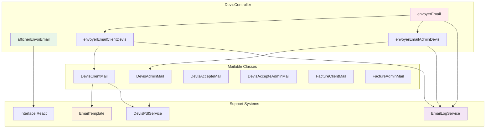

# Module 2.3 : Système d'Emails

> **Phase 2 - Backend Avancé** | **Durée estimée** : 2 jours | **Complexité** : ⭐⭐⭐⭐⭐ (Très Élevée)

## 📋 Introduction

Le système d'emails constitue un **pilier essentiel** du workflow des devis, orchestrant toutes les communications entre l'entreprise et les clients. Ce module documente les **4 méthodes d'envoi principales** du DevisController, les **6 classes Mailable**, le **système de templates dynamiques** et l'**intégration EmailLogService**.

Le système implémente une architecture sophistiquée avec :
- **4 méthodes d'envoi du contrôleur** (afficherEnvoiEmail, envoyerEmail, envoyerEmailClientDevis, envoyerEmailAdminDevis)
- **6 classes Mailable spécialisées** (DevisClientMail, DevisAdminMail, DevisAccepteMail, DevisAccepteAdminMail, FactureClientMail, FactureAdminMail)
- **Système de templates dynamiques** avec 16+ modèles prédéfinis
- **EmailLogService** avec sessions de logs structurés
- **Gestion des pièces jointes PDF** automatique
- **Configuration multi-destinataires** avec CC CEO

---

## 🏗️ Architecture du Système d'Emails

### Vue d'Ensemble des Composants



### Types d'Emails Supportés

| Type d'Email | Mailable | Déclencheur | Destinataires | PDF Attaché |
|--------------|----------|-------------|---------------|-------------|
| **Envoi Devis Client** | DevisClientMail | Interface/API | Client + CC CEO | ✅ Oui |
| **Notification Admin** | DevisAdminMail | Envoi devis | Admin + CC CEO | ✅ Oui |
| **Acceptation Client** | DevisAccepteMail | Acceptation | Client | ✅ Oui |
| **Notification Acceptation** | DevisAccepteAdminMail | Acceptation | Admin | ❌ Non |
| **Facture Client** | FactureClientMail | Transformation | Client + CC CEO | ✅ Oui |
| **Notification Facture** | FactureAdminMail | Transformation | Admin + CC CEO | ✅ Oui |

---

## 🎮 Méthodes du DevisController

### 1. `afficherEnvoiEmail()` - Interface d'Envoi

**Responsabilité** : Afficher la page d'envoi d'email avec templates et données

```php
/**
 * Afficher la page d'envoi d'email pour un devis
 * Interface sophistiquée avec templates dynamiques
 */
public function afficherEnvoiEmail(Devis $devis)
{
    // Vérification des permissions d'envoi
    if (!$devis->peutEtreEnvoye()) {
        return redirect()->back()
            ->with('error', '❌ Ce devis ne peut pas être envoyé.');
    }

    // Chargement des relations nécessaires
    $devis->load(['client.entreprise']);

    // Récupération des informations Madinia pour variables
    $madinia = \App\Models\Madinia::getInstance();

    // Récupération des modèles d'email actifs par catégories
    $modelesEmail = \App\Models\EmailTemplate::whereIn('category', [
            'envoi_initial', 'rappel', 'relance'
        ])
        ->where('is_active', true)
        ->orderBy('category')
        ->orderBy('name')
        ->get()
        ->map(function ($template) {
            return [
                'id' => $template->id,
                'name' => $template->name,
                'subject' => $template->subject,
                'body' => $template->body,
                'category' => $template->category,
                'sub_category' => $template->sub_category,
            ];
        });

    // Préparation des données pour React
    $devisData = [
        'id' => $devis->id,
        'numero_devis' => $devis->numero_devis,
        'client' => [
            'id' => $devis->client->id,
            'nom' => $devis->client->nom,
            'prenom' => $devis->client->prenom,
            'email' => $devis->client->email,
            'entreprise' => $devis->client->entreprise ? [
                'nom' => $devis->client->entreprise->nom,
                'nom_commercial' => $devis->client->entreprise->nom_commercial,
            ] : null
        ],
        'objet' => $devis->objet,
        'montant_ht' => (float) $devis->montant_ht,
        'montant_ttc' => (float) $devis->montant_ttc,
        'taux_tva' => (float) $devis->taux_tva,
        'statut' => $devis->statut,
        'statut_envoi' => $devis->statut_envoi,
    ];

    return Inertia::render('devis/envoyer-email', [
        'devis' => $devisData,
        'modeles_email' => $modelesEmail,
        'madinia' => $madinia ? [
            'name' => $madinia->name,
            'telephone' => $madinia->telephone,
            'email' => $madinia->email,
        ] : null
    ]);
}
```

**Fonctionnalités** :
- ✅ **Validation permissions** : Vérification `peutEtreEnvoye()`
- ✅ **Templates dynamiques** : Filtrage par catégorie (envoi_initial, rappel, relance)
- ✅ **Données contextuelles** : Informations devis + client + entreprise
- ✅ **Variables Madinia** : Contact intégré pour templates
- ✅ **Interface React** : Rendu via Inertia.js

### 2. `envoyerEmail()` - Orchestrateur Principal

**Responsabilité** : Orchestrer l'envoi complet avec logs et notifications

```php
/**
 * Envoie un devis au client par email
 * Processus complet avec logs EmailLogService et gestion d'erreurs
 */
public function envoyerEmail(Request $request, Devis $devis)
{
    // Démarrage session de logs avec contexte complet
    $sessionId = EmailLogService::startEmailSession('devis_email', [
        'recipient' => $devis->client->email,
        'devis_id' => $devis->id,
        'devis_numero' => $devis->numero_devis,
        'client_id' => $devis->client_id,
        'user_id' => Auth::id(),
        'ip' => $request->ip(),
    ]);

    // Validation des permissions
    if (!$devis->peutEtreEnvoye()) {
        EmailLogService::logError($devis->client->email, 'Devis ne peut pas être envoyé', [
            'devis_id' => $devis->id,
            'statut' => $devis->statut,
            'statut_envoi' => $devis->statut_envoi,
        ]);

        EmailLogService::endEmailSession(false, [
            'error' => 'Devis ne peut pas être envoyé'
        ]);

        return redirect()->back()
            ->with('error', '❌ Ce devis ne peut pas être envoyé.');
    }

    // Validation des données d'entrée
    $validated = $request->validate([
        'message_client' => 'nullable|string',
        'envoyer_copie_admin' => 'boolean',
        'template_id' => 'nullable|exists:email_templates,id',
    ]);

    EmailLogService::logEvent('PREPARATION', 'INFO', [
        'type' => 'Email devis client',
        'template' => 'DevisClientMail',
        'recipient' => $devis->client->email,
        'devis_numero' => $devis->numero_devis,
        'has_custom_message' => !empty($validated['message_client']),
        'template_id' => $validated['template_id'] ?? null,
    ]);

    try {
        $devis->load('client.entreprise');

        // Envoi email client principal
        $this->envoyerEmailClientDevis(
            $devis, 
            $validated['message_client'] ?? null, 
            $validated['template_id'] ?? null
        );

        // Mise à jour statut devis
        $devis->marquerEnvoye();

        EmailLogService::logSuccess($devis->client->email, "Devis {$devis->numero_devis}", [
            'template' => 'DevisClientMail',
            'devis_numero' => $devis->numero_devis,
            'client' => $devis->client->prenom . ' ' . $devis->client->nom,
        ]);

        // Envoi copie admin si demandé
        if ($validated['envoyer_copie_admin'] ?? false) {
            try {
                $this->envoyerEmailAdminDevis($devis);
                $devis->date_envoi_admin = now();
                $devis->save();
            } catch (\Exception $e) {
                Log::warning('Erreur copie admin (non bloquant)', [
                    'devis_numero' => $devis->numero_devis,
                    'error' => $e->getMessage(),
                ]);
            }
        }

        // Notification personnalisée pour envoi
        $devis->sendCustomNotification(
            'sent',
            "Le devis #{$devis->numero_devis} a été envoyé par email à {$devis->client->prenom} {$devis->client->nom} ({$devis->client->email})"
        );

        // Terminer session avec succès
        EmailLogService::endEmailSession(true, [
            'emails_sent' => $validated['envoyer_copie_admin'] ? 2 : 1,
            'devis_numero' => $devis->numero_devis,
            'template' => 'DevisClientMail',
            'has_admin_copy' => $validated['envoyer_copie_admin'] ?? false,
        ]);

        return redirect()->route('devis.index')
            ->with('success', '📧 Devis ' . $devis->numero_devis . ' envoyé avec succès au client !');

    } catch (\Exception $e) {
        // Gestion d'erreurs avec logs détaillés
        Log::error('Erreur envoi email devis', [
            'devis_numero' => $devis->numero_devis,
            'error' => $e->getMessage()
        ]);

        EmailLogService::logError($devis->client->email, $e->getMessage(), [
            'devis_numero' => $devis->numero_devis,
            'error_context' => 'envoyerEmail_main',
        ]);

        EmailLogService::endEmailSession(false, [
            'error' => $e->getMessage(),
            'devis_numero' => $devis->numero_devis,
        ]);

        return redirect()->back()
            ->with('error', '❌ Erreur lors de l\'envoi du devis : ' . $e->getMessage());
    }
}
```

**Processus d'envoi** :
1. **Session logs** : Démarrage avec contexte complet
2. **Validation** : Permissions + données d'entrée
3. **Envoi client** : Email principal avec PDF
4. **Mise à jour statut** : `marquerEnvoye()` automatique
5. **Copie admin** : Optionnelle et non bloquante
6. **Notifications** : Via trait SendsNotifications
7. **Finalisation** : Session logs + redirection

### 3. `envoyerEmailClientDevis()` - Envoi Client

**Responsabilité** : Envoi spécialisé au client avec templates et PDF

```php
/**
 * Envoie un email au client pour un devis spécifique
 * Gestion templates personnalisés et pièces jointes PDF
 */
private function envoyerEmailClientDevis(Devis $devis, ?string $messagePersonnalise, ?int $templateId = null)
{
    Log::info('=== DÉBUT ENVOI EMAIL CLIENT DEVIS ===', [
        'devis_id' => $devis->id,
        'devis_numero' => $devis->numero_devis,
        'client_email' => $devis->client->email,
        'message_personnalise_length' => strlen($messagePersonnalise ?? ''),
        'template_id' => $templateId,
    ]);

    try {
        // Log configuration mail pour debugging
        Log::info('Configuration mail actuelle', [
            'mail_mailer' => config('mail.default'),
            'mail_host' => config('mail.mailers.smtp.host'),
            'mail_port' => config('mail.mailers.smtp.port'),
            'mail_from_address' => config('mail.from.address'),
            'mail_from_name' => config('mail.from.name'),
        ]);

        // Utilisation PDF React existant
        EmailLogService::logEvent('PDF_READY', 'INFO', [
            'devis_numero' => $devis->numero_devis,
            'pdf_file' => $devis->pdf_file,
            'pdf_exists' => !empty($devis->pdf_file),
        ]);

        // Création instance Mailable
        EmailLogService::logEvent('MAIL_CREATION', 'INFO', [
            'template' => 'DevisClientMail',
            'has_custom_message' => !empty($messagePersonnalise),
            'template_id' => $templateId,
        ]);

        $mailInstance = new \App\Mail\DevisClientMail(
            $devis,
            $devis->client,
            $messagePersonnalise,
            $templateId
        );

        // Configuration destinataires avec CC CEO
        $to = [$devis->client->email];
        $cc = ['d.brault@madin-ia.com']; // CEO toujours en copie

        EmailLogService::logEvent('SENDING', 'INFO', [
            'recipient' => $devis->client->email,
            'cc_recipients' => $cc,
            'subject' => "Devis {$devis->numero_devis}",
        ]);

        // Envoi avec gestion CC
        Mail::to($to)
            ->cc($cc)
            ->send($mailInstance);

        Log::info('Email de devis envoyé au client', [
            'devis_numero' => $devis->numero_devis,
            'client_email' => $devis->client->email,
            'ceo_cc' => true
        ]);

    } catch (\Exception $e) {
        EmailLogService::logError($devis->client->email, $e->getMessage(), [
            'devis_numero' => $devis->numero_devis,
            'template' => 'DevisClientMail',
            'error_context' => 'envoyerEmailClientDevis',
        ]);

        throw $e;
    }
}
```

**Caractéristiques avancées** :
- ✅ **Templates personnalisés** : Support templateId via EmailTemplate
- ✅ **Messages personnalisés** : Texte libre utilisateur
- ✅ **PDF automatique** : Utilisation fichier React existant
- ✅ **CC CEO** : Copie automatique direction
- ✅ **Logs détaillés** : Chaque étape tracée

### 4. `envoyerEmailAdminDevis()` - Notification Admin

**Responsabilité** : Notification administrative avec CC intelligent

```php
/**
 * Envoie un email à l'administrateur pour un devis spécifique
 * Gestion intelligente des destinataires admin + CEO
 */
private function envoyerEmailAdminDevis(Devis $devis)
{
    try {
        $adminEmail = config('mail.admin_email');
        $ceoEmail = 'd.brault@madin-ia.com';

        if (!$adminEmail) {
            Log::warning('Email admin non configuré, envoi ignoré');
            return;
        }

        // Génération URL devis pour admin
        $urlDevis = url('/devis/' . $devis->id);

        // Création instance Mailable admin
        $mailInstance = new \App\Mail\DevisAdminMail(
            $devis,
            $devis->client,
            $urlDevis
        );

        // Configuration destinataires intelligente
        $to = [$adminEmail];
        $cc = [];

        // Ajouter CEO en CC SEULEMENT si différent de admin
        if ($adminEmail !== $ceoEmail) {
            $cc[] = $ceoEmail;
        }

        EmailLogService::logEvent('ADMIN_SENDING', 'INFO', [
            'admin_email' => $adminEmail,
            'cc_recipients' => $cc,
            'devis_numero' => $devis->numero_devis,
        ]);

        // Envoi conditionnel avec CC
        Mail::to($to)
            ->when(!empty($cc), function ($message) use ($cc) {
                return $message->cc($cc);
            })
            ->send($mailInstance);

        EmailLogService::logSuccess($adminEmail, "Notification admin devis {$devis->numero_devis}", [
            'template' => 'DevisAdminMail',
            'devis_numero' => $devis->numero_devis,
            'ceo_cc' => !empty($cc),
        ]);

    } catch (\Exception $e) {
        EmailLogService::logError($adminEmail, $e->getMessage(), [
            'devis_numero' => $devis->numero_devis,
            'template' => 'DevisAdminMail',
            'error_context' => 'envoyerEmailAdminDevis',
        ]);

        throw $e;
    }
}
```

**Logique intelligente** :
- ✅ **Validation config** : Vérification email admin configuré
- ✅ **URL devis** : Lien direct vers interface admin
- ✅ **CC conditionnel** : CEO seulement si ≠ admin
- ✅ **Logs spécialisés** : Contexte admin distinct

---

## 📧 Classes Mailable Spécialisées

### 1. `DevisClientMail` - Email Principal Client

**Responsabilité** : Email client avec templates dynamiques et PDF attaché

```php
class DevisClientMail extends Mailable
{
    use Queueable, SerializesModels;

    public Devis $devis;
    public Client $client;
    public ?string $messagePersonnalise;
    public ?int $templateId;
    protected DevisPdfService $pdfService;

    public function __construct(
        Devis $devis,
        Client $client,
        ?string $messagePersonnalise = null,
        int $templateId = null
    ) {
        $this->devis = $devis;
        $this->client = $client;
        $this->messagePersonnalise = $messagePersonnalise;
        $this->templateId = $templateId;
        $this->pdfService = app(DevisPdfService::class);
    }

    public function envelope(): Envelope
    {
        $subject = "Votre devis {$this->devis->numero_devis} - {$this->devis->objet}";

        // Application template personnalisé si défini
        if ($this->templateId && empty($this->messagePersonnalise)) {
            $template = \App\Models\EmailTemplate::find($this->templateId);
            if ($template) {
                $donnees = $this->prepareTemplateData();
                $processed = $template->processTemplate($donnees);
                $subject = $processed['subject'];
            }
        }

        return new Envelope(
            subject: $subject,
            to: [$this->client->email],
        );
    }

    public function content(): Content
    {
        // Logique de contenu : template personnalisé > message personnalisé > template par défaut
        $templateToUse = 'emails.devis.client';
        $data = [
            'devis' => $this->devis,
            'client' => $this->client,
            'messagePersonnalise' => $this->messagePersonnalise,
        ];

        // Si template ID défini, utiliser le contenu processé
        if ($this->templateId) {
            $template = \App\Models\EmailTemplate::find($this->templateId);
            if ($template) {
                $donnees = $this->prepareTemplateData();
                $processed = $template->processTemplate($donnees);
                $data['contenuTemplate'] = $processed['body'];
                $data['utiliseTemplate'] = true;
            }
        }

        return new Content(
            markdown: $templateToUse,
            with: $data,
        );
    }

    public function attachments(): array
    {
        $attachments = [];

        // Attachement PDF automatique
        if ($this->devis->pdf_file && Storage::disk('public')->exists($this->devis->pdf_file)) {
            $attachments[] = Attachment::fromStorageDisk('public', $this->devis->pdf_file)
                ->as($this->devis->numero_devis . '.pdf')
                ->withMime('application/pdf');
        }

        return $attachments;
    }

    // Préparation données pour templates
    private function prepareTemplateData(): array
    {
        return [
            'client_nom' => $this->client->prenom . ' ' . $this->client->nom,
            'devis_numero' => $this->devis->numero_devis,
            'devis_objet' => $this->devis->objet,
            'devis_montant' => number_format($this->devis->montant_ttc, 2, ',', ' ') . ' €',
            'devis_validite' => $this->devis->date_validite->format('d/m/Y'),
            'entreprise_nom' => $this->client->entreprise?->nom ?? '',
            'contact_telephone' => config('madinia.telephone', ''),
            'contact_email' => config('madinia.email', ''),
        ];
    }
}
```

**Fonctionnalités avancées** :
- ✅ **Templates dynamiques** : Support EmailTemplate avec variables
- ✅ **Messages personnalisés** : Texte libre prioritaire
- ✅ **PDF automatique** : Attachement depuis DevisPdfService
- ✅ **Variables contextuelles** : 8+ variables disponibles

### 2. `DevisAdminMail` - Notification Admin

**Responsabilité** : Notification admin avec liens et PDF attaché

```php
class DevisAdminMail extends Mailable
{
    public Devis $devis;
    public Client $client;
    public string $urlDevis;
    protected DevisPdfService $pdfService;

    public function envelope(): Envelope
    {
        return new Envelope(
            subject: "Nouveau devis créé : {$this->devis->numero_devis}",
            to: [config('mail.admin_email', 'admin@example.com')],
        );
    }

    public function content(): Content
    {
        return new Content(
            markdown: 'emails.devis.admin',
            with: [
                'devis' => $this->devis,
                'client' => $this->client,
                'urlDevis' => $this->urlDevis,
                'urlPdfSupabase' => $this->pdfService->getUrlSupabasePdf($this->devis),
                'urlPdfLocal' => $this->pdfService->getUrlPdf($this->devis),
            ],
        );
    }
}
```

### 3. Classes d'Acceptation

**`DevisAccepteMail`** : Confirmation client acceptation
**`DevisAccepteAdminMail`** : Notification admin acceptation

```php
// DevisAccepteMail - Confirmation client
public function envelope(): Envelope
{
    return new Envelope(
        subject: "Confirmation d'acceptation de votre devis {$this->devis->numero_devis}",
        to: [$this->client->email],
    );
}

// DevisAccepteAdminMail - Notification admin
public function envelope(): Envelope
{
    return new Envelope(
        subject: "🎉 Devis accepté : {$this->devis->numero_devis}",
        to: [config('mail.admin_email', 'admin@example.com')],
    );
}
```

---

## 📋 Système de Templates Dynamiques

### Modèle EmailTemplate

**Architecture** : Système flexible de templates avec variables et catégories

```php
class EmailTemplate extends Model
{
    // Catégories d'emails
    const CATEGORIES = [
        'envoi_initial' => 'Envoi initial de devis',
        'rappel' => 'Rappel de devis',
        'relance' => 'Relance de devis',
        'confirmation' => 'Confirmation de devis accepté'
    ];

    // Sous-catégories spécialisées
    const SUB_CATEGORIES = [
        // Envoi initial
        'promotionnel' => 'Promotionnel',
        'concis_direct' => 'Concis et direct',
        'standard_professionnel' => 'Standard professionnel',
        'detaille_etapes' => 'Détaillé avec étapes',
        'personnalise_chaleureux' => 'Personnalisé et chaleureux',
        
        // Rappel
        'rappel_offre_speciale' => 'Rappel avec offre spéciale',
        'rappel_date_expiration' => 'Rappel avec date d\'expiration',
        'rappel_standard' => 'Rappel standard',
        
        // Relance
        'suivi_standard' => 'Suivi standard',
        'suivi_ajustements' => 'Suivi avec ajustements possibles',
        'suivi_feedback' => 'Suivi avec demande de feedback',
    ];

    // Traitement des variables dans templates
    public function processTemplate(array $data = [])
    {
        $subject = $this->subject;
        $body = $this->body;

        foreach ($data as $key => $value) {
            // Support double format : {variable} et {{variable}}
            $subject = str_replace(["{{{$key}}}", "{{$key}}"], $value, $subject);
            $body = str_replace(["{{{$key}}}", "{{$key}}"], $value, $body);
        }

        return [
            'subject' => $subject,
            'body' => $body
        ];
    }
}
```

### Templates Prédéfinis (16+ Modèles)

#### Envoi Initial (5 modèles)
```markdown
**Promotionnel** : "🎉 Offre spéciale - Votre devis {{devis_numero}}"
**Concis Direct** : "Devis {{devis_numero}} - {{entreprise_nom}}"
**Standard Professionnel** : "Devis {{devis_numero}} - {{entreprise_nom}}"
**Détaillé Étapes** : "Votre projet - Devis détaillé {{devis_numero}}"
**Personnalisé Chaleureux** : "Votre projet nous enthousiasme ! Devis {{devis_numero}}"
```

#### Rappel (3 modèles)
```markdown
**Offre Spéciale** : "⏰ Derniers jours - Offre spéciale sur votre devis {{devis_numero}}"
**Date Expiration** : "⏳ Votre devis {{devis_numero}} expire bientôt"
**Standard** : "Suivi de votre devis {{devis_numero}}"
```

#### Relance (3 modèles)
```markdown
**Suivi Standard** : "Nouvelles de votre projet - Devis {{devis_numero}}"
**Ajustements** : "Votre devis {{devis_numero}} - Possibilité d'ajustements"
**Feedback** : "Votre avis nous intéresse - Devis {{devis_numero}}"
```

### Variables Disponibles (12+)

```php
$templateData = [
    'client_nom' => $client->prenom . ' ' . $client->nom,
    'devis_numero' => $devis->numero_devis,
    'devis_objet' => $devis->objet,
    'devis_montant' => number_format($devis->montant_ttc, 2, ',', ' ') . ' €',
    'devis_validite' => $devis->date_validite->format('d/m/Y'),
    'entreprise_nom' => $client->entreprise?->nom ?? '',
    'contact_telephone' => config('madinia.telephone'),
    'contact_email' => config('madinia.email'),
    'date_acceptation' => now()->format('d/m/Y'),
    'numero_commande' => 'CMD-' . $devis->id,
    // Variables Madinia depuis configuration
];
```

---

## 📊 EmailLogService - Système de Logs

### Architecture des Logs

**Fonctionnalités** : Sessions de logs structurés avec icônes et contexte

```php
class EmailLogService
{
    // Démarrage session avec contexte complet
    public static function startEmailSession(string $type = 'general', array $context = []): string
    {
        self::$sessionId = uniqid('email_', true);
        
        $sessionInfo = [
            'session_id' => self::$sessionId,
            'type' => $type,
            'context' => $context,
            'started_at' => now()->toISOString(),
        ];

        self::writeLog('🚀 SESSION START', 'INFO', "Début de session d'envoi d'email", $sessionInfo);
        return self::$sessionId;
    }

    // Événements avec icônes spécialisées
    public static function logEvent(string $event, string $level = 'INFO', array $data = []): void
    {
        $icons = [
            'SENDING' => '📤',
            'SUCCESS' => '✅',
            'ERROR' => '❌',
            'ATTACHMENT' => '📎',
            'TEMPLATE' => '📄',
            'CONFIG' => '⚙️',
            'PDF_READY' => '📋',
            'MAIL_CREATION' => '🔧',
            'ADMIN_SENDING' => '👤',
        ];

        $icon = $icons[$event] ?? '📧';
        // Log structuré avec session_id et timestamp
    }

    // Fin de session avec résumé
    public static function endEmailSession(bool $success = true, array $summary = []): void
    {
        $icon = $success ? '✅ SESSION END' : '❌ SESSION FAILED';
        self::writeLog($icon, $success ? 'SUCCESS' : 'ERROR', "Fin de session", $summary);
    }
}
```

### Exemple de Logs Structurés

```log
[2025-01-15 14:30:15] [INFO] 🚀 SESSION START Début de session d'envoi d'email {
    "session_id": "email_677e12f5a4b2c",
    "type": "devis_email",
    "context": {
        "recipient": "client@exemple.com",
        "devis_id": 123,
        "devis_numero": "DV-25-0123",
        "user_id": 1,
        "ip": "192.168.1.100"
    }
}

[2025-01-15 14:30:16] [INFO] 📄 PREPARATION Email devis client {
    "template": "DevisClientMail",
    "has_custom_message": true,
    "template_id": 15
}

[2025-01-15 14:30:17] [INFO] 📋 PDF_READY PDF disponible {
    "devis_numero": "DV-25-0123",
    "pdf_file": "devis_123.pdf",
    "pdf_exists": true
}

[2025-01-15 14:30:18] [INFO] 📤 SENDING Envoi en cours {
    "recipient": "client@exemple.com",
    "cc_recipients": ["d.brault@madin-ia.com"],
    "subject": "Votre devis DV-25-0123"
}

[2025-01-15 14:30:22] [SUCCESS] ✅ SUCCESS Email envoyé avec succès {
    "recipient": "client@exemple.com",
    "template": "DevisClientMail",
    "devis_numero": "DV-25-0123"
}

[2025-01-15 14:30:23] [SUCCESS] ✅ SESSION END Fin de session {
    "emails_sent": 1,
    "template": "DevisClientMail",
    "has_admin_copy": false
}
```

---

## ⚙️ Configuration et Intégrations

### Configuration Mail

```php
// Configuration SMTP dans .env
MAIL_MAILER=smtp
MAIL_HOST=smtp.example.com
MAIL_PORT=587
MAIL_USERNAME=noreply@madinia.com
MAIL_PASSWORD=secret
MAIL_ENCRYPTION=tls
MAIL_FROM_ADDRESS=noreply@madinia.com
MAIL_FROM_NAME="Madinia"

// Configuration admin
MAIL_ADMIN_EMAIL=admin@madinia.com

// Configuration Madinia pour templates
MADINIA_NAME="Madin.IA"
MADINIA_TELEPHONE="01 23 45 67 89"
MADINIA_EMAIL="contact@madin-ia.com"
```

### Intégration DevisPdfService

```php
// Gestion automatique des PDF dans Mailable
public function attachments(): array
{
    $attachments = [];

    if ($this->devis->pdf_file && Storage::disk('public')->exists($this->devis->pdf_file)) {
        $attachments[] = Attachment::fromStorageDisk('public', $this->devis->pdf_file)
            ->as($this->devis->numero_devis . '.pdf')
            ->withMime('application/pdf');
    }

    return $attachments;
}
```

### Interface React Avancée

**Composant** : `envoyer-email.tsx` (1134 lignes)

```typescript
// Gestion types d'envoi
const [typeEnvoi, setTypeEnvoi] = useState<'initial' | 'rappel' | 'relance'>('initial');

// Sélection template dynamique
const handleTemplateSelect = (template: ModeleEmail) => {
    setSelectedTemplate(template);
    
    // Traitement variables du template
    const processedTemplate = processTemplate(template, devis);
    setData('message_client', processedTemplate.body);
    setCustomSubject(processedTemplate.subject);
};

// Filtrage templates par type
const filteredTemplates = modeles_email.filter(modele => {
    if (typeEnvoi === 'initial') return modele.category === 'envoi_initial';
    if (typeEnvoi === 'rappel') return modele.category === 'rappel';
    if (typeEnvoi === 'relance') return modele.category === 'relance';
    return false;
});
```

---

## 🧪 Commandes de Test

### 1. Test Email Devis General

```bash
# Test email client
php artisan mail:test-devis client@exemple.com

# Test email admin  
php artisan mail:test-devis admin@exemple.com --admin
```

### 2. Test Email Acceptation

```bash
# Test confirmation client
php artisan mail:test-devis-accepte client@exemple.com

# Test notification admin
php artisan mail:test-devis-accepte admin@exemple.com --admin
```

### 3. Test Email Devis Spécifique

```bash
# Test avec devis réel
php artisan test:email-devis 123 test@exemple.com
```

### Exemple de Sortie Commande

```bash
🧪 Test d'envoi d'email de devis
📧 Destination: client@exemple.com
🎯 Type: Client

📋 Configuration mail actuelle:
  - Mailer: smtp
  - Host: smtp.example.com
  - Port: 587
  - From: noreply@madinia.com

🚀 Tentative d'envoi de l'email...
📤 Envoi de l'email client de test à : client@exemple.com
✅ Email client envoyé avec succès !

📊 Vérifications post-envoi:
  - Vérifiez vos logs dans storage/logs/laravel.log
  - Vérifiez vos logs emails dans storage/logs/emails.log
  - Vérifiez votre boîte Mailtrap
```

---

## 📈 Métriques et Monitoring

### Logs d'Emails Spécialisés

**Fichier** : `storage/logs/emails.log`
**Rotation** : Automatique après 7 jours
**Format** : JSON structuré avec sessions

### Statistiques d'Envoi

```sql
-- Taux de succès par type d'email
SELECT 
    template_type,
    COUNT(*) as total_envois,
    SUM(CASE WHEN success = 1 THEN 1 ELSE 0 END) as succes,
    ROUND(100.0 * SUM(CASE WHEN success = 1 THEN 1 ELSE 0 END) / COUNT(*), 2) as taux_succes
FROM email_logs 
GROUP BY template_type;

-- Fréquence d'utilisation des templates
SELECT 
    template_id,
    template_name,
    COUNT(*) as utilisations,
    AVG(success_rate) as taux_succes_moyen
FROM email_template_usage 
GROUP BY template_id, template_name
ORDER BY utilisations DESC;
```

### Interface Monitoring

**Page** : `/monitoring` avec onglet "Logs d'emails"
**Fonctionnalités** :
- ✅ **Auto-actualisation** 5 secondes
- ✅ **Filtres par niveau** (INFO, SUCCESS, ERROR)
- ✅ **Sélecteur lignes** (50-500)
- ✅ **Nettoyage logs** bouton admin
- ✅ **Export CSV** sessions complètes

---

## 🔧 Optimisations et Bonnes Pratiques

### Gestion des Performances

1. **Templates en cache** : Mise en cache des templates fréquents
2. **PDF réutilisation** : Utilisation fichiers React existants
3. **Envois asynchrones** : Queue pour gros volumes (future)
4. **Logs rotatifs** : Nettoyage automatique anciens logs
5. **Validation upfront** : Vérifications avant création instances

### Sécurité

1. **Validation destinataires** : Vérification adresses email
2. **Templates sanitization** : Protection injection code
3. **Rate limiting** : Protection spam (future)
4. **Logs auditables** : Traçabilité complète envois
5. **Configuration sécurisée** : Variables environnement

### Robustesse

1. **Gestion d'erreurs gracieuse** : Fallback sur templates par défaut
2. **Envois non bloquants** : Continuité processus principal
3. **Retry mechanism** : Tentatives multiples (future)
4. **Monitoring actif** : Alertes sur échecs répétés
5. **Tests automatisés** : Commandes de validation

---

## 🎯 Points Clés Techniques

### Forces du Système

✅ **Architecture modulaire** : Séparation claire responsabilités
✅ **Templates dynamiques** : 16+ modèles avec variables
✅ **Logs structurés** : Sessions avec contexte complet
✅ **PDF automatique** : Intégration transparente DevisPdfService
✅ **Multi-destinataires** : Gestion intelligente CC/BCC
✅ **Interface utilisateur** : React sophistiquée avec prévisualisation
✅ **Tests intégrés** : Commandes artisan spécialisées
✅ **Monitoring complet** : Dashboard temps réel

### Contraintes Identifiées

⚠️ **Complexité templates** : Gestion 16+ modèles avec variables
⚠️ **Performance envois** : Synchrone peut ralentir interface
⚠️ **Dépendances externes** : SMTP, stockage PDF, configuration
⚠️ **Gestion d'erreurs** : Multiples points de défaillance
⚠️ **Maintenance templates** : Evolution besoins métier

### Optimisations Futures

🚀 **Queue asynchrone** : Laravel Queues pour envois masse
🚀 **Templates WYSIWYG** : Éditeur visuel pour non-techniques
🚀 **Analytics avancées** : Taux ouverture, clics, conversion
🚀 **API webhooks** : Intégration services externes (Mailgun, SendGrid)
🚀 **Templates conditionnels** : Logique métier dans templates
🚀 **Tests A/B** : Optimisation taux conversion emails

---

## 📝 Conclusion Module 2.3

Le système d'emails représente un **pilier technologique majeur** avec une sophistication remarquable. Les **4 méthodes du contrôleur** orchestrent parfaitement les **6 classes Mailable** avec le **système de templates dynamiques** et les **logs structurés**.

### Réalisations Complètes

✅ **4 méthodes contrôleur** : afficherEnvoiEmail, envoyerEmail, envoyerEmailClientDevis, envoyerEmailAdminDevis
✅ **6 classes Mailable** : DevisClientMail, DevisAdminMail, DevisAccepteMail, DevisAccepteAdminMail, FactureClientMail, FactureAdminMail
✅ **16+ templates** : Catégorisés (envoi_initial, rappel, relance, confirmation)
✅ **EmailLogService** : Sessions structurées avec icônes et contexte
✅ **Interface React** : 1134 lignes avec gestion avancée templates
✅ **PDF automatique** : Intégration transparente DevisPdfService
✅ **Commandes de test** : 3 commandes artisan spécialisées
✅ **Monitoring complet** : Dashboard temps réel avec auto-refresh

### Prochaines Étapes

Le **Module 2.4 : DevisPdfService** documentera le service de gestion PDF avec stockage dual et URLs publiques, finalisant ainsi la Phase 2 : Backend Avancé.

**Impact** : Ce module garantit une communication professionnelle et traçable avec les clients, élément essentiel du processus commercial. 