# Module 3.1 : Pages Liste et Détail

> **Phase 3 - Frontend Complexe** | **Durée estimée** : 2 jours | **Complexité** : ⭐⭐⭐⭐⭐ (Très Élevée)

## 📋 Introduction

Le Module 3.1 marque le début de la **Phase 3 : Frontend Complexe** avec les pages React les plus critiques du système. Les pages `index.tsx` et `show.tsx` constituent le **cœur de l'interface utilisateur** avec leurs **1832 lignes de code combinées** et leurs fonctionnalités avancées.

Ces pages implémentent :
- **Interface de liste sophistiquée** : filtres multiples, recherche, pagination
- **Vue détaillée complète** : actions contextuelles, historique, PDF intégré
- **Gestion d'états complexe** : loading, modals, notifications
- **Performance optimisée** : mémoisation, pagination côté client
- **UX moderne** : design responsive, feedback utilisateur

---

## 🗂️ Architecture des Pages

### Vue d'Ensemble

```mermaid
graph TB
    subgraph "Pages Principales"
        Index["📊 index.tsx (867 lignes)"]
        Show["👁️ show.tsx (965 lignes)"]
    end
    
    subgraph "Fonctionnalités Index"
        Filtres["🔍 Filtres & Recherche"]
        Métriques["📈 Métriques Dynamiques"]
        Pagination["📄 Pagination Avancée"]
        Actions["⚡ Actions Rapides"]
    end
    
    subgraph "Fonctionnalités Show"
        Vue["📋 Vue Complète"]
        Historique["🕐 Historique Actions"]
        PDF["📄 Aperçu PDF Intégré"]
        Workflow["🔄 Actions Workflow"]
    end
    
    Index --> Filtres
    Index --> Métriques
    Index --> Pagination
    Index --> Actions
    
    Show --> Vue
    Show --> Historique
    Show --> PDF
    Show --> Workflow
```

---

## 📊 Page Index : Liste des Devis (867 lignes)

### 🏗️ Structure et Imports

```typescript
// Imports principaux (15 composants UI)
import { Button, Card, Badge, Input, Checkbox, Select, Table } from '@/components/ui';
import { DeleteConfirmationDialog } from '@/components/ui/delete-confirmation-dialog';
import AppLayout from '@/layouts/app-layout';
import { Head, Link, router } from '@inertiajs/react';

// Icônes Lucide (12 icônes spécialisées)
import { 
    Plus, Eye, Edit, Trash2, FileText, CheckCircle, XCircle, 
    Clock, AlertCircle, Mail, MailCheck, MailX, RefreshCw, 
    Search, Filter, Download, ArrowUpDown, TrendingUp 
} from 'lucide-react';

// Hooks React
import { useState, useMemo } from 'react';
import { toast } from 'sonner';
```

### 📊 Interface TypeScript

```typescript
interface Devis {
    id: number;
    numero_devis: string;
    objet: string;
    statut: 'brouillon' | 'envoye' | 'accepte' | 'refuse' | 'expire';
    statut_envoi: 'non_envoye' | 'envoye' | 'echec_envoi';
    date_devis: string;
    date_validite: string;
    date_envoi_client?: string;
    date_envoi_admin?: string;
    montant_ttc: number;
    peut_etre_envoye?: boolean;
    client: {
        id: number;
        nom: string;
        prenom: string;
        email: string;
        entreprise?: {
            nom: string;
            nom_commercial?: string;
        };
    };
    created_at: string;
}
```

### 🎛️ Gestion des États (8 useState)

```typescript
// États de filtrage
const [searchTerm, setSearchTerm] = useState('');
const [statusFilter, setStatusFilter] = useState<'all' | 'brouillon' | 'envoye' | 'accepte' | 'refuse' | 'expire'>('all');
const [statusEnvoiFilter, setStatusEnvoiFilter] = useState<'all' | 'non_envoye' | 'envoye' | 'echec_envoi'>('all');
const [periodFilter, setPeriodFilter] = useState<'tous' | 'annee_courante' | 'mois_courant'>('mois_courant');

// États de pagination et tri
const [currentPage, setCurrentPage] = useState(1);
const [itemsPerPage, setItemsPerPage] = useState(10);
const [sortField, setSortField] = useState<keyof Devis>('numero_devis');
const [sortDirection, setSortDirection] = useState<'asc' | 'desc'>('desc');

// États d'interface
const [selectedDevis, setSelectedDevis] = useState<number[]>([]);
const [deleteDialog, setDeleteDialog] = useState<{
    isOpen: boolean;
    devis: Devis | null;
}>({ isOpen: false, devis: null });
const [isDeleting, setIsDeleting] = useState(false);
```

### 🧮 Métriques Dynamiques (useMemo optimisé)

```typescript
// Calcul des métriques par période
const metrics = useMemo(() => {
    const totalDevis = filteredDevisByPeriod.length;
    const totalMontant = filteredDevisByPeriod.reduce((sum, item) => sum + item.montant_ttc, 0);

    const accepteDevis = filteredDevisByPeriod.filter(item => item.statut === 'accepte');
    const envoyeDevis = filteredDevisByPeriod.filter(item => item.statut === 'envoye');
    const refuseDevis = filteredDevisByPeriod.filter(item => item.statut === 'refuse');
    const expireDevis = filteredDevisByPeriod.filter(item => item.statut === 'expire');
    const brouillonDevis = filteredDevisByPeriod.filter(item => item.statut === 'brouillon');

    return {
        total: { count: totalDevis, montant: totalMontant },
        accepte: { count: accepteDevis.length, montant: accepteDevis.reduce((sum, item) => sum + item.montant_ttc, 0) },
        envoye: { count: envoyeDevis.length, montant: envoyeDevis.reduce((sum, item) => sum + item.montant_ttc, 0) },
        refuse: { count: refuseDevis.length, montant: refuseDevis.reduce((sum, item) => sum + item.montant_ttc, 0) },
        expire: { count: expireDevis.length, montant: expireDevis.reduce((sum, item) => sum + item.montant_ttc, 0) },
        brouillon: { count: brouillonDevis.length, montant: brouillonDevis.reduce((sum, item) => sum + item.montant_ttc, 0) }
    };
}, [filteredDevisByPeriod]);
```

### 🔍 Système de Filtrage Avancé

#### Filtres par Période
```typescript
const filteredDevisByPeriod = useMemo(() => {
    return devis.filter(item => {
        const itemDate = new Date(item.date_devis);

        switch (periodFilter) {
            case 'tous':
                return true;
            case 'annee_courante':
                return itemDate.getFullYear() === currentYear;
            case 'mois_courant':
                return itemDate.getFullYear() === currentYear &&
                       itemDate.getMonth() + 1 === currentMonth;
            default:
                return true;
        }
    });
}, [devis, periodFilter, currentYear, currentMonth]);
```

#### Recherche Multi-Critères
```typescript
const filteredAndSortedDevis = useMemo(() => {
    const filtered = devis.filter(item => {
        const matchesSearch =
            item.numero_devis.toLowerCase().includes(searchTerm.toLowerCase()) ||
            item.objet.toLowerCase().includes(searchTerm.toLowerCase()) ||
            item.client.nom.toLowerCase().includes(searchTerm.toLowerCase()) ||
            item.client.prenom.toLowerCase().includes(searchTerm.toLowerCase()) ||
            item.client.email.toLowerCase().includes(searchTerm.toLowerCase()) ||
            (item.client.entreprise && (
                item.client.entreprise.nom.toLowerCase().includes(searchTerm.toLowerCase()) ||
                (item.client.entreprise.nom_commercial?.toLowerCase().includes(searchTerm.toLowerCase()))
            ));

        const matchesStatus = statusFilter === 'all' || item.statut === statusFilter;
        const matchesStatusEnvoi = statusEnvoiFilter === 'all' || item.statut_envoi === statusEnvoiFilter;

        return matchesSearch && matchesStatus && matchesStatusEnvoi;
    });

    // Système de tri intelligent
    filtered.sort((a, b) => {
        let aValue = a[sortField];
        let bValue = b[sortField];

        if (sortField === 'numero_devis' || sortField === 'objet') {
            aValue = (aValue as string).toLowerCase();
            bValue = (bValue as string).toLowerCase();
        }

        // Gestion des valeurs null/undefined
        if (aValue == null && bValue == null) return 0;
        if (aValue == null) return sortDirection === 'asc' ? 1 : -1;
        if (bValue == null) return sortDirection === 'asc' ? -1 : 1;

        if (aValue < bValue) return sortDirection === 'asc' ? -1 : 1;
        if (aValue > bValue) return sortDirection === 'asc' ? 1 : -1;
        return 0;
    });

    return filtered;
}, [devis, searchTerm, statusFilter, statusEnvoiFilter, sortField, sortDirection]);
```

### 📄 Pagination Côté Client

```typescript
// Calcul de la pagination
const totalPages = Math.ceil(filteredAndSortedDevis.length / itemsPerPage);
const paginatedDevis = useMemo(() => {
    const startIndex = (currentPage - 1) * itemsPerPage;
    return filteredAndSortedDevis.slice(startIndex, startIndex + itemsPerPage);
}, [filteredAndSortedDevis, currentPage, itemsPerPage]);
```

### 🎨 Système de Badges Contextuels

#### Badges de Statut
```typescript
const getStatusStyles = (statut: string) => {
    switch (statut) {
        case 'accepte':
            return 'bg-green-600 text-white hover:bg-green-700';
        case 'envoye':
            return 'bg-blue-600 text-white hover:bg-blue-700';
        case 'en_attente':
            return 'bg-amber-600 text-white hover:bg-amber-700';
        case 'refuse':
            return 'bg-red-600 text-white hover:bg-red-700';
        case 'expire':
            return 'bg-orange-600 text-white hover:bg-orange-700';
        case 'brouillon':
            return 'bg-gray-600 text-white hover:bg-gray-700';
        default:
            return 'bg-gray-600 text-white hover:bg-gray-700';
    }
};
```

#### Icônes de Statut
```typescript
const getStatusIcon = (statut: string) => {
    switch (statut) {
        case 'accepte':
            return <CheckCircle className="h-4 w-4" />;
        case 'envoye':
            return <Clock className="h-4 w-4" />;
        case 'en_attente':
            return <Clock className="h-4 w-4" />;
        case 'refuse':
            return <XCircle className="h-4 w-4" />;
        case 'expire':
            return <AlertCircle className="h-4 w-4" />;
        default:
            return <FileText className="h-4 w-4" />;
    }
};
```

### ✅ Gestion de la Sélection Multiple

```typescript
// Sélection de tous les éléments de la page
const handleSelectAll = (checked: boolean) => {
    if (checked) {
        setSelectedDevis(paginatedDevis.map(item => item.id));
    } else {
        setSelectedDevis([]);
    }
};

// Sélection individuelle
const handleSelectDevis = (devisId: number, checked: boolean) => {
    if (checked) {
        setSelectedDevis(prev => [...prev, devisId]);
    } else {
        setSelectedDevis(prev => prev.filter(id => id !== devisId));
    }
};

// États de sélection
const isAllSelected = paginatedDevis.length > 0 && selectedDevis.length === paginatedDevis.length;
const isIndeterminate = selectedDevis.length > 0 && selectedDevis.length < paginatedDevis.length;
```

### 🗑️ Système de Suppression Sécurisé

```typescript
const handleDeleteDevis = async (deleteUrl: string, onClose: () => void) => {
    if (isDeleting) return;
    
    setIsDeleting(true);
    
    try {
        router.delete(deleteUrl, {
            onSuccess: () => {
                toast.success('✅ Devis supprimé avec succès', {
                    description: 'Le devis a été supprimé définitivement.',
                    duration: 4000,
                });
                onClose();
            },
            onError: (errors) => {
                console.error('Erreur lors de la suppression:', errors);
                toast.error('❌ Erreur lors de la suppression', {
                    description: 'Une erreur est survenue lors de la suppression du devis.',
                    duration: 5000,
                });
            },
            onFinish: () => {
                setIsDeleting(false);
            }
        });
    } catch (error) {
        console.error('Erreur inattendue:', error);
        setIsDeleting(false);
        toast.error('❌ Erreur inattendue', {
            description: 'Une erreur inattendue s\'est produite.',
            duration: 5000,
        });
    }
};
```

---

## 👁️ Page Show : Vue Détaillée (965 lignes)

### 🏗️ Architecture de la Page

```mermaid
graph TB
    subgraph "Structure Show.tsx"
        Header["📋 Header & Breadcrumbs"]
        StatusCards["📊 Cartes de Statut"]
        Actions["⚡ Actions Contextuelles"]
        Content["📄 Contenu Principal"]
        History["🕐 Historique Actions"]
        PdfModal["🖼️ Modal PDF"]
    end
    
    subgraph "Fonctionnalités Avancées"
        PDF["📄 Aperçu PDF Intégré"]
        Workflow["🔄 Actions Workflow"]
        Real["⏱️ Temps Réel"]
        Security["🔒 Contrôles Sécurité"]
    end
    
    Header --> StatusCards
    StatusCards --> Actions
    Actions --> Content
    Content --> History
    History --> PdfModal
    
    PDF --> Real
    Workflow --> Security
```



### 📊 Interface TypeScript Complète

```typescript
interface LigneDevis {
    id: number;
    service_id?: number;
    quantite: number;
    prix_unitaire_ht: number;
    taux_tva: number;
    montant_ht: number;
    montant_tva: number;
    montant_ttc: number;
    ordre: number;
    description_personnalisee?: string;
    service?: {
        id: number;
        nom: string;
        description: string;
        code: string;
    };
}

interface Devis {
    id: number;
    numero_devis: string;
    administrateur_id?: number;
    objet: string;
    statut: 'brouillon' | 'en_attente' | 'envoye' | 'accepte' | 'refuse' | 'expire';
    statut_envoi: 'non_envoye' | 'envoye' | 'echec_envoi';
    date_devis: string;
    date_validite: string;
    date_envoi_client?: string;
    date_envoi_admin?: string;
    montant_ht: number;
    taux_tva: number;
    montant_ttc: number;
    notes?: string;
    description?: string;
    conditions?: string;
    peut_etre_transforme_en_facture?: boolean;
    peut_etre_envoye?: boolean;
    pdf_url_supabase?: string;
    lignes?: LigneDevis[];
    facture?: {
        id: number;
        numero_facture: string;
    };
    administrateur?: {
        id: number;
        name: string;
        email: string;
    };
    client: {
        id: number;
        nom: string;
        prenom: string;
        email: string;
        telephone?: string;
        adresse?: string;
        ville?: string;
        code_postal?: string;
        entreprise?: {
            id: number;
            nom: string;
            nom_commercial?: string;
            adresse?: string;
            ville?: string;
            code_postal?: string;
        };
    };
    created_at: string;
    updated_at: string;
}

interface HistoriqueAction {
    id: number;
    action: 'creation' | 'modification' | 'changement_statut' | 'envoi_email' | 'suppression' | 'archivage' | 'restauration' | 'transformation';
    titre: string;
    description?: string;
    donnees_avant?: any;
    donnees_apres?: any;
    donnees_supplementaires?: any;
    created_at: string;
    user?: {
        id: number;
        name: string;
        email: string;
    };
    user_nom: string;
    user_email: string;
}
```

### 🎛️ Gestion des États Modal

```typescript
const [isPdfModalOpen, setIsPdfModalOpen] = useState(false);

// Gestion sécurisée de l'aperçu PDF
const handlePreviewPdf = () => {
    // Vérifications de sécurité
    if (!devis?.numero_devis || !devis.client) {
        console.error('Données du devis manquantes');
        alert('Données du devis incomplètes. Impossible de générer l\'aperçu.');
        return;
    }

    // Ouvrir l'aperçu directement
    setIsPdfModalOpen(true);
};
```

### 📊 Cartes de Statut Dynamiques

```typescript
// Statut principal avec styles conditionnels
<div className="bg-white dark:bg-gray-800/50 border border-gray-200 dark:border-gray-700 rounded-lg p-4 min-w-[200px]">
    <div className="flex items-center gap-2 mb-3">
        <FileText className="h-4 w-4 text-gray-600 dark:text-gray-400" />
        <span className="text-sm font-medium text-gray-700 dark:text-gray-300">
            Statut du devis
        </span>
    </div>
    <div className="flex items-center justify-center h-10">
        <Badge className={`${getStatusStyles(devis.statut)} px-3 py-2 text-xs font-medium`}>
            <span className="flex items-center gap-2">
                {getStatusIcon(devis.statut)}
                {formatStatut(devis.statut)}
            </span>
        </Badge>
    </div>
</div>

// Statut d'envoi avec indicateurs visuels
<div className="bg-gray-50 dark:bg-gray-800/50 border border-gray-200 dark:border-gray-700 rounded-lg p-4 min-w-[200px]">
    <div className="flex items-center gap-2 mb-3">
        <Mail className="h-4 w-4 text-blue-600 dark:text-blue-400" />
        <span className="text-sm font-medium text-gray-700 dark:text-gray-300">
            Statut d'envoi
        </span>
    </div>
    <div className="flex items-center justify-center h-10">
        <Badge className={`${getStatusEnvoiStyles(devis.statut_envoi)} px-3 py-2 text-xs font-medium`}>
            <span className="flex items-center gap-2">
                {getStatusEnvoiIcon(devis.statut_envoi)}
                {formatStatutEnvoi(devis.statut_envoi)}
            </span>
        </Badge>
    </div>
</div>
```

### ⚡ Actions Contextuelles Intelligentes

```typescript
// Actions principales selon le contexte
<div className="flex flex-wrap items-center gap-2">
    <Button asChild className="h-10 px-4">
        <Link href={`/devis/${devis.id}/edit`}>
            <Edit className="mr-2 h-4 w-4" />
            Modifier
        </Link>
    </Button>
    {devis.peut_etre_envoye && (
        <Button className="bg-green-600 hover:bg-green-700 h-10 px-4" asChild>
            <Link href={`/devis/${devis.id}/envoyer-email`}>
                <Send className="mr-2 h-4 w-4" />
                {devis.statut_envoi === 'envoye' ? 'Renvoyer' : 'Envoyer'}
            </Link>
        </Button>
    )}
</div>

// Actions PDF intégrées
<div className="flex flex-wrap items-center gap-2">
    <Button
        variant="outline"
        size="sm"
        className="h-10 px-4 bg-blue-50 dark:bg-blue-900/20 border-blue-200 dark:border-blue-700 text-blue-700 dark:text-blue-300 hover:bg-blue-100 dark:hover:bg-blue-900/30"
        onClick={handlePreviewPdf}
    >
        <Eye className="mr-2 h-4 w-4" />
        Aperçu PDF
    </Button>

    {/* Composant PdfSaveButton fonctionnel */}
    <div className="flex items-center">
        <PdfSaveButton
            pdfComponent={<DevisPdfPreview devis={devis} madinia={madinia} />}
            saveRoute={route('devis.save-react-pdf', devis.id)}
            filename={`${devis.numero_devis}.pdf`}
            type="devis"
            className="!bg-green-600 hover:!bg-green-700 active:!bg-green-800 focus:!border-green-900 focus:!ring-green-300"
        >
            Sauvegarder
        </PdfSaveButton>
    </div>
</div>
```

### 🔄 Workflow selon le Statut

```typescript
// Devis accepté - Transformation disponible
{devis.statut === 'accepte' && !devis.facture ? (
    <div className="flex items-center justify-between">
        <div>
            <h3 className="font-semibold text-lg mb-1 text-green-700 dark:text-green-400">🎉 Devis accepté</h3>
            <p className="text-sm text-gray-600 dark:text-gray-400">
                Ce devis peut maintenant être transformé en facture
            </p>
        </div>
        <div className="flex gap-2">
            <Button className="bg-green-600 hover:bg-green-700" asChild>
                <Link href={`/devis/${devis.id}/transformer-facture`}>
                    <Receipt className="mr-2 h-4 w-4" />
                    Transformer en facture
                </Link>
            </Button>
        </div>
    </div>
) : devis.facture ? (
    // Devis déjà transformé en facture
    <div className="flex items-center justify-between">
        <div>
            <h3 className="font-semibold text-lg mb-1 text-green-700 dark:text-green-400">✅ Devis transformé en facture</h3>
            <p className="text-sm text-gray-600 dark:text-gray-400">
                Ce devis a été transformé en facture {devis.facture.numero_facture}
            </p>
        </div>
        <div className="flex gap-2">
            <Button variant="outline" asChild>
                <Link href={`/factures/${devis.facture.id}`}>
                    <Receipt className="mr-2 h-4 w-4" />
                    Voir la facture {devis.facture.numero_facture}
                </Link>
            </Button>
        </div>
    </div>
)}
```

### 🕐 Historique des Actions Avancé

```typescript
// Système d'icônes contextuelles
const getActionIcon = (action: string) => {
    switch (action) {
        case 'creation':
            return <FileText className="h-4 w-4" />;
        case 'modification':
            return <Edit className="h-4 w-4" />;
        case 'changement_statut':
            return <CheckCircle className="h-4 w-4" />;
        case 'envoi_email':
            return <Mail className="h-4 w-4" />;
        case 'transformation':
            return <Receipt className="h-4 w-4" />;
        default:
            return <Clock className="h-4 w-4" />;
    }
};

// Code couleur par action
const getActionColor = (action: string) => {
    switch (action) {
        case 'creation':
            return 'bg-blue-100 text-blue-800 dark:bg-blue-900/30 dark:text-blue-300';
        case 'modification':
            return 'bg-amber-100 text-amber-800 dark:bg-amber-900/30 dark:text-amber-300';
        case 'changement_statut':
            return 'bg-green-100 text-green-800 dark:bg-green-900/30 dark:text-green-300';
        case 'envoi_email':
            return 'bg-purple-100 text-purple-800 dark:bg-purple-900/30 dark:text-purple-300';
        case 'transformation':
            return 'bg-emerald-100 text-emerald-800 dark:bg-emerald-900/30 dark:text-emerald-300';
        default:
            return 'bg-gray-100 text-gray-800 dark:bg-gray-800/50 dark:text-gray-300';
    }
};

// Affichage de l'historique avec métadonnées
{historique.map((action) => (
    <div key={action.id} className="flex items-start gap-4 p-4 bg-gray-50 rounded-lg">
        <div className={`flex items-center justify-center w-8 h-8 rounded-full ${getActionColor(action.action)}`}>
            {getActionIcon(action.action)}
        </div>
        <div className="flex-1 min-w-0">
            <div className="flex items-center justify-between">
                <h4 className="font-medium text-gray-900">{action.titre}</h4>
                <span className="text-sm text-gray-500">{formatActionDate(action.created_at)}</span>
            </div>
            {action.description && (
                <p className="text-sm text-gray-600 mt-1">{action.description}</p>
            )}
            <div className="flex items-center gap-2 mt-2 text-xs text-gray-500">
                <span>Par {action.user?.name || action.user_nom}</span>
                {action.donnees_supplementaires?.email_destinataire && (
                    <span>• Envoyé à {action.donnees_supplementaires.email_destinataire}</span>
                )}
                {action.donnees_supplementaires?.numero_facture && (
                    <span>• Facture {action.donnees_supplementaires.numero_facture}</span>
                )}
            </div>
            {/* Détails JSON expansibles */}
            {(action.donnees_avant || action.donnees_apres) && (
                <details className="mt-2">
                    <summary className="text-xs text-gray-500 cursor-pointer hover:text-gray-700">
                        Voir les détails
                    </summary>
                    <div className="mt-2 text-xs bg-white p-2 rounded border">
                        {action.donnees_avant && (
                            <div className="mb-2">
                                <span className="font-medium text-red-600">Avant :</span>
                                <pre className="text-xs text-gray-600 mt-1 whitespace-pre-wrap">
                                    {JSON.stringify(action.donnees_avant, null, 2)}
                                </pre>
                            </div>
                        )}
                        {action.donnees_apres && (
                            <div>
                                <span className="font-medium text-green-600">Après :</span>
                                <pre className="text-xs text-gray-600 mt-1 whitespace-pre-wrap">
                                    {JSON.stringify(action.donnees_apres, null, 2)}
                                </pre>
                            </div>
                        )}
                    </div>
                </details>
            )}
        </div>
    </div>
))}
```

### 🖼️ Modal PDF Intégré

```typescript
{/* Modal d'aperçu PDF */}
{isPdfModalOpen && (
    <div className="fixed inset-0 z-50 bg-black bg-opacity-50 flex items-center justify-center p-4">
        <div className="bg-white rounded-lg w-full h-full max-w-7xl max-h-[95vh] flex flex-col shadow-2xl">
            {/* Header du modal */}
            <div className="flex items-center justify-between p-4 border-b bg-gray-50">
                <h3 className="text-lg font-semibold text-gray-900">
                    Aperçu du devis {devis.numero_devis}
                </h3>
                <Button
                    variant="outline"
                    size="sm"
                    onClick={() => setIsPdfModalOpen(false)}
                    className="h-8 w-8 p-0"
                >
                    <X className="h-4 w-4" />
                </Button>
            </div>

            {/* Contenu du modal - PDFViewer */}
            <div className="flex-1 overflow-hidden">
                <PDFViewer
                    width="100%"
                    height="100%"
                    style={{ border: 'none' }}
                    showToolbar={true}
                >
                    <DevisPdfPreview
                        devis={devis}
                        madinia={madinia}
                    />
                </PDFViewer>
            </div>
        </div>
    </div>
)}
```

---

## 🔔 Intégration Notifications

### 🎯 Système de Toasts (Sonner)

```typescript
// Import du système de notifications
import { toast } from 'sonner';

// Notifications de succès
toast.success('✅ Devis supprimé avec succès', {
    description: 'Le devis a été supprimé définitivement.',
    duration: 4000,
});

// Notifications d'erreur
toast.error('❌ Erreur lors de la suppression', {
    description: 'Une erreur est survenue lors de la suppression du devis.',
    duration: 5000,
});

// Notifications d'information
toast.info('ℹ️ Information', {
    description: 'Information importante pour l\'utilisateur.',
    duration: 3000,
});
```

### 🔄 SessionToasts Component

```typescript
// Composant SessionToasts pour les messages flash
interface FlashMessages {
    success?: string;
    error?: string;
    warning?: string;
    info?: string;
}

export function SessionToasts() {
    const { props } = usePage();
    const flashMessages = props.flash as FlashMessages;

    useEffect(() => {
        if (flashMessages?.success) {
            toast.success(flashMessages.success);
        }
        if (flashMessages?.error) {
            toast.error(flashMessages.error);
        }
        if (flashMessages?.warning) {
            toast.warning(flashMessages.warning);
        }
        if (flashMessages?.info) {
            toast.info(flashMessages.info);
        }
    }, [flashMessages]);

    return null;
}
```

---

## ⚡ Optimisations Performance

### 🧮 Mémoisation Avancée

```typescript
// Mémoisation des calculs coûteux
const filteredAndSortedDevis = useMemo(() => {
    // Logique de filtrage et tri complexe
    return filtered;
}, [devis, searchTerm, statusFilter, statusEnvoiFilter, sortField, sortDirection]);

// Mémoisation de la pagination
const paginatedDevis = useMemo(() => {
    const startIndex = (currentPage - 1) * itemsPerPage;
    return filteredAndSortedDevis.slice(startIndex, startIndex + itemsPerPage);
}, [filteredAndSortedDevis, currentPage, itemsPerPage]);

// Mémoisation des métriques
const metrics = useMemo(() => {
    // Calculs des métriques par statut
    return computedMetrics;
}, [filteredDevisByPeriod]);
```

### 🔄 Lazy Loading

```typescript
// Chargement différé des composants lourds
const PDFViewer = lazy(() => import('@react-pdf/renderer').then(module => ({ default: module.PDFViewer })));
const DevisPdfPreview = lazy(() => import('@/components/pdf/DevisPdfPreview'));

// Utilisation avec Suspense
<Suspense fallback={<div>Chargement du PDF...</div>}>
    <PDFViewer>
        <DevisPdfPreview devis={devis} madinia={madinia} />
    </PDFViewer>
</Suspense>
```

---

## 🔒 Gestion des États de Chargement

### ⏳ Loading States

```typescript
// États de chargement pour les actions critiques
const [isDeleting, setIsDeleting] = useState(false);
const [isLoading, setIsLoading] = useState(false);
const [isPdfGenerating, setIsPdfGenerating] = useState(false);

// Gestion des états dans les actions
const handleDeleteDevis = async (deleteUrl: string, onClose: () => void) => {
    if (isDeleting) return; // Éviter les doubles clics
    
    setIsDeleting(true);
    
    try {
        // Action de suppression
        router.delete(deleteUrl, {
            onSuccess: () => {
                toast.success('✅ Devis supprimé avec succès');
                onClose();
            },
            onError: (errors) => {
                toast.error('❌ Erreur lors de la suppression');
            },
            onFinish: () => {
                setIsDeleting(false); // Nettoyer l'état
            }
        });
    } catch (error) {
        setIsDeleting(false);
        toast.error('❌ Erreur inattendue');
    }
};
```

### 🎯 Feedback Utilisateur

```typescript
// Indicateurs visuels de chargement
<Button 
    onClick={handleAction}
    disabled={isLoading}
    className="relative"
>
    {isLoading && (
        <RefreshCw className="mr-2 h-4 w-4 animate-spin" />
    )}
    {isLoading ? 'Traitement...' : 'Confirmer'}
</Button>

// États vides avec actions
{paginatedDevis.length === 0 && (
    <TableRow>
        <TableCell colSpan={9} className="text-center py-12">
            <div className="text-muted-foreground">
                <FileText className="mx-auto h-12 w-12 mb-4" />
                <h3 className="font-medium mb-2">Aucun devis trouvé</h3>
                <p>Aucun devis ne correspond à vos critères de recherche</p>
            </div>
            <Button asChild className="mt-4">
                <Link href="/devis/create">
                    <Plus className="mr-2 h-4 w-4" />
                    Créer un devis
                </Link>
            </Button>
        </TableCell>
    </TableRow>
)}
```

---

## 📊 Métriques et Points Clés

### 📈 Statistiques du Module

- **Fichiers documentés** : 2 pages principales
- **Lignes de code totales** : 1832 lignes
- **Hooks React utilisés** : useState (11), useMemo (6), useEffect (2)
- **Composants UI intégrés** : 25+ composants
- **Icônes Lucide** : 20+ icônes spécialisées
- **États gérés** : 12 états principaux
- **Fonctions utilitaires** : 15+ helpers

### 🎯 Fonctionnalités Avancées

1. **Filtrage Multi-Critères** : 5 types de filtres combinables
2. **Recherche Intelligente** : 7 champs de recherche simultanés
3. **Pagination Optimisée** : Côté client avec mémorisation
4. **Tri Dynamique** : 6 colonnes triables avec direction
5. **Sélection Multiple** : Gestion complète avec indeterminate
6. **Actions Contextuelles** : 8 actions selon le statut
7. **Modal PDF Intégré** : Aperçu temps réel avec react-pdf
8. **Historique Détaillé** : Actions tracées avec métadonnées

### 🔧 Points Forts Techniques

1. **Performance** : Mémoisation avancée avec useMemo
2. **UX** : Feedback visuel avec loading states
3. **Sécurité** : Validations côté client et contrôles
4. **Accessibilité** : Labels ARIA et navigation clavier
5. **Responsive** : Design adaptatif mobile/desktop
6. **Dark Mode** : Support complet thème sombre
7. **Internationalisation** : Formatage des dates/devises FR
8. **Notifications** : Système toast sophistiqué

### ⚠️ Points d'Attention

1. **Complexité États** : 12 useState nécessitent une gestion soigneuse
2. **Performance PDF** : Modal peut être lourd sur mobiles
3. **Mémorisation** : Dépendances useMemo à surveiller
4. **Pagination** : Côté client limitée pour gros volumes
5. **Recherche** : Pas d'optimisation pour recherche floue

---

## 🔄 Diagramme de Flux Utilisateur

```mermaid
graph TD
    A[Utilisateur arrive sur /devis] --> B{Chargement des données}
    B --> C[Affichage liste avec filtres]
    C --> D{Action utilisateur}
    
    D --> E[Recherche/Filtrage]
    D --> F[Tri/Pagination]
    D --> G[Sélection multiple]
    D --> H[Actions individuelles]
    
    E --> I[Mise à jour filteredAndSortedDevis]
    F --> J[Mise à jour currentPage/sort]
    G --> K[Mise à jour selectedDevis]
    H --> L{Type d'action}
    
    I --> M[Rerender liste filtrée]
    J --> M
    K --> M
    
    L --> N[Voir détail]
    L --> O[Éditer]
    L --> P[Supprimer]
    L --> Q[Aperçu PDF]
    
    N --> R[Navigation vers show.tsx]
    O --> S[Navigation vers edit.tsx]
    P --> T[Modal confirmation]
    Q --> U[Modal PDF intégré]
    
    T --> V{Confirmation}
    V -->|Oui| W[Suppression + toast]
    V -->|Non| C
    
    U --> X[PDFViewer avec DevisPdfPreview]
    X --> Y[Fermeture modal]
    Y --> C
    
    W --> Z[Actualisation liste]
    Z --> C
```



---

## 🚀 Conclusion Module 3.1

Le **Module 3.1 : Pages Liste et Détail** constitue la **fondation de l'interface utilisateur** du Dashboard Madinia. Avec ses **1832 lignes de code**, il implémente les fonctionnalités les plus critiques pour la productivité des utilisateurs.

### ✅ Réalisations Majeures

1. **Interface de liste sophistiquée** avec filtres multi-critères
2. **Vue détaillée complète** avec workflow contextuel
3. **Performance optimisée** via mémoisation avancée
4. **UX moderne** avec feedback temps réel
5. **Intégration PDF** native dans l'interface

### 🎯 Prochaines Étapes

Le **Module 3.2 : Formulaires Création/Édition** s'appuiera sur ces fondations pour documenter les pages les plus complexes du système avec leurs **2120 lignes de code combinées**.

Ces pages illustrent parfaitement la **maîtrise technique** requise pour construire des interfaces React modernes dans un contexte métier exigeant.