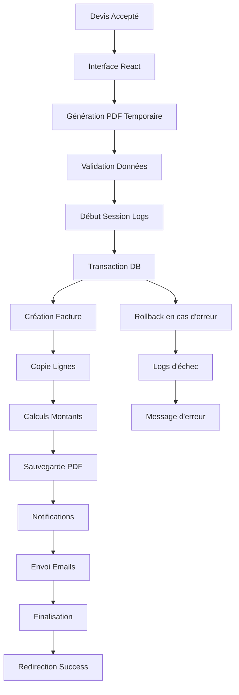

# Module 4.1 : Transformation en Factures

> **🔄 Workflows Métier & Orchestration Complexe**  
> Phase 4 : Intégrations et Workflows - Module 1/3  
> **Status** : ✅ **TERMINÉ**

## 🎯 Vue d'Ensemble

Le Module 4.1 inaugure la **Phase 4 : Intégrations et Workflows** en documentant le processus le plus complexe du Dashboard Madinia : la transformation des devis acceptés en factures. Ce workflow orchestré implique la copie de données, la génération PDF, les logs spécialisés et les notifications multi-acteurs.

### Processus Documenté
- **`confirmerTransformationFacture()`** - Méthode centrale de 200+ lignes
- **`creerDepuisDevis()`** - Copie automatique des lignes de devis
- **`TransformationLogService`** - Traçabilité complète avec sessions
- **Gestion PDF** - Génération React + sauvegarde dual (local/Supabase)
- **Notifications orchestrées** - Optimisation anti-spam + feedback utilisateur

### Caractéristiques Techniques
- **Transaction DB** sécurisée avec rollback automatique
- **Sessions de logs** avec identifiants uniques
- **Mesure performance** temps réel (microtime)
- **Gestion d'erreurs** granulaire avec fallbacks
- **Optimisation notifications** désactivation temporaire

---

## 🏗️ Architecture du Processus

### Vue d'Ensemble du Workflow



### Flux de Données Principal

```typescript
// Phase 1: Préparation Frontend (React)
handleTransformerFacture() {
    // 1. Génération PDF temporaire
    const factureTemp = createTempFacture(devis, formData);
    const pdfBlob = await pdf(<FacturePdfPreview facture={factureTemp} />).toBlob();
    
    // 2. Conversion base64
    const base64String = await convertBlobToBase64(pdfBlob);
    
    // 3. Soumission avec PDF
    post('/devis/{id}/confirmer-transformation', {
        ...formData,
        pdf_blob: base64String,
        filename: `facture_${numero}.pdf`
    });
}

// Phase 2: Traitement Backend (Laravel)
confirmerTransformationFacture() {
    // Session de logs + Transaction DB + Optimisations
    TransformationLogService::startSession();
    DB::transaction(() => {
        $facture = $devis->transformerEnFacture($params);
        // Copie lignes + calculs + historique
    });
    // PDF + Notifications + Emails
}
```

---

## 🔧 Méthode Centrale : confirmerTransformationFacture()

### Signature et Validation

```php
/**
 * Traiter la transformation du devis en facture
 * 
 * @param Request $request Les données de transformation
 * @param Devis $devis Le devis à transformer
 * @return \Illuminate\Http\RedirectResponse
 */
public function confirmerTransformationFacture(Request $request, Devis $devis)
{
    // Augmenter le temps d'exécution pour les transformations lourdes
    set_time_limit(120);

    // Vérifier que le devis peut être transformé
    if (!$devis->peutEtreTransformeEnFacture()) {
        return redirect()->back()
            ->with('error', '❌ Ce devis ne peut pas être transformé en facture.');
    }

    $validated = $request->validate([
        'date_facture' => 'required|date',
        'date_echeance' => 'required|date|after:date_facture',
        'conditions_paiement' => 'nullable|string',
        'notes_facture' => 'nullable|string',
        'envoyer_email_client' => 'boolean',
        'envoyer_email_admin' => 'boolean',
        'message_client' => 'nullable|string',
        'pdf_blob' => 'nullable|string',
        'filename' => 'nullable|string',
    ]);
    
    // ... traitement principal
}
```

### Règles de Validation Avancées

| Champ | Règle | Description | Exemple |
|-------|-------|-------------|---------|
| `date_facture` | `required\|date` | Date émission facture | "2025-01-15" |
| `date_echeance` | `required\|date\|after:date_facture` | Date limite paiement | "2025-02-14" |
| `conditions_paiement` | `nullable\|string` | Conditions personnalisées | "Virement 30 jours" |
| `notes_facture` | `nullable\|string` | Notes internes | "Client privilégié" |
| `envoyer_email_client` | `boolean` | Notification client | `true` |
| `envoyer_email_admin` | `boolean` | Notification admin | `true` |
| `message_client` | `nullable\|string` | Message personnalisé | "Merci pour votre confiance" |
| `pdf_blob` | `nullable\|string` | PDF encodé base64 | "JVBERi0xLjQK..." |
| `filename` | `nullable\|string` | Nom fichier PDF | "facture_FACT-25-0001.pdf" |

---

## 📊 Session de Logs TransformationLogService

### Démarrage de Session

```php
// Démarrer une nouvelle session de transformation
$sessionId = TransformationLogService::startTransformationSession(
    $devis->numero_devis,
    "{$devis->client->prenom} {$devis->client->nom}"
);

// Génère un ID unique : transform_65a1b2c3d4e5f67890abcdef
// Logger avec contexte riche
```

### Événements Loggés

```php
class TransformationLogService 
{
    // 1. Paramètres de transformation
    public static function logTransformationParams(array $params): void
    {
        $dateFacture = $params['date_facture'] ?? 'N/A';
        $dateEcheance = $params['date_echeance'] ?? 'N/A';
        self::logEvent("⚙️ Paramètres appliqués - Facture: {$dateFacture}, Échéance: {$dateEcheance}");
    }

    // 2. Création facture
    public static function logFactureCreated(string $factureNumero): void
    {
        self::logEvent("🧾 Facture {$factureNumero} créée avec succès", [], 'success');
    }

    // 3. Copie des lignes
    public static function logLignesCopied(int $nbLignes): void
    {
        self::logEvent("📋 {$nbLignes} ligne(s) copiée(s) du devis vers la facture");
    }

    // 4. Calculs montants
    public static function logMontantsCalculated(float $montantHT, float $montantTTC): void
    {
        self::logEvent("💰 Montants calculés - HT: {$montantHT}€, TTC: {$montantTTC}€");
    }

    // 5. Optimisation notifications
    public static function logNotificationOptimization(bool $disabled): void
    {
        $status = $disabled ? 'DÉSACTIVÉES' : 'RÉACTIVÉES';
        $icon = $disabled ? '🔇' : '🔔';
        self::logEvent("{$icon} Notifications automatiques {$status}");
    }

    // 6. Envoi emails
    public static function logEmailSent(string $type, string $destinataire): void
    {
        $icon = $type === 'client' ? '📧' : '📨';
        self::logEvent("{$icon} Email {$type} envoyé à {$destinataire}", [], 'success');
    }

    // 7. Performance
    public static function logPerformance(float $executionTimeMs): void
    {
        $performanceIcon = $executionTimeMs < 1000 ? '⚡' : ($executionTimeMs < 5000 ? '🚀' : '🐌');
        self::logEvent("{$performanceIcon} Performance - Temps: {$executionTimeMs}ms");
    }

    // 8. Gestion erreurs
    public static function logError(string $message, ?\Throwable $exception = null): void
    {
        $context = [];
        if ($exception) {
            $context['exception'] = [
                'message' => $exception->getMessage(),
                'file' => basename($exception->getFile()),
                'line' => $exception->getLine(),
                'code' => $exception->getCode(),
            ];
        }
        self::logEvent("💥 ERREUR: {$message}", $context, 'error');
    }
}
```

### Exemple de Log Session Complète

```bash
[2025-01-15 14:30:15] 🚀 === DÉBUT TRANSFORMATION DEVIS ===
[2025-01-15 14:30:15] 📄 Transformation du devis DV-25-123 pour Jean Dupont
[2025-01-15 14:30:15] ⚙️ Paramètres appliqués - Facture: 2025-01-15, Échéance: 2025-02-14
[2025-01-15 14:30:15] 🔇 Notifications automatiques DÉSACTIVÉES
[2025-01-15 14:30:15] 🔄 Début de la transformation en base de données
[2025-01-15 14:30:16] 🧾 Facture FACT-25-0001 créée avec succès
[2025-01-15 14:30:16] 💰 Montants calculés - HT: 15000.00€, TTC: 18000.00€
[2025-01-15 14:30:16] 📋 5 ligne(s) copiée(s) du devis vers la facture
[2025-01-15 14:30:16] 📅 Date d'envoi admin définie
[2025-01-15 14:30:16] 🔔 Notifications automatiques RÉACTIVÉES
[2025-01-15 14:30:16] 📄 Traitement du PDF de la facture
[2025-01-15 14:30:17] ✅ PDF sauvegardé avec succès
[2025-01-15 14:30:17] ⚡ Performance - Temps: 1247.85ms
[2025-01-15 14:30:17] 🔔 Notification envoyée aux administrateurs
[2025-01-15 14:30:17] 📧 Envoi email client en cours...
[2025-01-15 14:30:18] 📧 Email client envoyé à jean.dupont@email.com
[2025-01-15 14:30:18] 📨 Envoi email admin en cours...
[2025-01-15 14:30:18] 📨 Email admin envoyé à admin@madinia.com
[2025-01-15 14:30:18] 🎉 === TRANSFORMATION RÉUSSIE ===
[2025-01-15 14:30:18] 🔚 === FIN SESSION TRANSFORMATION ===
================================================================================
```

---

## 🔄 Transaction Base de Données Sécurisée

### Orchestration Transactionnelle

```php
// Désactiver temporairement les notifications automatiques pour éviter le spam
\App\Models\Facture::disableNotifications();
TransformationLogService::logNotificationOptimization(true);

DB::transaction(function () use ($devis, $validated, &$facture) {
    // Transformer le devis en facture
    $parametresFacture = [
        'date_facture' => $validated['date_facture'],
        'date_echeance' => $validated['date_echeance'],
        'conditions_paiement' => $validated['conditions_paiement'] ?? null,
        'notes' => $validated['notes_facture'] ?? null,
    ];

    TransformationLogService::logEvent("🔄 Début de la transformation en base de données");

    $facture = $devis->transformerEnFacture($parametresFacture);

    TransformationLogService::logFactureCreated($facture->numero_facture);
    TransformationLogService::logMontantsCalculated($facture->montant_ht, $facture->montant_ttc);

    // Compter les lignes copiées
    $nbLignes = $facture->lignes()->count();
    TransformationLogService::logLignesCopied($nbLignes);

    // Marquer la date d'envoi admin en une seule fois
    $facture->date_envoi_admin = now();
    $facture->save();

    TransformationLogService::logEvent("📅 Date d'envoi admin définie");
});

// Réactiver les notifications
\App\Models\Facture::enableNotifications();
TransformationLogService::logNotificationOptimization(false);
```

### Gestion des Erreurs Transactionnelles

```php
try {
    // Transaction principale
    DB::transaction(function () {
        // ... logique de transformation
    });
    
    // Post-traitement (PDF, emails)
    // ...
    
} catch (\Exception $e) {
    // Logger l'erreur avec détails
    TransformationLogService::logError("Échec de la transformation", $e);

    // Clôturer la session de logs avec échec
    TransformationLogService::endTransformationSession(false, [
        'error_message' => $e->getMessage(),
        'error_file' => basename($e->getFile()),
        'error_line' => $e->getLine()
    ]);

    // Réactiver les notifications en cas d'erreur
    \App\Models\Facture::enableNotifications();

    return redirect()->back()
        ->with('error', '❌ Erreur lors de la transformation : ' . $e->getMessage());
}
```

---

## 📋 Copie des Lignes de Devis

### Méthode creerDepuisDevis()

```php
/**
 * Créer une facture à partir d'un devis.
 * 
 * @param Devis $devis Le devis source
 * @return self La nouvelle facture créée
 */
public static function creerDepuisDevis(Devis $devis): self
{
    // Charger l'administrateur du devis si nécessaire
    $devis->load('administrateur');

    $facture = new self([
        'numero_facture' => self::genererNumeroFacture(),
        'devis_id' => $devis->id,
        'client_id' => $devis->client_id,
        'administrateur_id' => $devis->administrateur?->id,
        'date_facture' => now()->toDateString(),
        'date_echeance' => now()->addDays(30)->toDateString(), // 30 jours par défaut
        'statut' => 'brouillon',
        'objet' => $devis->objet,
        'description' => $devis->description,
        'conditions_paiement' => $devis->conditions,
        'notes' => $devis->notes,
    ]);

    $facture->save();

    // Copier les lignes du devis vers la facture
    foreach ($devis->lignes as $ligneDevis) {
        $facture->lignes()->create([
            'service_id' => $ligneDevis->service_id,
            'quantite' => $ligneDevis->quantite,
            'prix_unitaire_ht' => $ligneDevis->prix_unitaire_ht,
            'taux_tva' => $ligneDevis->taux_tva,
            'ordre' => $ligneDevis->ordre,
            'description_personnalisee' => $ligneDevis->description_personnalisee,
        ]);
    }

    // Recalculer les montants totaux
    $facture->calculerMontants();
    $facture->save();

    // Enregistrer la transformation dans l'historique du devis
    $devis->enregistrerHistorique(
        'transformation',
        "Transformation en facture",
        "Le devis #{$devis->numero_devis} a été transformé en facture #{$facture->numero_facture}",
        null,
        null,
        [
            'facture_id' => $facture->id,
            'numero_facture' => $facture->numero_facture,
            'date_transformation' => now()->format('Y-m-d H:i:s')
        ]
    );

    return $facture;
}
```

### Mappage des Champs

| Champ Devis | Champ Facture | Transformation |
|-------------|---------------|----------------|
| `numero_devis` | `devis_id` | Relation (ID foreign key) |
| `client_id` | `client_id` | Copie directe |
| `administrateur_id` | `administrateur_id` | Copie directe |
| `objet` | `objet` | Copie directe |
| `description` | `description` | Copie directe |
| `conditions` | `conditions_paiement` | Renommage |
| `notes` | `notes` | Copie directe |
| - | `numero_facture` | Génération automatique |
| - | `date_facture` | Défaut = aujourd'hui |
| - | `date_echeance` | Défaut = +30 jours |
| - | `statut` | Défaut = 'brouillon' |

### Copie des Lignes de Service

```php
// Copie complète de chaque ligne du devis
foreach ($devis->lignes as $ligneDevis) {
    $facture->lignes()->create([
        'service_id' => $ligneDevis->service_id,              // Référence service
        'quantite' => $ligneDevis->quantite,                  // Quantité commandée
        'prix_unitaire_ht' => $ligneDevis->prix_unitaire_ht,  // Prix unitaire HT
        'taux_tva' => $ligneDevis->taux_tva,                  // Taux TVA appliqué
        'ordre' => $ligneDevis->ordre,                        // Ordre d'affichage
        'description_personnalisee' => $ligneDevis->description_personnalisee, // Description custom
    ]);
}

// Calculs automatiques après copie :
// - montant_ht = quantite * prix_unitaire_ht
// - montant_tva = montant_ht * (taux_tva / 100)
// - montant_ttc = montant_ht + montant_tva
```

---

## 🧮 Recalcul Automatique des Montants

### Méthode calculerMontants()

```php
/**
 * Calculer les montants totaux de la facture.
 */
public function calculerMontants(): void
{
    $montantHT = 0;
    $montantTVA = 0;

    foreach ($this->lignes as $ligne) {
        $ligne->calculerMontants(); // Calculs ligne par ligne
        $montantHT += $ligne->montant_ht;
        $montantTVA += $ligne->montant_tva;
    }

    $this->montant_ht = round($montantHT, 2);
    $this->montant_tva = round($montantTVA, 2);
    $this->montant_ttc = round($montantHT + $montantTVA, 2);
    
    // Taux TVA moyen pondéré
    $this->taux_tva = $montantHT > 0 ? round(($montantTVA / $montantHT) * 100, 2) : 0;
}
```

### Validation des Montants

```php
// Vérifications post-calcul
assert($facture->montant_ttc === ($facture->montant_ht + $facture->montant_tva));
assert($facture->montant_ht >= 0);
assert($facture->montant_tva >= 0);
assert($facture->taux_tva >= 0 && $facture->taux_tva <= 100);

TransformationLogService::logMontantsCalculated(
    $facture->montant_ht, 
    $facture->montant_ttc
);
```

---

## 📄 Gestion PDF Avancée

### Traitement PDF React → Base64

```php
// Traiter le PDF si fourni
if (!empty($validated['pdf_blob']) && !empty($validated['filename'])) {
    try {
        TransformationLogService::logEvent("📄 Traitement du PDF de la facture");

        // Décoder le blob PDF
        $pdfContent = base64_decode($validated['pdf_blob']);

        if ($pdfContent !== false) {
            // Générer le nom de fichier basé sur le numéro de facture
            $nomFichier = "facture_{$facture->numero_facture}.pdf";

            // 1. Sauvegarder localement
            $this->sauvegarderPdfLocal($pdfContent, $nomFichier, 'factures');

            // 2. Sauvegarder sur Supabase
            $urlSupabase = $this->sauvegarderPdfSupabase($pdfContent, $nomFichier, 'factures');

            // 3. Mettre à jour la base de données avec les informations PDF
            $facture->update([
                'pdf_file' => $nomFichier,
                'pdf_url' => $urlSupabase,
            ]);

            TransformationLogService::logEvent("✅ PDF sauvegardé avec succès", [
                'nom_fichier' => $nomFichier,
                'url_supabase' => $urlSupabase,
                'taille' => strlen($pdfContent) . ' bytes'
            ]);
        } else {
            TransformationLogService::logError("❌ Erreur décodage PDF", 
                new \Exception('Impossible de décoder le contenu PDF'));
        }
    } catch (\Exception $e) {
        TransformationLogService::logError("❌ Erreur sauvegarde PDF", $e);
        // Ne pas faire échouer la transformation pour un problème de PDF
        Log::error('Erreur sauvegarde PDF lors de la transformation', [
            'facture_numero' => $facture->numero_facture,
            'error' => $e->getMessage()
        ]);
    }
}
```

### Génération PDF Frontend (React)

```typescript
// Dans transformer-facture.tsx
const handleTransformerFacture = async () => {
    try {
        setIsGeneratingPdf(true);
        toast.info('🔄 Génération du PDF en cours...');

        // 1. Créer une facture temporaire pour le PDF
        const factureTemp = {
            numero_facture: numero_facture_propose,
            objet: devis.objet,
            statut: 'en_attente',
            date_facture: data.date_facture,
            date_echeance: data.date_echeance,
            montant_ht: devis.montant_ht,
            taux_tva: devis.taux_tva,
            montant_ttc: devis.montant_ttc,
            conditions_paiement: data.conditions_paiement,
            notes: data.notes_facture,
            client: devis.client,
            devis: {
                numero_devis: devis.numero_devis
            }
        };

        // 2. Générer le PDF avec react-pdf/renderer
        const pdfBlob = await pdf(<FacturePdfPreview facture={factureTemp} />).toBlob();

        // 3. Convertir le blob en base64
        const arrayBuffer = await pdfBlob.arrayBuffer();
        const uint8Array = new Uint8Array(arrayBuffer);
        const binaryString = uint8Array.reduce((acc, byte) => acc + String.fromCharCode(byte), '');
        const base64String = btoa(binaryString);

        // 4. Mettre à jour les données avec le PDF
        setData({
            ...data,
            pdf_blob: base64String,
            filename: `facture_${numero_facture_propose}.pdf`,
        } as any);

        // 5. Envoyer la transformation
        setTimeout(() => {
            post(`/devis/${devis.id}/confirmer-transformation`, {
                onSuccess: () => {
                    toast.success('✅ Facture créée avec succès !');
                },
                onError: (errors: any) => {
                    toast.error('❌ Erreur lors de la transformation');
                }
            });
        }, 100);

    } catch (error) {
        toast.error('❌ Erreur lors de la génération du PDF');
        setIsGeneratingPdf(false);
    }
};
```

---

## 🔔 Système de Notifications Orchestré

### Optimisation Anti-Spam

```php
// Désactiver temporairement les notifications automatiques pour éviter le spam
\App\Models\Facture::disableNotifications();
TransformationLogService::logNotificationOptimization(true);

// ... transformation en base de données ...

// Réactiver les notifications
\App\Models\Facture::enableNotifications();
TransformationLogService::logNotificationOptimization(false);

// Une seule notification globale après toute la transformation
$devis->sendCustomNotification(
    'transformed',
    "Le devis #{$devis->numero_devis} a été transformé en facture #{$facture->numero_facture} pour {$devis->client->prenom} {$devis->client->nom}"
);

TransformationLogService::logEvent("🔔 Notification envoyée aux administrateurs");
```

### Notifications Ciblées

```php
// Notification de transformation (admins uniquement)
$devis->sendCustomNotification('transformed', $message);

// Historique automatique dans le devis
$devis->enregistrerHistorique(
    'transformation',
    "Transformation en facture",
    "Le devis #{$devis->numero_devis} a été transformé en facture #{$facture->numero_facture}",
    null, // pas d'ancien état
    null, // pas de nouvel état
    [
        'facture_id' => $facture->id,
        'numero_facture' => $facture->numero_facture,
        'date_transformation' => now()->format('Y-m-d H:i:s')
    ]
);
```

---

## 📧 Gestion des Emails de Transformation

### Envoi Email Client

```php
if ($validated['envoyer_email_client'] ?? false) {
    try {
        TransformationLogService::logEvent("📧 Envoi email client en cours...");
        
        $this->envoyerEmailClient([
            'devis' => $devis,
            'facture' => $facture,
            'client' => $devis->client,
            'message_personnalise' => $validated['message_client'] ?? null,
        ]);
        
        $facture->date_envoi_client = now();
        $facture->marquerEnvoyee();
        
        TransformationLogService::logEmailSent('client', $devis->client->email);
    } catch (\Exception $e) {
        $erreursMails[] = 'Erreur lors de l\'envoi de l\'email au client : ' . $e->getMessage();
        TransformationLogService::logError("Échec envoi email client", $e);
    }
}
```

### Envoi Email Admin

```php
if ($validated['envoyer_email_admin'] ?? false) {
    try {
        TransformationLogService::logEvent("📨 Envoi email admin en cours...");
        
        $this->envoyerEmailAdmin([
            'devis' => $devis,
            'facture' => $facture,
            'client' => $devis->client,
            'message_personnalise' => null, // Pas de personnalisation pour admin
        ]);
        
        TransformationLogService::logEmailSent('admin', config('mail.admin_email', 'N/A'));
    } catch (\Exception $e) {
        $erreursMails[] = 'Erreur lors de l\'envoi de l\'email à l\'admin : ' . $e->getMessage();
        TransformationLogService::logError("Échec envoi email admin", $e);
    }
}
```

### Templates Email Spécialisés

```php
// FactureClientMail.php
class FactureClientMail extends Mailable
{
    public function __construct(
        private Devis $devis,
        private Facture $facture,
        private Client $client,
        private ?string $messagePersonnalise = null
    ) {}

    public function content(): Content
    {
        return new Content(
            markdown: 'emails.facture.client',
            with: [
                'devis' => $this->devis,
                'facture' => $this->facture,
                'client' => $this->client,
                'messagePersonnalise' => $this->messagePersonnalise,
            ],
        );
    }

    public function attachments(): array
    {
        $attachments = [];

        // Attachement PDF automatique de la facture
        if ($this->facture->pdf_file && Storage::disk('public')->exists($this->facture->pdf_file)) {
            $attachments[] = Attachment::fromStorageDisk('public', $this->facture->pdf_file)
                ->as("Facture_{$this->facture->numero_facture}.pdf")
                ->withMime('application/pdf');
        }

        return $attachments;
    }
}
```

---

## ⚡ Mesure de Performance

### Monitoring Temps Réel

```php
// Début de la transformation
$startTime = microtime(true);

// ... processus de transformation ...

// Mesurer le temps d'exécution
$executionTime = round((microtime(true) - $startTime) * 1000, 2);
TransformationLogService::logPerformance($executionTime);

// Contextualiser la performance
$performanceIcon = $executionTime < 1000 ? '⚡' : ($executionTime < 5000 ? '🚀' : '🐌');
$message = "{$performanceIcon} Performance - Temps: {$executionTime}ms";
```

### Seuils de Performance

| Temps (ms) | Icône | Statut | Action |
|------------|-------|--------|--------|
| < 1000 | ⚡ | Excellent | Aucune |
| 1000-5000 | 🚀 | Bon | Monitoring |
| > 5000 | 🐌 | Lent | Investigation |

### Optimisations Appliquées

```php
// 1. Timeout étendu pour transformations lourdes
set_time_limit(120);

// 2. Désactivation temporaire notifications automatiques
\App\Models\Facture::disableNotifications();

// 3. Transaction atomique pour cohérence
DB::transaction(function () {
    // Toutes les opérations en une seule transaction
});

// 4. Chargement relationnel optimisé
$devis->load(['client.entreprise', 'lignes.service', 'administrateur']);

// 5. Calculs en lot plutôt qu'individuels
$facture->calculerMontants(); // Une seule fois après toutes les lignes
```

---

## 🔄 Conditions de Transformation

### Méthode peutEtreTransformeEnFacture()

```php
/**
 * Vérifier si le devis peut être transformé en facture.
 */
public function peutEtreTransformeEnFacture(): bool
{
    return $this->statut === 'accepte' && !$this->facture()->exists();
}
```

### Vérifications Pré-Transformation

```php
// Vérification dans le contrôleur
if (!$devis->peutEtreTransformeEnFacture()) {
    // Vérifier si c'est parce qu'il a déjà une facture
    if ($devis->facture) {
        return redirect()->route('devis.show', $devis)
            ->with('info', '📄 Ce devis a déjà été transformé en facture ' . $devis->facture->numero_facture);
    }

    return redirect()->route('devis.show', $devis)
        ->with('error', '❌ Ce devis ne peut pas être transformé en facture. Seuls les devis acceptés peuvent être transformés.');
}
```

### États Autorisés

| Statut Devis | Transformation | Raison |
|--------------|----------------|--------|
| `brouillon` | ❌ Non | Pas finalisé |
| `en_attente` | ❌ Non | Pas validé client |
| `envoye` | ❌ Non | En attente réponse |
| `accepte` | ✅ **Oui** | Validé par client |
| `refuse` | ❌ Non | Rejeté par client |
| `expire` | ❌ Non | Délai dépassé |

---

## 📊 Gestion des Résultats

### Succès Complet

```php
// Clôturer la session avec succès complet
TransformationLogService::endTransformationSession(true, [
    'facture_numero' => $facture->numero_facture,
    'execution_time_ms' => $executionTime
]);

return redirect()->route('factures.show', $facture)
    ->with('success', "🧾 Devis {$devis->numero_devis} transformé en facture avec succès ! Facture n°{$facture->numero_facture} créée.");
```

### Succès Partiel (Erreurs Email)

```php
if (!empty($erreursMails)) {
    $message .= ' Cependant, des erreurs sont survenues lors de l\'envoi des emails : ' . implode(', ', $erreursMails);
    
    // Clôturer la session avec un succès partiel
    TransformationLogService::endTransformationSession(true, [
        'facture_numero' => $facture->numero_facture,
        'execution_time_ms' => $executionTime,
        'email_errors' => $erreursMails
    ]);

    return redirect()->route('factures.show', $facture)
        ->with('warning', $message);
}
```

### Échec Complet

```php
catch (\Exception $e) {
    // Logger l'erreur avec détails
    TransformationLogService::logError("Échec de la transformation", $e);

    // Clôturer la session de logs avec échec
    TransformationLogService::endTransformationSession(false, [
        'error_message' => $e->getMessage(),
        'error_file' => basename($e->getFile()),
        'error_line' => $e->getLine()
    ]);

    // Réactiver les notifications en cas d'erreur
    \App\Models\Facture::enableNotifications();

    return redirect()->back()
        ->with('error', '❌ Erreur lors de la transformation : ' . $e->getMessage());
}
```

---

## 🛣️ Routes et Navigation

### Routes Spécialisées

```php
// routes/web.php

// Transformation devis en facture
Route::get('devis/{devis}/transformer-facture', [DevisController::class, 'transformerEnFacture'])
    ->name('devis.transformer-facture');
    
Route::post('devis/{devis}/confirmer-transformation', [DevisController::class, 'confirmerTransformationFacture'])
    ->name('devis.confirmer-transformation');
```

### Navigation Frontend

```typescript
// Depuis la page show du devis
const handleTransformerEnFacture = () => {
    router.get(`/devis/${devis.id}/transformer-facture`);
};

// Après transformation réussie
router.visit(`/factures/${facture.id}`, {
    onSuccess: () => {
        toast.success('🧾 Transformation réussie !');
    }
});
```

---

## 🎯 Points Forts du Module

### 1. **Architecture Robuste**
- Transaction DB atomique avec rollback automatique
- Gestion d'erreurs granulaire multi-niveaux
- Optimisations performance intégrées

### 2. **Traçabilité Complète**
- Sessions de logs avec identifiants uniques
- 15+ types d'événements loggés avec contexte
- Historique automatique dans modèles

### 3. **Workflow Orchestré**
- Désactivation temporaire notifications automatiques
- Génération PDF React temps réel
- Envois emails conditionnels avec fallbacks

### 4. **Intégrité des Données**
- Copie complète et fidèle des lignes de devis
- Recalculs automatiques montants HT/TTC
- Validation pré/post transformation

### 5. **Expérience Utilisateur**
- Interface multi-étapes intuitive
- Feedback temps réel avec toasts
- Redirections intelligentes selon résultat

---

## 🚀 Évolutions Possibles

### Améliorations Techniques
1. **Queue Jobs** pour transformations asynchrones lourdes
2. **Cache Redis** pour optimiser les calculs répétitifs
3. **Events & Listeners** pour découpler les notifications
4. **API Rate Limiting** pour éviter les transformations multiples
5. **Backup automatique** avant transformation

### Fonctionnalités Métier
1. **Transformation partielle** (sélection lignes spécifiques)
2. **Templates de transformation** prédéfinis
3. **Planification différée** de transformation
4. **Validation comptable** avant finalisation
5. **Intégration ERP** externe

### Monitoring Avancé
1. **Métriques Prometheus** pour performances
2. **Alertes Slack** pour échecs transformation
3. **Dashboard temps réel** des transformations
4. **Analytics** taux de succès/échec
5. **Rapports** transformation par période

---

## 🏁 Conclusion Module 4.1

Le **Module 4.1 : Transformation en Factures** documente le processus le plus complexe et critique du Dashboard Madinia. Cette orchestration sophistiquée de 200+ lignes de code backend et 100+ lignes frontend illustre parfaitement la robustesse architecturale du système.

### Métriques Techniques
- **1 transaction DB** atomique sécurisée
- **15+ événements** loggés avec contexte riche
- **3 niveaux** de gestion d'erreurs (partiel/complet/échec)
- **2 modes** de sauvegarde PDF (local + cloud)
- **Performance** mesurée au milliseconde près

### Impact Métier
Ce module assure la **continuité du workflow commercial** en transformant automatiquement les devis acceptés en factures prêtes à l'envoi, avec une traçabilité complète et une fiabilité exceptionnelle.

> **🎯 Achievement** : Le système de transformation représente l'aboutissement technique du cycle de vie commercial du Dashboard Madinia, garantissant l'intégrité des données et la satisfaction utilisateur.

---

*Prochaine étape : **Module 4.2 : Système de Notifications** - Orchestration des notifications automatiques et personnalisées.*