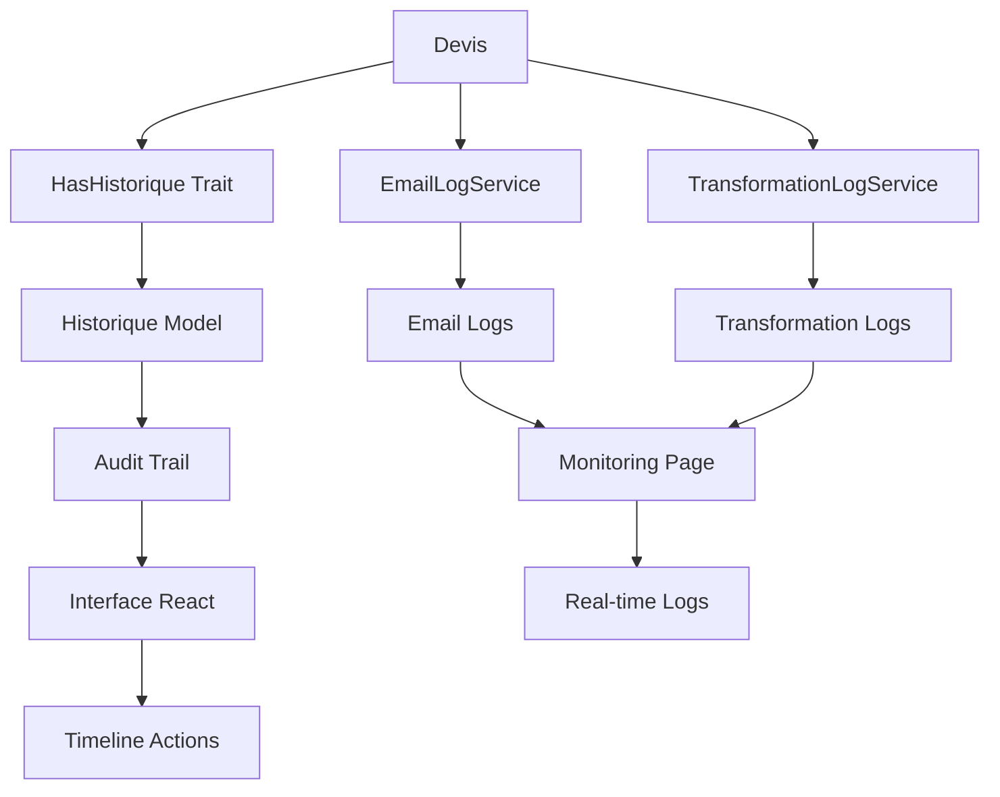

# Module 4.3 : Historique et Traçabilité

## 📋 Vue d'ensemble

Ce module documente l'architecture complète de traçabilité et d'historique des devis dans le Dashboard Madinia. Il couvre les systèmes d'audit automatique, les logs spécialisés, le monitoring des performances et l'interface utilisateur de traçabilité.

## 🏗️ Architecture Globale

### Composants Principaux



### Types de Traçabilité

1. **Historique Automatique** - Actions CRUD tracées automatiquement
2. **Logs Spécialisés** - Emails et transformations avec détails techniques
3. **Monitoring Temps Réel** - Surveillance en direct des opérations
4. **Audit Trail** - Interface utilisateur pour consultation

## 🔧 Système d'Historique Automatique

### Trait HasHistorique

```php
<?php

namespace App\Traits;

trait HasHistorique
{
    /**
     * Relation polymorphe vers l'historique
     */
    public function historique(): MorphMany
    {
        return $this->morphMany(Historique::class, 'entite', 'entite_type', 'entite_id')
                    ->chronologique();
    }

    /**
     * Enregistrer une action dans l'historique
     */
    public function enregistrerHistorique(
        string $action,
        string $titre,
        ?string $description = null,
        ?array $donneesAvant = null,
        ?array $donneesApres = null,
        ?array $donneesSupplementaires = null
    ): Historique {
        return Historique::enregistrer(
            $this,
            $action,
            $titre,
            $description,
            $donneesAvant,
            $donneesApres,
            $donneesSupplementaires
        );
    }

    /**
     * Boot trait - Événements automatiques
     */
    protected static function bootHasHistorique(): void
    {
        // Création automatique
        static::created(function ($model) {
            if (Auth::check()) {
                $model->enregistrerHistorique(
                    'creation',
                    "Création de " . class_basename($model) . " #{$model->id}",
                    "Nouvel enregistrement créé",
                    null,
                    $model->getAttributes()
                );
            }
        });

        // Modification automatique
        static::updated(function ($model) {
            if (Auth::check() && $model->wasChanged()) {
                $changes = [];
                $original = [];

                foreach ($model->getChanges() as $key => $newValue) {
                    if ($key !== 'updated_at') {
                        $changes[$key] = $newValue;
                        $original[$key] = $model->getOriginal($key);
                    }
                }

                if (!empty($changes)) {
                    $model->enregistrerHistorique(
                        'modification',
                        "Modification de " . class_basename($model) . " #{$model->id}",
                        "Données mises à jour",
                        $original,
                        $changes
                    );
                }
            }
        });
    }
}
```

### Modèle Historique

```php
<?php

namespace App\Models;

class Historique extends Model
{
    protected $fillable = [
        'entite_type', 'entite_id', 'action', 'titre', 'description',
        'donnees_avant', 'donnees_apres', 'donnees_supplementaires',
        'user_id', 'user_nom', 'user_email', 'ip_address', 'user_agent'
    ];

    protected $casts = [
        'donnees_avant' => 'array',
        'donnees_apres' => 'array',
        'donnees_supplementaires' => 'array',
        'created_at' => 'datetime',
    ];

    /**
     * Créer un enregistrement d'historique
     */
    public static function enregistrer(
        Model $entite,
        string $action,
        string $titre,
        ?string $description = null,
        ?array $donneesAvant = null,
        ?array $donneesApres = null,
        ?array $donneesSupplementaires = null,
        ?User $user = null
    ): self {
        $user = $user ?? Auth::user();

        return self::create([
            'entite_type' => get_class($entite),
            'entite_id' => $entite->id,
            'action' => $action,
            'titre' => $titre,
            'description' => $description,
            'donnees_avant' => $donneesAvant,
            'donnees_apres' => $donneesApres,
            'donnees_supplementaires' => $donneesSupplementaires,
            'user_id' => $user->id,
            'user_nom' => $user->name,
            'user_email' => $user->email,
            'ip_address' => request()->ip(),
            'user_agent' => request()->userAgent(),
            'created_at' => now(),
        ]);
    }

    /**
     * Obtenir une icône pour l'action
     */
    public function getIconeAttribute(): string
    {
        return match ($this->action) {
            'creation' => '🆕',
            'modification' => '✏️',
            'changement_statut' => '🔄',
            'envoi_email' => '📧',
            'transformation' => '🔄',
            'suppression' => '🗑️',
            default => '📋',
        };
    }
}
```

## 📧 Système de Logs Emails (EmailLogService)

### Service Principal

```php
<?php

namespace App\Services;

class EmailLogService
{
    private static $sessionId = null;

    /**
     * Démarrer une session d'envoi
     */
    public static function startEmailSession(string $type = 'general', array $context = []): string
    {
        self::$sessionId = uniqid('email_', true);
        
        self::writeLog('🚀 SESSION START', 'INFO', "Début session d'envoi d'email", [
            'session_id' => self::$sessionId,
            'type' => $type,
            'context' => $context
        ]);
        
        return self::$sessionId;
    }

    /**
     * Logger un succès d'envoi
     */
    public static function logSuccess(string $recipient, string $subject, array $details = []): void
    {
        self::logEvent('SUCCESS', 'SUCCESS', [
            'recipient' => $recipient,
            'subject' => $subject,
            'details' => $details
        ]);
    }

    /**
     * Logger une erreur
     */
    public static function logError(string $recipient, string $error, array $context = []): void
    {
        self::logEvent('ERROR', 'ERROR', [
            'recipient' => $recipient,
            'error' => $error,
            'context' => $context
        ]);
    }

    /**
     * Terminer la session
     */
    public static function endEmailSession(bool $success = true, array $summary = []): void
    {
        $icon = $success ? '✅ SESSION END' : '❌ SESSION FAILED';
        self::writeLog($icon, $success ? 'SUCCESS' : 'ERROR', "Fin session d'envoi", [
            'session_id' => self::$sessionId,
            'success' => $success,
            'summary' => $summary
        ]);
        
        self::$sessionId = null;
    }
}
```

### Utilisation dans DevisController

```php
// Dans DevisController::confirmerTransformationFacture()
EmailLogService::startEmailSession('transformation_devis', [
    'devis_id' => $devis->id,
    'devis_numero' => $devis->numero_devis
]);

try {
    // Logique d'envoi d'emails
    EmailLogService::logSuccess($client->email, 'Facture créée', $emailData);
    EmailLogService::endEmailSession(true, ['emails_sent' => 2]);
} catch (Exception $e) {
    EmailLogService::logError($client->email, $e->getMessage());
    EmailLogService::endEmailSession(false);
}
```

## 🔄 Système de Logs Transformations (TransformationLogService)

### Service Spécialisé

```php
<?php

namespace App\Services;

class TransformationLogService
{
    private static ?string $currentSessionId = null;

    /**
     * Démarrer une session de transformation
     */
    public static function startTransformationSession(string $devisNumero, string $clientNom): string
    {
        self::$currentSessionId = uniqid('transform_', true);
        
        self::writeLog('info', "🚀 === DÉBUT TRANSFORMATION DEVIS ===", [
            'session_id' => self::$currentSessionId,
            'devis_numero' => $devisNumero,
            'client_nom' => $clientNom
        ]);
        
        return self::$currentSessionId;
    }

    /**
     * Logger la création de facture
     */
    public static function logFactureCreated(string $factureNumero, array $context = []): void
    {
        self::logEvent("🧾 Facture {$factureNumero} créée avec succès", $context, 'success');
    }

    /**
     * Logger la copie des lignes
     */
    public static function logLignesCopied(int $nbLignes, array $context = []): void
    {
        self::logEvent("📋 {$nbLignes} ligne(s) copiée(s) du devis vers la facture", $context);
    }

    /**
     * Logger les performances
     */
    public static function logPerformance(float $executionTimeMs, int $dbQueries = null): void
    {
        $performanceIcon = $executionTimeMs < 1000 ? '⚡' : ($executionTimeMs < 5000 ? '🚀' : '🐌');
        $message = "{$performanceIcon} Performance - Temps: {$executionTimeMs}ms";
        
        if ($dbQueries !== null) {
            $message .= ", Requêtes DB: {$dbQueries}";
        }
        
        self::logEvent($message, ['execution_time_ms' => $executionTimeMs]);
    }

    /**
     * Terminer la session
     */
    public static function endTransformationSession(bool $success, array $finalContext = []): void
    {
        if ($success) {
            self::writeLog('info', "🎉 === TRANSFORMATION RÉUSSIE ===", $finalContext);
        } else {
            self::writeLog('error', "💥 === TRANSFORMATION ÉCHOUÉE ===", $finalContext);
        }
        
        self::$currentSessionId = null;
    }
}
```

## ⚛️ Interface React - Historique

### Composant d'Affichage

```typescript
interface HistoriqueAction {
    id: number;
    action: 'creation' | 'modification' | 'changement_statut' | 'envoi_email' | 'transformation';
    titre: string;
    description?: string;
    donnees_avant?: any;
    donnees_apres?: any;
    donnees_supplementaires?: any;
    created_at: string;
    user?: {
        id: number;
        name: string;
        email: string;
    };
    user_nom: string;
    user_email: string;
}

// Fonctions d'affichage
const getActionIcon = (action: string) => {
    switch (action) {
        case 'creation':
            return <FileText className="h-4 w-4" />;
        case 'modification':
            return <Edit className="h-4 w-4" />;
        case 'changement_statut':
            return <CheckCircle className="h-4 w-4" />;
        case 'envoi_email':
            return <Mail className="h-4 w-4" />;
        case 'transformation':
            return <Receipt className="h-4 w-4" />;
        default:
            return <Clock className="h-4 w-4" />;
    }
};

const getActionColor = (action: string) => {
    switch (action) {
        case 'creation':
            return 'bg-blue-100 text-blue-800 dark:bg-blue-900/30 dark:text-blue-300';
        case 'modification':
            return 'bg-amber-100 text-amber-800 dark:bg-amber-900/30 dark:text-amber-300';
        case 'changement_statut':
            return 'bg-green-100 text-green-800 dark:bg-green-900/30 dark:text-green-300';
        case 'envoi_email':
            return 'bg-purple-100 text-purple-800 dark:bg-purple-900/30 dark:text-purple-300';
        case 'transformation':
            return 'bg-emerald-100 text-emerald-800 dark:bg-emerald-900/30 dark:text-emerald-300';
        default:
            return 'bg-gray-100 text-gray-800 dark:bg-gray-800/50 dark:text-gray-300';
    }
};
```

### Template d'Affichage

```tsx
{/* Historique des actions */}
<Card className="w-full max-w-5xl mx-auto">
    <CardHeader>
        <CardTitle className="flex items-center gap-2">
            <Clock className="h-5 w-5" />
            Historique des actions
        </CardTitle>
    </CardHeader>
    <CardContent>
        {historique.length > 0 ? (
            <div className="space-y-4">
                {historique.map((action) => (
                    <div key={action.id} className="flex items-start gap-4 p-4 bg-gray-50 rounded-lg">
                        <div className={`flex items-center justify-center w-8 h-8 rounded-full ${getActionColor(action.action)}`}>
                            {getActionIcon(action.action)}
                        </div>
                        <div className="flex-1 min-w-0">
                            <div className="flex items-center justify-between">
                                <h4 className="font-medium text-gray-900">{action.titre}</h4>
                                <span className="text-sm text-gray-500">{formatActionDate(action.created_at)}</span>
                            </div>
                            {action.description && (
                                <p className="text-sm text-gray-600 mt-1">{action.description}</p>
                            )}
                            <div className="flex items-center gap-2 mt-2 text-xs text-gray-500">
                                <span>Par {action.user?.name || action.user_nom}</span>
                                {action.donnees_supplementaires?.email_destinataire && (
                                    <span>• Envoyé à {action.donnees_supplementaires.email_destinataire}</span>
                                )}
                            </div>
                            {(action.donnees_avant || action.donnees_apres) && (
                                <details className="mt-2">
                                    <summary className="text-xs text-gray-500 cursor-pointer">
                                        Voir les détails
                                    </summary>
                                    <div className="mt-2 text-xs bg-white p-2 rounded border">
                                        {action.donnees_avant && (
                                            <div className="mb-2">
                                                <span className="font-medium text-red-600">Avant :</span>
                                                <pre className="text-xs text-gray-600 mt-1">
                                                    {JSON.stringify(action.donnees_avant, null, 2)}
                                                </pre>
                                            </div>
                                        )}
                                        {action.donnees_apres && (
                                            <div>
                                                <span className="font-medium text-green-600">Après :</span>
                                                <pre className="text-xs text-gray-600 mt-1">
                                                    {JSON.stringify(action.donnees_apres, null, 2)}
                                                </pre>
                                            </div>
                                        )}
                                    </div>
                                </details>
                            )}
                        </div>
                    </div>
                ))}
            </div>
        ) : (
            <div className="text-center py-8 text-gray-500">
                <Clock className="h-12 w-12 mx-auto mb-4 text-gray-300" />
                <p>Aucune action enregistrée pour ce devis</p>
            </div>
        )}
    </CardContent>
</Card>
```

## 📊 Page de Monitoring

### Interface Unifiée

La page `/monitoring` centralise tous les logs avec un système d'onglets :

```tsx
// Onglets de monitoring
const monitoringTabs = [
    {
        id: 'emails',
        label: 'Logs d\'emails',
        icon: <Mail className="h-4 w-4" />,
        component: <EmailLogsTab />
    },
    {
        id: 'transformations', 
        label: 'Logs de transformation',
        icon: <ArrowRightLeft className="h-4 w-4" />,
        component: <TransformationLogsTab />
    }
];

// Auto-actualisation toutes les 5 secondes
useEffect(() => {
    const interval = setInterval(() => {
        if (activeTab === 'emails') {
            fetchEmailLogs();
        } else if (activeTab === 'transformations') {
            fetchTransformationLogs();
        }
    }, 5000);

    return () => clearInterval(interval);
}, [activeTab]);
```

### Fonctionnalités de Monitoring

1. **Auto-actualisation** - Logs en temps réel toutes les 5 secondes
2. **Sélecteur de lignes** - 50 à 500 lignes affichées
3. **Nettoyage des logs** - Boutons pour vider les anciens logs
4. **Formatage coloré** - Couleurs selon le niveau (INFO, SUCCESS, ERROR)
5. **Icônes contextuelles** - Identification visuelle rapide des événements

## 🔍 Traçabilité dans les Devis

### Actions Automatiquement Tracées

1. **Création de devis** :
   ```php
   // Automatique via HasHistorique trait
   'creation' => "Création de Devis #{$devis->id}"
   ```

2. **Modification de devis** :
   ```php
   // Automatique avec données avant/après
   'modification' => "Modification de Devis #{$devis->id}"
   // Inclut les changements de champs
   ```

3. **Changement de statut** :
   ```php
   $devis->enregistrerHistorique(
       'changement_statut',
       "Changement de statut",
       "Statut passé de {$ancienStatut} à {$nouveauStatut}",
       ['statut' => $ancienStatut],
       ['statut' => $nouveauStatut]
   );
   ```

4. **Envoi d'emails** :
   ```php
   $devis->enregistrerHistorique(
       'envoi_email',
       "Envoi d'email au client",
       "Email envoyé avec succès",
       null,
       null,
       ['email_destinataire' => $client->email, 'type_email' => 'devis_client']
   );
   ```

5. **Transformation en facture** :
   ```php
   $devis->enregistrerHistorique(
       'transformation',
       "Transformation en facture",
       "Devis transformé en facture {$facture->numero_facture}",
       null,
       null,
       ['numero_facture' => $facture->numero_facture, 'facture_id' => $facture->id]
   );
   ```

## 💾 Structure Base de Données

### Table `historique`

```sql
CREATE TABLE historique (
    id BIGINT UNSIGNED AUTO_INCREMENT PRIMARY KEY,
    entite_type VARCHAR(255) NOT NULL,
    entite_id BIGINT UNSIGNED NOT NULL,
    action VARCHAR(100) NOT NULL,
    titre VARCHAR(500) NOT NULL,
    description TEXT NULL,
    donnees_avant JSON NULL,
    donnees_apres JSON NULL,
    donnees_supplementaires JSON NULL,
    user_id BIGINT UNSIGNED NULL,
    user_nom VARCHAR(255) NOT NULL,
    user_email VARCHAR(255) NOT NULL,
    ip_address VARCHAR(45) NULL,
    user_agent TEXT NULL,
    created_at TIMESTAMP NOT NULL,
    
    INDEX idx_entite (entite_type, entite_id),
    INDEX idx_action (action),
    INDEX idx_user (user_id),
    INDEX idx_created_at (created_at),
    
    FOREIGN KEY (user_id) REFERENCES users(id) ON DELETE SET NULL
);
```

### Fichiers de Logs

```
storage/logs/
├── emails.log              # Logs d'envoi d'emails
├── transformations.log     # Logs de transformation
└── laravel.log            # Logs généraux Laravel
```

## 🛡️ Sécurité et Confidentialité

### Données Sensibles

1. **Anonymisation** - Pas de mots de passe ou tokens dans les logs
2. **IP Tracking** - Adresses IP pour audit de sécurité
3. **User Agent** - Détection des accès suspects
4. **Timestamps précis** - Horodatage au microsecond

### Protection des Logs

```php
// Nettoyage automatique des anciens logs
EmailLogService::clearOldLogs(7); // 7 jours
TransformationLogService::cleanOldLogs(30); // 30 jours

// Rotation des fichiers de logs
'daily' => [
    'driver' => 'daily',
    'path' => storage_path('logs/laravel.log'),
    'level' => env('LOG_LEVEL', 'debug'),
    'days' => 14,
],
```

## 📈 Métriques et Performance

### Suivi des Performances

```php
// Dans TransformationLogService
public static function logPerformance(float $executionTimeMs, int $dbQueries = null): void
{
    $performanceIcon = $executionTimeMs < 1000 ? '⚡' : ($executionTimeMs < 5000 ? '🚀' : '🐌');
    
    self::logEvent("{$performanceIcon} Performance - Temps: {$executionTimeMs}ms", [
        'execution_time_ms' => $executionTimeMs,
        'db_queries' => $dbQueries,
        'memory_usage' => memory_get_peak_usage(true)
    ]);
}
```

### Optimisations

1. **Requêtes groupées** - Historique chargé avec les relations
2. **Pagination** - Limitation du nombre d'entrées affichées
3. **Index DB** - Index optimisés pour les requêtes fréquentes
4. **Cache des logs** - Mise en cache temporaire des logs récents

## 🔧 Commandes Artisan

### Test des Logs

```bash
# Tester les logs d'emails
php artisan email:test-logs

# Tester les logs de transformation  
php artisan transformation:test-logs

# Nettoyer les anciens logs
php artisan logs:clean --days=7
```

### Exemple de Commande de Test

```php
// Dans TestTransformationLogsCommand
public function handle()
{
    $this->info('🧪 Test des logs de transformation...');
    
    TransformationLogService::startTransformationSession('DV-25-TEST', 'Client Test');
    TransformationLogService::logFactureCreated('FAC-25-TEST');
    TransformationLogService::logLignesCopied(3);
    TransformationLogService::logPerformance(1500, 15);
    TransformationLogService::endTransformationSession(true);
    
    $this->info('✅ Logs de test générés avec succès !');
}
```

## 🚀 Évolutions Futures

### Améliorations Prévues

1. **Dashboard Analytics** - Statistiques sur les actions
2. **Alertes Automatiques** - Notification sur erreurs critiques
3. **Export des Logs** - Export CSV/Excel pour analyse
4. **Intégration Webhook** - Notifications vers systèmes externes
5. **Archivage Automatique** - Compression des anciens logs

### Scalabilité

1. **Queue Processing** - Traitement asynchrone des logs volumineux
2. **Elasticsearch** - Recherche avancée dans les logs
3. **Microservices** - Service dédié pour les logs
4. **Cloud Storage** - Stockage des logs dans le cloud

## 📋 Résumé

Le système d'historique et de traçabilité du Dashboard Madinia offre :

- ✅ **Traçabilité complète** de toutes les actions sur les devis
- ✅ **Logs spécialisés** pour emails et transformations avec icônes
- ✅ **Interface utilisateur** intuitive avec timeline des actions
- ✅ **Monitoring temps réel** avec auto-actualisation
- ✅ **Performance tracking** avec métriques détaillées
- ✅ **Sécurité et audit** avec IP tracking et user agent
- ✅ **Gestion automatique** via traits et événements Laravel
- ✅ **Nettoyage automatique** des anciens logs

Ce module garantit une traçabilité exhaustive et un debugging efficace pour maintenir la qualité et la sécurité du système de devis. 