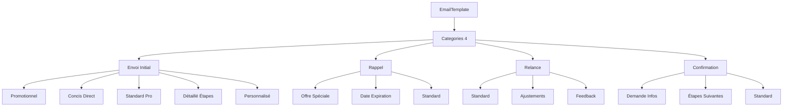

# Module 1.1 : Système EmailTemplate - Modèle et Structure de Données

## 📋 Vue d'ensemble

Le système EmailTemplate constitue le cœur de la gestion des communications par email dans le Dashboard Madinia. Il offre un système flexible de templates avec variables dynamiques, catégorisation avancée et gestion des modèles par défaut pour chaque type d'email.

## 🏗️ Architecture du Modèle EmailTemplate

### Structure de Base

Le modèle `EmailTemplate` est conçu pour gérer de manière sophistiquée les templates d'emails avec un système de catégories hiérarchiques et de variables dynamiques.

```php
<?php

namespace App\Models;

use Illuminate\Database\Eloquent\Model;
use Illuminate\Database\Eloquent\Casts\Attribute;

class EmailTemplate extends Model
{
    protected $fillable = [
        'name',
        'category', 
        'sub_category',
        'subject',
        'body',
        'is_default',
        'is_active',
        'variables',
        'description'
    ];

    protected $casts = [
        'variables' => 'array',
        'is_default' => 'boolean',
        'is_active' => 'boolean',
    ];
}
```

### Champs de la Table

| Champ | Type | Description | Contraintes |
|-------|------|-------------|-------------|
| `id` | ID | Identifiant unique | Primary Key, Auto-increment |
| `name` | String | Nom du modèle | Required, Max 255 |
| `category` | Enum | Catégorie principale | Required, 4 valeurs possibles |
| `sub_category` | Enum | Sous-catégorie spécialisée | Required, 15 valeurs possibles |
| `subject` | String | Sujet de l'email | Required, Max 255 |
| `body` | Text | Corps de l'email avec variables | Required |
| `is_default` | Boolean | Modèle par défaut pour sa catégorie | Default: false |
| `is_active` | Boolean | Statut actif/inactif | Default: true |
| `variables` | JSON | Variables disponibles dans le template | Nullable |
| `description` | Text | Description du modèle | Nullable |

## 🗂️ Système de Catégories et Sous-catégories

### Catégories Principales (4 types)

Le système organise les templates selon **4 catégories principales** correspondant aux phases de communication :

```php
const CATEGORIES = [
    'envoi_initial' => 'Envoi initial de devis',
    'rappel' => 'Rappel de devis', 
    'relance' => 'Relance de devis',
    'confirmation' => 'Confirmation de devis accepté'
];
```

#### 📤 **1. Envoi Initial**
- **Usage** : Premier envoi de devis au client
- **Objectif** : Présenter la proposition de manière professionnelle
- **Tonalité** : Accueillante, professionnelle, personnalisable

#### 🔔 **2. Rappel**
- **Usage** : Rappeler un devis en attente de réponse
- **Objectif** : Relancer en douceur sans être insistant
- **Tonalité** : Courtoise, avec possibilité d'urgence

#### 🚀 **3. Relance**
- **Usage** : Suivi actif pour obtenir une réponse
- **Objectif** : Encourager la décision, proposer des ajustements
- **Tonalité** : Proactive, orientée solution

#### ✅ **4. Confirmation**
- **Usage** : Confirmer l'acceptation d'un devis
- **Objectif** : Rassurer et organiser les prochaines étapes
- **Tonalité** : Enthousiaste, organisationnelle

### Sous-catégories Spécialisées (15 types)

Chaque catégorie se décline en **sous-catégories spécialisées** pour s'adapter aux différents contextes et tonalités :

```php
const SUB_CATEGORIES = [
    // 🎯 ENVOI INITIAL (5 sous-catégories)
    'promotionnel' => 'Promotionnel',
    'concis_direct' => 'Concis et direct', 
    'standard_professionnel' => 'Standard professionnel',
    'detaille_etapes' => 'Détaillé avec étapes',
    'personnalise_chaleureux' => 'Personnalisé et chaleureux',

    // 🔔 RAPPEL (3 sous-catégories)
    'rappel_offre_speciale' => 'Rappel avec offre spéciale',
    'rappel_date_expiration' => 'Rappel avec date d\'expiration',
    'rappel_standard' => 'Rappel standard',

    // 🚀 RELANCE (3 sous-catégories)
    'suivi_standard' => 'Suivi standard',
    'suivi_ajustements' => 'Suivi avec ajustements possibles', 
    'suivi_feedback' => 'Suivi avec demande de feedback',

    // ✅ CONFIRMATION (4 sous-catégories)
    'confirmation_infos' => 'Confirmation avec demande d\'informations',
    'confirmation_etapes' => 'Confirmation avec étapes suivantes',
    'confirmation_standard' => 'Confirmation standard'
];
```

## 🔧 Système de Variables et Remplacement

### Variables Dynamiques

Le système utilise un mécanisme sophistiqué de variables pour personnaliser automatiquement les emails :

```php
// Variables communes disponibles
$variables = [
    'client_nom' => 'Nom du client',
    'entreprise_nom' => 'Nom de l\'entreprise', 
    'devis_numero' => 'Numéro du devis',
    'devis_montant' => 'Montant du devis formaté',
    'devis_validite' => 'Date de validité',
    'devis_date' => 'Date du devis',
    'contact_nom' => 'Nom du contact',
    'contact_email' => 'Email de contact',
    'contact_telephone' => 'Téléphone de contact'
];
```

### Double Format de Variables

Le système supporte **deux formats de variables** pour une flexibilité maximale :

```php
public function processTemplate(array $data = [])
{
    $subject = $this->subject;
    $body = $this->body;

    foreach ($data as $key => $value) {
        // Format double accolades : {{variable}}
        $subject = str_replace("{{{$key}}}", $value, $subject); 
        $body = str_replace("{{{$key}}}", $value, $body);
        
        // Format simple accolades : {variable} 
        $subject = str_replace("{{$key}}", $value, $subject);
        $body = str_replace("{{$key}}", $value, $body);
    }

    return [
        'subject' => $subject,
        'body' => $body
    ];
}
```

### Exemples d'Utilisation

```php
// Template avec variables
$subject = "Devis {{devis_numero}} - {{entreprise_nom}}";
$body = "Bonjour {{client_nom}}, votre devis de {{devis_montant}} est prêt.";

// Données de remplacement
$data = [
    'devis_numero' => 'DV-25-001',
    'entreprise_nom' => 'TechCorp',
    'client_nom' => 'M. Dupont',
    'devis_montant' => '2 500,00 €'
];

// Résultat traité
$processed = $template->processTemplate($data);
// Subject: "Devis DV-25-001 - TechCorp"  
// Body: "Bonjour M. Dupont, votre devis de 2 500,00 € est prêt."
```

## 🎯 Gestion des Templates par Défaut

### Système d'Exclusivité

Chaque catégorie peut avoir **un seul template par défaut** grâce à un système d'exclusivité automatique :

```php
public function setAsDefault()
{
    // Retirer le statut par défaut des autres modèles de la même catégorie
    self::where('category', $this->category)
        ->where('id', '!=', $this->id)
        ->update(['is_default' => false]);

    // Définir ce modèle comme par défaut
    $this->update(['is_default' => true]);
}
```

### Récupération du Template par Défaut

```php
public static function getDefaultForCategory($category)
{
    return self::active()
        ->defaultForCategory($category)
        ->first();
}
```

## 📊 Scopes et Requêtes Optimisées

### Scopes Eloquent

Le modèle propose plusieurs scopes pour des requêtes optimisées :

```php
// Scope pour les modèles actifs
public function scopeActive($query)
{
    return $query->where('is_active', true);
}

// Scope par catégorie
public function scopeByCategory($query, $category)
{
    return $query->where('category', $category);
}

// Scope pour le modèle par défaut d'une catégorie
public function scopeDefaultForCategory($query, $category)
{
    return $query->where('category', $category)
                 ->where('is_default', true);
}
```

### Exemples de Requêtes

```php
// Récupérer tous les templates actifs d'envoi initial
$templates = EmailTemplate::active()
    ->byCategory('envoi_initial')
    ->orderBy('name')
    ->get();

// Récupérer le template par défaut pour les rappels
$defaultTemplate = EmailTemplate::defaultForCategory('rappel');

// Requête avec sous-catégories
$promotionnels = EmailTemplate::active()
    ->where('sub_category', 'promotionnel')
    ->get();
```

## 🏷️ Accessors et Formatage

### Accessors pour Affichage

Le modèle propose des accessors pour un affichage formaté :

```php
// Accessor pour le nom de la catégorie
protected function categoryName(): Attribute
{
    return Attribute::make(
        get: fn () => self::CATEGORIES[$this->category] ?? $this->category,
    );
}

// Accessor pour le nom de la sous-catégorie  
protected function subCategoryName(): Attribute
{
    return Attribute::make(
        get: fn () => self::SUB_CATEGORIES[$this->sub_category] ?? $this->sub_category,
    );
}
```

### Utilisation des Accessors

```php
$template = EmailTemplate::find(1);

echo $template->category;      // "envoi_initial"
echo $template->category_name; // "Envoi initial de devis"

echo $template->sub_category;      // "promotionnel"  
echo $template->sub_category_name; // "Promotionnel"
```

## 🔄 Méthodes Utilitaires

### Récupération des Sous-catégories

```php
public static function getSubCategoriesForCategory($category)
{
    $mapping = [
        'envoi_initial' => [
            'promotionnel', 'concis_direct', 'standard_professionnel',
            'detaille_etapes', 'personnalise_chaleureux'
        ],
        'rappel' => [
            'rappel_offre_speciale', 'rappel_date_expiration', 'rappel_standard'
        ],
        'relance' => [
            'suivi_standard', 'suivi_ajustements', 'suivi_feedback'
        ],
        'confirmation' => [
            'confirmation_infos', 'confirmation_etapes', 'confirmation_standard'
        ]
    ];

    return $mapping[$category] ?? [];
}
```

## 📈 Métriques et Statistiques

### Données du Système

- **4 catégories principales** : Envoi initial, Rappel, Relance, Confirmation
- **15 sous-catégories** : Répartition équilibrée selon les besoins métier
- **Variables illimitées** : Système flexible d'ajout de variables
- **Templates par défaut** : Un par catégorie pour usage automatique
- **Support dual** : Variables simple et double accolades

### Architecture Flexible



## 🎯 Points Forts du Système

### ✅ Avantages

1. **Flexibilité** : 15 sous-catégories pour tous les contextes
2. **Automatisation** : Variables dynamiques avec double format
3. **Cohérence** : Templates par défaut pour chaque catégorie
4. **Performance** : Scopes optimisés et index sur les colonnes critiques
5. **Évolutivité** : Facile d'ajouter de nouvelles catégories/variables
6. **UX** : Accessors pour affichage formaté dans l'interface

### 🔧 Optimisations Techniques

1. **Index DB** : Sur `(category, is_default)` et `(category, sub_category)`
2. **Casts Laravel** : JSON pour variables, Boolean pour flags
3. **Validation** : Rules strictes avec enums pour categories
4. **Scopes** : Requêtes métier optimisées
5. **Accessors** : Affichage formaté sans logique dans les vues

## 📝 Conclusion

Le système EmailTemplate offre une base solide et flexible pour la gestion des communications email. Avec ses 4 catégories principales et 15 sous-catégories, il couvre tous les besoins de communication liés aux devis tout en restant facilement extensible pour d'autres modules (factures, clients, etc.).

L'architecture modulaire et les méthodes métier permettent une utilisation simple tout en conservant la puissance nécessaire pour des cas d'usage complexes. 