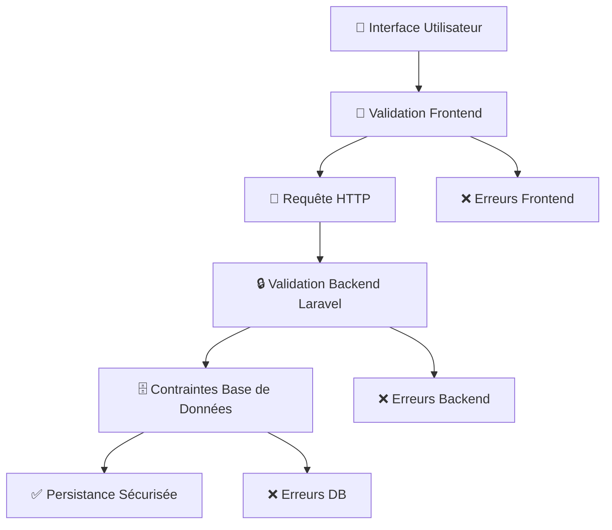

# Module 1.3 : Validation et Contraintes - Système Robuste de Validation EmailTemplate

## 📋 Vue d'ensemble

Le Module 1.3 documente l'ensemble du système de validation et contraintes pour les EmailTemplates, incluant les règles de validation backend Laravel, la validation frontend React, les contraintes de base de données, et la gestion complète des erreurs. Ce système garantit l'intégrité des données et une expérience utilisateur optimale.

## 🛡️ Architecture de Validation

### Validation Multi-Couches

Le système EmailTemplate implémente une **validation multi-couches** pour garantir l'intégrité des données à tous les niveaux :



### Niveaux de Validation

| Niveau | Responsabilité | Technologies | Type d'erreurs |
|--------|---------------|--------------|----------------|
| **Frontend** | UX instantanée, pré-validation | React, TypeScript | Erreurs d'interface |
| **Backend** | Validation métier, sécurité | Laravel Validation | Erreurs logiques |
| **Base de Données** | Intégrité référentielle | MySQL Contraintes | Erreurs structurelles |

## 🎯 Validation Backend Laravel

### Règles de Validation Complètes

Le `EmailTemplateController` utilise un système de validation exhaustif pour les méthodes `store()` et `update()` :

```php
/**
 * Règles de validation pour EmailTemplate
 * Utilisées dans store() et update()
 */
$validated = $request->validate([
    'name' => 'required|string|max:255',
    'category' => ['required', Rule::in(array_keys(EmailTemplate::CATEGORIES))],
    'sub_category' => ['required', Rule::in(array_keys(EmailTemplate::SUB_CATEGORIES))],
    'subject' => 'required|string|max:255',
    'body' => 'required|string',
    'description' => 'nullable|string',
    'is_default' => 'boolean',
    'is_active' => 'boolean',
    'variables' => 'nullable|array'
]);
```

### Détail des Règles Backend

#### Champs Obligatoires

| Champ | Règle | Description | Message d'erreur par défaut |
|-------|-------|-------------|----------------------------|
| `name` | `required\|string\|max:255` | Nom du template unique | "Le champ nom est obligatoire" |
| `category` | `required + Rule::in()` | Catégorie valide parmi 4 possibles | "La catégorie sélectionnée n'est pas valide" |
| `sub_category` | `required + Rule::in()` | Sous-catégorie valide parmi 15 possibles | "La sous-catégorie sélectionnée n'est pas valide" |
| `subject` | `required\|string\|max:255` | Sujet de l'email | "Le champ sujet est obligatoire" |
| `body` | `required\|string` | Corps de l'email avec variables | "Le champ corps est obligatoire" |

#### Champs Optionnels

| Champ | Règle | Description | Valeur par défaut |
|-------|-------|-------------|-------------------|
| `description` | `nullable\|string` | Description du template | `null` |
| `is_default` | `boolean` | Statut par défaut | `false` |
| `is_active` | `boolean` | Statut actif | `true` |
| `variables` | `nullable\|array` | Variables JSON | `null` |

### Validation des Énumérations

#### Validation Catégories Principales

```php
// Validation dynamique des catégories
'category' => ['required', Rule::in(array_keys(EmailTemplate::CATEGORIES))]

// Catégories valides (4 possibilités)
const CATEGORIES = [
    'envoi_initial' => 'Envoi initial de devis',
    'rappel' => 'Rappel de devis', 
    'relance' => 'Relance de devis',
    'confirmation' => 'Confirmation de devis accepté'
];
```

#### Validation Sous-Catégories Spécialisées

```php
// Validation dynamique des sous-catégories  
'sub_category' => ['required', Rule::in(array_keys(EmailTemplate::SUB_CATEGORIES))]

// 15 sous-catégories organisées par catégorie principale
const SUB_CATEGORIES = [
    // Envoi initial (5 sous-catégories)
    'promotionnel' => 'Promotionnel',
    'concis_direct' => 'Concis et direct',
    'standard_professionnel' => 'Standard professionnel',
    'detaille_etapes' => 'Détaillé avec étapes',
    'personnalise_chaleureux' => 'Personnalisé et chaleureux',
    
    // Rappel (3 sous-catégories)
    'rappel_offre_speciale' => 'Rappel avec offre spéciale',
    'rappel_date_expiration' => 'Rappel avec date d\'expiration', 
    'rappel_standard' => 'Rappel standard',
    
    // Relance (3 sous-catégories)
    'suivi_standard' => 'Suivi standard',
    'suivi_ajustements' => 'Suivi avec ajustements possibles',
    'suivi_feedback' => 'Suivi avec demande de feedback',
    
    // Confirmation (4 sous-catégories)
    'confirmation_infos' => 'Confirmation avec demande d\'informations',
    'confirmation_etapes' => 'Confirmation avec étapes suivantes',
    'confirmation_standard' => 'Confirmation standard'
];
```

### Validation des Variables JSON

#### Règles et Contraintes

```php
// Validation flexible du champ variables
'variables' => 'nullable|array'

// Exemples de structures valides
$validVariables = [
    // Array simple de noms de variables
    ['client_nom', 'devis_numero', 'devis_montant'],
    
    // Array avec métadonnées (structure étendue)
    [
        'client_nom' => ['required' => true, 'type' => 'string'],
        'devis_montant' => ['required' => false, 'type' => 'currency'],
        'date_expiration' => ['required' => true, 'type' => 'date']
    ],
    
    // Array vide (aucune variable)
    [],
    
    // Null (pas de contraintes de variables)
    null
];
```

## ⚛️ Validation Frontend React

### Validation en Temps Réel

Les composants `EmailTemplates/Create.tsx` et `EmailTemplates/Edit.tsx` implémentent une validation frontend sophistiquée avec feedback instantané :

#### Structure de Validation Frontend

```typescript
// Types de données avec validation TypeScript
interface EmailTemplateForm {
    name: string;
    category: string;
    sub_category: string;
    subject: string;
    body: string;
    description: string;
    is_default: boolean;
    is_active: boolean;
    variables: string[];
}

// Utilisation de useForm d'Inertia avec validation
const { data, setData, post, processing, errors, reset } = useForm<EmailTemplateForm>({
    name: '',
    category: '',
    sub_category: '',
    subject: '',
    body: '',
    description: '',
    is_default: false,
    is_active: true,
    variables: []
});
```

#### Validation Catégorie-Sous-Catégorie

Le frontend implémente une **validation hiérarchique** garantissant la cohérence entre catégories et sous-catégories :

```typescript
// Mapping des sous-catégories par catégorie  
const subCategoryMapping: Record<string, string[]> = {
    'envoi_initial': [
        'promotionnel', 'concis_direct', 'standard_professionnel', 
        'detaille_etapes', 'personnalise_chaleureux'
    ],
    'rappel': [
        'rappel_offre_speciale', 'rappel_date_expiration', 'rappel_standard'
    ],
    'relance': [
        'suivi_standard', 'suivi_ajustements', 'suivi_feedback'
    ],
    'confirmation': [
        'confirmation_infos', 'confirmation_etapes', 'confirmation_standard'
    ]
};

// Validation automatique lors du changement de catégorie
const handleCategoryChange = (category: string) => {
    setData('category', category);
    setData('sub_category', ''); // Reset sous-catégorie
    
    // Filtrer les sous-catégories disponibles
    const availableSubs = subCategoryMapping[category] || [];
    const filteredSubCategories = Object.fromEntries(
        Object.entries(subCategories).filter(([key]) => 
            availableSubs.includes(key)
        )
    );
    setAvailableSubCategories(filteredSubCategories);
};
```

### Affichage des Erreurs Frontend

#### Gestion des Messages d'Erreur

```tsx
// Pattern de gestion d'erreurs pour chaque champ
<div className="space-y-2">
    <Label htmlFor="name">Nom du modèle *</Label>
    <Input
        id="name"
        value={data.name}
        onChange={(e) => setData('name', e.target.value)}
        placeholder="Nom du modèle..."
        className={errors.name ? "border-destructive" : ""}
    />
    {errors.name && (
        <p className="text-sm text-destructive font-medium">
            {errors.name}
        </p>
    )}
</div>
```

#### États de Validation Visuels

| État | Classe CSS | Indicateur Visuel | Description |
|------|------------|-------------------|-------------|
| **Valide** | `border-green-200` | ✅ Bordure verte | Champ correctement rempli |
| **Erreur** | `border-destructive` | ❌ Bordure rouge | Erreur de validation |
| **Focus** | `ring-primary` | 🔵 Ring bleu | Champ sélectionné |
| **Requis** | `after:content-['*']` | * Rouge | Champ obligatoire |

## 🗄️ Contraintes de Base de Données

### Structure des Contraintes

La migration `create_email_templates_table` définit plusieurs niveaux de contraintes pour garantir l'intégrité des données :

```sql
-- Contraintes de base
CREATE TABLE email_templates (
    id BIGINT UNSIGNED AUTO_INCREMENT PRIMARY KEY,
    name VARCHAR(255) NOT NULL,
    category ENUM('envoi_initial','rappel','relance','confirmation') NOT NULL,
    sub_category ENUM(
        'promotionnel','concis_direct','standard_professionnel',
        'detaille_etapes','personnalise_chaleureux',
        'rappel_offre_speciale','rappel_date_expiration','rappel_standard',
        'suivi_standard','suivi_ajustements','suivi_feedback',
        'confirmation_infos','confirmation_etapes','confirmation_standard'
    ) NOT NULL,
    subject VARCHAR(255) NOT NULL,
    body TEXT NOT NULL,
    is_default BOOLEAN DEFAULT FALSE,
    is_active BOOLEAN DEFAULT TRUE,
    variables JSON NULL,
    description TEXT NULL,
    created_at TIMESTAMP NULL,
    updated_at TIMESTAMP NULL
);
```

### Index de Performance

#### Index Composés Optimisés

```sql
-- Index pour requêtes de templates par défaut
CREATE INDEX idx_category_default ON email_templates(category, is_default);

-- Index pour requêtes de catégorie/sous-catégorie
CREATE INDEX idx_category_subcategory ON email_templates(category, sub_category);
```

#### Performance des Requêtes

| Requête Type | Index Utilisé | Performance | Use Case |
|--------------|---------------|-------------|----------|
| `byCategory()` | `idx_category_default` | 🚀 Très rapide | Filtrage par catégorie |
| `defaultForCategory()` | `idx_category_default` | 🚀 Très rapide | Template par défaut |
| Recherche complète | `idx_category_subcategory` | ⚡ Rapide | Navigation hiérarchique |

### Contraintes d'Intégrité

#### Contraintes ENUM Strictes

```php
// Validation au niveau MySQL - Catégories
CONSTRAINT ENUM category IN (
    'envoi_initial', 'rappel', 'relance', 'confirmation'
)

// Validation au niveau MySQL - Sous-catégories (15 valeurs)
CONSTRAINT ENUM sub_category IN (
    'promotionnel', 'concis_direct', 'standard_professionnel',
    'detaille_etapes', 'personnalise_chaleureux',
    'rappel_offre_speciale', 'rappel_date_expiration', 'rappel_standard',
    'suivi_standard', 'suivi_ajustements', 'suivi_feedback', 
    'confirmation_infos', 'confirmation_etapes', 'confirmation_standard'
)
```

#### Contraintes de Longueur

| Champ | Type MySQL | Contrainte | Validation Laravel |
|-------|------------|------------|-------------------|
| `name` | `VARCHAR(255)` | Max 255 caractères | `max:255` |
| `subject` | `VARCHAR(255)` | Max 255 caractères | `max:255` |
| `body` | `TEXT` | Max ~65KB | `required\|string` |
| `description` | `TEXT` | Max ~65KB | `nullable\|string` |
| `variables` | `JSON` | Format JSON valide | `nullable\|array` |

## 🚨 Gestion Avancée des Erreurs

### Types d'Erreurs et Responses

#### Erreurs de Validation Backend

```php
// Gestion des erreurs dans EmailTemplateController
try {
    $validated = $request->validate([
        'name' => 'required|string|max:255',
        'category' => ['required', Rule::in(array_keys(EmailTemplate::CATEGORIES))],
        // ... autres règles
    ]);
    
    $template = EmailTemplate::create($validated);
    
    return redirect()->route('email-templates.index')
        ->with('success', 'Modèle d\'email créé avec succès.');
        
} catch (ValidationException $e) {
    // Retour automatique avec erreurs
    return back()
        ->withErrors($e->errors())
        ->withInput()
        ->with('error', 'Erreur de validation. Veuillez corriger les champs.');
}
```

#### Messages d'Erreur Personnalisés

```php
// Messages d'erreurs français personnalisés
$customMessages = [
    'name.required' => 'Le nom du modèle est obligatoire.',
    'name.max' => 'Le nom ne peut pas dépasser 255 caractères.',
    'category.required' => 'La catégorie est obligatoire.',
    'category.in' => 'La catégorie sélectionnée n\'est pas valide.',
    'sub_category.required' => 'La sous-catégorie est obligatoire.',
    'sub_category.in' => 'La sous-catégorie sélectionnée n\'est pas valide.',
    'subject.required' => 'Le sujet de l\'email est obligatoire.',
    'subject.max' => 'Le sujet ne peut pas dépasser 255 caractères.',
    'body.required' => 'Le corps de l\'email est obligatoire.',
    'variables.array' => 'Les variables doivent être au format tableau.',
];
```

### Validation de Cohérence Métier

#### Validation Template Par Défaut

Le système vérifie la cohérence lors de la définition d'un template comme par défaut :

```php
/**
 * Validation spéciale pour les templates par défaut
 * Garantit qu'un seul template par catégorie peut être par défaut
 */
public function validateDefaultTemplate(string $category, bool $isDefault): array
{
    $errors = [];
    
    if ($isDefault) {
        // Vérifier s'il existe déjà un template par défaut pour cette catégorie
        $existingDefault = self::where('category', $category)
            ->where('is_default', true)
            ->where('id', '!=', $this->id ?? 0)
            ->first();
            
        if ($existingDefault) {
            $errors['is_default'] = 
                "Un template par défaut existe déjà pour la catégorie '{$category}' : {$existingDefault->name}";
        }
    }
    
    return $errors;
}
```

#### Validation Variables Template

```php
/**
 * Validation avancée des variables dans le corps du template
 * Vérifie la cohérence entre variables déclarées et utilisées
 */
public function validateTemplateVariables(string $body, ?array $declaredVariables): array
{
    $errors = [];
    
    // Extraire toutes les variables du corps du template
    preg_match_all('/\{\{([^}]+)\}\}/', $body, $matches);
    $usedVariables = array_unique($matches[1]);
    
    // Variables utilisées mais non déclarées
    $declaredVariables = $declaredVariables ?? [];
    $undeclaredVars = array_diff($usedVariables, $declaredVariables);
    
    if (!empty($undeclaredVars)) {
        $errors['variables'] = 
            'Variables utilisées mais non déclarées : ' . implode(', ', $undeclaredVars);
    }
    
    // Variables déclarées mais non utilisées (warning, pas erreur)
    $unusedVars = array_diff($declaredVariables, $usedVariables);
    if (!empty($unusedVars)) {
        $errors['variables_warning'] = 
            'Variables déclarées mais non utilisées : ' . implode(', ', $unusedVars);
    }
    
    return $errors;
}
```

## 🔐 Sécurisation et Prévention d'Erreurs

### Protection contre les Injections

#### Sanitisation des Variables

```php
/**
 * Nettoyage sécurisé des variables avant traitement
 * Protection contre XSS et injection de code
 */
public function sanitizeTemplateVariables(array $variables): array
{
    $sanitized = [];
    
    foreach ($variables as $key => $value) {
        // Nettoyage de la clé
        $cleanKey = preg_replace('/[^a-zA-Z0-9_]/', '', $key);
        
        // Nettoyage de la valeur
        if (is_string($value)) {
            $cleanValue = htmlspecialchars($value, ENT_QUOTES, 'UTF-8');
        } else {
            $cleanValue = $value;
        }
        
        $sanitized[$cleanKey] = $cleanValue;
    }
    
    return $sanitized;
}
```

#### Validation des Templates Email

```php
/**
 * Validation de sécurité pour le contenu des templates
 * Prévention des scripts malveillants
 */
public function validateTemplateContent(string $subject, string $body): array
{
    $errors = [];
    
    // Vérifier la présence de balises dangereuses
    $dangerousTags = ['<script>', '<iframe>', '<object>', '<embed>', '<form>'];
    
    foreach ($dangerousTags as $tag) {
        if (stripos($body, $tag) !== false) {
            $errors['body'] = "Balise non autorisée détectée : {$tag}";
            break;
        }
    }
    
    // Vérifier les liens suspects
    if (preg_match('/javascript:/i', $body)) {
        $errors['body'] = 'Les liens JavaScript ne sont pas autorisés.';
    }
    
    return $errors;
}
```

### Tests de Validation

#### Tests Unitaires de Validation

```php
/**
 * Tests complets de validation pour EmailTemplate
 * Couverture de tous les cas d'erreur possibles
 */
class EmailTemplateValidationTest extends TestCase
{
    /** @test */
    public function it_validates_required_fields()
    {
        $response = $this->post(route('email-templates.store'), []);
        
        $response->assertSessionHasErrors([
            'name', 'category', 'sub_category', 'subject', 'body'
        ]);
    }
    
    /** @test */
    public function it_validates_category_enum()
    {
        $response = $this->post(route('email-templates.store'), [
            'name' => 'Test Template',
            'category' => 'invalid_category',
            'sub_category' => 'promotionnel',
            'subject' => 'Test Subject',
            'body' => 'Test Body'
        ]);
        
        $response->assertSessionHasErrors(['category']);
    }
    
    /** @test */
    public function it_validates_sub_category_enum()
    {
        $response = $this->post(route('email-templates.store'), [
            'name' => 'Test Template',
            'category' => 'envoi_initial',
            'sub_category' => 'invalid_sub_category',
            'subject' => 'Test Subject',
            'body' => 'Test Body'
        ]);
        
        $response->assertSessionHasErrors(['sub_category']);
    }
    
    /** @test */
    public function it_validates_string_length_limits()
    {
        $longString = str_repeat('x', 256);
        
        $response = $this->post(route('email-templates.store'), [
            'name' => $longString,
            'category' => 'envoi_initial',
            'sub_category' => 'promotionnel',
            'subject' => $longString,
            'body' => 'Test Body'
        ]);
        
        $response->assertSessionHasErrors(['name', 'subject']);
    }
    
    /** @test */
    public function it_validates_variables_array_format()
    {
        $response = $this->post(route('email-templates.store'), [
            'name' => 'Test Template',
            'category' => 'envoi_initial',
            'sub_category' => 'promotionnel',
            'subject' => 'Test Subject',
            'body' => 'Test Body',
            'variables' => 'not_an_array'
        ]);
        
        $response->assertSessionHasErrors(['variables']);
    }
}
```

## 📊 Métriques et Monitoring

### KPIs de Validation

| Métrique | Description | Seuil Acceptable | Actions si Dépassement |
|----------|-------------|------------------|------------------------|
| **Taux d'erreur validation** | % requêtes avec erreurs | < 5% | Améliorer UX/messages |
| **Temps validation backend** | Durée validation Laravel | < 100ms | Optimiser règles |
| **Erreurs catégorie/sous-catégorie** | Incohérences hiérarchiques | 0% | Revoir logique frontend |
| **Variables manquantes** | Templates avec variables non définies | < 1% | Audit templates existants |

### Logging des Erreurs de Validation

```php
/**
 * Logging avancé des erreurs de validation
 * Permet l'analyse et l'amélioration continue
 */
public function logValidationError(array $errors, array $inputData): void
{
    Log::warning('EmailTemplate validation failed', [
        'errors' => $errors,
        'input' => array_except($inputData, ['body']), // Exclure le body pour éviter les logs trop longs
        'user_id' => Auth::id(),
        'ip' => request()->ip(),
        'user_agent' => request()->userAgent(),
        'timestamp' => now()->toISOString(),
        'route' => request()->route()->getName()
    ]);
}
```

## 🎯 Résumé des Bonnes Pratiques

### Validation Frontend
- ✅ **Validation en temps réel** avec feedback instantané
- ✅ **Cohérence hiérarchique** catégorie/sous-catégorie automatique
- ✅ **Messages d'erreur clairs** en français
- ✅ **Indicateurs visuels** pour tous les états de validation

### Validation Backend  
- ✅ **Règles exhaustives** couvrant tous les champs
- ✅ **Validation enum stricte** avec Rule::in()
- ✅ **Gestion d'erreurs robuste** avec try/catch
- ✅ **Messages personnalisés** pour une meilleure UX

### Contraintes Base de Données
- ✅ **ENUM contraints** pour catégories et sous-catégories
- ✅ **Index optimisés** pour les requêtes fréquentes
- ✅ **Contraintes de longueur** appropriées
- ✅ **Support JSON natif** pour les variables

### Sécurité et Robustesse
- ✅ **Sanitisation** des variables utilisateur
- ✅ **Protection XSS** dans les templates
- ✅ **Validation métier** pour la cohérence
- ✅ **Tests unitaires** complets pour tous les cas

---

**Architecture Finale** : Un système de validation **multi-couches robuste** garantissant l'intégrité des données EmailTemplate à tous les niveaux, de l'interface utilisateur jusqu'à la base de données, avec une sécurité renforcée et une expérience utilisateur optimale.