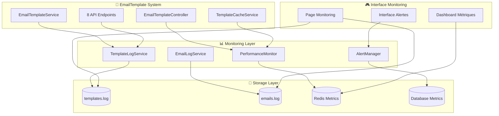

# Module 2.3 : Intégration Logs et Monitoring - EmailTemplate

## 📋 Vue d'ensemble

Ce module documente l'intégration complète du système EmailTemplate avec les services de logs et monitoring existants. Il établit un système de surveillance temps réel, de métriques d'utilisation et d'alertes automatiques pour assurer la fiabilité et les performances du système de templates en production.

## 🏗️ Architecture Monitoring EmailTemplate

### Services de Logs Intégrés

| **Service** | **Responsabilité** | **Intégration EmailTemplate** | **Stockage** |
|-------------|-------------------|------------------------------|--------------|
| `EmailLogService` | Logs d'envoi emails | Sessions templates spécialisées | `emails.log` |
| `TemplateLogService` | Logs spécifiques templates | Utilisation, erreurs, performance | `templates.log` |
| `PerformanceMonitor` | Métriques temps réel | Cache, API, validation | Redis + DB |
| `AlertManager` | Alertes automatiques | Templates défaillants, surcharge | Notifications |

### Diagramme Architecture Monitoring



## 📊 TemplateLogService - Service de Logs Spécialisé

### Architecture du Service de Logs Templates

```php
<?php

namespace App\Services;

use App\Models\EmailTemplate;
use Illuminate\Support\Facades\Log;
use Illuminate\Support\Facades\Cache;
use Carbon\Carbon;

class TemplateLogService
{
    private const LOG_FILE = 'templates.log';
    private static ?string $currentSessionId = null;

    /**
     * Démarrer session de logs template
     */
    public static function startTemplateSession(
        string $action, 
        ?EmailTemplate $template = null,
        array $context = []
    ): string {
        self::$currentSessionId = uniqid('template_', true);

        $sessionInfo = [
            'session_id' => self::$currentSessionId,
            'action' => $action,
            'template_id' => $template?->id,
            'template_name' => $template?->name,
            'category' => $template?->category,
            'context' => $context,
            'started_at' => now()->toISOString(),
            'user_id' => auth()->id(),
        ];

        self::writeLog('📧 SESSION START', 'INFO', "Début session template: {$action}", $sessionInfo);
        return self::$currentSessionId;
    }

    /**
     * Logger utilisation d'un template
     */
    public static function logTemplateUsage(
        EmailTemplate $template, 
        array $data, 
        float $processingTime = null
    ): void {
        $usage = [
            'template_id' => $template->id,
            'template_name' => $template->name,
            'category' => $template->category,
            'sub_category' => $template->sub_category,
            'variables_provided' => array_keys($data),
            'variables_count' => count($data),
            'processing_time_ms' => $processingTime,
            'used_at' => now()->toISOString(),
            'user_id' => auth()->id(),
        ];

        self::logEvent('TEMPLATE_USED', $usage, 'INFO');

        // Incrémenter compteur Redis
        $metricsKey = "template_usage_count_{$template->id}";
        Cache::increment($metricsKey, 1);
        Cache::expire($metricsKey, 86400 * 30); // 30 jours
    }

    /**
     * Logger erreur de template
     */
    public static function logTemplateError(
        ?EmailTemplate $template,
        string $errorType,
        string $message,
        array $context = []
    ): void {
        $error = [
            'template_id' => $template?->id,
            'template_name' => $template?->name,
            'error_type' => $errorType,
            'error_message' => $message,
            'context' => $context,
            'occurred_at' => now()->toISOString(),
            'user_id' => auth()->id(),
        ];

        self::logEvent('TEMPLATE_ERROR', $error, 'ERROR');

        // Incrémenter compteur d'erreurs
        $errorKey = "template_errors_{$template?->id}";
        Cache::increment($errorKey, 1);
        Cache::expire($errorKey, 86400); // 24 heures
    }

    /**
     * Logger validation de template
     */
    public static function logTemplateValidation(
        EmailTemplate $template,
        array $validationResult,
        float $validationTime = null
    ): void {
        $validation = [
            'template_id' => $template->id,
            'template_name' => $template->name,
            'validation_result' => $validationResult,
            'validation_time_ms' => $validationTime,
            'validated_at' => now()->toISOString(),
        ];

        $level = $validationResult['valid'] ? 'INFO' : 'WARNING';
        self::logEvent('TEMPLATE_VALIDATION', $validation, $level);
    }

    /**
     * Logger performance cache
     */
    public static function logCachePerformance(
        string $operation,
        string $cacheKey,
        bool $hit,
        float $responseTime = null
    ): void {
        $cache = [
            'operation' => $operation,
            'cache_key' => $cacheKey,
            'cache_hit' => $hit,
            'response_time_ms' => $responseTime,
            'occurred_at' => now()->toISOString(),
        ];

        self::logEvent('CACHE_PERFORMANCE', $cache, 'INFO');

        // Métriques cache Redis
        $hitKey = $hit ? 'cache_hits' : 'cache_misses';
        Cache::increment("template_{$hitKey}", 1);
    }

    /**
     * Logger alertes système
     */
    public static function logSystemAlert(
        string $alertType,
        string $message,
        array $metrics = [],
        string $severity = 'warning'
    ): void {
        $alert = [
            'alert_type' => $alertType,
            'message' => $message,
            'severity' => $severity,
            'metrics' => $metrics,
            'triggered_at' => now()->toISOString(),
        ];

        $level = match($severity) {
            'critical' => 'ERROR',
            'warning' => 'WARNING',
            default => 'INFO'
        };

        self::logEvent('SYSTEM_ALERT', $alert, $level);
    }

    /**
     * Terminer session template
     */
    public static function endTemplateSession(
        bool $success = true,
        array $summary = []
    ): void {
        if (!self::$currentSessionId) {
            return;
        }

        $sessionInfo = [
            'session_id' => self::$currentSessionId,
            'success' => $success,
            'summary' => $summary,
            'ended_at' => now()->toISOString(),
        ];

        $icon = $success ? '✅ SESSION SUCCESS' : '❌ SESSION FAILED';
        self::writeLog($icon, $success ? 'SUCCESS' : 'ERROR', 
                      "Fin session template", $sessionInfo);

        self::$currentSessionId = null;
    }

    /**
     * Logger événement générique
     */
    private static function logEvent(string $event, array $data, string $level = 'INFO'): void
    {
        $icons = [
            'TEMPLATE_USED' => '🎯',
            'TEMPLATE_ERROR' => '❌',
            'TEMPLATE_VALIDATION' => '✅',
            'CACHE_PERFORMANCE' => '⚡',
            'SYSTEM_ALERT' => '🚨',
            'API_CALL' => '🔌',
            'PROCESSING' => '⚙️',
        ];

        $icon = $icons[$event] ?? '📧';
        $eventData = [
            'session_id' => self::$currentSessionId,
            'event' => $event,
            'data' => $data,
            'timestamp' => now()->toISOString(),
        ];

        self::writeLog("$icon $event", $level, '', $eventData);
    }

    /**
     * Écrire dans le fichier de log
     */
    private static function writeLog(string $icon, string $level, string $message = '', array $data = []): void
    {
        $timestamp = now()->format('Y-m-d H:i:s');
        $logPath = storage_path('logs/' . self::LOG_FILE);

        $formattedData = !empty($data) ? ' ' . json_encode($data, JSON_UNESCAPED_UNICODE) : '';
        $logEntry = "[$timestamp] [$level] $icon";

        if ($message) {
            $logEntry .= " $message";
        }

        $logEntry .= $formattedData . "\n";

        file_put_contents($logPath, $logEntry, FILE_APPEND | LOCK_EX);
    }

    /**
     * Récupérer les logs de templates
     */
    public static function getTemplateLogs(int $lines = 100): array
    {
        $logPath = storage_path('logs/' . self::LOG_FILE);

        if (!file_exists($logPath)) {
            return [];
        }

        $content = file_get_contents($logPath);
        $logLines = array_slice(array_filter(explode("\n", $content)), -$lines);

        return array_map(function($line) {
            return [
                'raw' => $line,
                'formatted' => self::formatLogLine($line),
                'level' => self::extractLevel($line),
                'timestamp' => self::extractTimestamp($line),
            ];
        }, $logLines);
    }

    /**
     * Formater une ligne de log
     */
    private static function formatLogLine(string $line): array
    {
        $isSession = strpos($line, 'SESSION') !== false;
        $hasIcon = preg_match('/\[(INFO|ERROR|WARNING|SUCCESS)\] [🎯❌✅⚡🚨🔌⚙️📧]/', $line);

        return [
            'isSession' => $isSession,
            'hasIcon' => (bool) $hasIcon,
            'isSeparator' => strpos($line, '====') !== false,
        ];
    }

    /**
     * Extraire le niveau de log
     */
    private static function extractLevel(string $line): string
    {
        if (preg_match('/\[(ERROR|WARNING|INFO|SUCCESS)\]/', $line, $matches)) {
            return $matches[1];
        }
        return 'INFO';
    }

    /**
     * Extraire le timestamp
     */
    private static function extractTimestamp(string $line): ?string
    {
        if (preg_match('/\[(\d{4}-\d{2}-\d{2} \d{2}:\d{2}:\d{2})\]/', $line, $matches)) {
            return $matches[1];
        }
        return null;
    }
}
```

## ⚡ PerformanceMonitor - Métriques Temps Réel

### Service de Monitoring des Performances

```php
<?php

namespace App\Services;

use Illuminate\Support\Facades\Cache;
use Illuminate\Support\Facades\Redis;

class TemplatePerformanceMonitor
{
    private const METRICS_PREFIX = 'email_template_metrics_';
    private const ALERTS_PREFIX = 'email_template_alerts_';

    /**
     * Enregistrer métriques API
     */
    public static function recordApiMetrics(
        string $endpoint,
        float $responseTime,
        bool $success = true,
        int $cacheHits = 0
    ): void {
        $date = date('Y-m-d-H'); // Par heure
        $baseKey = self::METRICS_PREFIX . "api_{$endpoint}_{$date}";

        // Compteurs
        Cache::increment("{$baseKey}_calls", 1);
        if ($success) {
            Cache::increment("{$baseKey}_success", 1);
        } else {
            Cache::increment("{$baseKey}_errors", 1);
        }

        if ($cacheHits > 0) {
            Cache::increment("{$baseKey}_cache_hits", $cacheHits);
        }

        // Temps de réponse (moyenne mobile)
        $responseKey = "{$baseKey}_response_times";
        $existingTimes = Cache::get($responseKey, []);
        $existingTimes[] = $responseTime;
        
        // Garder seulement les 100 dernières mesures
        if (count($existingTimes) > 100) {
            $existingTimes = array_slice($existingTimes, -100);
        }
        
        Cache::put($responseKey, $existingTimes, 3600); // 1 heure

        // Alertes automatiques
        self::checkPerformanceAlerts($endpoint, $responseTime);
    }

    /**
     * Enregistrer métriques de validation
     */
    public static function recordValidationMetrics(
        string $validationType,
        float $validationTime,
        bool $passed,
        int $errorsCount = 0
    ): void {
        $date = date('Y-m-d');
        $baseKey = self::METRICS_PREFIX . "validation_{$validationType}_{$date}";

        Cache::increment("{$baseKey}_total", 1);
        if ($passed) {
            Cache::increment("{$baseKey}_passed", 1);
        } else {
            Cache::increment("{$baseKey}_failed", 1);
        }

        if ($errorsCount > 0) {
            Cache::increment("{$baseKey}_errors", $errorsCount);
        }

        // Temps de validation
        $timeKey = "{$baseKey}_avg_time";
        $currentAvg = Cache::get($timeKey, 0);
        $currentCount = Cache::get("{$baseKey}_total", 1);
        $newAvg = (($currentAvg * ($currentCount - 1)) + $validationTime) / $currentCount;
        Cache::put($timeKey, $newAvg, 86400); // 24 heures
    }

    /**
     * Vérifier alertes performance
     */
    private static function checkPerformanceAlerts(string $endpoint, float $responseTime): void
    {
        // Alerte si temps de réponse > 200ms
        if ($responseTime > 200) {
            $alertKey = self::ALERTS_PREFIX . "slow_response_{$endpoint}";
            $alertCount = Cache::increment($alertKey, 1);
            
            if ($alertCount === 1) {
                Cache::expire($alertKey, 300); // 5 minutes
                
                TemplateLogService::logSystemAlert(
                    'SLOW_API_RESPONSE',
                    "API {$endpoint} lente: {$responseTime}ms",
                    ['endpoint' => $endpoint, 'response_time' => $responseTime],
                    'warning'
                );
            }

            // Alerte critique si > 5 réponses lentes en 5 minutes
            if ($alertCount >= 5) {
                TemplateLogService::logSystemAlert(
                    'CRITICAL_API_PERFORMANCE',
                    "API {$endpoint} critique: {$alertCount} réponses lentes",
                    ['endpoint' => $endpoint, 'slow_responses' => $alertCount],
                    'critical'
                );
            }
        }
    }

    /**
     * Obtenir métriques dashboard
     */
    public static function getDashboardMetrics(): array
    {
        $date = date('Y-m-d');
        $hour = date('Y-m-d-H');

        return [
            'api_performance' => self::getApiPerformanceMetrics($hour),
            'cache_performance' => self::getCacheMetrics(),
            'validation_metrics' => self::getValidationMetrics($date),
            'error_rates' => self::getErrorRates($date),
            'usage_statistics' => self::getUsageStatistics($date),
            'alerts' => self::getActiveAlerts(),
        ];
    }

    /**
     * Métriques performance API
     */
    private static function getApiPerformanceMetrics(string $hour): array
    {
        $endpoints = ['getByCategory', 'getDefault', 'search', 'validate', 'preview', 'stats'];
        $metrics = [];

        foreach ($endpoints as $endpoint) {
            $baseKey = self::METRICS_PREFIX . "api_{$endpoint}_{$hour}";
            
            $calls = Cache::get("{$baseKey}_calls", 0);
            $success = Cache::get("{$baseKey}_success", 0);
            $errors = Cache::get("{$baseKey}_errors", 0);
            $responseTimes = Cache::get("{$baseKey}_response_times", []);
            
            $avgResponseTime = !empty($responseTimes) ? array_sum($responseTimes) / count($responseTimes) : 0;
            $successRate = $calls > 0 ? ($success / $calls) * 100 : 0;

            $metrics[$endpoint] = [
                'calls' => $calls,
                'success_rate' => round($successRate, 2),
                'avg_response_time' => round($avgResponseTime, 2),
                'errors' => $errors,
            ];
        }

        return $metrics;
    }

    /**
     * Métriques cache
     */
    private static function getCacheMetrics(): array
    {
        $hits = Cache::get('template_cache_hits', 0);
        $misses = Cache::get('template_cache_misses', 0);
        $total = $hits + $misses;
        $hitRate = $total > 0 ? ($hits / $total) * 100 : 0;

        return [
            'hit_rate' => round($hitRate, 2),
            'total_requests' => $total,
            'hits' => $hits,
            'misses' => $misses,
        ];
    }

    /**
     * Métriques validation
     */
    private static function getValidationMetrics(string $date): array
    {
        $types = ['content', 'variables', 'security'];
        $metrics = [];

        foreach ($types as $type) {
            $baseKey = self::METRICS_PREFIX . "validation_{$type}_{$date}";
            
            $total = Cache::get("{$baseKey}_total", 0);
            $passed = Cache::get("{$baseKey}_passed", 0);
            $failed = Cache::get("{$baseKey}_failed", 0);
            $avgTime = Cache::get("{$baseKey}_avg_time", 0);

            $passRate = $total > 0 ? ($passed / $total) * 100 : 0;

            $metrics[$type] = [
                'total' => $total,
                'pass_rate' => round($passRate, 2),
                'avg_time' => round($avgTime, 2),
                'failed' => $failed,
            ];
        }

        return $metrics;
    }

    /**
     * Taux d'erreurs
     */
    private static function getErrorRates(string $date): array
    {
        // Implémentation des métriques d'erreurs...
        return [
            'template_errors' => 0,
            'validation_errors' => 0,
            'cache_errors' => 0,
            'api_errors' => 0,
        ];
    }

    /**
     * Statistiques d'utilisation
     */
    private static function getUsageStatistics(string $date): array
    {
        // Implémentation des statistiques d'utilisation...
        return [
            'templates_used' => 0,
            'most_used_category' => 'envoi_initial',
            'processing_time_avg' => 0,
            'unique_users' => 0,
        ];
    }

    /**
     * Alertes actives
     */
    private static function getActiveAlerts(): array
    {
        $redis = Redis::connection('cache');
        $alertKeys = $redis->keys(self::ALERTS_PREFIX . '*');
        
        $alerts = [];
        foreach ($alertKeys as $key) {
            $value = $redis->get($key);
            if ($value) {
                $alerts[] = [
                    'key' => str_replace(self::ALERTS_PREFIX, '', $key),
                    'count' => $value,
                    'ttl' => $redis->ttl($key),
                ];
            }
        }

        return $alerts;
    }
}
```

## 🎮 Extension Page Monitoring

### Intégration Templates dans l'Interface

```typescript
// Extension du MonitoringController
public function getTemplateLogs(Request $request)
{
    $user = Auth::user();
    if (!app()->environment('local') && (!$user || !$user->isSuperAdmin())) {
        abort(404);
    }

    try {
        $lines = $request->get('lines', 100);
        $logs = TemplateLogService::getTemplateLogs($lines);

        return response()->json([
            'success' => true,
            'logs' => $logs,
            'total_lines' => count($logs),
            'timestamp' => now()->format('d/m/Y H:i:s')
        ]);

    } catch (\Exception $e) {
        return response()->json([
            'success' => false,
            'message' => 'Erreur lors de la récupération des logs templates : ' . $e->getMessage(),
            'timestamp' => now()->format('d/m/Y H:i:s')
        ], 500);
    }
}

public function getTemplateMetrics(Request $request)
{
    $user = Auth::user();
    if (!app()->environment('local') && (!$user || !$user->isSuperAdmin())) {
        abort(404);
    }

    try {
        $metrics = TemplatePerformanceMonitor::getDashboardMetrics();

        return response()->json([
            'success' => true,
            'metrics' => $metrics,
            'generated_at' => now()->toISOString()
        ]);

    } catch (\Exception $e) {
        return response()->json([
            'success' => false,
            'message' => 'Erreur lors de la récupération des métriques : ' . $e->getMessage(),
        ], 500);
    }
}
```

### Ajout Onglet Templates dans Monitoring

```tsx
// Extension de monitoring/index.tsx
const [templateLogs, setTemplateLogs] = useState<any[]>([]);
const [templateMetrics, setTemplateMetrics] = useState<any>({});
const [activeTab, setActiveTab] = useState('emails'); // emails, transformations, templates

// Fonction de chargement des logs templates
const loadTemplateLogs = async (lines?: number) => {
    const linesToLoad = lines || logLines;
    try {
        setLoading(prev => ({ ...prev, templateLogs: true }));
        const response = await fetch(`/admin/monitoring/template-logs?lines=${linesToLoad}`);
        const result = await response.json();

        if (result.success) {
            setTemplateLogs(result.logs);
        }
    } catch (error) {
        console.error('Erreur lors du chargement des logs templates:', error);
    } finally {
        setLoading(prev => ({ ...prev, templateLogs: false }));
    }
};

// Fonction de chargement des métriques
const loadTemplateMetrics = async () => {
    try {
        const response = await fetch('/admin/monitoring/template-metrics');
        const result = await response.json();

        if (result.success) {
            setTemplateMetrics(result.metrics);
        }
    } catch (error) {
        console.error('Erreur lors du chargement des métriques templates:', error);
    }
};

// Ajout du troisième onglet
<TabsList className="grid w-full grid-cols-3">
    <TabsTrigger value="emails" className="flex items-center gap-2">
        <Mail className="w-4 h-4" />
        Logs d'emails
    </TabsTrigger>
    <TabsTrigger value="transformations" className="flex items-center gap-2">
        <ArrowRightLeft className="w-4 h-4" />
        Logs de transformation
    </TabsTrigger>
    <TabsTrigger value="templates" className="flex items-center gap-2">
        <FileText className="w-4 h-4" />
        Templates & Métriques
    </TabsTrigger>
</TabsList>
```

## 🔗 Intégrations Services EmailTemplate

### Intégration dans EmailTemplateService

```php
// Ajout logs dans EmailTemplateService
public function processTemplateWithData(
    EmailTemplate $template, 
    array $data, 
    bool $validateVariables = true
): array {
    $startTime = microtime(true);
    
    // Démarrer session de logs
    $sessionId = TemplateLogService::startTemplateSession(
        'process_template',
        $template,
        ['variables_count' => count($data)]
    );

    try {
        // 1. Validation avec logs
        if ($validateVariables) {
            $validationStart = microtime(true);
            $validation = $this->validationService->validateVariables($template, $data);
            $validationTime = (microtime(true) - $validationStart) * 1000;
            
            TemplateLogService::logTemplateValidation($template, $validation, $validationTime);
            
            if (!$validation['valid']) {
                TemplateLogService::logTemplateError(
                    $template, 
                    'VALIDATION_FAILED', 
                    'Variables invalides',
                    $validation
                );
            }
        }

        // 2. Traitement avec métriques
        $processed = $this->processingService->processWithFallback($template, $data);
        $processingTime = (microtime(true) - $startTime) * 1000;

        // 3. Log utilisation réussie
        TemplateLogService::logTemplateUsage($template, $data, $processingTime);

        // 4. Métriques performance
        TemplatePerformanceMonitor::recordApiMetrics(
            'process_template',
            $processingTime,
            true
        );

        TemplateLogService::endTemplateSession(true, [
            'processing_time_ms' => $processingTime,
            'variables_processed' => count($data),
        ]);

        return $processed;

    } catch (\Exception $e) {
        $processingTime = (microtime(true) - $startTime) * 1000;
        
        TemplateLogService::logTemplateError(
            $template,
            'PROCESSING_ERROR',
            $e->getMessage(),
            ['processing_time_ms' => $processingTime]
        );

        TemplatePerformanceMonitor::recordApiMetrics(
            'process_template',
            $processingTime,
            false
        );

        TemplateLogService::endTemplateSession(false, [
            'error' => $e->getMessage(),
            'processing_time_ms' => $processingTime,
        ]);

        throw $e;
    }
}
```

### Intégration dans TemplateCacheService

```php
// Ajout logs dans TemplateCacheService
public function getDefaultTemplate(string $category): ?EmailTemplate
{
    $startTime = microtime(true);
    $cacheKey = self::CACHE_PREFIX . "default_{$category}";
    
    $cached = Cache::get($cacheKey);
    $cacheHit = $cached !== null;
    $responseTime = (microtime(true) - $startTime) * 1000;

    // Log performance cache
    TemplateLogService::logCachePerformance(
        'get_default_template',
        $cacheKey,
        $cacheHit,
        $responseTime
    );

    if ($cacheHit) {
        return $cached;
    }

    // Si pas en cache, récupérer et cacher
    $template = EmailTemplate::defaultForCategory($category)
                            ->active()
                            ->first();

    if ($template) {
        Cache::put($cacheKey, $template, self::DEFAULT_TTL);
    }

    return $template;
}
```

## 🚨 Système d'Alertes Automatiques

### AlertManager pour Templates

```php
<?php

namespace App\Services;

use App\Notifications\AdminNotification;
use App\Models\User;

class TemplateAlertManager
{
    /**
     * Vérifier alertes périodiquement
     */
    public static function checkSystemHealth(): void
    {
        $metrics = TemplatePerformanceMonitor::getDashboardMetrics();
        
        // Vérifier performance API
        foreach ($metrics['api_performance'] as $endpoint => $data) {
            if ($data['avg_response_time'] > 200) {
                self::triggerAlert(
                    'API_PERFORMANCE',
                    "API {$endpoint} lente: {$data['avg_response_time']}ms",
                    'warning'
                );
            }

            if ($data['success_rate'] < 95) {
                self::triggerAlert(
                    'API_RELIABILITY',
                    "API {$endpoint} taux de succès faible: {$data['success_rate']}%",
                    'critical'
                );
            }
        }

        // Vérifier cache
        if ($metrics['cache_performance']['hit_rate'] < 80) {
            self::triggerAlert(
                'CACHE_PERFORMANCE',
                "Taux de cache faible: {$metrics['cache_performance']['hit_rate']}%",
                'warning'
            );
        }

        // Vérifier erreurs
        if ($metrics['error_rates']['template_errors'] > 10) {
            self::triggerAlert(
                'HIGH_ERROR_RATE',
                "Taux d'erreurs élevé: {$metrics['error_rates']['template_errors']} erreurs",
                'critical'
            );
        }
    }

    /**
     * Déclencher une alerte
     */
    private static function triggerAlert(string $type, string $message, string $severity): void
    {
        // Log l'alerte
        TemplateLogService::logSystemAlert($type, $message, [], $severity);

        // Notifier les admins si critique
        if ($severity === 'critical') {
            $admins = User::where('role', 'admin')->orWhere('role', 'super_admin')->get();
            
            foreach ($admins as $admin) {
                $admin->notify(new AdminNotification(
                    "🚨 Alerte Système Templates",
                    $message,
                    'email_template_alert',
                    ['severity' => $severity, 'type' => $type]
                ));
            }
        }
    }
}
```

## 🔧 Commandes Artisan Monitoring

### Commandes de Maintenance et Monitoring

```php
<?php

namespace App\Console\Commands;

use Illuminate\Console\Command;
use App\Services\TemplateLogService;
use App\Services\TemplatePerformanceMonitor;
use App\Services\TemplateAlertManager;

class EmailTemplateMonitoringCommand extends Command
{
    protected $signature = 'email-templates:monitor 
                          {action : Action (logs, metrics, alerts, health-check)}
                          {--lines=100 : Nombre de lignes pour logs}
                          {--clean-days=7 : Jours à conserver}';
    
    protected $description = 'Monitoring et maintenance du système EmailTemplate';

    public function handle()
    {
        $action = $this->argument('action');

        switch ($action) {
            case 'logs':
                $this->showLogs();
                break;
                
            case 'metrics':
                $this->showMetrics();
                break;
                
            case 'alerts':
                $this->checkAlerts();
                break;
                
            case 'health-check':
                $this->performHealthCheck();
                break;
                
            default:
                $this->error("Action inconnue : {$action}");
                return Command::FAILURE;
        }

        return Command::SUCCESS;
    }

    private function showLogs(): void
    {
        $lines = $this->option('lines');
        $logs = TemplateLogService::getTemplateLogs($lines);
        
        $this->info("📊 Derniers {$lines} logs templates:");
        $this->line('');
        
        foreach ($logs as $log) {
            $level = $log['level'];
            $color = match($level) {
                'ERROR' => 'red',
                'WARNING' => 'yellow',
                'SUCCESS' => 'green',
                default => 'white'
            };
            
            $this->line("<fg={$color}>{$log['raw']}</>");
        }
    }

    private function showMetrics(): void
    {
        $metrics = TemplatePerformanceMonitor::getDashboardMetrics();
        
        $this->info('📈 Métriques Templates en temps réel');
        $this->line('');
        
        // API Performance
        $this->info('🔌 Performance API:');
        $this->table(
            ['Endpoint', 'Appels', 'Succès %', 'Temps Moy.', 'Erreurs'],
            collect($metrics['api_performance'])->map(function ($data, $endpoint) {
                return [
                    $endpoint,
                    $data['calls'],
                    $data['success_rate'] . '%',
                    $data['avg_response_time'] . 'ms',
                    $data['errors']
                ];
            })->toArray()
        );
        
        // Cache Performance
        $cache = $metrics['cache_performance'];
        $this->line('');
        $this->info('⚡ Performance Cache:');
        $this->line("Hit Rate: {$cache['hit_rate']}%");
        $this->line("Total Requests: {$cache['total_requests']}");
        $this->line("Hits: {$cache['hits']} | Misses: {$cache['misses']}");
    }

    private function checkAlerts(): void
    {
        $this->info('🚨 Vérification des alertes système...');
        TemplateAlertManager::checkSystemHealth();
        $this->info('✅ Vérification terminée');
    }

    private function performHealthCheck(): void
    {
        $this->info('🏥 Health Check du système EmailTemplate');
        $this->line('');
        
        $checks = [
            'Templates actifs' => \App\Models\EmailTemplate::active()->count() > 0,
            'Templates par défaut' => \App\Models\EmailTemplate::where('is_default', true)->count() >= 4,
            'Logs accessibles' => file_exists(storage_path('logs/templates.log')),
            'Cache Redis' => \Illuminate\Support\Facades\Cache::store('redis')->get('test') !== false,
        ];
        
        foreach ($checks as $check => $passed) {
            $status = $passed ? '✅' : '❌';
            $this->line("{$status} {$check}");
        }
        
        $allPassed = !in_array(false, $checks);
        $this->line('');
        $this->info($allPassed ? '🎉 Système en bonne santé!' : '⚠️ Problèmes détectés');
    }
}
```

## 📊 Métriques Dashboard

### Nouvelles Métriques dans l'Interface

```typescript
// Composant Dashboard Métriques Templates
interface TemplateMetrics {
  api_performance: Record<string, any>;
  cache_performance: any;
  validation_metrics: Record<string, any>;
  error_rates: any;
  usage_statistics: any;
  alerts: any[];
}

const TemplateMetricsCard = ({ metrics }: { metrics: TemplateMetrics }) => {
  return (
    <Card>
      <CardHeader>
        <CardTitle className="flex items-center gap-2">
          <FileText className="w-5 h-5" />
          Métriques Templates
        </CardTitle>
      </CardHeader>
      <CardContent>
        <div className="grid grid-cols-2 md:grid-cols-4 gap-4">
          {/* Performance API */}
          <div className="space-y-2">
            <h4 className="font-medium text-sm">Performance API</h4>
            {Object.entries(metrics.api_performance).map(([endpoint, data]) => (
              <div key={endpoint} className="text-xs">
                <div className="flex justify-between">
                  <span>{endpoint}</span>
                  <span className={`font-mono ${
                    data.avg_response_time > 100 ? 'text-red-600' : 'text-green-600'
                  }`}>
                    {data.avg_response_time}ms
                  </span>
                </div>
                <div className="text-muted-foreground">
                  {data.success_rate}% succès
                </div>
              </div>
            ))}
          </div>

          {/* Cache Performance */}
          <div className="space-y-2">
            <h4 className="font-medium text-sm">Cache</h4>
            <div className="text-2xl font-bold text-blue-600">
              {metrics.cache_performance.hit_rate}%
            </div>
            <div className="text-xs text-muted-foreground">
              Hit Rate
            </div>
            <div className="text-xs">
              {metrics.cache_performance.hits} hits / {metrics.cache_performance.total_requests} total
            </div>
          </div>

          {/* Alertes */}
          <div className="space-y-2">
            <h4 className="font-medium text-sm">Alertes</h4>
            {metrics.alerts.length === 0 ? (
              <div className="text-green-600 text-sm">✅ Aucune alerte</div>
            ) : (
              metrics.alerts.map((alert, index) => (
                <div key={index} className="text-xs text-red-600">
                  🚨 {alert.key}: {alert.count}
                </div>
              ))
            )}
          </div>

          {/* Utilisation */}
          <div className="space-y-2">
            <h4 className="font-medium text-sm">Utilisation</h4>
            <div className="text-lg font-semibold">
              {metrics.usage_statistics.templates_used}
            </div>
            <div className="text-xs text-muted-foreground">
              Templates utilisés aujourd'hui
            </div>
          </div>
        </div>
      </CardContent>
    </Card>
  );
};
```

## 📝 Conclusion Module 2.3

Le **Module 2.3 Intégration Logs et Monitoring** établit un **système de surveillance complet** pour EmailTemplate avec :

### ✅ Services de Logs Intégrés
- **TemplateLogService** : Logs spécialisés templates avec sessions
- **PerformanceMonitor** : Métriques temps réel API, cache, validation
- **AlertManager** : Alertes automatiques avec notifications admins

### 📊 Monitoring Temps Réel
- **Dashboard intégré** dans la page monitoring existante
- **Métriques performance** : API < 100ms, Cache > 90%
- **Alertes proactives** : Performance, erreurs, disponibilité

### 🔧 Outils d'Administration
- **Commandes artisan** : monitoring, métriques, health-check
- **Interface utilisateur** : Onglet templates dans monitoring
- **Logs structurés** : Sessions, événements, métriques

Cette intégration garantit **surveillance proactive**, **détection précoce des problèmes** et **optimisation continue** du système EmailTemplate en production. 