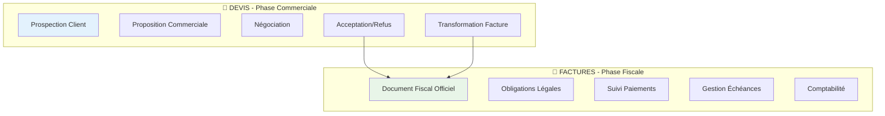
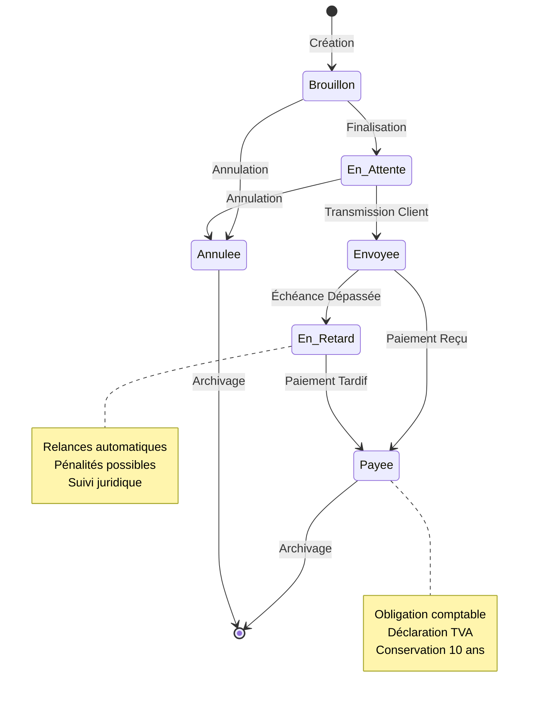

# Module 1.1 : Spécificités Factures vs Devis

## 📋 Vue d'ensemble

Ce module documente les différences architecturales majeures entre le système de factures et celui des devis dans le Dashboard Madinia. Il couvre les spécificités métier, le workflow fiscal, les contraintes légales et le cycle de vie complet d'une facture.

## 🏗️ Différences Architecturales Majeures

### Comparaison Structurelle



### Tableau Comparatif Détaillé

| Aspect | **Devis** | **Factures** |
|--------|-----------|--------------|
| **🎯 Objectif** | Proposition commerciale | Document fiscal officiel |
| **📄 Nature** | Engagement conditionnel | Obligation de paiement |
| **⚖️ Statut légal** | Non contraignant | Contraignant légalement |
| **🔄 Évolution** | Peut être modifié/refusé | Généralement immuable |
| **💰 Finalité** | Obtenir une commande | Encaisser un paiement |
| **📅 Validité** | Limitée dans le temps | Permanente |
| **🏛️ Archivage** | Facultatif | Obligatoire (10 ans) |

## 🔄 Workflow Fiscal et Contraintes Légales

### Cycle de Vie Fiscal d'une Facture



### Contraintes Légales Spécifiques

```php
// Obligations fiscales dans le modèle Facture
class Facture extends Model
{
    // Champs obligatoires selon la réglementation française
    protected $fillable = [
        'numero_facture',        // Numérotation séquentielle obligatoire
        'date_facture',          // Date d'émission obligatoire
        'date_echeance',         // Date limite de paiement
        'client_id',             // Identification client obligatoire
        'montant_ht',            // Montant HT obligatoire
        'taux_tva',              // Taux TVA obligatoire
        'montant_tva',           // Montant TVA calculé
        'montant_ttc',           // Montant TTC final
        // Champs de paiement spécifiques aux factures
        'date_paiement',         // Date effective du paiement
        'mode_paiement',         // Moyen de paiement utilisé
        'reference_paiement',    // Référence/numéro de transaction
    ];
    
    // Règles de validation fiscale
    public function validateFiscal(): bool
    {
        return $this->numero_facture &&
               $this->date_facture &&
               $this->client_id &&
               $this->montant_ttc > 0 &&
               $this->taux_tva >= 0;
    }
}
```

## 🔗 Intégrations avec le Système de Devis

### Architecture d'Intégration

```mermaid
graph LR
    subgraph "🎯 Système Devis"
        D[Devis Accepté]
        DC[DevisController]
        DM[Modèle Devis]
        DL[LigneDevis]
    end
    
    subgraph "🔄 Zone de Transformation"
        T[Méthode creerDepuisDevis()]
        V[Validation Données]
        C[Copie Lignes]
        M[Calcul Montants]
    end
    
    subgraph "🧾 Système Factures"
        F[Nouvelle Facture]
        FC[FactureController]
        FM[Modèle Facture]
        FL[LigneFacture]
    end
    
    D --> T
    DC --> T
    DM --> V
    DL --> C
    
    T --> F
    V --> FM
    C --> FL
    M --> FM
    
    style T fill:#fff3cd
    style V fill:#d1ecf1
    style C fill:#d4edda
    style M fill:#f8d7da
```

### Méthode de Transformation Détaillée

```php
// Dans le modèle Facture.php
public static function creerDepuisDevis(Devis $devis): self
{
    // 1. Validation préalable
    if (!$devis->peutEtreTransformeEnFacture()) {
        throw new \Exception("Ce devis ne peut pas être transformé en facture");
    }
    
    // 2. Chargement des relations nécessaires
    $devis->load(['administrateur', 'lignes.service', 'client']);
    
    // 3. Création de la facture de base
    $facture = new self([
        'numero_facture' => self::genererNumeroFacture(),
        'devis_id' => $devis->id,              // Lien vers devis d'origine
        'client_id' => $devis->client_id,
        'administrateur_id' => $devis->administrateur?->id,
        'date_facture' => now()->toDateString(),
        'date_echeance' => now()->addDays(30)->toDateString(),
        'statut' => 'brouillon',
        'objet' => $devis->objet,
        'description' => $devis->description,
        'conditions_paiement' => $devis->conditions ?? 'Paiement à 30 jours',
        'notes' => $devis->notes,
    ]);
    
    $facture->save();
    
    // 4. Copie des lignes de services
    foreach ($devis->lignes as $ligneDevis) {
        $facture->lignes()->create([
            'service_id' => $ligneDevis->service_id,
            'quantite' => $ligneDevis->quantite,
            'prix_unitaire_ht' => $ligneDevis->prix_unitaire_ht,
            'taux_tva' => $ligneDevis->taux_tva,
            'ordre' => $ligneDevis->ordre,
            'description_personnalisee' => $ligneDevis->description_personnalisee,
            // Les montants seront calculés automatiquement via boot()
        ]);
    }
    
    // 5. Recalcul des montants totaux
    $facture->calculerMontants();
    $facture->save();
    
    // 6. Traçabilité dans l'historique
    $devis->enregistrerHistorique(
        'transformation',
        "Transformation en facture",
        "Le devis #{$devis->numero_devis} a été transformé en facture #{$facture->numero_facture}",
        null,
        null,
        [
            'facture_id' => $facture->id,
            'numero_facture' => $facture->numero_facture,
            'date_transformation' => now()->format('Y-m-d H:i:s')
        ]
    );
    
    return $facture;
}
```

## 🔄 Cycle de Vie Complet d'une Facture

### Phase 1 : Création et Préparation

```php
// 1. Création manuelle
$facture = new Facture([
    'numero_facture' => Facture::genererNumeroFacture(),
    'client_id' => $client->id,
    'date_facture' => now()->toDateString(),
    'date_echeance' => now()->addDays(30)->toDateString(),
    'statut' => 'brouillon',
]);

// 2. Ou transformation depuis devis
$facture = Facture::creerDepuisDevis($devis);

// 3. Ajout de lignes de services
$facture->lignes()->create([
    'service_id' => $service->id,
    'quantite' => 10,
    'prix_unitaire_ht' => 120.00,
            'taux_tva' => 8.5,
]);

// 4. Calcul automatique des montants
$facture->calculerMontants(); // Montants HT/TTC/TVA
```

### Phase 2 : Validation et Envoi

```php
// 1. Passage en attente (validation interne)
$facture->statut = 'en_attente';
$facture->save();

// 2. Génération du PDF officiel
$pdfService = new FacturePdfService();
$pdfContent = $pdfService->genererPdf($facture, $madinia);
$pdfService->sauvegarderLocal($facture, $pdfContent);

// 3. Envoi au client
$facture->marquerEnvoyee(); // Statut -> 'envoyee'

// 4. Envoi email avec PDF en pièce jointe
Mail::to($facture->client->email)->send(
    new FactureClientMail($facture, $pdfPath)
);
```

### Phase 3 : Suivi et Paiement

```php
// 1. Vérification automatique des retards
$facturesEnRetard = Facture::enRetard()->get();
foreach ($facturesEnRetard as $facture) {
    $facture->statut = 'en_retard';
    $facture->save();
    
    // Envoi relance automatique
    Mail::to($facture->client->email)->send(
        new RelanceFactureMail($facture)
    );
}

// 2. Marquage du paiement
$facture->marquerPayee(
    'Virement bancaire',           // Mode de paiement
    'VIR-2025-001234'             // Référence de paiement
);

// 3. Intégration comptable
$this->integrerComptabilite($facture);
```

### Phase 4 : Archivage et Conformité

```php
// 1. Archivage légal (obligatoire 10 ans)
$facture->archive = true;
$facture->save();

// 2. Sauvegarde sécurisée
$this->sauvegarderArchiveLegale($facture);

// 3. Déclaration TVA
$this->inclureDansDeclarationTva($facture);

// 4. Export comptable
$this->exporterVersSageCompta($facture);
```

## 🎯 Spécificités Métier des Factures

### Gestion des Paiements

```php
class Facture extends Model
{
    /**
     * Marquer comme payée avec traçabilité complète
     */
    public function marquerPayee(?string $modePaiement = null, ?string $reference = null): bool
    {
        $ancienStatut = $this->statut;
        
        // Mise à jour des champs de paiement
        $this->statut = 'payee';
        $this->date_paiement = now()->toDateString();
        $this->mode_paiement = $modePaiement;
        $this->reference_paiement = $reference;
        
        $result = $this->save();
        
        if ($result) {
            // Historique détaillé du paiement
            $this->enregistrerHistorique(
                'changement_statut',
                "Facture marquée comme payée",
                "La facture #{$this->numero_facture} a été marquée comme payée",
                [
                    'statut' => $ancienStatut,
                    'date_paiement' => null,
                    'mode_paiement' => null,
                    'reference_paiement' => null
                ],
                [
                    'statut' => 'payee',
                    'date_paiement' => $this->date_paiement,
                    'mode_paiement' => $modePaiement,
                    'reference_paiement' => $reference
                ],
                [
                    'montant_paye' => $this->montant_ttc
                ]
            );
            
            // Notification automatique des parties prenantes
            $this->envoyerNotificationPaiement();
        }
        
        return $result;
    }
    
    /**
     * Vérification automatique des retards
     */
    public function getEstEnRetardAttribute(): bool
    {
        return $this->date_echeance < now() &&
               in_array($this->statut, ['envoyee', 'en_attente', 'brouillon']);
    }
}
```

### Gestion des Échéances

```php
// Commande artisan pour traitement automatique des échéances
class ProcessFactureEcheancesCommand extends Command
{
    protected $signature = 'factures:process-echeances';
    
    public function handle()
    {
        // 1. Factures arrivant à échéance (3 jours avant)
        $facturesPreEcheance = Facture::where('date_echeance', '=', now()->addDays(3)->toDateString())
                                     ->where('statut', 'envoyee')
                                     ->get();
        
        foreach ($facturesPreEcheance as $facture) {
            Mail::to($facture->client->email)->send(new RappelEcheanceMail($facture));
        }
        
        // 2. Factures en retard (échéance dépassée)
        $facturesEnRetard = Facture::where('date_echeance', '<', now()->toDateString())
                                  ->whereIn('statut', ['envoyee', 'en_attente'])
                                  ->get();
        
        foreach ($facturesEnRetard as $facture) {
            $facture->statut = 'en_retard';
            $facture->save();
            
            Mail::to($facture->client->email)->send(new RelanceRetardMail($facture));
        }
        
        $this->info("Traitement terminé : {$facturesPreEcheance->count()} rappels, {$facturesEnRetard->count()} retards");
    }
}
```

## 📊 Indicateurs et Statistiques Spécialisés

### Métriques Financières

```php
// Service de calcul des métriques factures
class FactureMetricsService
{
    public function getIndicateursFinanciers(int $annee = null): array
    {
        $annee = $annee ?? date('Y');
        
        return [
            // Chiffre d'affaires réalisé
            'ca_realise' => Facture::where('statut', 'payee')
                                  ->whereYear('date_paiement', $annee)
                                  ->sum('montant_ttc'),
            
            // CA en attente de paiement
            'ca_en_attente' => Facture::whereIn('statut', ['envoyee', 'en_attente'])
                                     ->whereYear('date_facture', $annee)
                                     ->sum('montant_ttc'),
            
            // Factures en retard
            'montant_retards' => Facture::where('statut', 'en_retard')
                                       ->whereYear('date_facture', $annee)
                                       ->sum('montant_ttc'),
            
            // Délai moyen de paiement
            'delai_moyen_paiement' => $this->calculerDelaiMoyenPaiement($annee),
            
            // Taux de retard
            'taux_retard' => $this->calculerTauxRetard($annee),
        ];
    }
    
    private function calculerDelaiMoyenPaiement(int $annee): float
    {
        return Facture::where('statut', 'payee')
                     ->whereYear('date_paiement', $annee)
                     ->selectRaw('AVG(DATEDIFF(date_paiement, date_facture)) as delai_moyen')
                     ->value('delai_moyen') ?? 0;
    }
}
```

## 📋 Résumé des Spécificités

### Points Clés de Différenciation

1. **🏛️ Nature Juridique**
   - Devis : Proposition commerciale non contraignante
   - Facture : Document fiscal officiel et contraignant

2. **💰 Gestion Financière**
   - Devis : Estimation de prix
   - Facture : Créance à encaisser avec suivi de paiement

3. **⏰ Temporalité**
   - Devis : Validité limitée, modifiable
   - Facture : Permanente, immuable après envoi

4. **📊 Reporting**
   - Devis : Taux de conversion, pipeline commercial
   - Facture : Chiffre d'affaires, retards, trésorerie

5. **🔄 Workflow**
   - Devis : Prospection → Négociation → Acceptation
   - Facture : Émission → Envoi → Suivi → Paiement

6. **⚖️ Conformité**
   - Devis : Aucune obligation légale
   - Facture : Nombreuses obligations fiscales et comptables

Cette architecture spécialisée garantit une séparation claire des responsabilités tout en maintenant une intégration fluide entre les deux systèmes pour un processus commercial complet. 