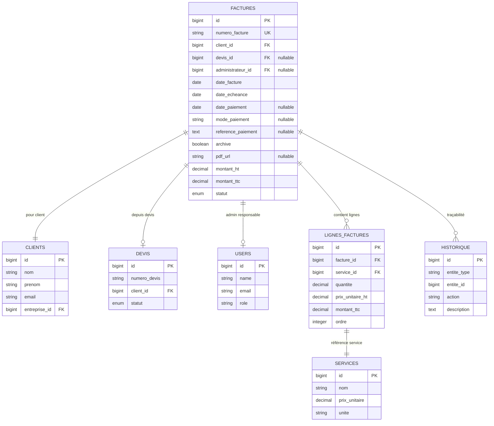

# Module 1.2 : Modèle de Données Factures

## 📋 Vue d'ensemble

Ce module documente la structure complète du modèle de données des factures dans le Dashboard Madinia. Il couvre la table `factures` avec ses 24 champs spécialisés, les relations avec les autres entités et la méthode de transformation depuis les devis.

## 🗄️ Structure Table Factures

### Schéma Complet de la Table

```sql
CREATE TABLE factures (
    -- Identifiants primaires
    id BIGINT UNSIGNED PRIMARY KEY AUTO_INCREMENT,
    numero_facture VARCHAR(255) UNIQUE NOT NULL,
    
    -- Relations obligatoires
    client_id BIGINT UNSIGNED NOT NULL,
    FOREIGN KEY (client_id) REFERENCES clients(id) ON DELETE CASCADE,
    
    -- Relations optionnelles
    devis_id BIGINT UNSIGNED NULL,
    FOREIGN KEY (devis_id) REFERENCES devis(id) ON DELETE CASCADE,
    administrateur_id BIGINT UNSIGNED NULL,
    FOREIGN KEY (administrateur_id) REFERENCES users(id) ON DELETE SET NULL,
    
    -- Dates obligatoires
    date_facture DATE NOT NULL,
    date_echeance DATE NOT NULL,
    
    -- Statuts métier (6 statuts vs 4 pour devis)
    statut ENUM('brouillon', 'en_attente', 'envoyee', 'payee', 'en_retard', 'annulee') 
           DEFAULT 'brouillon',
    statut_envoi ENUM('non_envoyee', 'envoyee', 'echec_envoi') 
                 DEFAULT 'non_envoyee'
                 COMMENT 'Statut d\'envoi de la facture au client',
    
    -- Contenu commercial
    objet VARCHAR(255) NOT NULL,
    description TEXT NULL,
    
    -- Montants financiers (calculs automatiques)
    montant_ht DECIMAL(10,2) DEFAULT 0.00,
    taux_tva DECIMAL(5,2) DEFAULT 8.5,
    montant_tva DECIMAL(10,2) DEFAULT 0.00,
    montant_ttc DECIMAL(10,2) DEFAULT 0.00,
    
    -- Conditions et notes
    conditions_paiement TEXT NULL,
    notes TEXT NULL,
    
    -- === CHAMPS SPÉCIFIQUES AUX FACTURES ===
    -- Gestion des paiements
    date_paiement DATE NULL,
    mode_paiement VARCHAR(255) NULL,
    reference_paiement TEXT NULL,
    
    -- Gestion administrative
    archive BOOLEAN DEFAULT FALSE,
    
    -- Gestion des PDFs
    pdf_file VARCHAR(255) NULL,
    pdf_url VARCHAR(500) NULL COMMENT 'URL publique Supabase du PDF',
    
    -- Traçabilité envois
    date_envoi_client TIMESTAMP NULL,
    date_envoi_admin TIMESTAMP NULL,
    
    -- Timestamps Laravel
    created_at TIMESTAMP NULL,
    updated_at TIMESTAMP NULL
);
```

### Comparaison avec le Modèle Devis

| **Champ** | **Devis** | **Factures** | **Différence** |
|-----------|-----------|--------------|----------------|
| **Champs identiques** | 20 champs | 20 champs | Base commune |
| **Champs spécifiques factures** | - | 4 champs | Paiement + archivage |
| **Total** | 20 champs | 24 champs | +4 champs (20%) |

#### Champs Spécifiques aux Factures

```php
// Champs exclusifs aux factures (absents dans devis)
protected $fillable = [
    // ... champs communs (20) ...
    
    // === SPÉCIFIQUES FACTURES ===
    'date_paiement',         // Date effective du paiement
    'mode_paiement',         // Moyen utilisé (virement, chèque, etc.)
    'reference_paiement',    // Référence bancaire ou numéro de transaction
    'archive',               // Statut d'archivage légal
];
```

## 🎯 Définition du Modèle Laravel

### Classe Facture Complète

```php
<?php

namespace App\Models;

use App\Traits\HasHistorique;
use App\Traits\SendsNotifications;
use Illuminate\Database\Eloquent\Model;
use Illuminate\Database\Eloquent\Relations\BelongsTo;
use Illuminate\Database\Eloquent\Relations\HasMany;

class Facture extends Model
{
    use HasHistorique, SendsNotifications;

    protected $table = 'factures';

    /**
     * Champs assignables en masse (24 champs vs 20 pour devis)
     */
    protected $fillable = [
        // Identifiants
        'numero_facture',
        'devis_id',
        'client_id',
        'administrateur_id',
        
        // Dates
        'date_facture',
        'date_echeance',
        
        // Statuts
        'statut',
        'statut_envoi',
        
        // Contenu
        'objet',
        'description',
        
        // Montants
        'montant_ht',
        'taux_tva',
        'montant_tva',
        'montant_ttc',
        
        // Conditions
        'conditions_paiement',
        'notes',
        
        // === SPÉCIFIQUES FACTURES ===
        'date_paiement',         // +1
        'mode_paiement',         // +2
        'reference_paiement',    // +3
        'archive',               // +4
        
        // Fichiers
        'pdf_file',
        'pdf_url',
        
        // Traçabilité
        'date_envoi_client',
        'date_envoi_admin',
    ];

    /**
     * Casting des attributs avec types spécialisés
     */
    protected $casts = [
        // Dates
        'date_facture' => 'date',
        'date_echeance' => 'date',
        'date_paiement' => 'date',              // Spécifique facture
        
        // Montants avec précision décimale
        'montant_ht' => 'decimal:2',
        'taux_tva' => 'decimal:2',
        'montant_tva' => 'decimal:2',
        'montant_ttc' => 'decimal:2',
        
        // Booleans
        'archive' => 'boolean',                 // Spécifique facture
        
        // Timestamps
        'date_envoi_client' => 'datetime',
        'date_envoi_admin' => 'datetime',
    ];

    /**
     * Événements du modèle
     */
    protected static function boot()
    {
        parent::boot();

        // Calcul automatique des montants avant sauvegarde
        static::saving(function ($facture) {
            if (
                $facture->isDirty(['montant_ht', 'taux_tva']) ||
                $facture->montant_tva == 0 ||
                $facture->montant_ttc == 0
            ) {
                $facture->calculerMontants();
            }
        });

        // Génération automatique du numéro si absent
        static::creating(function ($facture) {
            if (empty($facture->numero_facture)) {
                $facture->numero_facture = static::genererNumeroFacture();
            }
        });
    }
}
```

## 🔗 Relations avec les Autres Entités

### Diagramme des Relations



### Relations Laravel Détaillées

```php
class Facture extends Model
{
    /**
     * Client destinataire de la facture
     * Relation obligatoire et contrainte
     */
    public function client(): BelongsTo
    {
        return $this->belongsTo(Client::class)
                    ->with('entreprise');  // Eager loading automatique
    }

    /**
     * Devis d'origine (transformation)
     * Relation optionnelle - peut être null pour factures directes
     */
    public function devis(): BelongsTo
    {
        return $this->belongsTo(Devis::class);
    }

    /**
     * Administrateur responsable
     * Relation optionnelle avec protection contre la suppression
     */
    public function administrateur(): BelongsTo
    {
        return $this->belongsTo(User::class, 'administrateur_id')
                    ->select(['id', 'name', 'email']);
    }

    /**
     * Lignes de prestations facturées
     * Relation un-à-plusieurs avec ordre
     */
    public function lignes(): HasMany
    {
        return $this->hasMany(LigneFacture::class)
                    ->orderBy('ordre')
                    ->with('service');  // Eager loading du service
    }

    /**
     * Historique des actions sur la facture
     * Utilise le trait HasHistorique
     */
    public function historique()
    {
        return $this->morphMany(Historique::class, 'entite')
                    ->with('user')
                    ->latest();
    }
}
```

## 🛠️ Méthode creerDepuisDevis() Détaillée

### Analyse Complète de la Transformation

```php
/**
 * Créer une facture complète à partir d'un devis accepté
 * 
 * @param Devis $devis Le devis source à transformer
 * @return Facture La nouvelle facture créée
 * @throws \Exception Si le devis ne peut pas être transformé
 */
public static function creerDepuisDevis(Devis $devis): self
{
    // ================================================
    // PHASE 1 : VALIDATIONS PRÉALABLES
    // ================================================
    
    // Vérifier l'éligibilité du devis
    if (!$devis->peutEtreTransformeEnFacture()) {
        throw new \Exception(
            "Le devis #{$devis->numero_devis} ne peut pas être transformé : " .
            "statut '{$devis->statut}' non autorisé"
        );
    }
    
    // Vérifier qu'il n'existe pas déjà une facture pour ce devis
    if (static::where('devis_id', $devis->id)->exists()) {
        $factureExistante = static::where('devis_id', $devis->id)->first();
        throw new \Exception(
            "Le devis #{$devis->numero_devis} a déjà été transformé " .
            "en facture #{$factureExistante->numero_facture}"
        );
    }
    
    // ================================================
    // PHASE 2 : CHARGEMENT DES DONNÉES
    // ================================================
    
    // Charger toutes les relations nécessaires en une seule requête
    $devis->load([
        'administrateur:id,name,email',
        'lignes.service:id,nom,description,unite',
        'client.entreprise:id,nom,nom_commercial'
    ]);
    
    // ================================================
    // PHASE 3 : CRÉATION DE LA FACTURE DE BASE
    // ================================================
    
    $facture = new self([
        // Identifiants
        'numero_facture' => self::genererNumeroFacture(),
        'devis_id' => $devis->id,
        'client_id' => $devis->client_id,
        'administrateur_id' => $devis->administrateur?->id,
        
        // Dates avec calcul d'échéance
        'date_facture' => now()->toDateString(),
        'date_echeance' => now()->addDays(30)->toDateString(),
        
        // Statut initial
        'statut' => 'brouillon',
        'statut_envoi' => 'non_envoyee',
        
        // Contenu commercial (copie exacte)
        'objet' => $devis->objet,
        'description' => $devis->description,
        'notes' => $devis->notes,
        
        // Conditions adaptées pour facture
        'conditions_paiement' => $devis->conditions ?? 'Paiement à 30 jours par virement bancaire',
        
        // Montants initialisés à zéro (seront recalculés)
        'montant_ht' => 0,
        'taux_tva' => 0,
        'montant_tva' => 0,
        'montant_ttc' => 0,
    ]);
    
    // Sauvegarder la facture de base
    $facture->save();
    
    // ================================================
    // PHASE 4 : COPIE DES LIGNES DE PRESTATIONS
    // ================================================
    
    $lignesCopiees = 0;
    
    foreach ($devis->lignes as $ligneDevis) {
        $ligneFacture = $facture->lignes()->create([
            'service_id' => $ligneDevis->service_id,
            'quantite' => $ligneDevis->quantite,
            'prix_unitaire_ht' => $ligneDevis->prix_unitaire_ht,
            'taux_tva' => $ligneDevis->taux_tva,
            'ordre' => $ligneDevis->ordre,
            'description_personnalisee' => $ligneDevis->description_personnalisee,
            // montant_ht, montant_tva, montant_ttc calculés automatiquement via boot()
        ]);
        
        $lignesCopiees++;
    }
    
    // ================================================
    // PHASE 5 : RECALCUL DES TOTAUX
    // ================================================
    
    // Recalculer tous les montants à partir des lignes
    $facture->calculerMontants();
    $facture->save();
    
    // ================================================
    // PHASE 6 : TRAÇABILITÉ ET HISTORIQUE
    // ================================================
    
    // Enregistrer la transformation dans l'historique du devis
    $devis->enregistrerHistorique(
        'transformation',
        "Transformation en facture",
        "Le devis #{$devis->numero_devis} a été transformé en facture #{$facture->numero_facture}",
        null, // Pas d'ancien état
        null, // Pas de nouvel état (action ponctuelle)
        [
            'facture_id' => $facture->id,
            'numero_facture' => $facture->numero_facture,
            'date_transformation' => now()->format('Y-m-d H:i:s'),
            'lignes_copiees' => $lignesCopiees,
            'montant_transforme' => $facture->montant_ttc
        ]
    );
    
    // Enregistrer la création dans l'historique de la facture
    $facture->enregistrerHistorique(
        'creation',
        "Création depuis devis",
        "Facture créée automatiquement depuis le devis #{$devis->numero_devis}",
        null,
        null,
        [
            'devis_id' => $devis->id,
            'numero_devis' => $devis->numero_devis,
            'methode_creation' => 'transformation_devis',
            'lignes_importees' => $lignesCopiees
        ]
    );
    
    return $facture;
}
```

## 📊 Scopes et Requêtes Spécialisées

### Scopes Métier pour les Factures

```php
class Facture extends Model
{
    /**
     * Factures non archivées (actives)
     */
    public function scopeActives($query)
    {
        return $query->where('archive', false);
    }

    /**
     * Factures par statut spécifique
     */
    public function scopeParStatut($query, $statut)
    {
        return $query->where('statut', $statut);
    }

    /**
     * Factures en retard (échéance dépassée)
     */
    public function scopeEnRetard($query)
    {
        return $query->where('date_echeance', '<', now()->toDateString())
                    ->whereIn('statut', ['envoyee', 'en_attente', 'brouillon']);
    }

    /**
     * Factures d'un client spécifique
     */
    public function scopeParClient($query, $clientId)
    {
        return $query->where('client_id', $clientId);
    }

    /**
     * Factures d'une période donnée
     */
    public function scopeParPeriode($query, $dateDebut, $dateFin)
    {
        return $query->whereBetween('date_facture', [$dateDebut, $dateFin]);
    }

    /**
     * Factures payées avec délai de paiement
     */
    public function scopePayeesAvecDelai($query)
    {
        return $query->where('statut', 'payee')
                    ->whereNotNull('date_paiement')
                    ->selectRaw('*, DATEDIFF(date_paiement, date_facture) as delai_paiement');
    }

    /**
     * Factures créées depuis un devis
     */
    public function scopeDepuisDevis($query)
    {
        return $query->whereNotNull('devis_id')
                    ->with('devis:id,numero_devis,statut');
    }
}
```

## 📋 Résumé du Modèle de Données

### Caractéristiques Principales

1. **🔢 Structure Étendue** : 24 champs vs 20 pour les devis (+20%)
2. **💰 Spécialisation Paiement** : 4 champs dédiés au suivi financier
3. **🔗 Relations Riches** : 5 relations principales avec eager loading
4. **🎯 Méthodes Métier** : Transformation, calculs, gestion des retards
5. **📊 Scopes Avancés** : 7 scopes pour requêtes spécialisées
6. **⚡ Performances** : Calculs automatiques et optimisations

Cette architecture robuste garantit une gestion complète du cycle de facturation tout en maintenant la compatibilité avec le système de devis existant. 