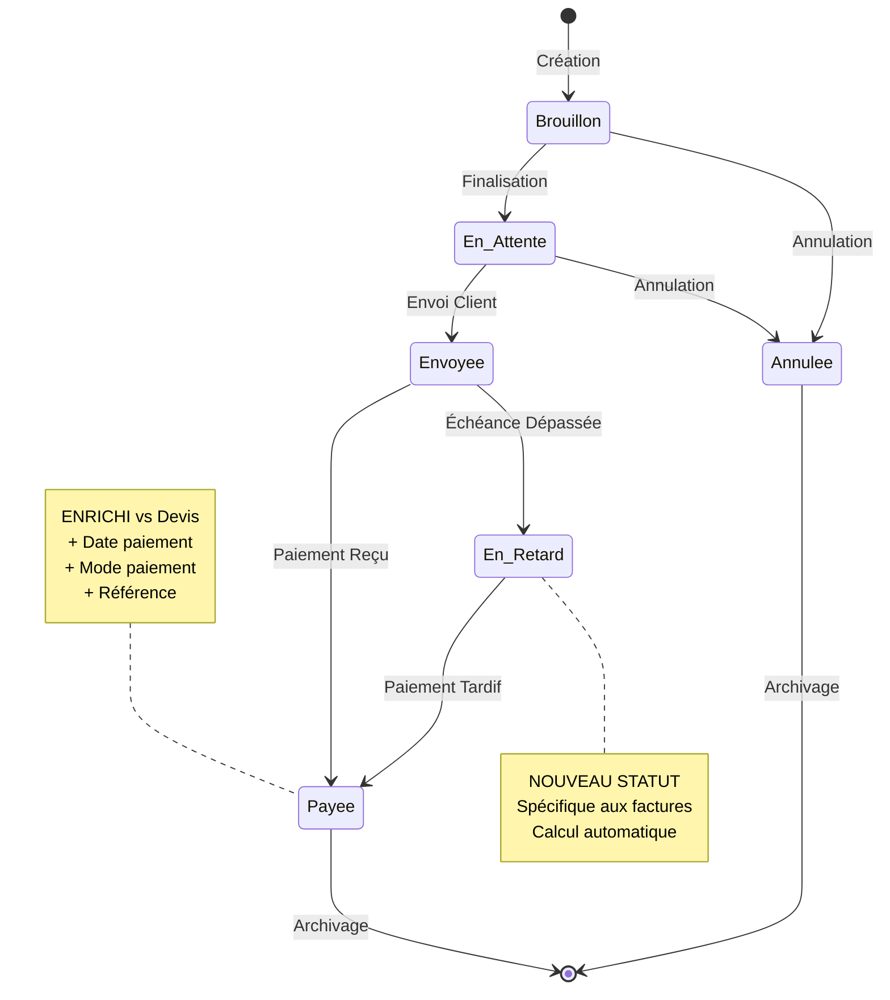

# Module 1.3 : Gestion Paiements et Échéances

## 📋 Vue d'ensemble

Ce module documente le système complet de gestion des paiements et échéances dans le Dashboard Madinia. Il couvre les 6 statuts métier, les transitions automatiques, le calcul des retards, les méthodes de marquage de paiement et le suivi des références de paiement.

## 📊 Système de Statuts Métier

### Les 6 Statuts Principaux vs Devis (4 statuts)



### Définition des Statuts

```php
// Enum des statuts facture dans la migration
$table->enum('statut', [
    'brouillon',    // Facture en cours de préparation
    'en_attente',   // Finalisée, prête à l'envoi
    'envoyee',      // Envoyée au client
    'payee',        // Paiement reçu et confirmé
    'en_retard',    // Échéance dépassée (NOUVEAU vs devis)
    'annulee'       // Annulée
])->default('brouillon');

// Statut d'envoi séparé
$table->enum('statut_envoi', [
    'non_envoyee',  // Pas encore envoyée
    'envoyee',      // Envoyée avec succès
    'echec_envoi'   // Échec lors de l'envoi
])->default('non_envoyee');
```

### Matrice de Transitions Autorisées

| **Depuis** | **Vers** | **Conditions** | **Actions Automatiques** |
|------------|----------|----------------|---------------------------|
| `brouillon` | `en_attente` | Validation complète | Calcul montants |
| `brouillon` | `annulee` | Décision admin | Historique |
| `en_attente` | `envoyee` | Envoi réussi | Date envoi + PDF |
| `en_attente` | `annulee` | Décision admin | Historique |
| `envoyee` | `payee` | Paiement confirmé | Date + mode + référence |
| `envoyee` | `en_retard` | Échéance dépassée | Calcul automatique |
| `en_retard` | `payee` | Paiement tardif | Pénalités éventuelles |

## ⏰ Calcul Automatique des Retards

### Logique de Détection

```php
/**
 * Déterminer automatiquement si une facture est en retard
 * Appelé par un accesseur et une commande cron
 */
public function getEstEnRetardAttribute(): bool
{
    // Conditions pour être considérée en retard :
    // 1. Échéance dépassée (date_echeance < aujourd'hui)
    // 2. Statut permettant le retard (envoyee, en_attente, brouillon)
    // 3. Pas encore payée (statut != 'payee')
    
    return $this->date_echeance < now()->toDate() &&
           in_array($this->statut, ['envoyee', 'en_attente', 'brouillon']) &&
           $this->statut !== 'payee';
}

/**
 * Calculer le nombre de jours de retard
 */
public function getJoursRetardAttribute(): int
{
    if (!$this->est_en_retard) {
        return 0;
    }
    
    return $this->date_echeance->diffInDays(now(), false);
}

/**
 * Calculer les pénalités de retard (optionnel)
 */
public function getPenalitesRetardAttribute(): float
{
    if (!$this->est_en_retard || $this->jours_retard < 30) {
        return 0;
    }
    
    // Exemple : 1% du montant TTC par mois de retard
    $moisRetard = ceil($this->jours_retard / 30);
    return round($this->montant_ttc * 0.01 * $moisRetard, 2);
}
```

### Commande de Traitement Automatique

```php
// Console/Commands/ProcessFactureRetards.php
class ProcessFactureRetards extends Command
{
    protected $signature = 'factures:process-retards
                            {--dry-run : Afficher les changements sans les appliquer}
                            {--notify : Envoyer les notifications de relance}';
    
    protected $description = 'Traiter automatiquement les factures en retard';

    public function handle()
    {
        $dryRun = $this->option('dry-run');
        $notify = $this->option('notify');
        
        // =======================================
        // ÉTAPE 1 : FACTURES ARRIVANT À ÉCHÉANCE
        // =======================================
        
        $facturesPreEcheance = Facture::where('date_echeance', '=', now()->addDays(3)->toDateString())
                                     ->where('statut', 'envoyee')
                                     ->with('client')
                                     ->get();
        
        $this->info("📅 Factures arrivant à échéance (J-3) : {$facturesPreEcheance->count()}");
        
        foreach ($facturesPreEcheance as $facture) {
            if ($notify && !$dryRun) {
                Mail::to($facture->client->email)->send(new RappelEcheanceMail($facture));
                $this->line("  📧 Rappel envoyé pour facture #{$facture->numero_facture}");
            } else {
                $this->line("  📧 [DRY-RUN] Rappel pour facture #{$facture->numero_facture}");
            }
        }
        
        // =======================================
        // ÉTAPE 2 : FACTURES EN RETARD
        // =======================================
        
        $facturesEnRetard = Facture::where('date_echeance', '<', now()->toDateString())
                                  ->whereIn('statut', ['envoyee', 'en_attente'])
                                  ->with('client')
                                  ->get();
        
        $this->info("🚨 Factures en retard détectées : {$facturesEnRetard->count()}");
        
        $retardsTraites = 0;
        $relancesEnvoyees = 0;
        
        foreach ($facturesEnRetard as $facture) {
            if (!$dryRun) {
                $ancienStatut = $facture->statut;
                $facture->statut = 'en_retard';
                $facture->save();
                
                // Historique du changement
                $facture->enregistrerHistorique(
                    'changement_statut',
                    "Passage automatique en retard",
                    "La facture #{$facture->numero_facture} est passée automatiquement en retard (échéance dépassée)",
                    ['statut' => $ancienStatut],
                    ['statut' => 'en_retard'],
                    [
                        'jours_retard' => $facture->jours_retard,
                        'montant_concerne' => $facture->montant_ttc,
                        'traitement_automatique' => true
                    ]
                );
                
                $retardsTraites++;
            }
            
            // Envoi relance
            if ($notify && !$dryRun) {
                Mail::to($facture->client->email)->send(new RelanceRetardMail($facture));
                $relancesEnvoyees++;
            }
            
            $this->line("  🚨 Facture #{$facture->numero_facture} - {$facture->jours_retard} jours - {$facture->montant_ttc}€");
        }
        
        // =======================================
        // RÉSUMÉ DU TRAITEMENT
        // =======================================
        
        if ($dryRun) {
            $this->warn("🔍 Mode DRY-RUN : Aucune modification appliquée");
        } else {
            $this->info("✅ Traitement terminé :");
            $this->info("   📅 Rappels d'échéance : {$facturesPreEcheance->count()}");
            $this->info("   🚨 Retards traités : {$retardsTraites}");
            if ($notify) {
                $this->info("   📧 Relances envoyées : {$relancesEnvoyees}");
            }
        }
        
        // Programmation de la prochaine exécution
        $this->info("⏰ Prochaine exécution recommandée : demain à 09:00");
    }
}
```

## 💰 Méthodes de Marquage de Paiement

### marquerPayee() - Méthode Principale

```php
/**
 * Marquer une facture comme payée avec traçabilité complète
 * 
 * @param string|null $modePaiement Mode de paiement utilisé
 * @param string|null $reference Référence bancaire ou numéro de transaction
 * @param \DateTime|null $datePaiement Date effective (par défaut aujourd'hui)
 * @return bool Succès de l'opération
 */
public function marquerPayee(
    ?string $modePaiement = null, 
    ?string $reference = null,
    ?\DateTime $datePaiement = null
): bool {
    // =======================================
    // VALIDATIONS PRÉALABLES
    // =======================================
    
    if ($this->statut === 'payee') {
        throw new \Exception("La facture #{$this->numero_facture} est déjà marquée comme payée");
    }
    
    if ($this->statut === 'annulee') {
        throw new \Exception("Impossible de marquer comme payée une facture annulée");
    }
    
    // =======================================
    // SAUVEGARDE DE L'ÉTAT PRÉCÉDENT
    // =======================================
    
    $ancienStatut = $this->statut;
    $ancienneDatePaiement = $this->date_paiement;
    $ancienModePaiement = $this->mode_paiement;
    $ancienneReference = $this->reference_paiement;
    
    // =======================================
    // MISE À JOUR DES CHAMPS DE PAIEMENT
    // =======================================
    
    $this->statut = 'payee';
    $this->date_paiement = $datePaiement ? $datePaiement->toDateString() : now()->toDateString();
    $this->mode_paiement = $modePaiement;
    $this->reference_paiement = $reference;
    
    $result = $this->save();
    
    if ($result) {
        // =======================================
        // HISTORIQUE DÉTAILLÉ
        // =======================================
        
        $this->enregistrerHistorique(
            'changement_statut',
            "Facture marquée comme payée",
            "La facture #{$this->numero_facture} a été marquée comme payée" . 
            ($modePaiement ? " par {$modePaiement}" : ""),
            [
                'statut' => $ancienStatut,
                'date_paiement' => $ancienneDatePaiement,
                'mode_paiement' => $ancienModePaiement,
                'reference_paiement' => $ancienneReference
            ],
            [
                'statut' => 'payee',
                'date_paiement' => $this->date_paiement,
                'mode_paiement' => $modePaiement,
                'reference_paiement' => $reference
            ],
            [
                'montant_paye' => $this->montant_ttc,
                'delai_paiement' => $this->date_facture->diffInDays($this->date_paiement),
                'etait_en_retard' => $ancienStatut === 'en_retard',
                'jours_retard' => $ancienStatut === 'en_retard' ? $this->jours_retard : 0
            ]
        );
        
        // =======================================
        // NOTIFICATIONS AUTOMATIQUES
        // =======================================
        
        // Notification aux administrateurs
        $this->envoyerNotificationPaiement($modePaiement, $reference);
        
        // Confirmation au client (optionnel)
        if (config('factures.confirmer_paiement_client', false)) {
            Mail::to($this->client->email)->send(
                new ConfirmationPaiementMail($this, $modePaiement, $reference)
            );
        }
        
        // =======================================
        // INTÉGRATIONS COMPTABLES
        // =======================================
        
        if (config('factures.integration_comptable', false)) {
            $this->integrerComptabilite();
        }
    }
    
    return $result;
}
```

### marquerEnvoyee() - Gestion de l'Envoi

```php
/**
 * Marquer une facture comme envoyée au client
 * Met à jour les statuts et la traçabilité d'envoi
 */
public function marquerEnvoyee(): bool
{
    $ancienStatut = $this->statut;
    $ancienStatutEnvoi = $this->statut_envoi;
    
    // Mise à jour des statuts
    $this->statut = 'envoyee';
    $this->statut_envoi = 'envoyee';
    $this->date_envoi_client = now();
    
    $result = $this->save();
    
    if ($result) {
        $changes = [
            'statut' => 'envoyee',
            'statut_envoi' => 'envoyee',
            'date_envoi_client' => $this->date_envoi_client->format('Y-m-d H:i:s')
        ];
        
        $original = [
            'statut' => $ancienStatut,
            'statut_envoi' => $ancienStatutEnvoi,
            'date_envoi_client' => null
        ];
        
        $this->enregistrerHistorique(
            'envoi_email',
            "Facture envoyée au client",
            "La facture #{$this->numero_facture} a été envoyée avec succès au client {$this->client->nom_complet}",
            $original,
            $changes,
            [
                'email_destinataire' => $this->client->email,
                'type_envoi' => 'client',
                'pdf_inclus' => true,
                'echeance_dans' => $this->date_facture->diffInDays($this->date_echeance)
            ]
        );
        
        // Programmer le suivi automatique de l'échéance
        $this->programmerSuiviEcheance();
    }
    
    return $result;
}

/**
 * Programmer le suivi automatique de cette facture
 */
private function programmerSuiviEcheance(): void
{
    // Job pour rappel 3 jours avant échéance
    RappelEcheanceJob::dispatch($this->id)
                     ->delay($this->date_echeance->subDays(3));
    
    // Job pour vérification retard le jour de l'échéance
    VerificationRetardJob::dispatch($this->id)
                         ->delay($this->date_echeance->addDay());
}
```

## 📑 Suivi des Références de Paiement

### Types de Références Supportés

```php
/**
 * Service de gestion des références de paiement
 */
class ReferencesPaiementService
{
    /**
     * Types de références de paiement reconnus
     */
    const TYPES_REFERENCES = [
        'virement' => [
            'prefixes' => ['VIR', 'VIRT', 'TRF'],
            'format' => 'VIR-YYYY-NNNNNN',
            'validation' => '/^VIR[T]?-\d{4}-\d{6,10}$/'
        ],
        'cheque' => [
            'prefixes' => ['CHQ', 'CHECK'],
            'format' => 'CHQ-NNNNNN',
            'validation' => '/^CHQ-\d{6,10}$/'
        ],
        'carte' => [
            'prefixes' => ['CB', 'CARD'],
            'format' => 'CB-XXXX-XXXX',
            'validation' => '/^CB-[A-Z0-9]{4}-[A-Z0-9]{4}$/'
        ],
        'especes' => [
            'prefixes' => ['ESP', 'CASH'],
            'format' => 'ESP-YYYY-MM-DD',
            'validation' => '/^ESP-\d{4}-\d{2}-\d{2}$/'
        ],
        'compensation' => [
            'prefixes' => ['COMP', 'OFFSET'],
            'format' => 'COMP-REF-XXXX',
            'validation' => '/^COMP-REF-[A-Z0-9]{4,10}$/'
        ]
    ];
    
    /**
     * Valider une référence de paiement selon son type
     */
    public function validerReference(string $reference, string $modePaiement): bool
    {
        $modeNormalise = strtolower(str_replace(' ', '_', $modePaiement));
        
        // Correspondance mode de paiement -> type de référence
        $correspondances = [
            'virement_bancaire' => 'virement',
            'virement' => 'virement',
            'cheque' => 'cheque',
            'chèque' => 'cheque',
            'carte_bancaire' => 'carte',
            'carte' => 'carte',
            'especes' => 'especes',
            'espèces' => 'especes',
            'compensation' => 'compensation'
        ];
        
        $typeReference = $correspondances[$modeNormalise] ?? null;
        
        if (!$typeReference || !isset(self::TYPES_REFERENCES[$typeReference])) {
            return true; // Mode libre si type non reconnu
        }
        
        $pattern = self::TYPES_REFERENCES[$typeReference]['validation'];
        return preg_match($pattern, $reference) === 1;
    }
    
    /**
     * Générer une référence automatique selon le mode de paiement
     */
    public function genererReference(string $modePaiement, Facture $facture): string
    {
        $modeNormalise = strtolower(str_replace(' ', '_', $modePaiement));
        
        return match ($modeNormalise) {
            'virement_bancaire', 'virement' => 
                sprintf('VIR-%s-%06d', date('Y'), $facture->id),
                
            'cheque', 'chèque' => 
                sprintf('CHQ-%06d', $facture->id),
                
            'carte_bancaire', 'carte' => 
                sprintf('CB-%04d-%04d', date('ym'), $facture->id),
                
            'especes', 'espèces' => 
                sprintf('ESP-%s', date('Y-m-d')),
                
            'compensation' => 
                sprintf('COMP-REF-%04d', $facture->id),
                
            default => sprintf('PAY-%s-%04d', strtoupper(substr($modeNormalise, 0, 3)), $facture->id)
        };
    }
}
```

## 📊 Métriques et Indicateurs de Paiement

### Calculs Financiers Avancés

```php
/**
 * Service de métriques de paiement
 */
class MetriquesPaiementService
{
    /**
     * Calculer les indicateurs de performance de paiement
     */
    public function getIndicateursPerformance(int $annee = null): array
    {
        $annee = $annee ?? date('Y');
        
        return [
            // Délais de paiement
            'delai_moyen_paiement' => $this->calculerDelaiMoyenPaiement($annee),
            'delai_median_paiement' => $this->calculerDelaiMedianPaiement($annee),
            
            // Taux de retard
            'taux_retard' => $this->calculerTauxRetard($annee),
            'montant_retards' => $this->calculerMontantRetards($annee),
            
            // Modes de paiement
            'repartition_modes_paiement' => $this->getRepartitionModesPaiement($annee),
            
            // Évolution temporelle
            'evolution_mensuelle' => $this->getEvolutionMensuelle($annee),
            
            // Clients problématiques
            'clients_retardataires' => $this->getClientsRetardataires($annee),
        ];
    }
    
    private function calculerDelaiMoyenPaiement(int $annee): float
    {
        return Facture::where('statut', 'payee')
                     ->whereYear('date_paiement', $annee)
                     ->selectRaw('AVG(DATEDIFF(date_paiement, date_facture)) as delai_moyen')
                     ->value('delai_moyen') ?? 0;
    }
    
    private function calculerTauxRetard(int $annee): float
    {
        $totalFactures = Facture::whereYear('date_facture', $annee)
                               ->whereIn('statut', ['payee', 'en_retard'])
                               ->count();
        
        if ($totalFactures === 0) return 0;
        
        $facturesEnRetard = Facture::whereYear('date_facture', $annee)
                                  ->where(function($query) {
                                      $query->where('statut', 'en_retard')
                                            ->orWhere(function($q) {
                                                $q->where('statut', 'payee')
                                                  ->whereRaw('date_paiement > date_echeance');
                                            });
                                  })
                                  ->count();
        
        return round(($facturesEnRetard / $totalFactures) * 100, 2);
    }
    
    private function getRepartitionModesPaiement(int $annee): array
    {
        return Facture::where('statut', 'payee')
                     ->whereYear('date_paiement', $annee)
                     ->groupBy('mode_paiement')
                     ->selectRaw('mode_paiement, COUNT(*) as nombre, SUM(montant_ttc) as montant_total')
                     ->orderBy('montant_total', 'desc')
                     ->get()
                     ->toArray();
    }
}
```

## 📋 Résumé de la Gestion des Paiements

### Fonctionnalités Clés

1. **📊 Statuts Enrichis** : 6 statuts vs 4 pour les devis (+50%)
2. **⏰ Calcul Automatique** : Détection des retards par cron job quotidien
3. **💰 Traçabilité Complète** : Date, mode et référence de paiement
4. **📧 Notifications Automatiques** : Rappels et relances intelligents
5. **🔍 Métriques Avancées** : Indicateurs de performance financière
6. **⚖️ Conformité Légale** : Archivage et historique détaillé

### Avantages vs Système Devis

- **Suivi financier** complet absent dans les devis
- **Gestion des échéances** avec alertes automatiques
- **Calcul des retards** et pénalités éventuelles
- **Références de paiement** structurées et validées
- **Métriques de performance** pour le pilotage financier

Cette architecture garantit une gestion professionnelle et automatisée du cycle de paiement des factures. 