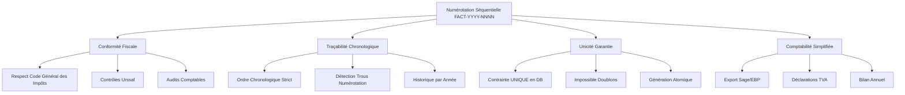

# Module 1.4 : Auto-génération Numéros Fiscaux

## 📋 Vue d'ensemble

Ce module documente le système d'auto-génération des numéros de factures dans le Dashboard Madinia. Il couvre le format `FACT-2025-{numero}` séquentiel, la méthode `genererNumeroFacture()`, les contraintes fiscales d'unicité et les migrations des formats existants.

## 🔢 Format de Numérotation Fiscal

### Structure Standard FACT-YYYY-NNNN

```php
// Format officiel des numéros de facture
// FACT-2025-0001, FACT-2025-0002, etc.

const FORMAT_NUMERO_FACTURE = 'FACT-{ANNEE}-{NUMERO_SEQUENCE}';

// Exemples de numéros générés :
// FACT-2025-0001  // Première facture de 2025
// FACT-2025-0002  // Deuxième facture de 2025
// FACT-2025-0150  // 150ème facture de 2025
// FACT-2026-0001  // Première facture de 2026 (reset compteur)
```

### Différences avec la Numérotation Devis

| **Aspect** | **Devis** | **Factures** |
|------------|-----------|--------------|
| **Préfixe** | `DV` | `FACT` |
| **Format** | `DV-25-{ID}` | `FACT-2025-{SEQ}` |
| **Année** | Abrégée (25) | Complète (2025) |
| **Numérotation** | Basée sur ID | Séquentielle par année |
| **Reset annuel** | Non | Oui (recommencé à 0001) |
| **Conformité** | Interne | Fiscale (obligatoire) |

### Avantages du Format Séquentiel



## 🛠️ Méthode genererNumeroFacture()

### Implémentation Complète

```php
/**
 * Générer automatiquement un numéro de facture séquentiel
 * Format : FACT-YYYY-NNNN (ex: FACT-2025-0001)
 * 
 * @param int|null $annee Année spécifique (par défaut année courante)
 * @return string Numéro de facture unique
 * @throws \Exception Si impossible de générer un numéro
 */
public static function genererNumeroFacture(?int $annee = null): string
{
    $annee = $annee ?? date('Y');
    
    // =======================================
    // PHASE 1 : REQUÊTE ATOMIQUE SÉCURISÉE
    // =======================================
    
    // Utilisation de DB::transaction pour éviter les conditions de course
    return DB::transaction(function () use ($annee) {
        
        // Recherche du dernier numéro de l'année avec verrouillage
        $dernierNumero = static::where('numero_facture', 'LIKE', "FACT-{$annee}-%")
                              ->lockForUpdate()  // Verrouillage pessimiste
                              ->orderBy('numero_facture', 'desc')
                              ->first();
        
        // =======================================
        // PHASE 2 : CALCUL DU PROCHAIN NUMÉRO
        // =======================================
        
        if ($dernierNumero) {
            // Extraction du numéro séquentiel depuis le format FACT-YYYY-NNNN
            $dernierSequence = (int) substr($dernierNumero->numero_facture, -4);
            $nouveauSequence = $dernierSequence + 1;
            
            // Validation de la limite théorique (9999 factures/an)
            if ($nouveauSequence > 9999) {
                throw new \Exception(
                    "Limite de 9999 factures par année atteinte pour {$annee}. " .
                    "Veuillez passer à l'année suivante ou modifier le format."
                );
            }
        } else {
            // Première facture de l'année
            $nouveauSequence = 1;
        }
        
        // =======================================
        // PHASE 3 : FORMATAGE FINAL
        // =======================================
        
        $numeroGenere = sprintf('FACT-%d-%04d', $annee, $nouveauSequence);
        
        // =======================================
        // PHASE 4 : VALIDATION D'UNICITÉ
        // =======================================
        
        // Vérification finale (sécurité supplémentaire)
        $existe = static::where('numero_facture', $numeroGenere)->exists();
        if ($existe) {
            throw new \Exception(
                "Conflit de numérotation détecté : {$numeroGenere} existe déjà. " .
                "Veuillez réessayer."
            );
        }
        
        return $numeroGenere;
    });
}
```

### Gestion des Cas d'Erreur

```php
/**
 * Version robuste avec gestion d'erreurs et retry automatique
 */
public static function genererNumeroFactureRobuste(?int $annee = null, int $maxTentatives = 3): string
{
    $tentative = 0;
    $derniereErreur = null;
    
    while ($tentative < $maxTentatives) {
        try {
            return static::genererNumeroFacture($annee);
            
        } catch (\Exception $e) {
            $tentative++;
            $derniereErreur = $e;
            
            // Log de l'erreur
            Log::warning("Échec génération numéro facture (tentative {$tentative}/{$maxTentatives})", [
                'error' => $e->getMessage(),
                'annee' => $annee ?? date('Y'),
                'trace' => $e->getTraceAsString()
            ]);
            
            // Délai avant retry (éviter les collisions)
            if ($tentative < $maxTentatives) {
                usleep(rand(100000, 500000)); // 100-500ms aléatoire
            }
        }
    }
    
    // Échec définitif après toutes les tentatives
    throw new \Exception(
        "Impossible de générer un numéro de facture après {$maxTentatives} tentatives. " .
        "Dernière erreur : " . $derniereErreur->getMessage()
    );
}
```

### Hook d'Auto-génération

```php
// Dans le modèle Facture.php - événement creating()
protected static function boot()
{
    parent::boot();
    
    // Auto-génération du numéro si absent lors de la création
    static::creating(function ($facture) {
        if (empty($facture->numero_facture)) {
            try {
                $facture->numero_facture = static::genererNumeroFactureRobuste();
                
                Log::info("Numéro facture auto-généré", [
                    'numero_genere' => $facture->numero_facture,
                    'client_id' => $facture->client_id,
                    'method' => 'auto_generation_creating'
                ]);
                
            } catch (\Exception $e) {
                Log::error("Échec auto-génération numéro facture", [
                    'error' => $e->getMessage(),
                    'client_id' => $facture->client_id
                ]);
                
                // Re-lancer l'exception pour empêcher la création
                throw $e;
            }
        }
    });
    
    // Calcul automatique des montants avant sauvegarde
    static::saving(function ($facture) {
        if (
            $facture->isDirty(['montant_ht', 'taux_tva']) ||
            $facture->montant_tva == 0 ||
            $facture->montant_ttc == 0
        ) {
            $facture->calculerMontants();
        }
    });
}
```

## ⚖️ Contraintes Fiscales et Unicité

### Contrainte Base de Données

```sql
-- Migration : contrainte d'unicité sur numero_facture
ALTER TABLE factures 
ADD CONSTRAINT uk_factures_numero_facture 
UNIQUE (numero_facture);

-- Index pour optimiser les recherches
CREATE INDEX idx_factures_numero_pattern 
ON factures (numero_facture, created_at);

-- Index pour requêtes par année
CREATE INDEX idx_factures_annee 
ON factures ((SUBSTRING(numero_facture, 6, 4)), created_at);
```

### Validations Laravel

```php
// Dans FactureController.php
public function store(Request $request)
{
    $validated = $request->validate([
        // ... autres champs ...
        'numero_facture' => [
            'nullable',                    // Optionnel (auto-généré si absent)
            'string',
            'max:255',
            'unique:factures,numero_facture', // Unicité absolue
            'regex:/^FACT-\d{4}-\d{4}$/'   // Format strict
        ],
    ], [
        'numero_facture.unique' => 'Ce numéro de facture existe déjà',
        'numero_facture.regex' => 'Format invalide. Attendu : FACT-YYYY-NNNN'
    ]);
    
    // Si numéro non fourni, génération automatique
    if (empty($validated['numero_facture'])) {
        $validated['numero_facture'] = Facture::genererNumeroFactureRobuste();
    }
    
    // ... suite de la création ...
}
```

### Obligations Légales Françaises

```php
/**
 * Service de validation fiscale des numéros de facture
 */
class ValidationFiscaleService
{
    /**
     * Vérifier la conformité fiscale d'un numéro de facture
     * Selon l'article 242 nonies A du CGI
     */
    public function verifierConformiteFiscale(string $numeroFacture): array
    {
        $violations = [];
        
        // 1. Format obligatoire : numérotation chronologique
        if (!preg_match('/^FACT-\d{4}-\d{4}$/', $numeroFacture)) {
            $violations[] = "Format non conforme au standard chronologique";
        }
        
        // 2. Unicité absolue
        $doublonExiste = Facture::where('numero_facture', $numeroFacture)->count() > 1;
        if ($doublonExiste) {
            $violations[] = "Numéro en doublon (violation unicité fiscale)";
        }
        
        // 3. Cohérence chronologique
        $violationChronologie = $this->verifierChronologie($numeroFacture);
        if ($violationChronologie) {
            $violations[] = $violationChronologie;
        }
        
        // 4. Continuité de la numérotation
        $trouDansNumerotation = $this->detecterTrouNumerotation($numeroFacture);
        if ($trouDansNumerotation) {
            $violations[] = $trouDansNumerotation;
        }
        
        return [
            'conforme' => empty($violations),
            'violations' => $violations,
            'numero_verifie' => $numeroFacture,
            'date_verification' => now()->format('Y-m-d H:i:s')
        ];
    }
    
    /**
     * Vérifier que la numérotation respecte l'ordre chronologique
     */
    private function verifierChronologie(string $numeroFacture): ?string
    {
        // Extraction année et séquence
        if (!preg_match('/^FACT-(\d{4})-(\d{4})$/', $numeroFacture, $matches)) {
            return null;
        }
        
        $annee = (int) $matches[1];
        $sequence = (int) $matches[2];
        
        // Recherche de factures postérieures avec numéro inférieur
        $violationsChronologie = Facture::whereRaw("numero_facture LIKE 'FACT-{$annee}-%'")
                                       ->whereRaw("CAST(SUBSTRING(numero_facture, -4) AS UNSIGNED) < ?", [$sequence])
                                       ->where('created_at', '>', now())
                                       ->count();
        
        if ($violationsChronologie > 0) {
            return "Violation chronologie : numéro {$numeroFacture} créé après des numéros supérieurs";
        }
        
        return null;
    }
    
    /**
     * Détecter les trous dans la numérotation séquentielle
     */
    private function detecterTrouNumerotation(string $numeroFacture): ?string
    {
        if (!preg_match('/^FACT-(\d{4})-(\d{4})$/', $numeroFacture, $matches)) {
            return null;
        }
        
        $annee = (int) $matches[1];
        
        // Récupérer tous les numéros de l'année
        $numerosExistants = Facture::where('numero_facture', 'LIKE', "FACT-{$annee}-%")
                                  ->pluck('numero_facture')
                                  ->map(function($numero) {
                                      return (int) substr($numero, -4);
                                  })
                                  ->sort()
                                  ->values()
                                  ->toArray();
        
        // Vérifier la continuité
        $trous = [];
        for ($i = 1; $i < count($numerosExistants); $i++) {
            $ecart = $numerosExistants[$i] - $numerosExistants[$i-1];
            if ($ecart > 1) {
                for ($j = $numerosExistants[$i-1] + 1; $j < $numerosExistants[$i]; $j++) {
                    $trous[] = sprintf('FACT-%d-%04d', $annee, $j);
                }
            }
        }
        
        if (!empty($trous)) {
            return "Trous détectés dans la numérotation : " . implode(', ', array_slice($trous, 0, 5)) . 
                   (count($trous) > 5 ? " (+" . (count($trous) - 5) . " autres)" : "");
        }
        
        return null;
    }
}
```

## 🔄 Migration des Formats Existants

### Commande de Migration

```php
// Console/Commands/MigrateFactureNumbers.php
class MigrateFactureNumbers extends Command
{
    protected $signature = 'factures:migrate-numbers 
                            {--dry-run : Afficher les changements sans les appliquer}
                            {--force : Forcer la migration même en cas de conflits}';
    
    protected $description = 'Migrer les numéros de factures vers le format FACT-YYYY-NNNN';

    public function handle()
    {
        $dryRun = $this->option('dry-run');
        $force = $this->option('force');
        
        $this->info("🔄 Début de la migration des numéros de factures");
        $this->info("Mode : " . ($dryRun ? "DRY-RUN (simulation)" : "PRODUCTION"));
        
        // =======================================
        // ÉTAPE 1 : ANALYSE DES FORMATS EXISTANTS
        // =======================================
        
        $facturesAMigrer = Facture::whereNotNull('numero_facture')
                                 ->where('numero_facture', 'NOT LIKE', 'FACT-%')
                                 ->orderBy('created_at')
                                 ->get();
        
        $this->info("📊 Factures à migrer : {$facturesAMigrer->count()}");
        
        if ($facturesAMigrer->isEmpty()) {
            $this->info("✅ Aucune facture à migrer. Tous les numéros sont déjà au bon format.");
            return;
        }
        
        // =======================================
        // ÉTAPE 2 : GROUPEMENT PAR ANNÉE
        // =======================================
        
        $facturesParAnnee = $facturesAMigrer->groupBy(function($facture) {
            return $facture->created_at->year;
        });
        
        $this->table(
            ['Année', 'Nombre de factures', 'Premiers formats détectés'],
            $facturesParAnnee->map(function($factures, $annee) {
                $formatsEchantillon = $factures->take(3)->pluck('numero_facture')->implode(', ');
                return [$annee, $factures->count(), $formatsEchantillon];
            })->toArray()
        );
        
        // =======================================
        // ÉTAPE 3 : MIGRATION PAR ANNÉE
        // =======================================
        
        $totalMigrees = 0;
        $erreurs = [];
        
        foreach ($facturesParAnnee as $annee => $factures) {
            $this->info("\n🗓️ Migration année {$annee} ({$factures->count()} factures)");
            
            $sequence = 1;
            
            foreach ($factures as $facture) {
                $ancienNumero = $facture->numero_facture;
                $nouveauNumero = sprintf('FACT-%d-%04d', $annee, $sequence);
                
                // Vérification de conflit
                $conflit = Facture::where('numero_facture', $nouveauNumero)
                                 ->where('id', '!=', $facture->id)
                                 ->exists();
                
                if ($conflit && !$force) {
                    $erreurs[] = "Conflit pour {$nouveauNumero} (facture #{$facture->id})";
                    $this->error("  ❌ Conflit : {$ancienNumero} → {$nouveauNumero}");
                    continue;
                }
                
                if (!$dryRun) {
                    $facture->numero_facture = $nouveauNumero;
                    $facture->save();
                    
                    // Historique de la migration
                    $facture->enregistrerHistorique(
                        'migration_numero',
                        "Migration du numéro de facture",
                        "Numéro migré de '{$ancienNumero}' vers '{$nouveauNumero}'",
                        ['numero_facture' => $ancienNumero],
                        ['numero_facture' => $nouveauNumero],
                        [
                            'migration_automatique' => true,
                            'annee_migration' => $annee,
                            'sequence_migration' => $sequence,
                            'commande' => 'factures:migrate-numbers'
                        ]
                    );
                }
                
                $this->line("  ✅ {$ancienNumero} → {$nouveauNumero}");
                $totalMigrees++;
                $sequence++;
            }
        }
        
        // =======================================
        // RÉSUMÉ DE LA MIGRATION
        // =======================================
        
        $this->info("\n📋 Résumé de la migration :");
        $this->info("   ✅ Factures migrées : {$totalMigrees}");
        $this->info("   ❌ Erreurs rencontrées : " . count($erreurs));
        
        if (!empty($erreurs)) {
            $this->error("\n🚨 Erreurs détaillées :");
            foreach ($erreurs as $erreur) {
                $this->error("   • {$erreur}");
            }
        }
        
        if ($dryRun) {
            $this->warn("\n🔍 Mode DRY-RUN : Aucune modification appliquée");
            $this->info("Relancez sans --dry-run pour appliquer les changements");
        } else {
            $this->info("\n🎉 Migration terminée avec succès !");
        }
    }
}
```

### Script de Validation Post-Migration

```php
// Console/Commands/ValidateFactureNumbers.php
class ValidateFactureNumbers extends Command
{
    protected $signature = 'factures:validate-numbers {--annee=}';
    protected $description = 'Valider la conformité fiscale des numéros de factures';

    public function handle()
    {
        $anneeFiltre = $this->option('annee');
        
        $this->info("🔍 Validation des numéros de factures");
        if ($anneeFiltre) {
            $this->info("   Année sélectionnée : {$anneeFiltre}");
        }
        
        $validationService = new ValidationFiscaleService();
        
        // Récupération des factures à valider
        $query = Facture::whereNotNull('numero_facture');
        if ($anneeFiltre) {
            $query->where('numero_facture', 'LIKE', "FACT-{$anneeFiltre}-%");
        }
        
        $factures = $query->orderBy('numero_facture')->get();
        
        $this->info("📊 {$factures->count()} factures à valider\n");
        
        $conformes = 0;
        $nonConformes = 0;
        $violations = [];
        
        foreach ($factures as $facture) {
            $resultat = $validationService->verifierConformiteFiscale($facture->numero_facture);
            
            if ($resultat['conforme']) {
                $conformes++;
                $this->line("✅ {$facture->numero_facture}");
            } else {
                $nonConformes++;
                $this->error("❌ {$facture->numero_facture}");
                foreach ($resultat['violations'] as $violation) {
                    $this->error("   → {$violation}");
                    $violations[] = "{$facture->numero_facture}: {$violation}";
                }
            }
        }
        
        // Résumé final
        $this->info("\n📋 Résumé de la validation :");
        $this->info("   ✅ Factures conformes : {$conformes}");
        $this->error("   ❌ Factures non conformes : {$nonConformes}");
        
        $tauxConformite = $factures->count() > 0 ? 
            round(($conformes / $factures->count()) * 100, 2) : 100;
        
        $this->info("   📊 Taux de conformité : {$tauxConformite}%");
        
        if ($nonConformes === 0) {
            $this->info("\n🎉 Toutes les factures sont conformes aux exigences fiscales !");
        } else {
            $this->warn("\n⚠️ Des non-conformités ont été détectées. Veuillez corriger avant tout contrôle fiscal.");
        }
    }
}
```

## 📋 Résumé de l'Auto-génération

### Caractéristiques Principales

1. **🔢 Format Fiscal Standard** : `FACT-YYYY-NNNN` conforme au CGI
2. **⚡ Génération Atomique** : Transaction DB avec verrouillage
3. **🔄 Reset Annuel** : Redémarrage à 0001 chaque année
4. **⚖️ Conformité Légale** : Respect chronologie et unicité
5. **🛠️ Migration Assistée** : Outils de conversion des anciens formats
6. **✅ Validation Continue** : Contrôles de conformité automatisés

### Avantages vs Numérotation Devis

- **Conformité fiscale** obligatoire vs optionnelle
- **Séquentialité garantie** vs basée sur ID
- **Reset annuel** pour comptabilité vs continu
- **Format étendu** pour traçabilité vs compact
- **Outils de validation** intégrés vs basiques

Cette architecture garantit une numérotation fiscalement conforme et juridiquement sûre pour toutes les factures émises. 