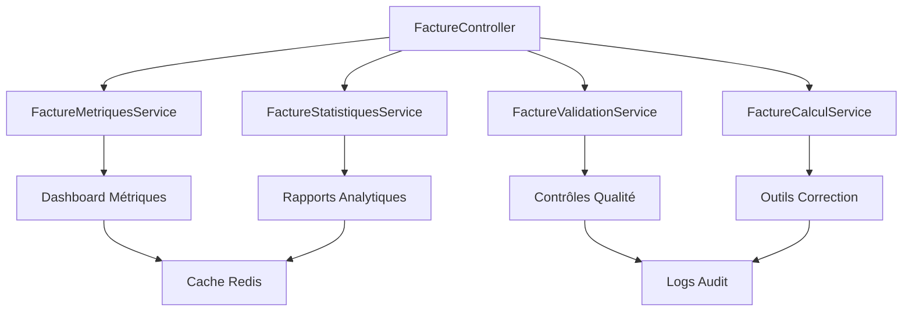

# Module 2.4 : Services Métier Factures

## 📋 Vue d'ensemble

Ce module documente les services métier spécialisés pour les factures : calculs financiers, métriques de performance, statistiques fiscales, et services d'aide à la décision. Ces services étendent la logique métier au-delà du CRUD de base.

## 🏗️ Architecture des Services

### Services Identifiés

| **Service** | **Responsabilité** | **Méthodes Clés** | **Usage** |
|-------------|-------------------|-------------------|-----------|
| `FactureMetriquesService` | Calculs et KPIs | `calculerMetriques()` | Dashboard, reporting |
| `FactureStatistiquesService` | Analyses temporelles | `analyserTendances()` | Analytique business |
| `FactureValidationService` | Contrôles conformité | `validerConformite()` | Processus qualité |
| `FactureCalculService` | Logique financière | `recalculerMontants()` | Corrections, audit |

### Diagramme d'Architecture



## 📊 FactureMetriquesService

### Métriques Financières

```php
<?php

namespace App\Services;

use App\Models\Facture;
use Carbon\Carbon;
use Illuminate\Support\Facades\DB;
use Illuminate\Support\Facades\Cache;

class FactureMetriquesService
{
    /**
     * Calcule les métriques principales avec cache Redis
     */
    public function calculerMetriques(array $filters = []): array
    {
        $cacheKey = 'facture_metriques_' . md5(serialize($filters));
        
        return Cache::remember($cacheKey, 300, function () use ($filters) {
            $query = Facture::query();
            
            // Application des filtres
            $this->appliquerFiltres($query, $filters);
            
            return [
                'financier' => $this->calculerMetriquesFinancieres($query),
                'temporel' => $this->calculerMetriquesTemporelles($query),
                'statuts' => $this->calculerRepartitionStatuts($query),
                'tendances' => $this->calculerTendances($query),
                'performance' => $this->calculerPerformance($query),
            ];
        });
    }

    /**
     * Métriques financières détaillées
     */
    private function calculerMetriquesFinancieres($query): array
    {
        $clone = clone $query;
        
        $stats = $clone->selectRaw("
            COUNT(*) as total_factures,
            SUM(montant_ht) as ca_ht_total,
            SUM(montant_ttc) as ca_ttc_total,
            AVG(montant_ttc) as panier_moyen,
            MIN(montant_ttc) as montant_min,
            MAX(montant_ttc) as montant_max,
            SUM(CASE WHEN statut = 'payee' THEN montant_ttc ELSE 0 END) as ca_encaisse,
            SUM(CASE WHEN statut = 'en_retard' THEN montant_ttc ELSE 0 END) as ca_en_retard,
            SUM(CASE WHEN statut IN ('en_attente', 'envoyee') THEN montant_ttc ELSE 0 END) as ca_en_attente
        ")->first();

        return [
            'ca_total_ht' => $stats->ca_ht_total ?? 0,
            'ca_total_ttc' => $stats->ca_ttc_total ?? 0,
            'ca_encaisse' => $stats->ca_encaisse ?? 0,
            'ca_en_attente' => $stats->ca_en_attente ?? 0,
            'ca_en_retard' => $stats->ca_en_retard ?? 0,
            'panier_moyen' => $stats->panier_moyen ?? 0,
            'montant_min' => $stats->montant_min ?? 0,
            'montant_max' => $stats->montant_max ?? 0,
            'total_factures' => $stats->total_factures ?? 0,
            'taux_encaissement' => $stats->ca_ttc_total > 0 
                ? ($stats->ca_encaisse / $stats->ca_ttc_total) * 100 
                : 0,
        ];
    }

    /**
     * Analyse des délais et échéances
     */
    private function calculerMetriquesTemporelles($query): array
    {
        $clone = clone $query;
        
        $delais = $clone->selectRaw("
            AVG(DATEDIFF(date_paiement, date_facture)) as delai_moyen_paiement,
            AVG(DATEDIFF(date_echeance, date_facture)) as delai_moyen_echeance,
            COUNT(CASE WHEN date_paiement <= date_echeance THEN 1 END) as paiements_dans_delai,
            COUNT(CASE WHEN date_paiement > date_echeance THEN 1 END) as paiements_en_retard,
            COUNT(CASE WHEN DATE(NOW()) > date_echeance AND statut != 'payee' THEN 1 END) as factures_en_retard_actuel
        ")->whereNotNull('date_paiement')->first();

        return [
            'delai_moyen_paiement' => round($delais->delai_moyen_paiement ?? 0, 1),
            'delai_moyen_echeance' => round($delais->delai_moyen_echeance ?? 0, 1),
            'paiements_dans_delai' => $delais->paiements_dans_delai ?? 0,
            'paiements_en_retard' => $delais->paiements_en_retard ?? 0,
            'factures_en_retard_actuel' => $delais->factures_en_retard_actuel ?? 0,
            'taux_ponctualite' => ($delais->paiements_dans_delai + $delais->paiements_en_retard) > 0
                ? ($delais->paiements_dans_delai / ($delais->paiements_dans_delai + $delais->paiements_en_retard)) * 100
                : 0,
        ];
    }

    /**
     * Répartition par statuts avec tendances
     */
    private function calculerRepartitionStatuts($query): array
    {
        $clone = clone $query;
        
        $repartition = $clone->select('statut', DB::raw('COUNT(*) as count'), DB::raw('SUM(montant_ttc) as montant'))
            ->groupBy('statut')
            ->get()
            ->keyBy('statut');

        $statuts = ['brouillon', 'en_attente', 'envoyee', 'payee', 'en_retard', 'annulee'];
        
        return collect($statuts)->mapWithKeys(function ($statut) use ($repartition) {
            $data = $repartition->get($statut);
            return [$statut => [
                'count' => $data->count ?? 0,
                'montant' => $data->montant ?? 0,
                'pourcentage' => 0, // Calculé après
            ]];
        })->toArray();
    }
}
```

## 📈 FactureStatistiquesService  

### Analyses Temporelles

```php
<?php

namespace App\Services;

use App\Models\Facture;
use Carbon\Carbon;
use Illuminate\Support\Facades\DB;

class FactureStatistiquesService
{
    /**
     * Évolution du CA par mois avec comparaison N-1
     */
    public function evolutionCaMensuel(int $annee = null): array
    {
        $annee = $annee ?? date('Y');
        
        return [
            'annee_courante' => $this->getCaMensuel($annee),
            'annee_precedente' => $this->getCaMensuel($annee - 1),
            'evolution' => $this->calculerEvolution($annee),
        ];
    }

    /**
     * CA mensuel pour une année donnée
     */
    private function getCaMensuel(int $annee): array
    {
        $stats = Facture::selectRaw("
            MONTH(date_facture) as mois,
            COUNT(*) as nb_factures,
            SUM(montant_ttc) as ca_ttc,
            SUM(CASE WHEN statut = 'payee' THEN montant_ttc ELSE 0 END) as ca_encaisse
        ")
        ->whereYear('date_facture', $annee)
        ->where('statut', '!=', 'annulee')
        ->groupBy(DB::raw('MONTH(date_facture)'))
        ->get()
        ->keyBy('mois');

        return collect(range(1, 12))->mapWithKeys(function ($mois) use ($stats) {
            $data = $stats->get($mois);
            return [$mois => [
                'mois_nom' => Carbon::create()->month($mois)->translatedFormat('F'),
                'nb_factures' => $data->nb_factures ?? 0,
                'ca_ttc' => $data->ca_ttc ?? 0,
                'ca_encaisse' => $data->ca_encaisse ?? 0,
            ]];
        })->toArray();
    }

    /**
     * Top clients par CA
     */
    public function topClients(int $limit = 10): array
    {
        return Facture::with('client')
            ->select('client_id')
            ->selectRaw('COUNT(*) as nb_factures')
            ->selectRaw('SUM(montant_ttc) as ca_total')
            ->selectRaw('AVG(montant_ttc) as panier_moyen')
            ->where('statut', '!=', 'annulee')
            ->groupBy('client_id')
            ->orderByDesc('ca_total')
            ->limit($limit)
            ->get()
            ->map(function ($item) {
                return [
                    'client' => [
                        'id' => $item->client->id,
                        'nom' => $item->client->prenom . ' ' . $item->client->nom,
                        'email' => $item->client->email,
                        'entreprise' => $item->client->entreprise->nom ?? null,
                    ],
                    'nb_factures' => $item->nb_factures,
                    'ca_total' => $item->ca_total,
                    'panier_moyen' => round($item->panier_moyen, 2),
                ];
            })
            ->toArray();
    }
}
```

## ✅ FactureValidationService

### Contrôles de Conformité

```php
<?php

namespace App\Services;

use App\Models\Facture;
use Carbon\Carbon;

class FactureValidationService
{
    /**
     * Validation complète d'une facture
     */
    public function validerConformite(Facture $facture): array
    {
        $erreurs = [];
        $avertissements = [];

        // Validation données obligatoires
        $erreurs = array_merge($erreurs, $this->validerDonneesObligatoires($facture));
        
        // Validation montants cohérents  
        $erreurs = array_merge($erreurs, $this->validerCoherenceMontants($facture));
        
        // Validation dates logiques
        $erreurs = array_merge($erreurs, $this->validerDates($facture));
        
        // Validation numérotation fiscale
        $erreurs = array_merge($erreurs, $this->validerNumerotation($facture));
        
        // Avertissements non bloquants
        $avertissements = array_merge($avertissements, $this->detecterAvertissements($facture));

        return [
            'valide' => empty($erreurs),
            'erreurs' => $erreurs,
            'avertissements' => $avertissements,
            'score_qualite' => $this->calculerScoreQualite($facture, $erreurs, $avertissements),
        ];
    }

    /**
     * Validation données obligatoires selon CGI
     */
    private function validerDonneesObligatoires(Facture $facture): array
    {
        $erreurs = [];

        $champsObligatoires = [
            'numero_facture' => 'Numéro de facture manquant',
            'date_facture' => 'Date d\'émission manquante',
            'date_echeance' => 'Date d\'échéance manquante',
            'client_id' => 'Client non assigné',
            'montant_ht' => 'Montant HT manquant',
            'montant_ttc' => 'Montant TTC manquant',
            'statut' => 'Statut manquant',
        ];

        foreach ($champsObligatoires as $champ => $message) {
            if (empty($facture->$champ)) {
                $erreurs[] = $message;
            }
        }

        return $erreurs;
    }

    /**
     * Validation cohérence des calculs
     */
    private function validerCoherenceMontants(Facture $facture): array
    {
        $erreurs = [];

        // Vérification TVA
        if ($facture->montant_ht && $facture->montant_ttc) {
            $tva_calculee = $facture->montant_ttc - $facture->montant_ht;
            $ecart = abs($tva_calculee - ($facture->montant_tva ?? 0));
            
            if ($ecart > 0.01) {
                $erreurs[] = "TVA incohérente : calculée {$tva_calculee}€, stockée {$facture->montant_tva}€";
            }
        }

        // Montants positifs
        if ($facture->montant_ttc < 0) {
            $erreurs[] = "Montant TTC négatif non autorisé";
        }

        return $erreurs;
    }
}
```

## 🔢 FactureCalculService

### Recalculs et Corrections

```php
<?php

namespace App\Services;

use App\Models\Facture;
use App\Models\LigneFacture;

class FactureCalculService
{
    /**
     * Recalcule tous les montants d'une facture
     */
    public function recalculerMontants(Facture $facture): array
    {
        $corrections = [];
        
        // Chargement des lignes
        $facture->load('lignes');
        
        // Calculs depuis les lignes
        $totaux = $this->calculerTotauxLignes($facture->lignes);
        
        // Détection des écarts
        $corrections = $this->detecterEcarts($facture, $totaux);
        
        // Application des corrections
        if (!empty($corrections)) {
            $this->appliquerCorrections($facture, $totaux);
        }

        return [
            'corrections_appliquees' => $corrections,
            'totaux_recalcules' => $totaux,
            'facture_mise_a_jour' => !empty($corrections),
        ];
    }

    /**
     * Calcul des totaux depuis les lignes
     */
    private function calculerTotauxLignes($lignes): array
    {
        $total_ht = 0;
        $total_tva = 0;

        foreach ($lignes as $ligne) {
            $montant_ligne_ht = $ligne->quantite * $ligne->prix_unitaire;
            $montant_ligne_tva = $montant_ligne_ht * ($ligne->taux_tva / 100);
            
            $total_ht += $montant_ligne_ht;
            $total_tva += $montant_ligne_tva;
        }

        return [
            'montant_ht' => round($total_ht, 2),
            'montant_tva' => round($total_tva, 2),
            'montant_ttc' => round($total_ht + $total_tva, 2),
        ];
    }
}
```

## 🚀 Utilisation dans les Contrôleurs

### Intégration FactureController

```php
/**
 * Dashboard avec métriques en temps réel
 */
public function dashboard()
{
    $metriquesService = app(FactureMetriquesService::class);
    $statistiquesService = app(FactureStatistiquesService::class);
    
    return view('factures.dashboard', [
        'metriques' => $metriquesService->calculerMetriques(),
        'evolution_ca' => $statistiquesService->evolutionCaMensuel(),
        'top_clients' => $statistiquesService->topClients(5),
    ]);
}

/**
 * Validation avant envoi avec contrôles qualité
 */
public function validerFacture(Facture $facture)
{
    $validationService = app(FactureValidationService::class);
    $validation = $validationService->validerConformite($facture);
    
    if (!$validation['valide']) {
        return response()->json([
            'erreurs' => $validation['erreurs'],
            'peut_envoyer' => false,
        ], 400);
    }
    
    return response()->json([
        'validation' => $validation,
        'peut_envoyer' => true,
    ]);
}

/**
 * Outils de correction avec audit trail
 */
public function corrigerCalculs(Facture $facture)
{
    $calculService = app(FactureCalculService::class);
    $corrections = $calculService->recalculerMontants($facture);
    
    if ($corrections['facture_mise_a_jour']) {
        // Log audit des corrections
        Log::info('Correction automatique facture', [
            'facture_numero' => $facture->numero_facture,
            'corrections' => $corrections['corrections_appliquees'],
            'user_id' => auth()->id(),
        ]);
    }
    
    return response()->json($corrections);
}
```

## 📋 Résumé Services Métier

### Avantages Architecture

1. **🔄 Séparation responsabilités** : Chaque service a un rôle précis
2. **⚡ Performance optimisée** : Cache Redis sur métriques
3. **🛡️ Qualité garantie** : Validations conformité fiscale  
4. **📊 Business Intelligence** : Statistiques et tendances
5. **🔧 Maintenabilité** : Services indépendants et testables
6. **📈 Évolutivité** : Ajout facile de nouvelles métriques

### Services vs Système Devis

- **Métriques financières** : Plus complexes (retards, encaissements)
- **Validations fiscales** : Conformité CGI obligatoire
- **Calculs avancés** : Gestion TVA, corrections automatiques
- **Statistiques business** : Analyses temporelles étendues
- **Cache performance** : Nécessaire vu la complexité des calculs

Cette architecture de services garantit une logique métier robuste et évolutive pour la gestion avancée des factures.
