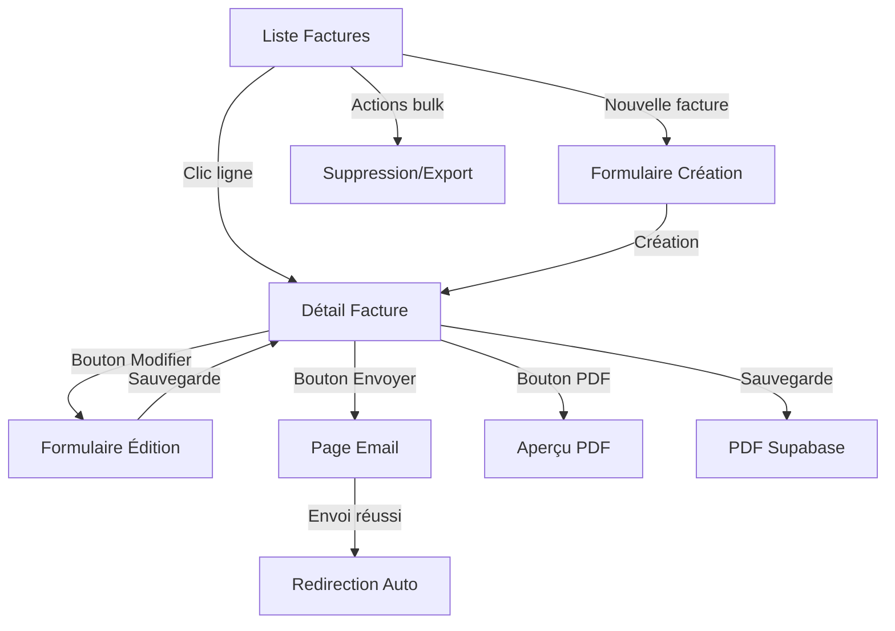

# Module 3.1 : Pages Liste et Détails Factures - Interface React

## 📋 Vue d'ensemble

Ce module documente les pages React frontend pour la gestion des factures : la page liste (`index.tsx`) avec tableau avancé et métriques, et la page détail (`show.tsx`) avec interface professionnelle et gestion des statuts.

## 🏗️ Architecture des Pages

### Structure des Composants

```
pages/factures/
├── index.tsx           # Page liste avec tableau et filtres
├── show.tsx            # Page détail avec actions contextuelles
├── create.tsx          # Formulaire de création
├── edit.tsx            # Formulaire d'édition
└── envoyer-email.tsx   # Interface d'envoi email
```

### Interfaces TypeScript

```typescript
interface Facture {
    id: number;
    numero_facture: string;
    client: {
        id: number;
        nom: string;
        prenom: string;
        email: string;
        telephone?: string;
        entreprise?: {
            id: number;
            nom: string;
            nom_commercial?: string;
        };
    };
    devis?: {
        id: number;
        numero_devis: string;
    };
    administrateur?: {
        id: number;
        name: string;
        email: string;
    };
    objet: string;
    description?: string;
    statut: 'brouillon' | 'en_attente' | 'envoyee' | 'payee' | 'en_retard' | 'annulee';
    date_facture: string;
    date_echeance: string;
    date_paiement?: string;
    montant_ht: number;
    montant_ttc: number;
    taux_tva: number;
    lignes: LigneFacture[];
}

interface LigneFacture {
    id: number;
    service_id?: number;
    quantite: number;
    prix_unitaire_ht: number;
    taux_tva: number;
    montant_ht: number;
    montant_tva: number;
    montant_ttc: number;
    ordre: number;
    description_personnalisee?: string;
    service?: {
        id: number;
        nom: string;
        description: string;
        code?: string;
        unite?: string;
    };
}
```

## 📊 Page Liste - index.tsx (870+ lignes)

### 🎯 Fonctionnalités Principales

1. **📈 Métriques Temps Réel** : 6 cartes de KPIs avec montants et volumes
2. **🔍 Filtrage Avancé** : Recherche, statut, période, délais
3. **📋 Tableau Interactif** : Tri, pagination, sélection multiple
4. **🎨 Badges de Statut** : Couleurs et icônes contextuelles
5. **⚡ Actions Bulk** : Suppression, export en masse
6. **📱 Responsive Design** : Adaptatif mobile et desktop

### Métriques Dashboard

```typescript
// Calcul des métriques temps réel par période
const metrics = useMemo(() => {
    const totalFactures = filteredFacturesByPeriod.length;
    const totalMontant = filteredFacturesByPeriod.reduce((sum, item) => sum + item.montant_ttc, 0);

    const payeeFactures = filteredFacturesByPeriod.filter(item => item.statut === 'payee');
    const envoyeeFactures = filteredFacturesByPeriod.filter(item => item.statut === 'envoyee');
    const retardFactures = filteredFacturesByPeriod.filter(item => item.statut === 'en_retard');
    const annuleeFactures = filteredFacturesByPeriod.filter(item => item.statut === 'annulee');
    const brouillonFactures = filteredFacturesByPeriod.filter(item => item.statut === 'brouillon');

    return {
        total: { count: totalFactures, montant: totalMontant },
        payee: { count: payeeFactures.length, montant: payeeFactures.reduce((sum, item) => sum + item.montant_ttc, 0) },
        envoyee: { count: envoyeeFactures.length, montant: envoyeeFactures.reduce((sum, item) => sum + item.montant_ttc, 0) },
        retard: { count: retardFactures.length, montant: retardFactures.reduce((sum, item) => sum + item.montant_ttc, 0) },
        annulee: { count: annuleeFactures.length, montant: annuleeFactures.reduce((sum, item) => sum + item.montant_ttc, 0) },
        brouillon: { count: brouillonFactures.length, montant: brouillonFactures.reduce((sum, item) => sum + item.montant_ttc, 0) }
    };
}, [filteredFacturesByPeriod]);
```

### Cartes Métriques avec Dégradés

```tsx
{/* Grid des 6 métriques principales */}
<div className="grid grid-cols-1 md:grid-cols-3 lg:grid-cols-6 gap-4">
    {/* Total */}
    <Card className="bg-gradient-to-br from-blue-50 to-blue-100 dark:from-blue-950 dark:to-blue-900 border-blue-200 dark:border-blue-800">
        <CardContent className="p-4">
            <div className="flex items-center justify-between">
                <div>
                    <p className="text-sm font-medium text-blue-600 dark:text-blue-400">Total</p>
                    <p className="text-xs text-blue-500 dark:text-blue-300 mb-1">
                        {metrics.total.count} factures
                    </p>
                    <p className="text-2xl font-bold text-blue-700 dark:text-blue-100">
                        {formatPrice(metrics.total.montant)}
                    </p>
                </div>
                <div className="w-12 h-12 bg-blue-100 dark:bg-blue-800 rounded-lg flex items-center justify-center">
                    <TrendingUp className="h-6 w-6 text-blue-600 dark:text-blue-300" />
                </div>
            </div>
        </CardContent>
    </Card>

    {/* Payées */}
    <Card className="bg-gradient-to-br from-green-50 to-green-100 dark:from-green-950 dark:to-green-900 border-green-200 dark:border-green-800">
        <CardContent className="p-4">
            <div className="flex items-center justify-between">
                <div>
                    <p className="text-sm font-medium text-green-600 dark:text-green-400">Payées</p>
                    <p className="text-xs text-green-500 dark:text-green-300 mb-1">
                        {metrics.payee.count} factures
                    </p>
                    <p className="text-2xl font-bold text-green-700 dark:text-green-100">
                        {formatPrice(metrics.payee.montant)}
                    </p>
                </div>
                <div className="w-12 h-12 bg-green-100 dark:bg-green-800 rounded-lg flex items-center justify-center">
                    <CheckCircle className="h-6 w-6 text-green-600 dark:text-green-300" />
                </div>
            </div>
        </CardContent>
    </Card>

    {/* En attente (orange) */}
    <Card className="bg-gradient-to-br from-orange-50 to-orange-100">
        {/* ... En attente de paiement ... */}
    </Card>

    {/* En retard (rouge) */}
    <Card className="bg-gradient-to-br from-red-50 to-red-100">
        {/* ... Paiements en retard ... */}
    </Card>

    {/* Annulées (violet) */}
    <Card className="bg-gradient-to-br from-purple-50 to-purple-100">
        {/* ... Factures annulées ... */}
    </Card>

    {/* Brouillons (gris) */}
    <Card className="bg-gradient-to-br from-gray-50 to-gray-100">
        {/* ... Factures brouillons ... */}
    </Card>
</div>
```

### Filtres de Période Intelligents

```tsx
// Filtrage par période avec état React
const [periodFilter, setPeriodFilter] = useState<'tous' | 'annee_courante' | 'mois_courant'>('mois_courant');

// Logique de filtrage par date
const filteredFacturesByPeriod = useMemo(() => {
    return factures.filter(item => {
        const itemDate = new Date(item.date_facture);

        switch (periodFilter) {
            case 'tous':
                return true;
            case 'annee_courante':
                return itemDate.getFullYear() === currentYear;
            case 'mois_courant':
                return itemDate.getFullYear() === currentYear &&
                    itemDate.getMonth() + 1 === currentMonth;
            default:
                return true;
        }
    });
}, [factures, periodFilter, currentYear, currentMonth]);

// Sélecteur UI avec icônes
<Select value={periodFilter} onValueChange={setPeriodFilter}>
    <SelectContent>
        <SelectItem value="tous">📈 Tous</SelectItem>
        <SelectItem value="annee_courante">📅 Année en cours</SelectItem>
        <SelectItem value="mois_courant">💰 Mois en cours</SelectItem>
    </SelectContent>
</Select>
```

### Système de Badges de Statut

```tsx
// Styles contextuels par statut
const getStatusStyles = (statut: string) => {
    switch (statut) {
        case 'payee':
            return 'bg-green-100 text-green-800 border-green-200';
        case 'envoyee':
            return 'bg-blue-100 text-blue-800 border-blue-200';
        case 'en_retard':
            return 'bg-red-100 text-red-800 border-red-200';
        case 'annulee':
            return 'bg-gray-100 text-gray-800 border-gray-200';
        case 'brouillon':
            return 'bg-gray-100 text-gray-800 border-gray-200';
        case 'en_attente':
            return 'bg-yellow-100 text-yellow-800 border-yellow-200';
        default:
            return 'bg-gray-100 text-gray-800 border-gray-200';
    }
};

// Icônes par statut
const getStatusIcon = (statut: string) => {
    switch (statut) {
        case 'payee':
            return <CheckCircle className="h-4 w-4" />;
        case 'envoyee':
            return <Clock className="h-4 w-4" />;
        case 'en_retard':
            return <AlertCircle className="h-4 w-4" />;
        case 'annulee':
            return <XCircle className="h-4 w-4" />;
        case 'brouillon':
            return <FileText className="h-4 w-4" />;
        case 'en_attente':
            return <Clock className="h-4 w-4" />;
        default:
            return <Receipt className="h-4 w-4" />;
    }
};

// Badge uniforme dans le tableau
<Badge className={`${getStatusStyles(facture.statut)} border-0`}>
    <span className="flex items-center gap-1">
        {getStatusIcon(facture.statut)}
        {formatStatut(facture.statut)}
    </span>
</Badge>
```

### Tableau avec Tri et Pagination

```tsx
// État de tri multi-colonnes
const [sortField, setSortField] = useState<keyof Facture>('numero_facture');
const [sortDirection, setSortDirection] = useState<'asc' | 'desc'>('desc');

// Gestion du tri intelligent
const handleSort = (field: keyof Facture) => {
    if (sortField === field) {
        setSortDirection(sortDirection === 'asc' ? 'desc' : 'asc');
    } else {
        setSortField(field);
        setSortDirection('asc');
    }
};

// Tri avec gestion des types
filtered.sort((a, b) => {
    let aValue = a[sortField];
    let bValue = b[sortField];

    if (sortField === 'numero_facture' || sortField === 'objet') {
        aValue = (aValue as string).toLowerCase();
        bValue = (bValue as string).toLowerCase();
    }

    // Gérer les valeurs undefined/null
    if (aValue == null && bValue == null) return 0;
    if (aValue == null) return sortDirection === 'asc' ? 1 : -1;
    if (bValue == null) return sortDirection === 'asc' ? -1 : 1;

    if (aValue < bValue) return sortDirection === 'asc' ? -1 : 1;
    if (aValue > bValue) return sortDirection === 'asc' ? 1 : -1;
    return 0;
});

// Headers cliquables
<TableHead className="cursor-pointer sort-button" onClick={() => handleSort('numero_facture')}>
    <div className="flex items-center gap-2">
        Numéro
        <ArrowUpDown className="h-4 w-4" />
    </div>
</TableHead>
```

### Actions en Masse et Export

```tsx
// Sélection multiple avec états
const [selectedFactures, setSelectedFactures] = useState<number[]>([]);

// Sélection/désélection globale
const handleSelectAll = (checked: boolean) => {
    if (checked) {
        setSelectedFactures(paginatedFactures.map(item => item.id));
    } else {
        setSelectedFactures([]);
    }
};

// Actions bulk conditionnelles
{selectedFactures.length > 0 && (
    <div className="form-actions">
        <Button variant="outline" size="sm" onClick={handleDeleteSelected}>
            <Trash2 className="mr-2 h-4 w-4" />
            Supprimer ({selectedFactures.length})
        </Button>
        <Button variant="outline" size="sm">
            <Download className="mr-2 h-4 w-4" />
            Exporter
        </Button>
    </div>
)}
```

### Gestion des Retards de Paiement

```tsx
// Détection automatique des retards
const isRetard = (dateEcheance: string, statut: string) => {
    return new Date(dateEcheance) < new Date() &&
        !['payee', 'annulee'].includes(statut);
};

// Affichage conditionnel dans le tableau
<TableCell>
    <div className={isRetard(facture.date_echeance, facture.statut) ? 'text-red-600 font-medium' : ''}>
        {formatDate(facture.date_echeance)}
        {isRetard(facture.date_echeance, facture.statut) && (
            <div className="text-xs text-red-500">En retard</div>
        )}
    </div>
</TableCell>
```

## 🔍 Page Détail - show.tsx (990+ lignes)

### 🎯 Interface Professionnelle

La page de détail présente une interface professionnelle inspirée d'un vrai document fiscal avec :

1. **📊 Header Contextuel** : Statut, échéances, délais
2. **🎛️ Actions Contextuelles** : Modifier, envoyer, marquer payée
3. **📄 Aperçu PDF** : Intégration React PDF native
4. **💾 Sauvegarde Intelligente** : PdfSaveButton avec Supabase
5. **📧 Workflow Email** : Intégré avec templates
6. **🔄 Gestion Statuts** : Dropdown avec validation métier

### Header Adaptatif par Statut

```tsx
// Headers contextuels selon le statut
{facture.statut === 'payee' ? (
    // ✅ Facture payée
    <div className="flex items-center justify-between">
        <div>
            <h3 className="font-semibold text-lg mb-1 text-green-700">✅ Facture payée</h3>
            <p className="text-sm text-gray-600">
                Cette facture a été payée le {facture.date_paiement ? formatDateShort(facture.date_paiement) : 'N/A'}
            </p>
        </div>
        <div className="text-right">
            <div className="text-2xl font-bold text-green-600">
                {formatPrice(facture.montant_ttc)}
            </div>
            <div className="text-sm text-gray-500">
                Montant payé
            </div>
        </div>
    </div>
) : facture.statut === 'envoyee' ? (
    // 📧 Facture envoyée
    <div className="flex items-center justify-between">
        <div>
            <h3 className="font-semibold text-lg mb-1 text-blue-700">📧 Facture envoyée</h3>
            <p className="text-sm text-gray-600">
                Cette facture a été envoyée au client et attend le paiement
            </p>
            <div className="flex items-center gap-4 mt-2 text-sm text-gray-500">
                <div className="flex items-center gap-1">
                    <Calendar className="h-4 w-4" />
                    <span>Émise: {formatDateShort(facture.date_facture)}</span>
                </div>
                <div className="flex items-center gap-1">
                    <Clock className="h-4 w-4" />
                    <span className={isRetard() ? 'text-red-600 font-medium' : ''}>
                        Échéance: {formatDateShort(facture.date_echeance)}
                    </span>
                </div>
            </div>
        </div>
        <div className="text-right">
            <div className="text-2xl font-bold text-blue-600">
                {formatPrice(facture.montant_ttc)}
            </div>
            <div className="text-sm text-gray-500">
                En attente de paiement
            </div>
        </div>
    </div>
) : facture.statut === 'en_retard' ? (
    // ⚠️ Facture en retard
    <div className="flex items-center justify-between">
        <div>
            <h3 className="font-semibold text-lg mb-1 text-red-700">⚠️ Facture en retard</h3>
            <p className="text-sm text-gray-600">
                Cette facture n'a pas été payée dans les délais
            </p>
            <div className="text-sm text-red-600 font-medium mt-1">
                {getDelaiPaiement()}
            </div>
        </div>
        <div className="text-right">
            <div className="text-2xl font-bold text-red-600">
                {formatPrice(facture.montant_ttc)}
            </div>
            <div className="text-sm text-red-500">
                Paiement en retard
            </div>
        </div>
    </div>
)}
```

### Calcul des Délais Intelligents

```tsx
// Calcul automatique des délais et retards
const getDelaiPaiement = () => {
    const dateEcheance = new Date(facture.date_echeance);
    const aujourdhui = new Date();
    const diffTime = dateEcheance.getTime() - aujourdhui.getTime();
    const diffDays = Math.ceil(diffTime / (1000 * 60 * 60 * 24));

    if (diffDays < 0) {
        return `En retard de ${Math.abs(diffDays)} jour${Math.abs(diffDays) > 1 ? 's' : ''}`;
    } else if (diffDays === 0) {
        return 'Échéance aujourd\'hui';
    } else {
        return `${diffDays} jour${diffDays > 1 ? 's' : ''} restant${diffDays > 1 ? 's' : ''}`;
    }
};

// Détection de retard
const isRetard = () => {
    return new Date(facture.date_echeance) < new Date() &&
        !['payee', 'annulee'].includes(facture.statut);
};
```

### Actions Contextuelles par Statut

```tsx
// Actions conditionnelles selon le statut de la facture
<div className="flex flex-wrap items-center gap-2">
    {/* Modification uniquement pour brouillons et en_attente */}
    {['brouillon', 'en_attente'].includes(facture.statut) && (
        <Button asChild className="h-10 px-4">
            <Link href={`/factures/${facture.id}/edit`}>
                <Edit className="mr-2 h-4 w-4" />
                Modifier
            </Link>
        </Button>
    )}

    {/* Envoi email pour tous sauf payées et annulées */}
    {!['payee', 'annulee'].includes(facture.statut) && (
        <Button className="bg-green-600 hover:bg-green-700 h-10 px-4" asChild>
            <Link href={`/factures/${facture.id}/envoyer-email`}>
                <Send className="mr-2 h-4 w-4" />
                Envoyer par email
            </Link>
        </Button>
    )}

    {/* Marquer payée uniquement pour les envoyées */}
    {facture.statut === 'envoyee' && (
        <Button className="bg-blue-600 hover:bg-blue-700 h-10 px-4" onClick={handleMarquerPayee}>
            <CheckCircle className="mr-2 h-4 w-4" />
            Marquer payée
        </Button>
    )}
</div>
```

### Gestion des Statuts Dropdown

```tsx
// Options de statut avec validation métier
const statutOptions = [
    { value: 'brouillon', label: 'Brouillon', icon: '📝' },
    { value: 'en_attente', label: 'En attente', icon: '⏳' },
    { value: 'envoyee', label: 'Envoyée', icon: '📧' },
    { value: 'payee', label: 'Payée', icon: '✅' },
    { value: 'en_retard', label: 'En retard', icon: '⚠️' },
    { value: 'annulee', label: 'Annulée', icon: '❌' }
];

// Changement de statut avec validation
const handleStatutChange = (nouveauStatut: string) => {
    router.patch(`/factures/${facture.id}/changer-statut`, {
        statut: nouveauStatut
    }, {
        onSuccess: () => {
            toast.success(`Statut changé vers : ${formatStatut(nouveauStatut)}`);
        },
        onError: () => {
            toast.error('Erreur lors du changement de statut');
        }
    });
};

// Dropdown uniforme
<Select value={facture.statut} onValueChange={handleStatutChange}>
    <SelectTrigger className="w-full h-10 border-gray-300 hover:border-amber-400 bg-white transition-colors">
        <SelectValue placeholder="Sélectionner un statut" />
    </SelectTrigger>
    <SelectContent>
        {statutOptions.map((option) => (
            <SelectItem key={option.value} value={option.value}>
                <span className="flex items-center gap-2">
                    <span>{option.icon}</span>
                    <span>{option.label}</span>
                </span>
            </SelectItem>
        ))}
    </SelectContent>
</Select>
```

### Intégration PDF Native

```tsx
// Modal d'aperçu PDF avec React PDF
const [isPdfModalOpen, setIsPdfModalOpen] = useState(false);

const handlePreviewPdf = () => {
    setIsPdfModalOpen(true);
};

// Bouton d'aperçu
<Button
    variant="outline"
    size="sm"
    className="h-10 px-4 bg-blue-50 border-blue-200 text-blue-700 hover:bg-blue-100"
    onClick={handlePreviewPdf}
>
    <Eye className="mr-2 h-4 w-4" />
    Aperçu PDF
</Button>

// PdfSaveButton pour sauvegarde Supabase
<PdfSaveButton
    pdfComponent={<FacturePdfPreview facture={facture} madinia={madinia} />}
    saveRoute={route('factures.save-react-pdf', facture.id)}
    filename={`${facture.numero_facture}.pdf`}
    type="facture"
    className="!bg-green-600 hover:!bg-green-700 active:!bg-green-800 focus:!border-green-900 focus:!ring-green-300"
>
    Sauvegarder
</PdfSaveButton>
```

### Format Invoice Professionnel

```tsx
// Layout style facture avec informations Madinia
<Card className="w-full max-w-5xl mx-auto bg-white shadow-lg">
    <CardContent className="p-12 lg:p-16">
        {/* Header avec logo et numéro */}
        <div className="flex justify-between items-start mb-8">
            <div>
                <div className="flex items-center gap-3 mb-4">
                    <div className="w-36 h-12 flex items-center justify-center">
                        
                        
                    </div>
                </div>
            </div>
            <div className="text-right">
                <div className={`px-4 py-2 rounded-lg inline-block mb-2 ${getStatusStyles(facture.statut)}`}>
                    <span className="text-sm font-medium">
                        {formatStatut(facture.statut)}
                    </span>
                </div>
                <h2 className="text-3xl font-bold text-gray-900">{facture.numero_facture}</h2>
            </div>
        </div>

        {/* Sections From et To comme vraie facture */}
        <div className="grid grid-cols-1 md:grid-cols-2 gap-8 mb-8">
            {/* From section */}
            <div>
                <h3 className="text-sm font-semibold text-gray-700 mb-3">Facture de</h3>
                <div className="space-y-1">
                    <p className="font-semibold text-gray-900">
                        {madinia?.name || 'Madin.IA'}
                    </p>
                    {madinia?.adresse && (
                        <p className="text-gray-600">{madinia.adresse}</p>
                    )}
                    {madinia?.pays && (
                        <p className="text-gray-600">{madinia.pays}</p>
                    )}
                    {madinia?.email && (
                        <p className="text-gray-600">{madinia.email}</p>
                    )}
                    {madinia?.siret && (
                        <p className="text-gray-600">SIRET: {madinia.siret}</p>
                    )}
                </div>
            </div>

            {/* To section */}
            <div>
                <h3 className="text-sm font-semibold text-gray-700 mb-3">Facture à</h3>
                <div className="space-y-1">
                    <p className="font-semibold text-gray-900">
                        {facture.client.prenom} {facture.client.nom}
                    </p>
                    {facture.client.entreprise && (
                        <p className="text-gray-600">
                            {facture.client.entreprise.nom_commercial || facture.client.entreprise.nom}
                        </p>
                    )}
                    <p className="text-gray-600">{facture.client.email}</p>
                    {facture.client.telephone && (
                        <p className="text-gray-600">{facture.client.telephone}</p>
                    )}
                </div>
            </div>
        </div>
    </CardContent>
</Card>
```

### Tableau des Lignes Professionnel

```tsx
// Tableau des lignes avec calculs automatiques
<div className="overflow-hidden rounded-lg border border-gray-200">
    <table className="w-full">
        <thead className="bg-gray-50">
            <tr>
                <th className="px-6 py-3 text-left text-xs font-medium text-gray-500 uppercase tracking-wider">
                    #
                </th>
                <th className="px-6 py-3 text-left text-xs font-medium text-gray-500 uppercase tracking-wider">
                    Description
                </th>
                <th className="px-6 py-3 text-center text-xs font-medium text-gray-500 uppercase tracking-wider">
                    Qté
                </th>
                <th className="px-6 py-3 text-right text-xs font-medium text-gray-500 uppercase tracking-wider">
                    Prix unitaire
                </th>
                <th className="px-6 py-3 text-right text-xs font-medium text-gray-500 uppercase tracking-wider">
                    Total
                </th>
            </tr>
        </thead>
        <tbody className="bg-white divide-y divide-gray-200">
            {facture.lignes && facture.lignes.length > 0 ? (
                facture.lignes
                    .sort((a, b) => a.ordre - b.ordre)
                    .map((ligne, index) => (
                        <tr key={ligne.id} className="hover:bg-gray-50">
                            <td className="px-6 py-4 whitespace-nowrap text-sm text-gray-900">
                                {ligne.ordre}
                            </td>
                            <td className="px-6 py-4 text-sm text-gray-900">
                                <div className="font-medium">
                                    {ligne.service?.nom || 'Service personnalisé'}
                                </div>
                                <div className="text-gray-500 text-xs mt-1">
                                    {ligne.description_personnalisee || ligne.service?.description || 'Service personnalisé'}
                                </div>
                                {ligne.service?.unite && (
                                    <div className="text-gray-400 text-xs mt-1">
                                        Unité : {formatUnite(ligne.service.unite, ligne.quantite)}
                                    </div>
                                )}
                            </td>
                            <td className="px-6 py-4 whitespace-nowrap text-sm text-gray-900 text-center">
                                {ligne.quantite}
                            </td>
                            <td className="px-6 py-4 whitespace-nowrap text-sm text-gray-900 text-right">
                                {formatPrice(ligne.prix_unitaire_ht)}
                            </td>
                            <td className="px-6 py-4 whitespace-nowrap text-sm text-gray-900 text-right font-medium">
                                {formatPrice(ligne.montant_ttc)}
                            </td>
                        </tr>
                    ))
            ) : (
                <tr>
                    <td colSpan={5} className="px-6 py-8 text-center text-gray-500">
                        Aucune ligne de facturation
                    </td>
                </tr>
            )}
        </tbody>
    </table>
</div>
```

## 🔄 Workflow Intégré

### Navigation Fluide



### Intégration avec Backend

1. **📊 Données temps réel** : Props Inertia avec relations complètes
2. **🔄 Actions Inertia** : PATCH/DELETE avec feedback toast
3. **📧 Workflow emails** : Intégration templates Blade
4. **📄 PDF React** : Génération client + sauvegarde serveur
5. **🔔 Notifications** : Toast Sonner pour feedback utilisateur

## 📱 Responsive Design

### Breakpoints Adaptatifs

- **📱 Mobile (< 768px)** : 1 colonne, cards stack, actions condensées
- **📟 Tablet (768-1024px)** : 2-3 colonnes, navigation simplifiée  
- **🖥️ Desktop (> 1024px)** : Grille complète 6 colonnes, tous détails

### Optimisations Mobile

```tsx
// Grid responsive pour métriques
<div className="grid grid-cols-1 md:grid-cols-3 lg:grid-cols-6 gap-4">

// Actions responsive
<div className="flex flex-col sm:flex-row sm:items-center sm:justify-between gap-4">

// Tableau responsive avec scroll horizontal
<div className="rounded-md border table-responsive">
    <Table>
        {/* ... contenu tableau ... */}
    </Table>
</div>
```

## 🎨 Design System Unifié

### Classes CSS Génériques

Les pages utilisent le système CSS généralisé d'`app.css` :

- `.page-container` : Layout principal
- `.page-header` : En-têtes avec dégradé
- `.card-elevated` : Cartes avec ombre
- `.badge-success/.badge-warning/.badge-error` : Badges contextuels
- `.table-responsive` : Tableaux adaptatifs
- `.action-button` : Boutons d'action uniformes

### Couleurs Thématiques

- **🔵 Bleu** : Total, envoyée, actions principales
- **🟢 Vert** : Payée, succès, validation
- **🟠 Orange** : En attente, avertissement
- **🔴 Rouge** : En retard, erreur, urgence
- **🟣 Violet** : Annulée, archives
- **⚫ Gris** : Brouillon, inactif

## 📊 Performance et Optimisation

### Mémorisation React

```tsx
// Métriques calculées avec useMemo
const metrics = useMemo(() => {
    // ... calculs complexes ...
}, [filteredFacturesByPeriod]);

// Pagination optimisée
const paginatedFactures = useMemo(() => {
    const startIndex = (currentPage - 1) * itemsPerPage;
    return filteredAndSortedFactures.slice(startIndex, startIndex + itemsPerPage);
}, [filteredAndSortedFactures, currentPage, itemsPerPage]);
```

### Lazy Loading

- **📄 PDF Modal** : Chargé uniquement à l'ouverture
- **🖼️ Images** : Loading différé pour logos
- **📊 Métriques** : Calcul à la demande selon filtre période

## 🔗 Intégrations

### API Routes

- `GET /factures` : Liste avec métriques
- `GET /factures/{id}` : Détail complet avec relations
- `PATCH /factures/{id}/changer-statut` : Changement statut
- `PATCH /factures/{id}/marquer-payee` : Marquer comme payée
- `DELETE /factures/{id}` : Suppression avec vérifications

### Templates Email

- Liens directs vers `envoyer-email.tsx`
- Intégration avec `FactureClientMail` et `FactureAdminMail`
- Redirection automatique après envoi

### Système PDF

- **Aperçu** : PDFViewer React-PDF
- **Sauvegarde** : PdfSaveButton vers Supabase
- **Download** : PDFDownloadLink natif

## 📋 Résumé Module 3.1

### Caractéristiques Principales

1. **📊 Interface Complète** : Liste + détail avec toutes fonctionnalités
2. **🎯 UX Optimisée** : Actions contextuelles, feedback immédiat
3. **📱 Responsive Design** : Adaptatif toutes plateformes
4. **🔄 Workflow Métier** : Statuts, délais, emails intégrés
5. **🎨 Design Professionnel** : Style facture, couleurs thématiques
6. **⚡ Performance** : Mémorisation, lazy loading, optimisations

### Différences vs Devis

- **🏷️ Badges fiscaux** : 6 statuts vs 4 pour devis
- **📅 Gestion échéances** : Délais automatiques, retards
- **💰 Métriques avancées** : Encaissements, période, analyse
- **📄 Format professionnel** : Layout facture vs devis
- **🔄 Workflow paiement** : Marquer payée, relances

Cette architecture garantit une interface utilisateur complète et professionnelle pour la gestion des factures avec toutes les fonctionnalités métier nécessaires. Les composants sont optimisés, réutilisables et s'intègrent parfaitement avec le backend Laravel.
