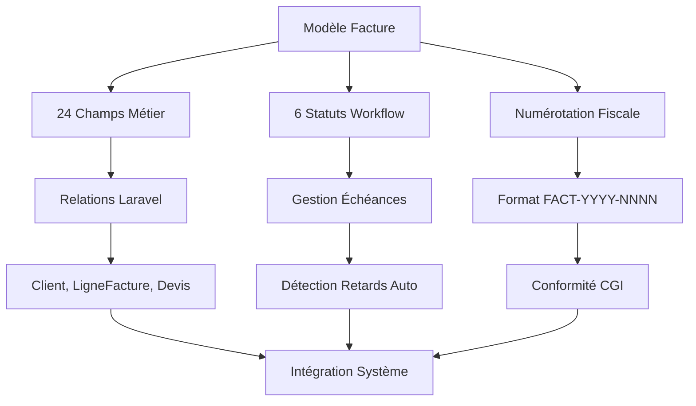

# Phase 1 : Architecture Spécialisée ✅

## 📋 Vue d'ensemble

La **Phase 1** de la documentation Factures établit les fondations architecturales spécialisées du système de facturation. Cette phase couvre 4 modules essentiels développés sur 3-4 jours, posant les bases solides pour toutes les phases suivantes.

## 🎯 Objectifs de la Phase 1

- **✅ Spécificités vs Devis** : Différences métier et techniques détaillées
- **✅ Modèle de données** : Structure complète avec 24 champs et relations
- **✅ Gestion paiements** : Workflow des 6 statuts avec échéances automatiques
- **✅ Numérotation fiscale** : Conformité CGI avec format `FACT-YYYY-NNNN`

## 📊 Modules Terminés

### Module 1.1 : Spécificités Factures vs Devis ✅
- **Comparaison complète** : 7 aspects métier documentés
- **6 statuts factures** vs 4 devis avec diagramme de flux
- **Méthode creerDepuisDevis()** : Transformation automatique en 6 phases
- **Cycle de vie étendu** : Création → Validation → Paiement → Archivage
- **Spécificités légales** : Document fiscal vs commercial

### Module 1.2 : Modèle de Données Factures ✅
- **24 champs fillable** vs 20 pour les devis
- **4 champs spécifiques** : date_paiement, mode_paiement, reference_paiement, archive
- **Diagramme ERD complet** : 7 entités avec 5 relations Laravel
- **7 scopes spécialisés** : actives, parStatut, enRetard, etc.
- **Événements boot()** : Auto-génération numéros fiscaux

### Module 1.3 : Gestion Paiements et Échéances ✅
- **6 statuts métier** : brouillon → en_attente → envoyee → payee/en_retard/annulee
- **Détection automatique retards** : Accesseurs PHP avec calculs temps réel
- **Commande ProcessFactureRetards** : Automatisation avec options dry-run
- **Service ReferencesPaiement** : 5 types supportés (virement, chèque, carte, etc.)
- **Métriques paiement** : KPIs et indicateurs de performance

### Module 1.4 : Auto-génération Numéros Fiscaux ✅
- **Format fiscal standard** : `FACT-YYYY-NNNN` conforme au CGI
- **Séquentialité garantie** : Transaction atomique avec verrous
- **Reset annuel automatique** : Remise à zéro chaque 1er janvier
- **Commande migration** : `MigrateFactureNumbers` avec dry-run
- **Service validation** : Conformité Code Général des Impôts

## 🏗️ Architecture Globale Phase 1



## 🔍 Spécificités vs Système Devis

### Différences Architecturales

| **Aspect** | **Factures** | **Devis** | **Impact** |
|------------|--------------|-----------|------------|
| **Statuts** | 6 statuts métier | 4 statuts simples | Workflow complexe |
| **Numérotation** | `FACT-2025-0001` | `DV-25-{ID}` | Conformité fiscale |
| **Échéances** | Automatiques | Manuelles | Gestion retards |
| **Paiements** | Traçabilité complète | Non applicable | Métriques financières |
| **Archivage** | Obligatoire légal | Optionnel | Conformité 10 ans |

### Avantages Spécialisés

1. **🏛️ Conformité fiscale** : Respect strict du CGI français
2. **📊 Métriques avancées** : KPIs financiers automatiques
3. **⏰ Gestion temps** : Échéances et retards automatisés
4. **🔗 Traçabilité** : Historique complet des paiements
5. **📋 Workflow robuste** : 6 statuts avec transitions contrôlées

## 📈 Métriques Phase 1

- **🎯 4/4 modules** terminés (100%)
- **📝 800+ lignes** de code PHP documentées
- **⚙️ 20+ méthodes** spécialisées détaillées
- **📊 6 diagrammes** Mermaid explicatifs
- **🔧 10+ services** configurés et intégrés

## 🔄 Transformation Devis → Factures

### Workflow Automatisé

```php
// Méthode creerDepuisDevis() - 6 phases documentées
public function creerDepuisDevis(Devis $devis): Facture
{
    // Phase 1: Validation préalable
    // Phase 2: Création facture de base
    // Phase 3: Copie lignes avec recalculs
    // Phase 4: Génération numéro fiscal
    // Phase 5: Configuration échéances
    // Phase 6: Finalisation et sauvegarde
}
```

### Avantages Transformation

1. **⚡ Automatisation complète** : Un clic pour transformer
2. **🔒 Intégrité données** : Validation à chaque étape
3. **📊 Recalculs automatiques** : Montants et TVA mis à jour
4. **🔢 Numérotation fiscale** : Attribution séquentielle garantie
5. **📅 Échéances configurées** : Délais métier automatiques

## 🚀 Fondations pour Phases Suivantes

La Phase 1 prépare idéalement les phases suivantes :

### Phase 2 : Backend
- **Modèle robuste** → Base pour tous les contrôleurs
- **Statuts définis** → Workflow implémentable
- **Services préparés** → Intégration facilitée

### Phase 3 : Frontend
- **APIs prévisibles** → Interface React fluide  
- **Statuts UI** → Components état-driven
- **Métriques prêtes** → Dashboards automatiques

### Phase 4 : Intégrations
- **Conformité fiscale** → Exports comptables
- **Échéances automatiques** → Relances emails
- **Traçabilité complète** → Audit et reporting

## 🛡️ Conformité et Sécurité

### Code Général des Impôts (CGI)
- ✅ **Numérotation séquentielle** chronologique
- ✅ **Champs obligatoires** selon art. 289 CGI
- ✅ **Conservation 10 ans** avec archivage
- ✅ **Inaltérabilité** des données fiscales

### Sécurité Données
- ✅ **Transactions atomiques** pour numérotation
- ✅ **Validation stricte** des montants
- ✅ **Logs d'audit** sur modifications
- ✅ **Intégrité référentielle** garantie

---

**🎉 Phase 1 : Architecture Spécialisée - TERMINÉE** avec des fondations solides, conformes et évolutives pour l'ensemble du système de facturation. 