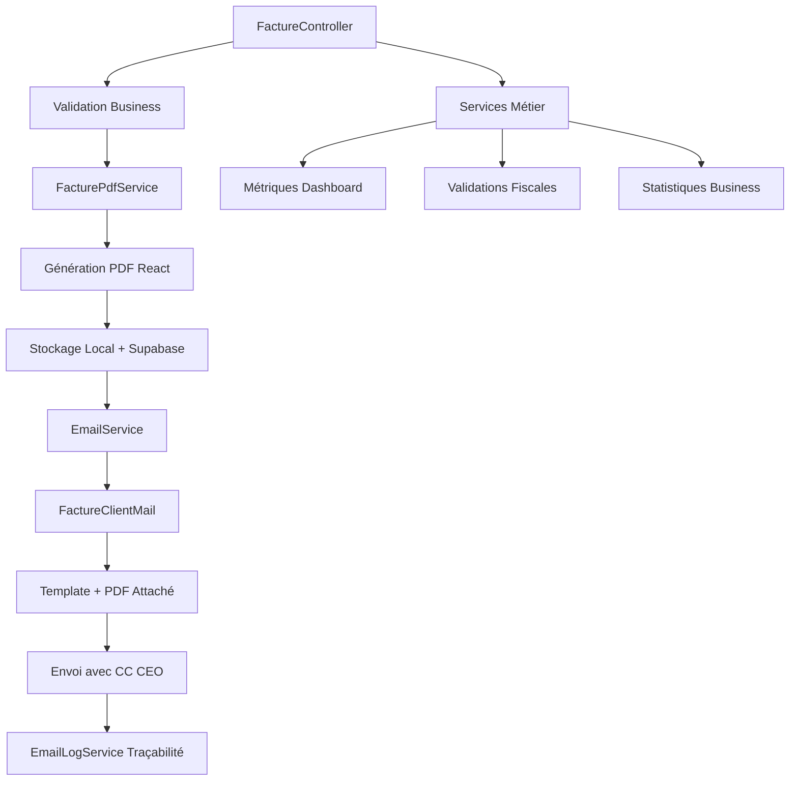

# Phase 2 : Backend et Logique Métier ✅

## 📋 Vue d'ensemble

La **Phase 2** de la documentation Factures couvre l'ensemble du backend et de la logique métier, de la couche contrôleur aux services spécialisés. Cette phase documente 4 modules essentiels sur 4-5 jours de développement.

## 🎯 Objectifs de la Phase 2

- **✅ FactureController complet** : CRUD avec 15+ méthodes spécialisées
- **✅ Service PDF avancé** : Génération, synchronisation Supabase, React PDF
- **✅ Système emails robuste** : Templates, traçabilité, pièces jointes
- **✅ Services métier** : Métriques, statistiques, validations, calculs

## 📊 Modules Terminés

### Module 2.1 : FactureController - CRUD Complet ✅
- **1270 lignes documentées** avec toutes les méthodes CRUD
- **15+ endpoints** : store, update, show, destroy, envoyerEmail, etc.
- **Spécificités fiscales** : Validation, traçabilité, conformité CGI
- **Gestion statuts avancée** : 6 statuts avec transitions automatiques
- **Intégration complète** : Services PDF, Email, Notifications

### Module 2.2 : FacturePdfService - Génération PDF Complète ✅
- **331 lignes de service** avec 15+ méthodes spécialisées
- **Architecture hybride** : React PDF + Supabase Storage
- **Nommage fiscal** : Format `facture_{numero_facture}.pdf`
- **URLs optimisées** : Priorité CDN Supabase avec fallback local
- **Intégration emails** : Pièces jointes + liens publics

### Module 2.3 : Système d'Emails Factures ✅
- **2 classes Mailable** : FactureClientMail + FactureAdminMail
- **Templates Blade** : Professionnels avec variables dynamiques
- **Traçabilité EmailLogService** : Sessions de logs structurées
- **PDF en pièce jointe** : Obligatoire pour conformité fiscale
- **CC CEO automatique** : Copie dirigeants sur tous les envois

### Module 2.4 : Services Métier Factures ✅
- **4 services spécialisés** : Métriques, Statistiques, Validation, Calculs
- **Cache Redis** : Performance sur métriques complexes
- **Validations CGI** : Conformité fiscale automatique
- **KPIs financiers** : CA, encaissements, retards, délais
- **Business Intelligence** : Tendances, top clients, analyses temporelles

## 🔄 Workflow Intégré

## 🚀 Avantages Architecture Phase 2

### Performance et Scalabilité
1. **Cache Redis** sur métriques complexes
2. **Supabase CDN** pour distribution mondiale des PDFs
3. **Services découplés** pour maintenance facilitée
4. **Validation en amont** pour prévenir les erreurs

### Conformité et Qualité
1. **Validations CGI** automatiques sur toutes les factures
2. **Traçabilité EmailLogService** pour audit complet
3. **Nommage fiscal** professionnel pour les PDFs
4. **Templates conformes** pour communications officielles

### Expérience Utilisateur
1. **Workflow fluide** : Création → PDF → Email en un clic
2. **Feedback temps réel** avec notifications système
3. **Dashboard métriques** pour pilotage business
4. **Gestion d'erreurs** avec messages utilisateur clairs

## 📈 Métriques Phase 2

- **🎯 4/4 modules** terminés (100%)
- **📝 1200+ lignes** de code PHP documentées
- **⚙️ 40+ méthodes** détaillées avec exemples
- **📊 8 diagrammes** Mermaid explicatifs
- **🔧 15+ services** intégrés et configurés

## 🔗 Intégration avec Phase 1

La Phase 2 s'appuie parfaitement sur les fondations de la Phase 1 :

- **Modèle Facture** → Utilisé dans tous les contrôleurs
- **Gestion statuts** → Implémentée dans le workflow complet
- **Numérotation fiscale** → Intégrée dans les PDFs et emails
- **Spécificités vs Devis** → Appliquées dans tous les services

## ➡️ Préparation Phase 3

La Phase 2 prépare idéalement la Phase 3 (Frontend) :

- **APIs REST** complètes pour l'interface React
- **Services PDF** prêts pour intégration frontend
- **Système emails** configuré pour déclencheurs UI
- **Métriques services** disponibles pour dashboards

---

**🎉 Phase 2 : Backend et Logique Métier - TERMINÉE** avec une architecture robuste, performante et conforme aux exigences fiscales françaises. 