# 📋 Planning de Rédaction - Documentation Factures

## 🎯 Vue d'ensemble du Projet

La documentation technique des **Factures** du Dashboard Madinia est organisée en **5 phases distinctes** pour couvrir l'intégralité du système de facturation. Cette approche méthodique garantit une documentation exhaustive et professionnelle.

## ✅ Phase 1 : Architecture Spécialisée (TERMINÉE - 4/4 modules)

**📅 Durée** : 3-4 jours  
**🎯 Objectif** : Documenter les spécificités et l'architecture des factures par rapport aux devis  
**📊 Statut** : **100% COMPLÈTE** ✅

### Modules Terminés

| Module | Titre | Statut | Durée | Contenu Principal |
|--------|-------|--------|--------|------------------|
| **1.1** | Spécificités Factures vs Devis | ✅ **TERMINÉ** | 1 jour | Différences architecturales, workflow fiscal, intégrations |
| **1.2** | Modèle de Données Factures | ✅ **TERMINÉ** | 1 jour | Structure table (24 champs), relations, méthode creerDepuisDevis() |
| **1.3** | Gestion Paiements et Échéances | ✅ **TERMINÉ** | 1-1,5 jour | 6 statuts métier, calcul automatique retards, références paiement |
| **1.4** | Auto-génération Numéros Fiscaux | ✅ **TERMINÉ** | 0,5 jour | Format FACT-YYYY-NNNN, conformité CGI, migrations |

### 🎉 Réalisations Phase 1

- **📄 4 modules** complets avec documentation technique approfondie
- **🔍 Analyse comparative** détaillée factures vs devis  
- **📊 Diagrammes Mermaid** pour l'architecture et les workflows
- **💻 Code PHP complet** avec méthodes, validations et commandes
- **⚖️ Conformité fiscale** documentée selon le Code Général des Impôts
- **🔄 Outils de migration** pour les formats existants

## ✅ Phase 2 : Backend et Logique Métier (TERMINÉE - 4/4 modules)

**📅 Durée** : 4-5 jours  
**🎯 Objectif** : Documenter les contrôleurs, services et logique métier backend  
**📊 Statut** : **100% COMPLÈTE** ✅

### Modules Terminés

| Module | Titre | Statut | Durée | Contenu Principal |
|--------|-------|--------|--------|------------------|
| **2.1** | FactureController - CRUD Complet | ✅ **TERMINÉ** | 1,5 jour | 1270 lignes, 15+ méthodes, spécificités fiscales |
| **2.2** | FacturePdfService Spécialisé | ✅ **TERMINÉ** | 1 jour | 331 lignes, React PDF, Supabase Storage, nommage fiscal |
| **2.3** | Système d'Emails Factures | ✅ **TERMINÉ** | 1 jour | 2 Mailables, templates Blade, traçabilité EmailLogService |
| **2.4** | Services Métier Avancés | ✅ **TERMINÉ** | 1,5 jour | 4 services (Métriques, Stats, Validation, Calculs), Cache Redis |

### 🎉 Réalisations Phase 2

- **📄 4 modules** backend complets avec architecture robuste
- **🎮 FactureController** avec 15+ méthodes spécialisées documentées
- **📄 FacturePdfService** avec React PDF et stockage Supabase
- **📧 Système emails** avec templates professionnels et traçabilité
- **📊 Services métier** avec métriques, validations CGI et cache Redis
- **🔧 Intégrations** complètes entre tous les services backend

## 📱 Phase 3 : Interface React Frontend (🚀 DÉMARRÉE)

**📅 Durée estimée** : 3-4 jours  
**🎯 Objectif** : Documenter l'interface utilisateur React spécialisée  
**📊 Statut** : **1/4 modules (25%)** 🚀

### Modules Prévus

| Module | Titre | Statut | Durée | Description |
|--------|-------|--------|--------|-------------|
| **3.1** | Pages Liste et Détails Factures | ✅ **TERMINÉ** | 1 jour | Tableaux, filtres, statuts, indicateurs financiers |
| **3.2** | Formulaires Création/Édition | ⏳ **À VENIR** | 1 jour | Validation client, calculs automatiques, lignes |
| **3.3** | Interface PDF React Spécialisée | ⏳ **À VENIR** | 1 jour | Templates factures, prévisualisation, téléchargement |
| **3.4** | Composants Métier Factures | ⏳ **À VENIR** | 1 jour | Badges statuts, calculateurs, widgets paiement |

### 🎉 Réalisations Phase 3 (Module 3.1)

- **📊 Page Liste Complète** : Métriques temps réel, filtres avancés, tableaux interactifs
- **🔍 Interface Détail** : Layout professionnel, actions contextuelles, gestion statuts
- **📱 Responsive Design** : Adaptatif mobile/desktop avec grilles flexibles
- **🎨 Design System** : Badges de statut, couleurs thématiques, CSS génériques
- **⚡ Performance** : Mémorisation React, lazy loading, optimisations
- **🔄 Workflow Intégré** : Navigation fluide, actions Inertia, feedback toast

## 🔗 Phase 4 : Intégrations et Automatisations (À VENIR)

**📅 Durée estimée** : 3-4 jours  
**🎯 Objectif** : Documenter les intégrations système et automatisations

### Modules Prévus

| Module | Titre | Durée | Description |
|--------|-------|--------|-------------|
| **4.1** | Transformation Devis → Factures | 1 jour | Processus automatisé, validation, traçabilité |
| **4.2** | Système de Notifications Enrichi | 1 jour | Alertes échéances, relances, notifications admin |
| **4.3** | Historique et Audit Trail | 1 jour | Traçabilité complète, conformité légale |
| **4.4** | Intégrations Externes | 1 jour | APIs comptables, banques, systèmes de paiement |

## 🧪 Phase 5 : Tests et Optimisation (À VENIR)

**📅 Durée estimée** : 2-3 jours  
**🎯 Objectif** : Documenter la stratégie de tests et optimisations

### Modules Prévus

| Module | Titre | Durée | Description |
|--------|-------|--------|-------------|
| **5.1** | Tests Backend Factures | 1 jour | Tests unitaires, intégration, factories |
| **5.2** | Tests Frontend Spécialisés | 1 jour | Tests composants, E2E workflows paiement |
| **5.3** | Performance et Monitoring | 1 jour | Optimisations, cache, métriques temps réel |

## 📊 Progression Globale du Projet

```mermaid
gantt
    title Documentation Factures - Planning Global
    dateFormat X
    axisFormat %d

    section Phase 1 - Architecture ✅
    Module 1.1 Spécificités vs Devis    :done, p1m1, 0, 1
    Module 1.2 Modèle de Données        :done, p1m2, 1, 2  
    Module 1.3 Paiements & Échéances    :done, p1m3, 2, 3
    Module 1.4 Numéros Fiscaux          :done, p1m4, 3, 4

    section Phase 2 - Backend ✅
    Module 2.1 FactureController        :done, p2m1, 4, 6
    Module 2.2 FacturePdfService        :done, p2m2, 6, 7
    Module 2.3 Emails Factures          :done, p2m3, 7, 8
    Module 2.4 Services Métier          :done, p2m4, 8, 10

    section Phase 3 - Frontend 📱
    Module 3.1 Pages & Listes           :p3m1, 10, 11
    Module 3.2 Formulaires              :p3m2, 11, 12
    Module 3.3 Interface PDF             :p3m3, 12, 13
    Module 3.4 Composants Métier        :p3m4, 13, 14

    section Phase 4 - Intégrations 🔗
    Module 4.1 Transformation           :p4m1, 14, 15
    Module 4.2 Notifications            :p4m2, 15, 16
    Module 4.3 Historique               :p4m3, 16, 17
    Module 4.4 APIs Externes            :p4m4, 17, 18

    section Phase 5 - Tests 🧪
    Module 5.1 Tests Backend            :p5m1, 18, 19
    Module 5.2 Tests Frontend           :p5m2, 19, 20
    Module 5.3 Performance              :p5m3, 20, 21
```

## 🏆 Statistiques Actuelles

### Phases 1+2+3 (Partielle) Complétées ✅

- **📚 Modules documentés** : 9/19 (47%)
- **📄 Pages créées** : 11 fichiers Markdown complets (+ 2 pages synthèse)
- **💻 Lignes de code documentées** : 2000+ lignes PHP + 1800+ lignes React
- **📊 Diagrammes créés** : 12+ diagrammes Mermaid
- **⏱️ Temps de rédaction** : 8-10 jours (phases 1+2 + module 3.1)

### Objectifs Globaux

- **📖 Documentation complète** : 19 modules sur 5 phases
- **🔍 Couverture exhaustive** : Architecture ✅, Backend ✅, Frontend, Intégrations, Tests
- **📈 Progression** : 47% complété (Phases 1+2 + 1 module Phase 3)
- **🎯 Prochaine étape** : Phase 3 - Modules 3.2-3.4 (Formulaires, PDF, Composants)

## 🎉 Réalisations Notables

### Documentation de Qualité Professionnelle

1. **📋 Architecture Détaillée** : Comparaison approfondie factures vs devis
2. **🗄️ Modèle de Données Complet** : 24 champs avec relations et méthodes  
3. **💰 Gestion Financière Avancée** : 6 statuts, calculs automatiques, références
4. **⚖️ Conformité Fiscale** : Format FACT-YYYY-NNNN selon CGI
5. **🛠️ Outils de Migration** : Commandes pour formats existants
6. **📊 Métriques et Validation** : Services de contrôle et performance

La **Phase 1** pose des fondations solides pour la suite de la documentation du système de facturation du Dashboard Madinia.

---

**📌 Note** : Cette documentation suit les standards établis pour les modules Clients, Entreprises, Services et Devis, garantissant une cohérence et une qualité professionnelle dans tout le projet. 