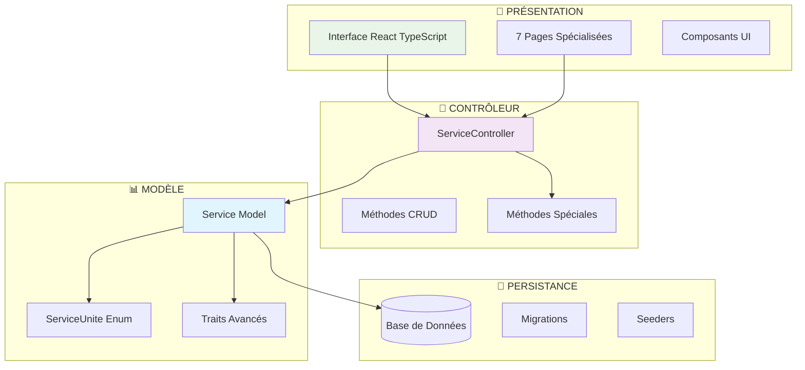
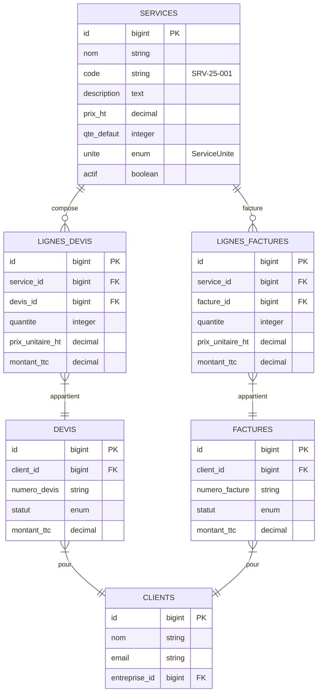
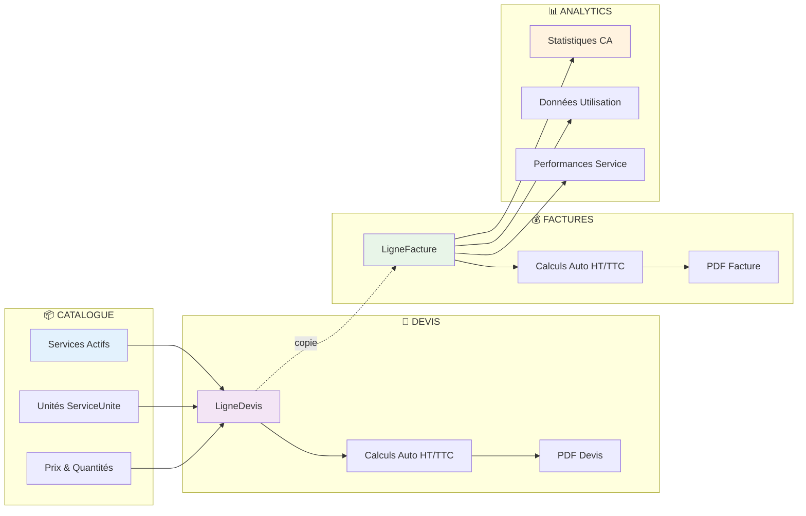

# 🏗️ Module 1 : Vue d'ensemble Architecture Services

> **Dashboard Madinia** - Documentation Technique Services  
> **Phase 1 : Fondations & Métier** - Module 1/8  
> **Dernière mise à jour** : 19 janvier 2025

---

## 📋 Présentation du Module

### **🎯 Objectif**
Présenter l'architecture spécifique du système de gestion des services dans le Dashboard Madinia, en soulignant leur **position centrale** dans l'écosystème applicatif et leur rôle de **pivot métier** entre les clients et la facturation.

### **🔍 Périmètre**
- Architecture MVC complète des services
- Position stratégique dans l'écosystème
- Flow de données service → lignes → devis/factures
- Différences architecturales avec les autres modules

---

## 🏛️ Architecture MVC Services

### **🎭 Pattern Architectural**

Le système de gestion des services suit une **architecture MVC renforcée** avec des spécificités métier avancées :



---

## 🌟 Position Centrale dans l'Écosystème

### **🎯 Centre Névralgique Métier**

Les services occupent une **position stratégique unique** dans l'architecture de l'application :

#### **1. Hub de Données**
```php
// Service.php - Relations centrales
class Service extends Model
{
    // Relations vers les lignes (centre névralgique)
    public function lignesDevis(): HasMany
    public function lignesFactures(): HasMany
    
    // Auto-génération codes professionnels
    protected static function boot()
}
```

#### **2. Relations Critiques**

| **Entité** | **Relation** | **Type** | **Impact Métier** |
|------------|--------------|----------|-------------------|
| **LigneDevis** | `hasMany` | 1:N | Composition des devis |
| **LigneFacture** | `hasMany` | 1:N | Facturation réelle |
| **Auto-génération** | - | Système | Codes SRV-25-001 |
| **Unités** | `ServiceUnite` | Enum | 7 types métier |

### **📊 Diagramme Relations Écosystème**



---

## 🔄 Flow de Données : Service → Lignes → Facturation

### **📈 Pipeline de Transformation Métier**

Le flow de données des services suit un **pipeline sophistiqué** à travers l'application :

#### **Étape 1 : Catalogue Services**
```php
// ServiceController.php - Catalogue
public function catalogue() {
    return Service::actif()
        ->withCount(['lignesDevis', 'lignesFactures'])
        ->orderBy('nom')
        ->get();
}
```

#### **Étape 2 : Composition Devis**
```php
// LigneDevis.php - Calculs automatiques
protected static function boot() {
    static::saving(function ($ligne) {
        $ligne->montant_ht = $ligne->quantite * $ligne->prix_unitaire_ht;
        $ligne->montant_tva = $ligne->montant_ht * ($ligne->taux_tva / 100);
        $ligne->montant_ttc = $ligne->montant_ht + $ligne->montant_tva;
    });
}
```

#### **Étape 3 : Transformation Facture**
```php
// Facture.php - Copie des lignes
public static function creerDepuisDevis(Devis $devis): self {
    // Copier les lignes du devis vers la facture
    foreach ($devis->lignes as $ligneDevis) {
        $facture->lignes()->create([
            'service_id' => $ligneDevis->service_id,
            'quantite' => $ligneDevis->quantite,
            'prix_unitaire_ht' => $ligneDevis->prix_unitaire_ht,
            // ... autres champs
        ]);
    }
}
```

### **🎯 Schéma de Flow Complet**



---

## 🔄 Différences avec Autres Modules

### **📊 Comparaison Architecturale**

| **Aspect** | **Services** | **Clients** | **Entreprises** |
|------------|--------------|-------------|----------------|
| **🎯 Rôle** | **Centre névralgique** | Destinataire final | Groupement logique |
| **🔗 Relations** | **7 relations critiques** | 5 relations | 2 relations |
| **📄 Pages Frontend** | **7 pages spécialisées** | 4 pages standard | 4 pages standard |
| **🔧 Fonctionnalités** | **Auto-génération codes** | Emails avancés | Stats simples |
| **📊 Analytics** | **Page dédiée + stats** | Calculs relationnels | Via clients |
| **🎨 UI Complexité** | **Interface la plus riche** | Formulaires simples | B2B spécialisé |
| **⚙️ Systèmes Auto** | **Enum + Boot methods** | Traits standards | Traits standards |

### **🏗️ Spécificités Techniques Services**

#### **1. Auto-génération Codes**
```php
// Unique aux services - Format SRV-25-001
protected static function boot() {
    static::created(function ($service) {
        $annee = date('y');
        $id = str_pad($service->id, 3, '0', STR_PAD_LEFT);
        $nouveauCode = "SRV-{$annee}-{$id}";
        $service->update(['code' => $nouveauCode]);
    });
}
```

#### **2. Enum ServiceUnite Avancé**
```php
// 7 types d'unités métier avec formatage automatique
enum ServiceUnite: string {
    case HEURE = 'heure';
    case JOURNEE = 'journee';
    // ... 5 autres types
    
    public function getLibelle(int $quantite): string {
        return $quantite <= 1 ? $this->getSingulier() : $this->getPluriel();
    }
}
```

#### **3. Routes Spécialisées**
```php
// Routes uniques aux services
Route::patch('services/{service}/toggle', [ServiceController::class, 'toggle']);
Route::post('services/{service}/duplicate', [ServiceController::class, 'duplicate']);
Route::get('services/catalogue', [ServiceController::class, 'catalogue']);
Route::get('services/actifs', [ServiceController::class, 'actifs']);
Route::get('services/statistiques', [ServiceController::class, 'statistiques']);
```

### **🎯 Position Stratégique Unique**

#### **Services = Pivot Central**
- **❌ Pas d'emails** directs (contrairement aux clients)
- **❌ Pas de relations entreprise** (contrairement aux clients)
- **✅ Auto-génération codes** professionnels
- **✅ Centre de toute facturation** 
- **✅ Interface la plus sophistiquée**
- **✅ Analytics dédiées**
- **✅ 7 types d'unités métier**
- **✅ Protection suppression** si utilisé

---

## 🚀 Points Clés Architecture

### **💎 Caractéristiques Uniques**

1. **🎯 Centre Névralgique** : Tous les devis et factures passent par les services
2. **🤖 Auto-génération** : Codes professionnels SRV-25-XXX automatiques
3. **📊 Analytics Avancées** : Page statistiques dédiée + métriques temps réel
4. **🔧 Enum PHP 8.1+** : Système d'unités sophistiqué avec formatage
5. **🛡️ Protection Métier** : Impossible supprimer si utilisé dans facturation
6. **⚡ Interface Riche** : 7 pages spécialisées (vs 4 pour autres modules)
7. **🔄 Duplication** : Système de copie de services existants

### **🎭 Traits Architecturaux**

```php
class Service extends Model
{
    use HasFactory;           // Factory standard Laravel
    use HasHistorique;        // Historique automatique actions
    use SendsNotifications;   // Notifications admins automatiques
    
    protected $casts = [
        'unite' => ServiceUnite::class,  // Enum avancé
        'actif' => 'boolean',           // Toggle système
        'prix_ht' => 'decimal:2',       // Précision financière
    ];
}
```

### **🔮 Évolutions Futures**

L'architecture des services est conçue pour **l'extensibilité** :
- **Nouveaux types d'unités** via enum ServiceUnite
- **Versions de services** avec historique des prix
- **Catégories de services** pour organisation avancée
- **Templates de services** pour création rapide
- **API externes** pour synchronisation catalogues

---

*📚 **Prochaines étapes** : Module 2 - Modèle Service & Auto-génération*

---

**🏷️ Tags** : `architecture` `mvc` `services` `pivot-métier` `auto-génération` `enum` `analytics` 