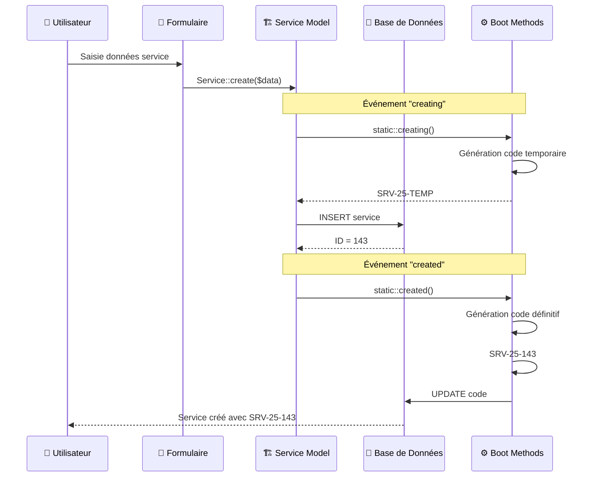
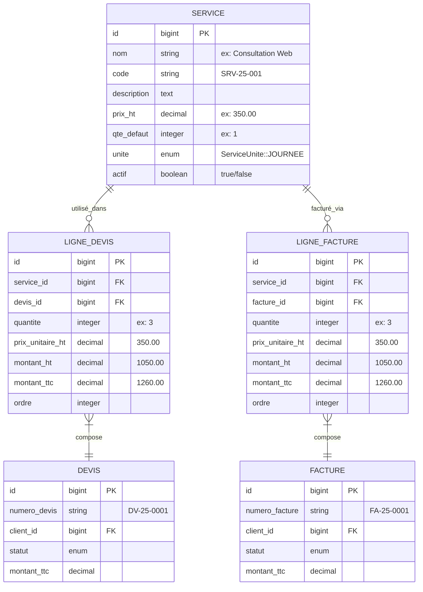
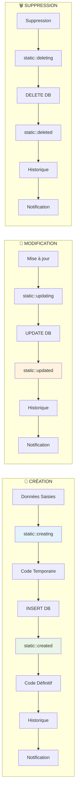

# 🤖 Module 2 : Modèle Service & Auto-génération

> **Dashboard Madinia** - Documentation Technique Services  
> **Phase 1 : Fondations & Métier** - Module 2/8  
> **Dernière mise à jour** : 19 janvier 2025

---

## 📋 Présentation du Module

### **🎯 Objectif**
Documenter en profondeur le modèle `Service` d'Eloquent, ses automatismes d'auto-génération de codes professionnels, ses relations centrales et l'utilisation des traits avancés qui en font le **pivot métier** de l'application.

### **🔍 Périmètre**
- Structure complète du modèle Service
- Système d'auto-génération de codes SRV-25-XXX
- Relations avec lignes de devis et factures
- Traits HasHistorique et SendsNotifications
- Boot methods et événements automatiques

---

## 🏗️ Structure du Modèle Service

### **📋 Présentation Générale**

```php
<?php

namespace App\Models;

use App\Traits\HasHistorique;
use App\Traits\SendsNotifications;
use App\ServiceUnite;
use Illuminate\Database\Eloquent\Factories\HasFactory;
use Illuminate\Database\Eloquent\Model;
use Illuminate\Database\Eloquent\Relations\HasMany;

class Service extends Model
{
    use HasFactory, HasHistorique, SendsNotifications;
    
    // Configuration et automatismes...
}
```

### **🎭 Traits Utilisés**

| **Trait** | **Fonctionnalité** | **Impact** |
|-----------|-------------------|------------|
| `HasFactory` | Factory Laravel standard | Génération de données test |
| **`HasHistorique`** | **Historique automatique** | Toutes actions trackées |
| **`SendsNotifications`** | **Notifications admins** | Alerts automatiques |

---

## 📊 Champs et Configuration

### **🔧 Attributs Fillable**

```php
protected $fillable = [
    'nom',              // Nom du service (requis)
    'code',             // Code auto-généré SRV-25-XXX
    'description',      // Description détaillée (optionnel)
    'prix_ht',          // Prix unitaire HT (requis)
    'qte_defaut',       // Quantité par défaut (requis)
    'unite',            // Enum ServiceUnite (requis)
    'actif',            // Status actif/inactif (boolean)
];
```

### **🎯 Casting Avancé**

```php
protected $casts = [
    'prix_ht' => 'decimal:2',        // Précision financière
    'qte_defaut' => 'integer',       // Quantité entière
    'unite' => ServiceUnite::class,  // Enum PHP 8.1+
    'actif' => 'boolean',           // Status actif/inactif
];
```

#### **Avantages du Casting**

| **Cast** | **Avant** | **Après** | **Avantage** |
|----------|-----------|-----------|--------------|
| `decimal:2` | `"19.99"` | `19.99` | Précision financière garantie |
| `ServiceUnite::class` | `"heure"` | `ServiceUnite::HEURE` | Méthodes enum disponibles |
| `boolean` | `"1"` | `true` | Type safety strict |

---

## 🤖 Système d'Auto-génération de Codes

### **🎯 Format Professionnel**

Le système génère automatiquement des codes au format `SRV-25-XXX` :
- **SRV** : Préfixe Service
- **25** : Année (2025 = 25)  
- **XXX** : ID sur 3 digits (001, 002, etc.)

### **⚙️ Méthode de Génération**

```php
/**
 * Générer automatiquement le code au format SRV-25-001
 */
public static function genererCodeService(): string
{
    $annee = date('y'); // Année sur 2 digits (25)

    // Trouver le prochain ID disponible
    $dernierService = self::orderBy('id', 'desc')->first();
    $prochainId = $dernierService ? $dernierService->id + 1 : 1;

    // Formater l'ID sur 3 digits
    $id = str_pad($prochainId, 3, '0', STR_PAD_LEFT);

    return "SRV-{$annee}-{$id}";
}
```

#### **🔍 Analyse Étape par Étape**

| **Étape** | **Code** | **Résultat** | **Explication** |
|-----------|----------|--------------|-----------------|
| 1 | `date('y')` | `"25"` | Année courante sur 2 digits |
| 2 | `orderBy('id', 'desc')->first()` | Service #142 | Dernier service créé |
| 3 | `$dernierService->id + 1` | `143` | Prochain ID disponible |
| 4 | `str_pad(143, 3, '0', STR_PAD_LEFT)` | `"143"` | Formatage sur 3 digits |
| 5 | `"SRV-{$annee}-{$id}"` | `"SRV-25-143"` | Code final généré |

### **🔄 Boot Methods - Automatisation Complète**

```php
/**
 * Boot du modèle pour générer automatiquement le code
 */
protected static function boot()
{
    parent::boot();

    // 🚀 Avant création : Code temporaire
    static::creating(function ($service) {
        // Générer automatiquement le code si pas fourni
        if (empty($service->code)) {
            $service->code = self::genererCodeService();
        }
    });

    // ✅ Après création : Code définitif avec ID réel
    static::created(function ($service) {
        // Mettre à jour le code avec l'ID réel après création
        $annee = date('y');
        $id = str_pad($service->id, 3, '0', STR_PAD_LEFT);
        $nouveauCode = "SRV-{$annee}-{$id}";

        if ($service->code !== $nouveauCode) {
            $service->update(['code' => $nouveauCode]);
        }
    });
}
```

### **📈 Flow d'Auto-génération**



### **🎯 Avantages de l'Auto-génération**

| **Avantage** | **Description** | **Impact** |
|--------------|-----------------|------------|
| **🤖 Automatique** | Aucune intervention utilisateur | Productivité maximale |
| **🔒 Unique** | Codes garantis uniques | Pas de doublons |
| **📊 Professionnel** | Format standardisé | Image professionnelle |
| **📅 Millésimé** | Année intégrée | Traçabilité temporelle |
| **🔢 Ordonné** | Séquence numérique | Facilité de recherche |

---

## 🔗 Relations Eloquent Centrales

### **📈 Relations Principales**

Le modèle `Service` est le **centre névralgique** de la facturation avec ses relations critiques :

#### **1. Relation LignesDevis (1:N)**

```php
/**
 * Les lignes de devis qui utilisent ce service
 */
public function lignesDevis(): HasMany
{
    return $this->hasMany(LigneDevis::class);
}
```

**Caractéristiques :**
- **Type** : `HasMany` (One-to-Many)
- **Usage** : Composition des devis clients
- **Cardinalité** : 1 service → N lignes de devis
- **Impact métier** : Statistiques d'utilisation des services

#### **2. Relation LignesFactures (1:N)**

```php
/**
 * Les lignes de factures qui utilisent ce service
 */
public function lignesFactures(): HasMany
{
    return $this->hasMany(LigneFacture::class);
}
```

**Caractéristiques :**
- **Type** : `HasMany` (One-to-Many)
- **Usage** : Facturation réelle des prestations
- **Cardinalité** : 1 service → N lignes de factures
- **Impact métier** : Calcul du chiffre d'affaires par service

### **🔄 Schéma Relations Détaillé**



---

## 🔍 Scopes Eloquent Avancés

### **⚡ Scope Services Actifs**

```php
/**
 * Scope pour les services actifs seulement
 */
public function scopeActif($query)
{
    return $query->where('actif', true);
}
```

**Utilisation :**
```php
// ✅ Services actifs pour catalogue
$servicesActifs = Service::actif()->orderBy('nom')->get();

// ✅ Avec statistiques
$servicesDisponibles = Service::actif()
    ->withCount(['lignesDevis', 'lignesFactures'])
    ->get();
```

### **🔎 Scope Recherche Multi-champs**

```php
/**
 * Scope pour rechercher par nom ou code
 */
public function scopeSearch($query, $term)
{
    return $query->where(function ($q) use ($term) {
        $q->where('nom', 'like', '%' . $term . '%')
          ->orWhere('code', 'like', '%' . $term . '%')
          ->orWhere('description', 'like', '%' . $term . '%');
    });
}
```

**Utilisation :**
```php
// ✅ Recherche flexible
$services = Service::search('consultation')
    ->actif()
    ->orderBy('nom')
    ->get();

// Recherche par code
$services = Service::search('SRV-25-001')->get();

// Recherche dans description
$services = Service::search('développement web')->get();
```

### **🔧 Exemples de Combinaisons**

```php
// ✅ Requête complexe avec scopes
$servicesPopulaires = Service::actif()
    ->search('web')
    ->withCount(['lignesFactures' => function($query) {
        $query->whereHas('facture', function($q) {
            $q->where('statut', 'payee');
        });
    }])
    ->having('lignes_factures_count', '>', 5)
    ->orderBy('lignes_factures_count', 'desc')
    ->get();
```

---

## 🎯 Méthodes Métier

### **📝 Formatage des Unités**

```php
/**
 * Retourne le libellé de l'unité formaté selon la quantité
 */
public function getUniteLibelle(?int $quantite = null): string
{
    $qte = $quantite ?? $this->qte_defaut ?? 1;
    return $this->unite ? $this->unite->getLibelle($qte) : 'unité';
}
```

#### **⚡ Utilisation Avancée**

```php
$service = Service::find(1);
// Avec ServiceUnite::HEURE et qte_defaut = 1
echo $service->getUniteLibelle();     // "heure"
echo $service->getUniteLibelle(1);    // "heure"  
echo $service->getUniteLibelle(3);    // "heures"

// Avec ServiceUnite::FORFAIT
echo $service->getUniteLibelle();     // "forfait"
echo $service->getUniteLibelle(2);    // "forfaits"
```

#### **🎨 Intégration Interface**

```typescript
// Dans React TypeScript
interface Service {
    id: number;
    nom: string;
    prix_ht: number;
    qte_defaut: number;
    unite: string;
}

// Utilisation dans PDF/Formulaires
function formatService(service: Service, quantite: number) {
    return `${quantite} ${service.unite_libelle} de ${service.nom}`;
}
// Résultat : "3 heures de Consultation Web"
```

---

## 🔄 Traits Avancés Intégrés

### **📖 Trait HasHistorique**

Le trait `HasHistorique` apporte un **tracking automatique** de toutes les actions :

#### **🤖 Événements Automatiques**

```php
protected static function bootHasHistorique(): void
{
    // ✅ Création automatiquement loggée
    static::created(function ($model) {
        $model->enregistrerHistorique(
            'creation',
            "Création de Service #{$model->id}",
            "Nouveau service créé",
            null,
            $model->getAttributes()
        );
    });

    // ✅ Modification automatiquement loggée
    static::updated(function ($model) {
        if ($model->wasChanged()) {
            $model->enregistrerHistorique(
                'modification',
                "Modification de Service #{$model->id}",
                "Données mises à jour",
                $model->getOriginal(),
                $model->getChanges()
            );
        }
    });
}
```

#### **📊 Accès à l'Historique**

```php
// ✅ Récupération de l'historique complet
$service = Service::find(1);
$historique = $service->historique()
    ->with('user')
    ->orderBy('created_at', 'desc')
    ->get();

// ✅ Types d'historique spécifiques
$creations = $service->getHistoriqueCreation();
$modifications = $service->getHistoriqueModifications();
```

### **📢 Trait SendsNotifications**

Le trait `SendsNotifications` envoie des **notifications automatiques** aux administrateurs :

#### **🔔 Notifications Automatiques**

```php
protected static function bootSendsNotifications()
{
    // ✅ Notification création
    static::created(function ($service) {
        // ServiceNotification envoyée à tous les admins
        $service->sendNotificationToAdmins('created');
    });

    // ✅ Notification modification
    static::updated(function ($service) {
        $service->sendNotificationToAdmins('updated');
    });
}
```

#### **🎯 Notifications Personnalisées**

```php
// Dans ServiceController::toggle()
$service->sendCustomNotification(
    'activated',
    "Le service \"{$service->nom}\" a été activé"
);

$service->sendCustomNotification(
    'deactivated', 
    "Le service \"{$service->nom}\" a été désactivé"
);
```

#### **👥 Destinataires**

```php
// Notifications envoyées à :
$admins = User::whereHas('userRole', function ($query) {
    $query->whereIn('name', ['admin', 'super_admin']);
})->get();

// Chaque admin reçoit une ServiceNotification
foreach ($admins as $admin) {
    $admin->notify(new ServiceNotification($service, $action, $message));
}
```

---

## 🎮 Exemples d'Utilisation Complète

### **1. Création de Service avec Auto-génération**

```php
// ✅ Création simple - Code généré automatiquement
$service = Service::create([
    'nom' => 'Consultation Web',
    'description' => 'Audit et conseil en développement web',
    'prix_ht' => 350.00,
    'qte_defaut' => 1,
    'unite' => ServiceUnite::JOURNEE,
    'actif' => true,
]);

// Résultat automatique :
// - code = "SRV-25-143"
// - Historique créé automatiquement
// - Notification envoyée aux admins
```

### **2. Recherche et Statistiques**

```php
// ✅ Services populaires avec statistiques
$servicesPopulaires = Service::actif()
    ->withCount([
        'lignesDevis',
        'lignesFactures',
        'lignesFactures as ca_total' => function($query) {
            $query->select(DB::raw('sum(montant_ttc)'));
        }
    ])
    ->orderBy('lignes_factures_count', 'desc')
    ->take(10)
    ->get();

foreach ($servicesPopulaires as $service) {
    echo "Service: {$service->nom}\n";
    echo "Code: {$service->code}\n";
    echo "Utilisé dans {$service->lignes_devis_count} devis\n";
    echo "CA généré: {$service->ca_total}€\n";
    echo "Unité: {$service->getUniteLibelle()}\n\n";
}
```

### **3. Intégration avec Devis/Factures**

```php
// ✅ Service utilisé dans composition de devis
$service = Service::actif()->find(1);

// Création ligne de devis
$ligneDevis = LigneDevis::create([
    'devis_id' => $devis->id,
    'service_id' => $service->id,
    'quantite' => 3,
    'prix_unitaire_ht' => $service->prix_ht,
    'taux_tva' => 20.00,
    'ordre' => 1,
]);

// Calculs automatiques dans LigneDevis::boot()
// montant_ht = 3 * 350.00 = 1050.00
// montant_tva = 1050.00 * 0.20 = 210.00  
// montant_ttc = 1050.00 + 210.00 = 1260.00
```

---

## 🚀 Points Clés du Modèle

### **💎 Caractéristiques Uniques**

1. **🤖 Auto-génération Complète** : Codes SRV-25-XXX automatiques
2. **🔗 Relations Centrales** : Hub vers lignes de devis et factures  
3. **📊 Enum Avancé** : ServiceUnite avec formatage automatique
4. **🔍 Scopes Métier** : Recherche multi-champs et filtrage
5. **📖 Historique Automatique** : Toutes actions trackées
6. **🔔 Notifications Automatiques** : Alerts admins
7. **🎯 Méthodes Métier** : Formatage intelligent des unités

### **🎭 Événements du Cycle de Vie**



### **🔮 Extensions Futures**

L'architecture du modèle permet facilement :
- **Catégories de services** avec relation belongsTo
- **Versions de services** avec historique des prix
- **Templates de services** pour création rapide
- **Services composés** avec relations many-to-many
- **Tarification dynamique** avec formules de calcul

---

*📚 **Prochaines étapes** : Module 3 - Système d'Unités & Enum ServiceUnite*

---

**🏷️ Tags** : `model` `eloquent` `auto-génération` `traits` `relations` `boot-methods` `notifications` `historique`