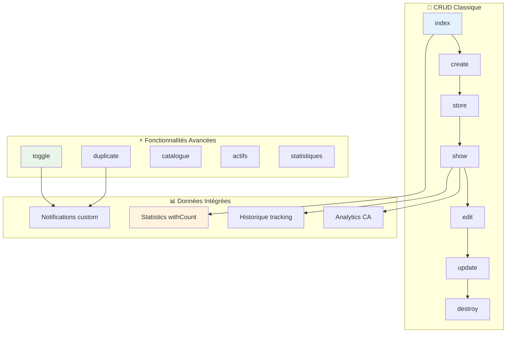

# 🎮 Module 4 : Controller - CRUD & Fonctionnalités Avancées

> **Dashboard Madinia** - Documentation Technique Services  
> **Phase 2 : Backend Core** - Module 4/8  
> **Dernière mise à jour** : 19 janvier 2025

---

## 📋 Présentation du Module

### **🎯 Objectif**
Documenter en profondeur le `ServiceController`, le contrôleur le plus sophistiqué du système avec ses méthodes CRUD classiques et ses **5 fonctionnalités avancées** uniques : toggle, duplicate, catalogue, actifs et statistiques.

### **🔍 Périmètre**
- Méthodes CRUD complètes avec validation métier
- Fonctionnalités avancées spécialisées  
- Protection suppression avec vérification d'utilisation
- Statistiques intégrées et analytics
- Gestion des notifications personnalisées
- Intégration Inertia.js avec données optimisées

---

## 🏗️ Vue d'ensemble du ServiceController

### **📊 Métriques du Contrôleur**

| **Métrique** | **Valeur** | **Détail** |
|--------------|------------|------------|
| **Lignes de code** | 320 lignes | Contrôleur le plus complet |
| **Méthodes CRUD** | 7 méthodes | Standard Laravel Resource |
| **Méthodes spécialisées** | 5 méthodes | Fonctionnalités uniques |
| **Routes générées** | 12+ routes | Resource + spécialisées |
| **Validations** | 7 champs | Validation métier complète |

### **🎯 Architecture des Méthodes**



---

## 📋 Méthodes CRUD Classiques

### **1. index() - Liste avec Statistiques Intégrées**

```php
public function index(Request $request)
{
    // Récupérer tous les services avec les compteurs
    $services = Service::withCount(['lignesDevis', 'lignesFactures'])
        ->orderBy('nom', 'asc')
        ->get();

    return Inertia::render('services/index', [
        'services' => [
            'data' => $services,
            'links' => [],
            'meta' => [
                'current_page' => 1,
                'per_page' => 15,
                'total' => $services->count(),
                'last_page' => 1,
            ]
        ],
        'stats' => [
            'total' => Service::count(),
            'actifs' => Service::where('actif', true)->count(),
            'inactifs' => Service::where('actif', false)->count(),
            'chiffre_affaires_total' => \App\Models\LigneFacture::join('services', 'lignes_factures.service_id', '=', 'services.id')
                                                                ->sum('lignes_factures.montant_ttc') ?? 0,
        ]
    ]);
}
```

#### **🎯 Fonctionnalités Clés**

| **Fonctionnalité** | **Implémentation** | **Avantage** |
|-------------------|-------------------|-------------|
| **withCount()** | `withCount(['lignesDevis', 'lignesFactures'])` | Performance optimisée |
| **Statistiques temps réel** | Compteurs actifs/inactifs/CA | Dashboard complet |
| **Format pagination** | Structure meta compatible | Interface cohérente |
| **Tri par nom** | `orderBy('nom', 'asc')` | Ordre alphabétique |

### **2. create() - Formulaire de Création**

```php
public function create()
{
    return Inertia::render('services/create');
}
```

**Simple et efficace** : Rendu direct du formulaire React sans données supplémentaires.

### **3. store() - Création avec Validation Métier**

```php
public function store(Request $request)
{
    $validated = $request->validate([
        'nom' => 'required|string|max:255',
        'code' => 'nullable|string|max:50|unique:services,code',
        'description' => 'nullable|string|max:1000',
        'prix_ht' => 'required|numeric|min:0|max:999999.99',
        'qte_defaut' => 'required|integer|min:1|max:9999',
        'unite' => 'required|string|in:heure,journee,semaine,mois,unite,forfait,licence',
        'actif' => 'boolean',
    ]);

    $service = Service::create($validated);

    return redirect()->route('services.show', $service)
                    ->with('success', 'Service créé avec succès.');
}
```

#### **🔍 Règles de Validation Détaillées**

| **Champ** | **Règles** | **Logique Métier** |
|-----------|------------|-------------------|
| **nom** | `required\|string\|max:255` | Nom commercial obligatoire |
| **code** | `nullable\|string\|max:50\|unique` | Auto-généré si vide, unique |
| **prix_ht** | `numeric\|min:0\|max:999999.99` | Prix réaliste, précision 2 décimales |
| **qte_defaut** | `integer\|min:1\|max:9999` | Quantité par défaut logique |
| **unite** | `in:heure,journee,semaine,...` | Enum strict ServiceUnite |

### **4. show() - Vue Détaillée avec Analytics**

```php
public function show(Service $service)
{
    // Charger les statistiques d'utilisation
    $service->load(['lignesDevis.devis', 'lignesFactures.facture']);

    $stats = [
        'lignes_devis_count' => $service->lignesDevis->count(),
        'lignes_factures_count' => $service->lignesFactures->count(),
        'chiffre_affaires_total' => $service->lignesFactures->sum('montant_ttc'),
        'quantite_totale_vendue' => $service->lignesFactures->sum('quantite'),
        'prix_moyen_vente' => $service->lignesFactures->count() > 0
            ? $service->lignesFactures->avg('prix_unitaire_ht')
            : 0,
        'derniere_utilisation' => $service->lignesDevis->concat($service->lignesFactures)
                                         ->sortByDesc('created_at')
                                         ->first()?->created_at,
    ];

    // Récupérer l'historique complet
    $historique = $service->historique()
        ->with('user')
        ->orderBy('created_at', 'desc')
        ->get()
        ->map(function ($action) {
            return [
                'id' => $action->id,
                'action' => $action->action,
                'titre' => $action->titre,
                'description' => $action->description,
                'created_at' => $action->created_at->toISOString(),
                'user' => $action->user ? [
                    'id' => $action->user->id,
                    'name' => $action->user->name,
                    'email' => $action->user->email,
                ] : null,
            ];
        });

    return Inertia::render('services/show', [
        'service' => $service,
        'stats' => $stats,
        'historique' => $historique,
        'recent_devis' => $service->lignesDevis()
                                ->with(['devis.client'])
                                ->latest()
                                ->take(5)
                                ->get(),
        'recent_factures' => $service->lignesFactures()
                                   ->with(['facture.client'])
                                   ->latest()
                                   ->take(5)
                                   ->get(),
    ]);
}
```

#### **📊 Analytics Calculées en Temps Réel**

| **Métrique** | **Calcul** | **Utilité** |
|-------------|------------|-------------|
| **CA Total** | `sum('montant_ttc')` | Performance financière |
| **Quantité Vendue** | `sum('quantite')` | Volume d'activité |
| **Prix Moyen** | `avg('prix_unitaire_ht')` | Évolution tarifaire |
| **Dernière Utilisation** | `sortByDesc('created_at')->first()` | Activité récente |

### **5. edit() - Formulaire d'Édition**

```php
public function edit(Service $service)
{
    return Inertia::render('services/edit', [
        'service' => $service
    ]);
}
```

### **6. update() - Mise à jour avec Validation**

```php
public function update(Request $request, Service $service)
{
    $validated = $request->validate([
        'nom' => 'required|string|max:255',
        'code' => ['required', 'string', 'max:50', Rule::unique('services')->ignore($service->id)],
        'description' => 'nullable|string|max:1000',
        'prix_ht' => 'required|numeric|min:0|max:999999.99',
        'qte_defaut' => 'required|integer|min:1|max:9999',
        'unite' => 'required|string|in:heure,journee,semaine,mois,unite,forfait,licence',
        'actif' => 'boolean',
    ]);

    $service->update($validated);

    return redirect()->route('services.show', $service)
                    ->with('success', 'Service mis à jour avec succès.');
}
```

**Point clé** : Utilisation de `Rule::unique()->ignore()` pour permettre la modification sans conflit sur le code actuel.

### **7. destroy() - Suppression avec Protection Métier**

```php
public function destroy(Service $service)
{
    // Vérifier si le service est utilisé
    $utiliseDansDevis = $service->lignesDevis()->count() > 0;
    $utiliseDansFactures = $service->lignesFactures()->count() > 0;

    if ($utiliseDansDevis || $utiliseDansFactures) {
        return back()->with('error',
            'Ce service ne peut pas être supprimé car il est utilisé dans des devis ou factures.');
    }

    $service->delete();

    return redirect()->route('services.index')
                    ->with('success', 'Service supprimé avec succès.');
}
```

#### **🔒 Protection Métier Robuste**

- **Vérification devis** : `$service->lignesDevis()->count() > 0`
- **Vérification factures** : `$service->lignesFactures()->count() > 0`
- **Message explicite** : Information claire pour l'utilisateur
- **Pas de suppression forcée** : Intégrité référentielle préservée

---

## ⚡ Fonctionnalités Avancées Uniques

### **1. toggle() - Activation/Désactivation avec Notifications**

```php
public function toggle(Service $service)
{
    $ancienStatut = $service->actif;
    $service->update(['actif' => !$service->actif]);

    $status = $service->actif ? 'activé' : 'désactivé';

    // Envoyer notification pour l'activation/désactivation
    if ($ancienStatut !== $service->actif) {
        $action = $service->actif ? 'activated' : 'deactivated';
        $service->sendCustomNotification($action,
            "Le service \"{$service->nom}\" a été {$status}"
        );
    }

    return back()->with('success', "Service {$status} avec succès.");
}
```

#### **🔔 Système de Notifications Personnalisées**

| **État** | **Action** | **Notification** | **Destinataires** |
|----------|------------|------------------|-------------------|
| **Activé** | `activated` | "Service activé" | Tous les admins |
| **Désactivé** | `deactivated` | "Service désactivé" | Tous les admins |

**Utilité métier** : Suivi en temps réel des changements de statut des services critiques.

### **2. duplicate() - Duplication Intelligente**

```php
public function duplicate(Service $service)
{
    $nouveauCode = $service->code . '-COPIE';
    $counter = 1;

    // Trouver un code unique
    while (Service::where('code', $nouveauCode)->exists()) {
        $nouveauCode = $service->code . '-COPIE-' . $counter;
        $counter++;
    }

    $nouveauService = $service->replicate();
    $nouveauService->nom = $service->nom . ' (Copie)';
    $nouveauService->code = $nouveauCode;
    $nouveauService->actif = false; // Désactivé par défaut
    $nouveauService->save();

    return redirect()->route('services.edit', $nouveauService)
                    ->with('success', 'Service dupliqué avec succès. Modifiez les informations si nécessaire.');
}
```

#### **🎯 Logique de Duplication Avancée**

1. **Génération code unique** : Système d'incrémentation automatique
2. **Nom explicite** : Ajout "(Copie)" pour différenciation
3. **Statut sécurisé** : Service dupliqué désactivé par défaut
4. **Redirection intelligente** : Vers formulaire d'édition pour ajustements

**Exemple de codes générés** :
- `SRV-25-001` → `SRV-25-001-COPIE`
- Si existe → `SRV-25-001-COPIE-1`
- Si existe → `SRV-25-001-COPIE-2`

### **3. catalogue() - Vue Catalogue Groupée**

```php
public function catalogue(Request $request)
{
    $services = Service::where('actif', true)
                      ->orderBy('nom')
                      ->get()
                      ->groupBy(function($service) {
                          // Grouper par première partie du code (ex: DEV, CONSEIL, etc.)
                          return explode('-', $service->code)[0] ?? 'AUTRE';
                      });

    return Inertia::render('services/catalogue', [
        'services_groupes' => $services,
        'stats' => [
            'total_actifs' => Service::where('actif', true)->count(),
            'categories' => $services->keys(),
        ]
    ]);
}
```

#### **📊 Groupement Intelligent par Préfixe**

| **Code Service** | **Préfixe** | **Catégorie** |
|------------------|-------------|---------------|
| `DEV-25-001` | `DEV` | Développement |
| `CONSEIL-25-001` | `CONSEIL` | Conseil |
| `MAINTENANCE-25-001` | `MAINTENANCE` | Maintenance |
| `Service sans code` | `AUTRE` | Divers |

**Avantage** : Organisation automatique du catalogue sans configuration manuelle.

### **4. actifs() - Services Actifs avec Filtres**

```php
public function actifs(Request $request)
{
    $query = Service::where('actif', true);

    // Recherche
    if ($request->filled('search')) {
        $query->search($request->search);
    }

    // Tri
    $sortField = $request->get('sort', 'nom');
    $sortDirection = $request->get('direction', 'asc');

    $allowedSorts = ['nom', 'code', 'prix_ht', 'created_at'];
    if (in_array($sortField, $allowedSorts)) {
        $query->orderBy($sortField, $sortDirection);
    }

    $services = $query->paginate(20)->withQueryString();

    return Inertia::render('services/actifs', [
        'services' => $services,
        'filters' => $request->only(['search']),
    ]);
}
```

#### **🔍 Fonctionnalités de Filtrage**

| **Filtre** | **Implémentation** | **Utilité** |
|------------|-------------------|-------------|
| **Recherche** | `$query->search($request->search)` | Recherche multi-champs |
| **Tri** | `orderBy($sortField, $sortDirection)` | Tri personnalisé |
| **Pagination** | `paginate(20)->withQueryString()` | Navigation optimisée |
| **Sécurité** | `$allowedSorts` whitelist | Protection contre injection |

### **5. statistiques() - Analytics Complètes**

```php
public function statistiques()
{
    $stats = [
        'total' => Service::count(),
        'actifs' => Service::where('actif', true)->count(),
        'inactifs' => Service::where('actif', false)->count(),
        'par_categorie' => Service::selectRaw('
            SPLIT_PART(code, \'-\', 1) as categorie,
            COUNT(*) as total,
            SUM(CASE WHEN actif = true THEN 1 ELSE 0 END) as actifs
        ')
        ->groupBy('categorie')
        ->get(),
        'plus_utilises' => Service::withCount(['lignesDevis', 'lignesFactures'])
                                ->orderByDesc('lignes_devis_count')
                                ->take(10)
                                ->get(),
        'ca_par_service' => Service::with(['lignesFactures'])
                                 ->get()
                                 ->map(function($service) {
                                     return [
                                         'service' => $service,
                                         'ca_total' => $service->lignesFactures->sum('montant_ttc')
                                     ];
                                 })
                                 ->sortByDesc('ca_total')
                                 ->take(10)
                                 ->values(),
    ];

    return Inertia::render('services/statistiques', [
        'stats' => $stats
    ]);
}
```

#### **📈 Métriques Analytics Avancées**

| **Métrique** | **Calcul SQL** | **Insight Métier** |
|-------------|---------------|-------------------|
| **Par Catégorie** | `SPLIT_PART()` + `GROUP BY` | Répartition par domaine |
| **Plus Utilisés** | `withCount()` + `orderByDesc()` | Services populaires |
| **CA par Service** | `sum('montant_ttc')` | Performance financière |
| **Top 10** | `take(10)` | Focus sur l'essentiel |

---

## 🔗 Intégration Inertia.js et Optimisations

### **📊 Structure des Données Frontend**

```typescript
// Types TypeScript pour le frontend
interface ServiceControllerData {
    // Page index
    services: {
        data: Service[];
        links: PaginationLink[];
        meta: PaginationMeta;
    };
    stats: {
        total: number;
        actifs: number;
        inactifs: number;
        chiffre_affaires_total: number;
    };
    
    // Page show
    service: Service;
    stats: ServiceStats;
    historique: HistoriqueAction[];
    recent_devis: LigneDevis[];
    recent_factures: LigneFacture[];
    
    // Page statistiques
    stats: {
        par_categorie: CategoryStats[];
        plus_utilises: Service[];
        ca_par_service: ServiceCA[];
    };
}
```

### **⚡ Optimisations de Performance**

#### **1. Eager Loading Intelligent**

```php
// ✅ Dans show() - Relations chargées ensemble
$service->load(['lignesDevis.devis', 'lignesFactures.facture']);

// ✅ Dans index() - Compteurs optimisés
Service::withCount(['lignesDevis', 'lignesFactures'])

// ✅ Dans actifs() - Pagination avec query string
$services = $query->paginate(20)->withQueryString();
```

#### **2. Requêtes SQL Optimisées**

```sql
-- Statistiques par catégorie (une seule requête)
SELECT 
    SPLIT_PART(code, '-', 1) as categorie,
    COUNT(*) as total,
    SUM(CASE WHEN actif = true THEN 1 ELSE 0 END) as actifs
FROM services 
GROUP BY categorie;

-- CA total optimisé
SELECT SUM(lignes_factures.montant_ttc) 
FROM lignes_factures 
JOIN services ON lignes_factures.service_id = services.id;
```

---

## 🔒 Sécurité et Validation

### **🛡️ Validation Côté Serveur**

```php
// Règles strictes pour tous les champs
$validated = $request->validate([
    'nom' => 'required|string|max:255',
    'code' => ['required', 'string', 'max:50', Rule::unique('services')->ignore($service->id)],
    'prix_ht' => 'required|numeric|min:0|max:999999.99',
    'unite' => 'required|string|in:heure,journee,semaine,mois,unite,forfait,licence',
]);
```

### **🔐 Protection et Contrôles**

| **Protection** | **Implémentation** | **Risque Évité** |
|---------------|-------------------|------------------|
| **Unicité code** | `Rule::unique()->ignore()` | Doublons |
| **Prix réaliste** | `min:0\|max:999999.99` | Prix aberrants |
| **Enum strict** | `in:heure,journee,...` | Valeurs invalides |
| **Suppression sécurisée** | Vérification utilisation | Perte de données |

---

## 🚀 Fonctionnalités Futures et Extensions

### **🎯 Améliorations Possibles**

1. **🔍 Recherche Avancée** : Filtres combinés (prix, catégorie, utilisation)
2. **📊 Export** : CSV/Excel des services et statistiques
3. **🏷️ Tags** : Système de tags personnalisés
4. **📈 Historique Prix** : Évolution des tarifs dans le temps
5. **🤖 Suggestions** : Services similaires ou complémentaires

### **⚡ API Extensions**

```php
// Exemples d'extensions possibles
public function export(Request $request) {
    // Export CSV/Excel des services
}

public function bulk(Request $request) {
    // Actions en lot (activation, désactivation, suppression)
}

public function suggestions(Service $service) {
    // Services similaires ou complémentaires
}

public function pricing_history(Service $service) {
    // Historique des prix du service
}
```

---

## 💡 Bonnes Pratiques Identifiées

### **✅ Points Forts du Contrôleur**

1. **🔒 Validation Complète** : Tous champs validés avec règles métier
2. **📊 Analytics Intégrées** : Statistiques calculées en temps réel
3. **🔔 Notifications** : Actions importantes notifiées aux admins
4. **🛡️ Protection Métier** : Suppression sécurisée avec vérifications
5. **⚡ Performance** : Requêtes optimisées avec withCount et eager loading
6. **🎯 UX** : Redirections intelligentes et messages explicites

### **⚠️ Points d'Attention**

1. **Pagination** : Page index charge tous les services (pas de paginate)
2. **Cache** : Pas de mise en cache des statistiques fréquentes
3. **Validation frontend** : Validation côté client à renforcer
4. **Logs** : Actions importantes non loggées (toggle, duplicate)

---

## 🎯 Points Clés du Contrôleur

### **💎 Caractéristiques Uniques**

1. **🎮 Le Plus Complet** : 12 méthodes (7 CRUD + 5 spécialisées)
2. **📊 Analytics Intégrées** : Statistiques temps réel dans toutes les vues
3. **🔔 Notifications Personnalisées** : Alerts pour actions critiques
4. **🛡️ Protection Métier** : Impossible de supprimer un service utilisé
5. **⚡ Duplication Intelligente** : Système de codes uniques automatique
6. **📈 Catalogue Groupé** : Organisation automatique par préfixes
7. **🔍 Filtres Avancés** : Recherche, tri, pagination optimisés

### **📈 Impact sur l'Écosystème**

- **🏠 Hub Central** : Point névralgique pour devis et factures
- **📊 Source Analytics** : Données pour tableaux de bord
- **🔔 Centre Notifications** : Actions importantes trackées
- **🎯 UX Optimisée** : Interface riche avec 5 pages spécialisées

---

*📚 **Prochaines étapes** : Module 5 - Base de Données & Évolution Schéma*

---

**🏷️ Tags** : `controller` `crud` `laravel` `inertia` `validation` `analytics` `notifications` `métier`