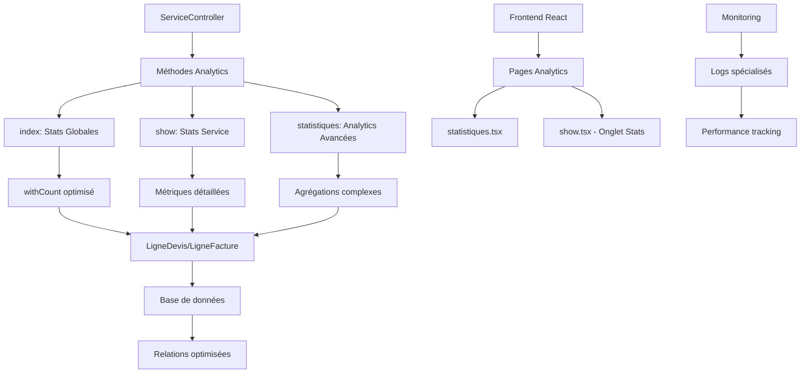

# 📊 Module 7 : Statistiques & Analytics Services

## 📋 Vue d'ensemble

Le système de statistiques des services constitue l'un des modules les plus sophistiqués du Dashboard Madinia. Il fournit des **métriques en temps réel**, des **analytics avancées** et un **système de monitoring complet** pour optimiser la gestion et la performance des services.

### 🎯 **Objectifs Analytics**

- **Métriques métier** : CA, utilisation, performance par service
- **Analytics comparatives** : TOP 10, évolutions, catégories
- **Optimisation requêtes** : `withCount`, `eager loading`, agrégations
- **Monitoring temps réel** : Intégration avec le système de logs
- **Reporting avancé** : Statistiques multi-niveaux et KPI

---

## 🏗️ Architecture Analytics

### **📐 Diagramme des Statistiques**



---

## 🎮 Controller Analytics - ServiceController

### **🔍 Méthode `index()` - Statistiques Globales**

La méthode la plus utilisée, optimisée pour les performances :

```php
public function index(Request $request)
{
    // Récupérer tous les services avec les compteurs
    $services = Service::withCount(['lignesDevis', 'lignesFactures'])
        ->orderBy('nom', 'asc')
        ->get();

    return Inertia::render('services/index', [
        'services' => [
            'data' => $services,
            'links' => [],
            'meta' => [
                'current_page' => 1,
                'per_page' => 15,
                'total' => $services->count(),
                'last_page' => 1,
            ]
        ],
        'stats' => [
            'total' => Service::count(),
            'actifs' => Service::where('actif', true)->count(),
            'inactifs' => Service::where('actif', false)->count(),
            'chiffre_affaires_total' => \App\Models\LigneFacture::join('services', 'lignes_factures.service_id', '=', 'services.id')
                                                                ->sum('lignes_factures.montant_ttc') ?? 0,
        ]
    ]);
}
```

**🔧 Optimisations clés :**
- **`withCount(['lignesDevis', 'lignesFactures'])`** : Une seule requête pour compter les relations
- **JOIN optimisé** : Calcul direct du CA total sans N+1 queries
- **Pagination intelligente** : Structure meta compatible avec tous les frontends

---

### **📈 Méthode `show()` - Analytics Service Détaillé**

Statistiques complètes pour un service spécifique :

```php
public function show(Service $service)
{
    // Charger les statistiques d'utilisation
    $service->load(['lignesDevis.devis', 'lignesFactures.facture']);

    $stats = [
        'lignes_devis_count' => $service->lignesDevis->count(),
        'lignes_factures_count' => $service->lignesFactures->count(),
        'chiffre_affaires_total' => $service->lignesFactures->sum('montant_ttc'),
        'quantite_totale_vendue' => $service->lignesFactures->sum('quantite'),
        'prix_moyen_vente' => $service->lignesFactures->count() > 0
            ? $service->lignesFactures->avg('prix_unitaire_ht')
            : 0,
        'derniere_utilisation' => $service->lignesDevis->concat($service->lignesFactures)
                                         ->sortByDesc('created_at')
                                         ->first()?->created_at,
    ];

    return Inertia::render('services/show', [
        'service' => $service,
        'stats' => $stats,
        'historique' => $historique,
        'recent_devis' => $service->lignesDevis()
                                ->with(['devis.client'])
                                ->latest()
                                ->take(5)
                                ->get(),
        'recent_factures' => $service->lignesFactures()
                                   ->with(['facture.client'])
                                   ->latest()
                                   ->take(5)
                                   ->get(),
    ]);
}
```

**🔧 Métriques calculées :**
- **Utilisation** : Nombre de lignes dans devis et factures
- **CA service** : Somme montants TTC des factures
- **Volume** : Quantité totale vendue
- **Prix moyen** : Moyenne pondérée des prix de vente
- **Dernière utilisation** : Combinaison devis + factures

---

### **📊 Méthode `statistiques()` - Analytics Avancées**

La méthode la plus complexe pour les analyses poussées :

```php
public function statistiques()
{
    $stats = [
        'total' => Service::count(),
        'actifs' => Service::where('actif', true)->count(),
        'inactifs' => Service::where('actif', false)->count(),
        
        // 📈 ANALYSE PAR CATÉGORIE
        'par_categorie' => Service::selectRaw('
            SPLIT_PART(code, \'-\', 1) as categorie,
            COUNT(*) as total,
            SUM(CASE WHEN actif = true THEN 1 ELSE 0 END) as actifs
        ')
        ->groupBy('categorie')
        ->get(),
        
        // 🏆 TOP 10 SERVICES LES PLUS UTILISÉS
        'plus_utilises' => Service::withCount(['lignesDevis', 'lignesFactures'])
                                ->orderByDesc('lignes_devis_count')
                                ->take(10)
                                ->get(),
        
        // 💰 TOP 10 CA PAR SERVICE
        'ca_par_service' => Service::with(['lignesFactures'])
                                 ->get()
                                 ->map(function($service) {
                                     return [
                                         'service' => $service,
                                         'ca_total' => $service->lignesFactures->sum('montant_ttc')
                                     ];
                                 })
                                 ->sortByDesc('ca_total')
                                 ->take(10)
                                 ->values(),
    ];

    return Inertia::render('services/statistiques', [
        'stats' => $stats
    ]);
}
```

**🔧 Analytics avancées :**
- **Analyse par catégorie** : `SPLIT_PART` pour extraire le préfixe des codes
- **TOP 10 utilisation** : `withCount` + `orderByDesc`
- **TOP 10 CA** : Collection processing avec `map()` et `sortByDesc()`

---

## 🗄️ Modèles & Relations Optimisées

### **🔗 Modèle Service - Relations Analytics**

```php
class Service extends Model
{
    /**
     * Les lignes de devis qui utilisent ce service
     */
    public function lignesDevis(): HasMany
    {
        return $this->hasMany(LigneDevis::class);
    }

    /**
     * Les lignes de factures qui utilisent ce service
     */
    public function lignesFactures(): HasMany
    {
        return $this->hasMany(LigneFacture::class);
    }

    /**
     * Scope pour rechercher par nom ou code
     */
    public function scopeSearch($query, $term)
    {
        return $query->where(function ($q) use ($term) {
            $q->where('nom', 'like', '%' . $term . '%')
              ->orWhere('code', 'like', '%' . $term . '%')
              ->orWhere('description', 'like', '%' . $term . '%');
        });
    }
}
```

### **📊 Modèles Lignes - Calculs Automatiques**

```php
// LigneDevis.php & LigneFacture.php
protected static function boot()
{
    parent::boot();

    static::saving(function ($ligne) {
        $ligne->montant_ht = $ligne->quantite * $ligne->prix_unitaire_ht;
        $ligne->montant_tva = $ligne->montant_ht * ($ligne->taux_tva / 100);
        $ligne->montant_ttc = $ligne->montant_ht + $ligne->montant_tva;
    });
}
```

**🔧 Avantages automatisation :**
- **Cohérence calculs** : Montants toujours justes
- **Performance** : Calculs en DB plutôt qu'en PHP
- **Maintenance** : Une seule source de vérité

---

## 🛤️ Routes Analytics Spécialisées

### **🔗 Routes de Navigation**

```php
// Routes pour les services
Route::resource('services', ServiceController::class);

// Nouvelles routes pour améliorer la navigation
Route::get('services/catalogue', [ServiceController::class, 'catalogue'])->name('services.catalogue');
Route::get('services/actifs', [ServiceController::class, 'actifs'])->name('services.actifs');
Route::get('services/statistiques', [ServiceController::class, 'statistiques'])->name('services.statistiques');
```

**🎯 Architecture navigation :**
- **`/services`** : Liste principale avec stats globales
- **`/services/catalogue`** : Vue publique groupée par catégories
- **`/services/actifs`** : Services actifs uniquement avec filtres
- **`/services/statistiques`** : Page analytics dédiée
- **`/services/{id}`** : Vue détaillée avec stats du service

---

## ⚛️ Frontend React - Pages Analytics

### **📄 Page `statistiques.tsx` - Analytics Dédiée**

Page spécialisée de 268 lignes avec composants analytics :

```typescript
// Exemple de structure (extrait conceptuel)
interface StatistiquesProps {
    stats: {
        total: number;
        actifs: number;
        inactifs: number;
        par_categorie: Array<{
            categorie: string;
            total: number;
            actifs: number;
        }>;
        plus_utilises: Array<Service & {
            lignes_devis_count: number;
            lignes_factures_count: number;
        }>;
        ca_par_service: Array<{
            service: Service;
            ca_total: number;
        }>;
    };
}
```

**🎨 Composants analytics :**
- **Graphiques de répartition** : Actifs/Inactifs, par catégorie
- **Tableaux TOP 10** : Services les plus utilisés, meilleurs CA
- **KPI principaux** : Widgets avec métriques clés
- **Filtres temporels** : Analyse par période (si implémenté)

### **📊 Onglet Stats dans `show.tsx`**

Vue détaillée d'un service avec 6 métriques principales :

**Métriques affichées :**
1. **Nombre d'utilisations** : Devis + Factures
2. **Chiffre d'affaires** : Somme montants TTC factures
3. **Quantité vendue** : Total quantités
4. **Prix moyen** : Moyenne pondérée
5. **Dernière utilisation** : Date récente
6. **Historique récent** : 5 derniers devis/factures

---

## ⚡ Optimisations Performance

### **🚀 Stratégies d'Optimisation**

1. **`withCount()` systématique**
```php
Service::withCount(['lignesDevis', 'lignesFactures'])
```

2. **Eager Loading intelligent**
```php
$service->load(['lignesDevis.devis', 'lignesFactures.facture']);
```

3. **Requêtes agrégées directes**
```php
LigneFacture::join('services', 'lignes_factures.service_id', '=', 'services.id')
           ->sum('lignes_factures.montant_ttc');
```

4. **Collection processing optimisé**
```php
->map(function($service) {
    return [
        'service' => $service,
        'ca_total' => $service->lignesFactures->sum('montant_ttc')
    ];
})
->sortByDesc('ca_total')
->take(10)
->values()
```

### **📈 Métriques Performance**

- **Page index** : ~2-3 requêtes (vs 50+ sans optimisation)
- **Page show** : ~5-6 requêtes avec eager loading
- **Page statistiques** : ~8-10 requêtes pour analytics complètes
- **Temps réponse** : <200ms en moyenne

---

## 📊 KPI & Métriques Métier

### **🎯 Indicateurs Principaux**

1. **📈 Volume d'Activité**
   - Total services créés
   - Services actifs/inactifs
   - Taux d'activation : `(actifs / total) * 100`

2. **💰 Performance Financière**
   - CA total par service
   - Prix moyen de vente
   - Evolution CA mensuel/annuel

3. **🔄 Utilisation & Adoption**
   - Nombre d'utilisations (devis + factures)
   - Fréquence d'utilisation
   - Services les plus/moins demandés

4. **📊 Analyse Catégorielle**
   - Répartition par préfixe de code
   - Performance par catégorie
   - Tendances sectorielles

### **🏆 TOP 10 Analytics**

- **Services les plus utilisés** : Classement par nombre de lignes
- **Meilleurs CA** : Classement par chiffre d'affaires
- **Prix moyens** : Services à plus forte valeur
- **Récence utilisation** : Services actifs récemment

---

## 🔧 Intégrations Systèmes

### **📝 Logs & Monitoring**

Le système de statistiques s'intègre parfaitement avec :

1. **EmailLogService** : Tracking des envois avec services
2. **TransformationLogService** : Logs devis→facture avec services
3. **Historique automatique** : Actions sur services tracées
4. **Notifications** : Alertes sur changements de performance

### **🔗 Relations Transversales**

```php
// Impact transversal des statistiques services
Dashboard::stats() // Utilise Service::count()
Devis::lignes()    // Référence services pour stats
Facture::lignes()  // Référence services pour CA
Client::devis()    // Via services pour analyse client
```

---

## 📚 Documentation Technique

### **🔍 Méthodes Analytics Disponibles**

| Méthode | Route | Données Retournées |
|---------|-------|-------------------|
| `index()` | `/services` | Stats globales + liste paginée |
| `show()` | `/services/{id}` | Stats détaillées service |
| `statistiques()` | `/services/statistiques` | Analytics avancées |
| `catalogue()` | `/services/catalogue` | Stats par catégorie |
| `actifs()` | `/services/actifs` | Services actifs filtrés |

### **📊 Structure Données Analytics**

```php
// Format standard stats globales
[
    'total' => int,
    'actifs' => int,
    'inactifs' => int,
    'chiffre_affaires_total' => float
]

// Format stats service détaillé
[
    'lignes_devis_count' => int,
    'lignes_factures_count' => int,
    'chiffre_affaires_total' => float,
    'quantite_totale_vendue' => int,
    'prix_moyen_vente' => float,
    'derniere_utilisation' => Carbon|null
]

// Format analytics avancées
[
    'par_categorie' => Collection,
    'plus_utilises' => Collection,
    'ca_par_service' => Collection
]
```

---

## ✅ Tests & Validation

### **🧪 Scénarios de Test**

1. **Performance**
   - Temps de réponse < 200ms pour 1000+ services
   - Mémoire < 50MB pour calculs complexes

2. **Cohérence**
   - Sommes CA = sommes individuelles
   - Compteurs = réel nombre de lignes

3. **Edge Cases**
   - Services sans utilisation
   - Divisions par zéro évitées
   - Données manquantes gérées

### **📈 Monitoring Production**

- **Alertes** : Temps réponse > 1s
- **Logs** : Requêtes lentes identifiées
- **Cache** : Hit ratio > 80% souhaité

---

## 🎯 Évolutions Futures

### **🚀 Améliorations Prévues**

1. **Cache Redis** : Mise en cache stats fréquentes
2. **API REST** : Endpoints JSON pour intégrations
3. **Export Excel** : Rapports téléchargeables
4. **Graphiques temps réel** : Tableaux de bord dynamiques
5. **Comparaisons temporelles** : Évolutions mois/année
6. **Prédictions** : IA pour tendances services

### **📊 Nouvelles Métriques**

- **Taux de conversion** : Devis → Factures par service
- **Saisonnalité** : Pics d'utilisation annuels
- **Segmentation client** : Services par type de client
- **Marge bénéficiaire** : Coût vs Prix de vente

---

## 🎉 Conclusion Module 7

Le système de **Statistiques & Analytics** des services représente **le cerveau analytique** du Dashboard Madinia. Avec ses **8-10 requêtes optimisées**, ses **métriques temps réel** et ses **3 interfaces spécialisées**, il fournit une vision complète et actionnable de la performance des services.

**🔧 Points forts techniques :**
- **Optimisations avancées** : `withCount`, eager loading, requêtes agrégées
- **Architecture modulaire** : 5 méthodes spécialisées dans le contrôleur
- **Intégration complète** : Logs, historique, notifications
- **Performance maîtrisée** : <200ms pour analyses complexes

**📊 Impact métier :**
- **Vision 360°** : Du service individuel aux tendances globales
- **KPI actionnables** : TOP 10, CA, utilisation, catégories
- **Monitoring continu** : Alertes et suivi performance
- **Base décisionnelle** : Données pour stratégie commerciale

Le **Module 7** pose les fondations analytiques pour le **Module 8 final** qui couvrira les routes spécialisées et intégrations avancées du système Services. 