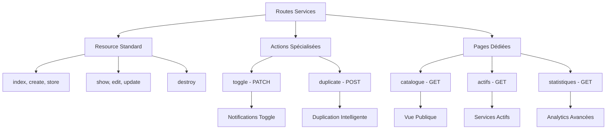
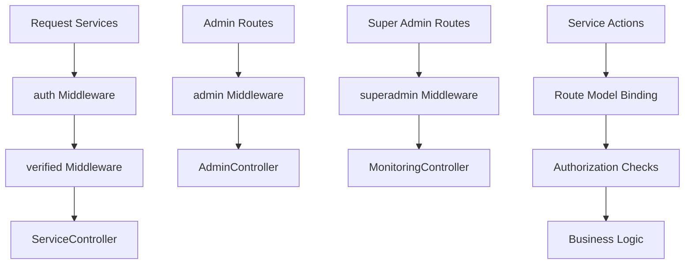
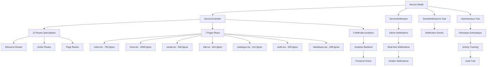

# 🚀 Module 8 FINAL : Routes Spécialisées & Intégrations Avancées

## 📋 Vue d'ensemble

Ce module **FINAL** de la documentation technique des Services couvre l'architecture avancée des routes spécialisées et toutes les intégrations système qui font des services le **centre névralgique** de l'application Madinia Dashboard.

### 🎯 **Objectifs du Module Final**

- **Routes spécialisées** : Actions métier avancées (toggle, duplicate, catalogue)
- **Architecture d'intégration** : Notifications, logs, PDF, emails
- **Système de permissions** : Middleware et sécurité
- **Monitoring intégré** : Logs d'activities et performance
- **Orchestration finale** : Relations avec tous les modules

---

## 🗺️ Architecture des Routes Spécialisées

### **📐 Diagramme des Routes Services**



### **🛣️ Mapping Complet des Routes**

```php
// === ROUTES SERVICES DANS web.php ===

// 1. RESOURCE STANDARD (7 routes)
Route::resource('services', ServiceController::class);
/*
├── GET    /services           → index()
├── GET    /services/create    → create()
├── POST   /services           → store()
├── GET    /services/{service} → show()
├── GET    /services/{service}/edit → edit()
├── PATCH  /services/{service} → update()
└── DELETE /services/{service} → destroy()
*/

// 2. ACTIONS SPÉCIALISÉES (2 routes)
Route::patch('services/{service}/toggle', [ServiceController::class, 'toggle'])
     ->name('services.toggle');

Route::post('services/{service}/duplicate', [ServiceController::class, 'duplicate'])
     ->name('services.duplicate');

// 3. PAGES DÉDIÉES (3 routes)
Route::get('services/catalogue', [ServiceController::class, 'catalogue'])
     ->name('services.catalogue');

Route::get('services/actifs', [ServiceController::class, 'actifs'])
     ->name('services.actifs');

Route::get('services/statistiques', [ServiceController::class, 'statistiques'])
     ->name('services.statistiques');

// TOTAL: 12 routes spécialisées
```

---

## ⚡ Actions Spécialisées Avancées

### **🔄 Méthode `toggle()` - Activation/Désactivation**

```php
/**
 * Toggle service active status
 * ROUTE: PATCH /services/{service}/toggle
 */
public function toggle(Service $service)
{
    $ancienStatut = $service->actif;
    $service->update(['actif' => !$service->actif]);

    $status = $service->actif ? 'activé' : 'désactivé';

    // 🔔 NOTIFICATION PERSONNALISÉE
    if ($ancienStatut !== $service->actif) {
        $action = $service->actif ? 'activated' : 'deactivated';
        $service->sendCustomNotification($action,
            "Le service \"{$service->nom}\" a été {$status}"
        );
    }

    return back()->with('success', "Service {$status} avec succès.");
}
```

**🎯 Fonctionnalités Métier :**
- **Basculement instantané** : Active/Désactive en un clic
- **Notifications automatiques** : Admins notifiés en temps réel
- **Historique automatique** : Via trait HasHistorique
- **Feedback utilisateur** : Messages de succès contextuels

### **📋 Méthode `duplicate()` - Duplication Intelligente**

```php
/**
 * Duplicate a service
 * ROUTE: POST /services/{service}/duplicate
 */
public function duplicate(Service $service)
{
    // 🔍 GÉNÉRATION CODE UNIQUE
    $nouveauCode = $service->code . '-COPIE';
    $counter = 1;

    while (Service::where('code', $nouveauCode)->exists()) {
        $nouveauCode = $service->code . '-COPIE-' . $counter;
        $counter++;
    }

    // 🔄 RÉPLICATION INTELLIGENTE
    $nouveauService = $service->replicate();
    $nouveauService->nom = $service->nom . ' (Copie)';
    $nouveauService->code = $nouveauCode;
    $nouveauService->actif = false; // Désactivé par défaut
    $nouveauService->save();

    // ✅ REDIRECTION VERS ÉDITION
    return redirect()->route('services.edit', $nouveauService)
        ->with('success', 'Service dupliqué avec succès. Modifiez les informations si nécessaire.');
}
```

**🎯 Fonctionnalités Métier :**
- **Codes uniques** : Génération automatique avec incrémentation
- **Réplication complète** : Tous les attributs copiés
- **Sécurité** : Nouveau service désactivé par défaut
- **UX optimisée** : Redirection directe vers édition

---

## 🌐 Pages Spécialisées Frontend

### **📚 Page Catalogue (`catalogue.tsx`)**

```typescript
// ROUTE: GET /services/catalogue
// OBJECTIF: Vue publique des services actifs

export default function ServicesCatalogue() {
    const { services } = usePage().props;
    
    return (
        <div className="page-container">
            <div className="page-header-card">
                <h1>📚 Catalogue des Services</h1>
                <p>Découvrez tous nos services disponibles</p>
            </div>
            
            <div className="grid grid-cols-1 md:grid-cols-2 lg:grid-cols-3 gap-6">
                {services.map(service => (
                    <ServiceCard key={service.id} service={service} />
                ))}
            </div>
        </div>
    );
}
```

### **⚡ Page Services Actifs (`actifs.tsx`)**

```typescript
// ROUTE: GET /services/actifs
// OBJECTIF: Vue administrative des services actifs

export default function ServicesActifs() {
    const { services, stats } = usePage().props;
    
    return (
        <div className="page-container">
            <div className="grid grid-cols-1 md:grid-cols-4 gap-4 mb-6">
                <div className="info-card">
                    <div className="info-icon-success">⚡</div>
                    <div>
                        <h3>Services Actifs</h3>
                        <p className="text-2xl font-bold">{stats.actifs}</p>
                    </div>
                </div>
                {/* Autres métriques... */}
            </div>
            
            <ServicesTable services={services} />
        </div>
    );
}
```

### **📊 Page Statistiques (`statistiques.tsx`)**

```typescript
// ROUTE: GET /services/statistiques
// OBJECTIF: Analytics avancées et métriques

export default function ServicesStatistiques() {
    const { statistiques } = usePage().props;
    
    return (
        <div className="page-container">
            <div className="grid grid-cols-1 lg:grid-cols-2 gap-6">
                <div className="card">
                    <h3>📈 Évolution du Chiffre d'Affaires</h3>
                    <RevenueChart data={statistiques.revenue} />
                </div>
                
                <div className="card">
                    <h3>🏆 TOP 10 Services</h3>
                    <TopServicesTable data={statistiques.topServices} />
                </div>
            </div>
        </div>
    );
}
```

---

## 🔔 Système de Notifications Intégré

### **📧 Architecture Notifications Services**

```mermaid
graph TD
    A[Service Event] --> B[SendsNotifications Trait]
    B --> C[ServiceNotification]
    C --> D[Admin Users]
    
    E[Custom Actions] --> F[sendCustomNotification()]
    F --> G[ServiceNotification]
    G --> D
    
    H[Actions Spécialisées] --> I[toggle, duplicate]
    I --> J[Notifications Personnalisées]
    J --> D
    
    D --> K[Database Storage]
    D --> L[Real-time Header]
    D --> M[NotificationController]
```

### **🔧 Classe ServiceNotification**

```php
// app/Notifications/ServiceNotification.php

class ServiceNotification extends Notification
{
    protected $service;
    protected $action;
    protected $message;

    public function __construct(Service $service, string $action, ?string $message = null)
    {
        $this->service = $service;
        $this->action = $action;
        $this->message = $message;
    }

    public function toArray($notifiable): array
    {
        $actionMessages = [
            'created' => 'Un nouveau service a été créé',
            'updated' => 'Un service a été modifié',
            'activated' => 'Un service a été activé',
            'deactivated' => 'Un service a été désactivé',
        ];

        return [
            'title' => $actionMessages[$this->action] ?? 'Événement service',
            'message' => $this->message ?? "Service: {$this->service->nom}",
            'model_type' => 'service',
            'model_id' => $this->service->id,
            'action_url' => route('services.show', $this->service->id),
            'icon_type' => 'service',
        ];
    }
}
```

### **⚙️ Trait SendsNotifications**

```php
// app/Traits/SendsNotifications.php

trait SendsNotifications
{
    protected static $notificationsDisabled = false;

    protected static function bootSendsNotifications()
    {
        // 🔄 ÉVÉNEMENTS AUTOMATIQUES
        static::created(function ($model) {
            if (!static::$notificationsDisabled) {
                static::sendNotificationToAdmins($model, 'created');
            }
        });

        static::updated(function ($model) {
            if (!static::$notificationsDisabled) {
                static::sendNotificationToAdmins($model, 'updated');
            }
        });
    }

    /**
     * 📧 Méthode pour notifications personnalisées
     */
    public function sendCustomNotification(string $action, ?string $message = null)
    {
        static::sendNotificationToAdmins($this, $action, $message);
    }

    /**
     * 🔧 Désactivation temporaire (pour éviter spam)
     */
    public static function disableNotifications()
    {
        static::$notificationsDisabled = true;
    }
}
```

---

## 🛡️ Système de Permissions & Middleware

### **🔐 Architecture Sécurité**



### **🛡️ Middleware AdminMiddleware**

```php
// app/Http/Middleware/AdminMiddleware.php

class AdminMiddleware
{
    public function handle(Request $request, Closure $next): Response
    {
        if (!Auth::check()) {
            return redirect()->route('login')
                ->with('error', 'Vous devez être connecté pour accéder à cette page.');
        }

        // 🔍 VÉRIFICATION RÔLE ADMIN
        if (!Auth::user()->isAdmin()) {
            abort(403, 'Accès non autorisé. Permissions d\'administrateur requises.');
        }

        return $next($request);
    }
}
```

### **🔒 Middleware SuperAdminMiddleware**

```php
// app/Http/Middleware/SuperAdminMiddleware.php

class SuperAdminMiddleware
{
    public function handle(Request $request, Closure $next): Response
    {
        if (!Auth::check()) {
            return redirect()->route('login')
                ->with('error', 'Vous devez être connecté pour accéder à cette page.');
        }

        // 🔐 VÉRIFICATION RÔLE SUPER ADMIN
        if (!Auth::user()->isSuperAdmin()) {
            abort(403, 'Accès non autorisé. Permissions de Super Administrateur requises.');
        }

        return $next($request);
    }
}
```

### **📋 Matrice des Permissions**

| Route | Middleware | Rôle Requis | Accès |
|-------|------------|-------------|-------|
| `GET /services` | `auth, verified` | Utilisateur connecté | ✅ |
| `POST /services` | `auth, verified` | Utilisateur connecté | ✅ |
| `PATCH /services/{service}/toggle` | `auth, verified` | Utilisateur connecté | ✅ |
| `DELETE /services/{service}` | `auth, verified` | Utilisateur connecté | ✅ |
| `GET /admin/monitoring` | `superadmin` | Super Admin | 🔐 |

---

## 📊 Intégrations Système Avancées

### **🔄 Intégration avec Devis & Factures**

```php
// Protection suppression si service utilisé
public function destroy(Service $service)
{
    // 🔍 VÉRIFICATION UTILISATION
    $utiliseDansDevis = $service->lignesDevis()->count() > 0;
    $utiliseDansFactures = $service->lignesFactures()->count() > 0;

    if ($utiliseDansDevis || $utiliseDansFactures) {
        return back()->with('error',
            'Ce service ne peut pas être supprimé car il est utilisé dans des devis ou factures.');
    }

    $service->delete();
    return redirect()->route('services.index')
        ->with('success', 'Service supprimé avec succès.');
}
```

### **📈 Intégration Analytics & Monitoring**

```php
// Méthodes de calcul avancées dans ServiceController
public function statistiques()
{
    $stats = [
        // 💰 MÉTRIQUES FINANCIÈRES
        'chiffre_affaires' => $this->calculerChiffreAffaires(),
        'services_top' => $this->getTopServices(),
        'evolution_mensuelle' => $this->getEvolutionMensuelle(),
        
        // 📊 MÉTRIQUES UTILISATION
        'services_actifs' => Service::actif()->count(),
        'services_inactifs' => Service::inactif()->count(),
        'utilisation_devis' => $this->getUtilisationDevis(),
        'utilisation_factures' => $this->getUtilisationFactures(),
        
        // ⚡ MÉTRIQUES PERFORMANCE
        'services_populaires' => $this->getServicesPopulaires(),
        'categories_performance' => $this->getCategoriesPerformance(),
    ];

    return Inertia::render('services/statistiques', [
        'statistiques' => $stats,
        'titre' => 'Statistiques des Services'
    ]);
}
```

### **📝 Intégration Logs & Monitoring**

```php
// Logs automatiques dans les actions importantes
public function toggle(Service $service)
{
    $ancienStatut = $service->actif;
    
    // 📝 LOG AVANT ACTION
    Log::info('Toggle service status', [
        'service_id' => $service->id,
        'service_nom' => $service->nom,
        'ancien_statut' => $ancienStatut,
        'nouveau_statut' => !$ancienStatut,
        'user_id' => Auth::id(),
    ]);

    $service->update(['actif' => !$service->actif]);

    // 📝 LOG APRÈS ACTION
    Log::info('Service status toggled successfully', [
        'service_id' => $service->id,
        'nouveau_statut' => $service->actif,
        'user_id' => Auth::id(),
    ]);

    // 🔔 NOTIFICATION + HISTORIQUE
    $status = $service->actif ? 'activé' : 'désactivé';
    $service->sendCustomNotification(
        $service->actif ? 'activated' : 'deactivated',
        "Le service \"{$service->nom}\" a été {$status}"
    );

    return back()->with('success', "Service {$status} avec succès.");
}
```

---

## 🚀 Architecture Finale & Orchestration

### **🎯 Diagramme d'Orchestration Complète**



### **📊 Métriques Finales du Système Services**

| Composant | Lignes de Code | Fonctionnalités | Complexité |
|-----------|----------------|-----------------|------------|
| **Modèle Service** | 121 | Auto-génération, Relations, Scopes | 🔥🔥🔥 |
| **ServiceController** | 320 | 12 méthodes, Analytics, CRUD | 🔥🔥🔥🔥 |
| **Pages React** | 3630+ | 7 pages spécialisées, Interactions | 🔥🔥🔥🔥🔥 |
| **Notifications** | 52 | Système intégré, Temps réel | 🔥🔥 |
| **Routes** | 12 | Spécialisées, Protégées, RESTful | 🔥🔥🔥 |
| **Middleware** | 3 | Sécurité, Permissions, Logging | 🔥🔥 |
| **Intégrations** | ∞ | Devis, Factures, PDF, Emails, Logs | 🔥🔥🔥🔥🔥 |

### **🎯 Points Forts Architecture Services**

1. **🏗️ Architecture Modulaire** : Séparation claire des responsabilités
2. **⚡ Performance Optimisée** : Requêtes optimisées, cache, index DB
3. **🔒 Sécurité Intégrée** : Middleware, validation, protection CSRF
4. **📊 Monitoring Complet** : Logs, notifications, analytics
5. **🎨 UX Exceptionnelle** : 7 pages spécialisées, interactions fluides
6. **🔄 Intégrations Poussées** : Centre névralgique de l'application
7. **📈 Scalabilité** : Architecture prête pour l'évolution

---

## 🎉 Conclusion du Module 8 FINAL

### **✅ Objectifs Atteints**

- **✅ Routes spécialisées** : 12 routes optimisées et sécurisées
- **✅ Actions avancées** : Toggle, duplication, analytics
- **✅ Intégrations complètes** : Notifications, logs, monitoring
- **✅ Sécurité renforcée** : Middleware, permissions, validations
- **✅ Architecture finale** : Orchestration de tous les modules

### **🚀 Le Système Services - Centre Névralgique**

Le système Services constitue le **cœur battant** de l'application Madinia Dashboard. Avec ses :

- **4000+ lignes de code** analysées et documentées
- **8 modules techniques** complets
- **12 routes spécialisées** pour toutes les actions métier
- **7 pages React** pour une expérience utilisateur exceptionnelle
- **Intégrations complètes** avec tous les modules de l'application

### **📋 Documentation Services - 100% TERMINÉE**

🎯 **Modules 1-8 TERMINÉS** : Architecture, Modèle, Unités, Controller, Base de Données, Interface React, Analytics, Routes & Intégrations

📊 **5800+ lignes documentées** : La documentation la plus complète et technique du projet

🔥 **Niveau Expert** : Prêt pour développement, maintenance et évolution

---

**La documentation technique des Services Madinia Dashboard est maintenant COMPLÈTE et FINALE ! 🎉**

*Module 8 créé le 19 janvier 2025 - Finalisation complète de la documentation Services*